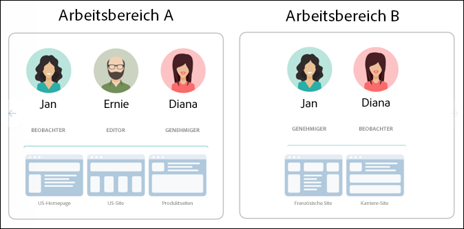
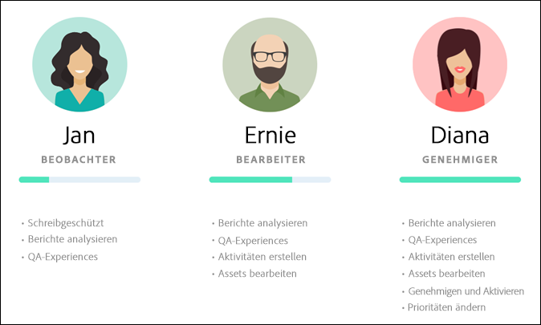
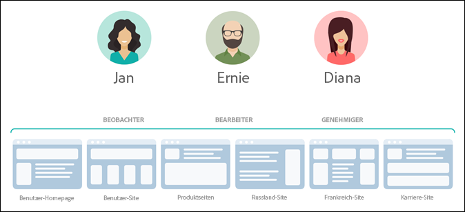
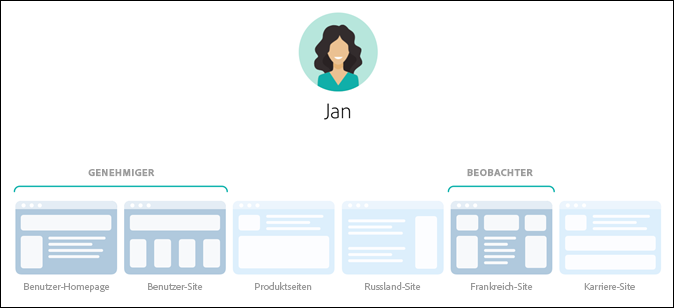
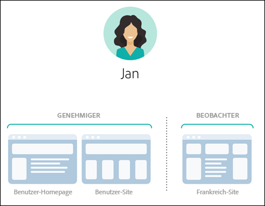
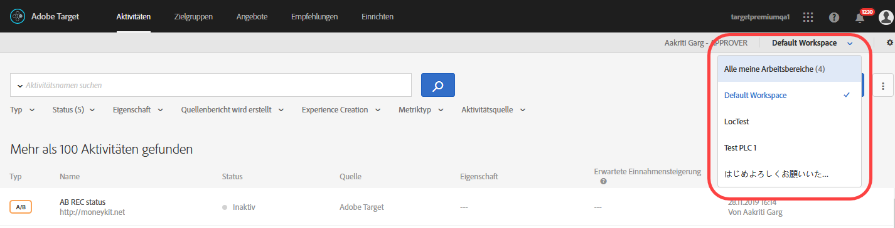
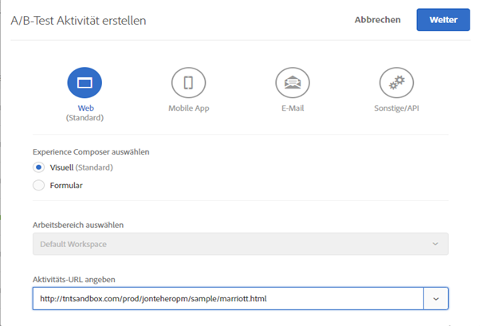
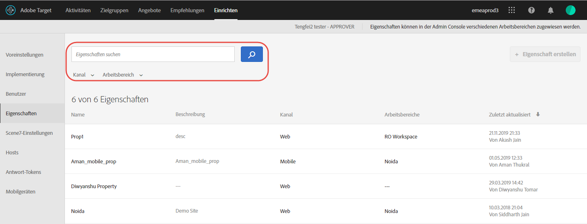

#  Berechtigungen für Unternehmensbenutzer{#enterprise-user-permissions}

Enterprise user permissions is a means of formal administering enterprise-wide user access to [!DNL Target]. Add users to [!DNL Target], assign permissions based on their roles, and create workspaces for teams based on different departments, global locations, channels, and other logical groupings. You can assign users the roles of [!UICONTROL Observer], [!UICONTROL Editor], or [!UICONTROL Approver].

## Bestimmen, ob Sie Zugriff auf Berechtigungen für Unternehmensbenutzer haben

>[!NOTE]
>
>Die Funktionalitäten für Eigenschaften und Berechtigungen sind als Bestandteil der Lösung [!DNL Target] Premium verfügbar. Für [!DNL Target] Standard sind sie nicht ohne [!DNL Target] Premium-Lizenz verfügbar.
>
>Your [!DNL Target] implementation can be using any version of at.js or mbox.js.

You can tell whether your organization has a Standard or Premium license by clicking the [!UICONTROL Administration] link at the top of the [!DNL Target] UI.

* **[!DNL Target Standard]Kunden**: Wenn die Registerkarte &quot; [!UICONTROL Benutzer] &quot;([!UICONTROL Administration > Benutzer]) (und nicht die Registerkarte &quot; [!UICONTROL Eigenschaften] &quot;) angezeigt wird, verfügt Ihr Unternehmen über eine [!DNL Target Standard] Lizenz. [!DNL Target Standard]Kunden sollten die Anweisungen unter [Benutzer](/help/administrating-target/c-user-management/c-user-management/user-management.md) befolgen, um Benutzer hinzuzufügen und Berechtigungen im [!DNL Adobe Admin Console].

* **[!DNL Target Premium]Kunden**: Wenn die Registerkarte &quot; [!UICONTROL Eigenschaften] &quot;([!UICONTROL Administration > Eigenschaften]) und die Registerkarte &quot; [!UICONTROL Benutzer] &quot;angezeigt werden, verfügt Ihr Unternehmen über eine [!DNL Target Premium] Lizenz. [!DNL Target Premium]-Kunden sollten die Anweisungen in diesem Artikel und in [Konfigurieren von Unternehmensberechtigungen](/help/administrating-target/c-user-management/property-channel/properties-overview.md) folgen.

## Bevor Sie mit den Unternehmensberechtigungen beginnen

>[!IMPORTANT]
>
>Ensure that you read the [Caveats](/help/administrating-target/c-user-management/property-channel/property-channel.md#section_9714311B1CD9497A86F4910F8AE635E2) section below before proceeding with enterprise permissions.

## Terms and definitions used in this section {#section_F8D229544FEA41C3BC2EFD1F95AA0116}

The following terms are used throughout this section and might be new to users wanting to use the Properties and Permissions functionality in [!DNL Target] Premium.

### Eigenschaft

Properties are similar in nature to those within [!DNL Adobe Platform Launch] in that they use a unique snippet of code to differentiate them.

Eine Webeigenschaft besteht aus einer Bibliothek von Regeln und einem Einbettungscode. Es kann sich bei einer Webeigenschaft um eine beliebige Gruppierung einer oder mehrerer Domänen bzw. Subdomänen handeln.

Eigenschaften werden aktiviert, indem ein bestimmtes Namens-/Wertpaar als Parameter bei jedem Aufruf hinzugefügt wird (Zielgruppe-Aufruf, API-Aufruf usw.) an [!DNL Target].

Eigenschaften sind bestimmten Kanälen (Web, mobil, E-Mail oder API/Sonstige) zugeordnet.

### Arbeitsbereich (Produktprofil)

Mithilfe eines Arbeitsbereichs können Organisationen bestimmte Benutzergruppen bestimmten Eigenschaftsgruppen zuweisen. Arbeitsbereiche ähneln auf vielerlei Weise den Report Suites in [!DNL Adobe Analytics].

Note: Workspaces are known as [!UICONTROL Product Profiles] in the [!DNL Adobe Admin Console for Enterprise].

Wenn Sie Teil einer multinationalen Organisation sind, besitzen Sie eventuell einen Arbeitsbereich für Ihre europäischen Webseiten, Eigenschaften oder Sites und einen weiteren Arbeitsbereich für Ihre amerikanischen Webseiten, Eigenschaften oder Sites. Wenn Sie einer Organisation angehören, die mehrere Marken besitzt, haben Sie eventuell für jede Marke einen eigenen Arbeitsbereich.

Benutzer können mehreren Arbeitsbereichen angehören und in den verschiedenen Arbeitsbereichen sogar unterschiedliche Rollen einnehmen.

Users can have different views of [!DNL Adobe Target] by moving between workspaces, similar to how [!DNL Analytics] users have different views of [!DNL Analytics] by moving between Report Suites.

Arbeitsbereiche können vollständig verschiedene Zielgruppen, Codeangebote und Aktivitäten beinhalten.

Alle Zielgruppen und Aktivitäten, die vor der Migration des Modells für Unternehmensberechtigungen erstellt wurden, werden zusammen im „Standardarbeitsbereich“ gruppiert, der weiter unten erläutert wird.

All activities created via [!DNL Adobe Experience Manager] (AEM), [!DNL Adobe Mobile Services], and [!DNL Adobe Target Classic] will be part of the &quot;Default Workspace.&quot;

### Standardarbeitsbereich

All existing workspaces (product profiles) within [!DNL Admin Console] are merged into a single workspace called &quot;Default Workspace&quot; during your organization&#39;s migration to the new Enterprise Permissions model.

>[!IMPORTANT]
>
>Löschen Sie den Standardarbeitsbereich nicht.

All user roles and access to all [!DNL Target] functionality remains exactly the same as they were prior to the migration to the new Enterprise Permissions model.

### Benutzergruppen

Sie können Benutzergruppen wie Entwickler, Analytiker, Marketingexperten, Manager usw. erstellen und ihnen dann Benutzerrechte für verschiedene Adobe-Produkte und -Arbeitsbereiche zuweisen. Das Zuweisen der passenden Berechtigungen für ein Team-Mitglied für zwei Adobe-Produkte kann oft einfach durch Zuweisung zu einer einzigen Benutzergruppe vorgenommen werden.

### Rollen und Berechtigungen

Rollen und Berechtigungen bestimmen, welche Zugriffsebene Benutzer haben, um Aktivitäten in der [!DNL Target]-Implementierung zu erstellen und zu verwalten. In [!DNL Target] gibt es folgende Rollen:

| Rolle | Beschreibung |
|--- |--- |
| Genehmiger | Kann Aktivitäten erstellen, bearbeiten, aktivieren oder stoppen. |
| Bearbeiter | Kann Aktivitäten erstellen und bearbeiten, bevor sie live sind, kann aber nicht den Start einer Aktivität genehmigen. |
| Beobachter | Kann Aktivitäten anzeigen, aber nicht erstellen oder bearbeiten. |
| Publisher | Ähnlich wie bei der Rolle &quot;Beobachter&quot;(Aktivitäten können zwar Ansicht, aber nicht erstellt oder bearbeitet werden). Die Rolle &quot;Herausgeber&quot;verfügt jedoch über die zusätzliche Berechtigung zum Aktivieren von Aktivitäten. |

### Kanal

Der Kanal gibt den Content-Typ an, in dem Ihre [!DNL Target]-Aktivitäten bereitgestellt werden: Webseiten, mobile Apps, E-Mail-Nachrichten usw.

Bei Erstellung einer neuen Aktivität wird diese dem aktuell ausgewählten Arbeitsbereich zugewiesen. Optionen für die Kanalauswahl finden sich im ersten Dialogfeld, in dem Sie den gewünschten Aktivitätskanal festlegen können: Web, mobile App, E-Mail oder Sonstige/API.

## Permissions overview {#section_DC2172520DA84605B218A5E9FB6D187A}

Die folgenden Informationen erläutern, wie Berechtigungen zuvor in [!DNL Target] umgesetzt wurden und wie sie mit der neuen Funktion für [!UICONTROL Eigenschaften] und [!UICONTROL Berechtigungen] umgesetzt werden.

Mithilfe der neuen [!UICONTROL Berechtigungsfunktion] können Sie verschiedene Projekte (in der [!DNL Adobe Admin Console for Enterprise] als „Produktprofile“ bezeichnet) erstellen, die die Zuweisung bestimmter Rechte an einzelne Benutzer ermöglichen, sodass diese Benutzer Zugriff auf bestimmte Projekte erhalten. Diese voneinander unabhängigen Projekte funktionieren ähnlich wie Report Suites in [!DNL Adobe Analytics]. Jedes Projekt verfügt über bestimmte Benutzer mit bestimmten Rollen, die einer bestimmten Reihe Berechtigungen entsprechen. Somit können Kunden die Ansicht, die Bearbeitung und den Genehmigungszugriff der Benutzer basierend auf Region, Umgebung (Entwicklung, Test, Produktion), Kanal oder anderen Kriterien einschränken, wie unten dargestellt:

Ein bestimmter Benutzer verfügt beispielsweise über Genehmigungszugriff auf die Websites für Nord- und Südamerika, jedoch nur auf Ansichtszugriff auf die mobile App für Europa. Dieser Benutzer verfügt möglicherweise nicht über die nötigen Rechte, die in Web- und Mobileigenschaften angebotenen Aktivitäten der APAC-Region einzusehen.

Im aktuellen [!DNL Target] [!UICONTROL Berechtigungsmodell] gibt es drei Rollen (Beobachter, Bearbeiter und Genehmiger), die in folgender Abbildung dargestellt werden:

Jede Rolle verfügt über eigene Zugriffsniveaus:

| Rolle | Beschreibung |
|--- |--- |
| Genehmiger | Kann Aktivitäten erstellen, bearbeiten, aktivieren oder stoppen. |
| Bearbeiter | Kann Aktivitäten erstellen und bearbeiten, bevor sie live sind, kann aber nicht den Start einer Aktivität genehmigen. |
| Beobachter | Kann Aktivitäten anzeigen, aber nicht erstellen oder bearbeiten. |
| Publisher | Ähnlich wie bei der Rolle &quot;Beobachter&quot;(Aktivitäten können zwar Ansicht, aber nicht erstellt oder bearbeitet werden). Die Rolle &quot;Herausgeber&quot;verfügt jedoch über die zusätzliche Berechtigung zum Aktivieren von Aktivitäten. |

Es muss dabei berücksichtigt werden, dass die Benutzerrolle für alle Seiten, Eigenschaften oder Sites Ihres Kontos gilt, die über [!DNL Target]-Tags verfügen, wie unten dargestellt:

Das neue [!DNL Target][!UICONTROL -Berechtigungsmodell] verfügt über die gleichen drei Rollen (Beobachter, Bearbeiter und Genehmiger), einem Benutzer können jedoch verschiedene Rollen für einzelne Seiten, Eigenschaften oder Sites zugewiesen werden, wie unten dargestellt:

In diesem Beispiel besitzt Jan Genehmigerrechte für die US-Homepage und die US-Site und Beobachterrechte für die französische Site.

Außerdem kann Jan keine Seiten, Eigenschaften oder Sites in [!DNL Target] anzeigen, für die sie nicht über entsprechende Berechtigungen verfügt, wie unten dargestellt:

In diesem Beispiel kann Jan die Produktseiten, die russische Site und die Karriere-Site nicht sehen.

## Use-case scenarios {#section_F3CE8576959E4F4CB13BEEED38311DD8}

Die folgenden Anwendungsfälle zeigen wie Eigenschaften, Projekte, Rollen und Berechtigungen genutzt werden können, um Marketingziele mit [!DNL Target] zu erreichen:

### Multinationale Organisation

Wenn Sie Teil einer multinationalen Organisation sind, besitzen Sie eventuell einen Arbeitsbereich für Ihre europäischen Webseiten, Eigenschaften oder Sites und einen weiteren Arbeitsbereich für Ihre amerikanischen Webseiten, Eigenschaften oder Sites.
Nach einer Umstrukturierung richten Sie für die Personen aus der obigen Abbildung folgende Arbeitsbereiche und Berechtigungen ein:

* **Jan**: Jan leitet die Optimierungsabteilung im Center of Excellence für die US-Webseiten, -Objekte und -Sites ihrer Organisation. Sie besitzt Systemadministratorrechte in der Adobe Experience Cloud.

   In ihrer Rolle hat sie Genehmigerberechtigungen für die US-Homepage und die US-Site. Mit den Genehmigerberechtigungen kann sie Aktivitäten erstellen, bearbeiten und aktivieren oder stoppen.

   Jan berät außerdem das Optimierungsteam in Frankreich und besitzt daher Beobachterrechte für die französische Site, die ihr Leserechte für Aktivitäten gewähren. Jan kann Aktivitäten anzeigen, sie aber nicht erstellen oder bearbeiten.

   Da Jan keine Rolle besitzt, für die sie die Produktseiten, die russische Site oder die Karriere-Site sehen muss, kann sie für diese Sites keine Aktivitäten sehen.

* **Ernie**: Ernie ist Marketingleiter der Organisation und für das Marketing in den USA zuständig.

   Da Ernie recht neu in der Organisation ist und noch wenig Erfahrung mit Target hat, besitzt er Bearbeiterrechte für die US-Homepage, die US-Site und für Produktseiten. Mit Bearbeiterrechten kann Ernie Aktivitäten erstellen und bearbeiten, bevor diese live sind, er kann den Start einer Aktivität jedoch nicht genehmigen. Den Start in die Produktion muss jemand mit Genehmigerrechten genehmigen, z. B. Jan.

   Da Ernie keine Rolle besitzt, für die er die russische Site, die französische Site oder die Karriere-Site sehen muss, kann er für diese Sites keine Aktivitäten sehen.

* **Diana**: Diana arbeitet jetzt als Analystin für die Organisation. Ihr wurden Beobachterberechtigungen für die US-Homepage, -Site, -Produktseiten und die russische und die französische Site zugewiesen, mit denen sie reinen Lesezugriff auf Aktivitäten hat. Diana kann Aktivitäten anzeigen, sie aber nicht erstellen oder bearbeiten.

   Da Diana keine Rolle besitzt, für die sie die Karriere-Site sehen muss, kann sie für diese Site keine Aktivitäten sehen.

### Organisation mit mehreren Marken

Wenn Sie zu einer Organisation mit mehreren Marken gehören, besitzen Sie womöglich einen separaten Arbeitsbereich für die Webseiten, Eigenschaften oder Sites der einzelnen Marken.

Nach einer Umstrukturierung richten Sie für die Personen aus der obigen Abbildung folgende Projekte und Berechtigungen ein:

* **Jan**: Jan leitet die Optimierungsabteilung im Center of Excellence für eine Organisation im Gesundheitswesen, die getrennte Produktbereiche für Krankenhäuser und für Endverbraucher betreibt. Sie besitzt Systemadministratorrechte in der Adobe Experience Cloud.

   In ihrer Rolle besitzt sie Genehmigerrechte für die Krankenhaus-Site. Mit den Genehmigerberechtigungen kann sie Aktivitäten erstellen, bearbeiten und aktivieren oder stoppen.

   Jan berät außerdem das Optimierungsteam des Produktbereichs für Endverbraucher und besitzt daher Beobachterrechte für diese Site, die ihr Leserechte für Aktivitäten gewähren. Jan kann Aktivitäten anzeigen, sie aber nicht erstellen oder bearbeiten.

* **Ernie**: Ernie ist Marketingleiter der Organisation für das Marketing des Produktbereichs für Endverbraucher.

   Da Ernie recht neu in der Organisation ist und noch wenig Erfahrung mit Target hat, besitzt er Bearbeiterrechte für die Endverbraucher-Site. Mit Bearbeiterrechten kann Ernie Aktivitäten erstellen und bearbeiten, bevor diese live sind, er kann den Start einer Aktivität jedoch nicht genehmigen. Den Start in die Produktion muss jemand mit Genehmigerrechten für die Endverbraucher-Site genehmigen, wobei es sich in diesem Szenario nicht um Jan handelt.

   Da Ernie keine Rolle besitzt, für die er die Krankenhaus-Site sehen muss, kann er für diese Site keine Aktivitäten sehen.

* **Diana**: Diana arbeitet jetzt als Analystin für die Organisation. Ihr wurden Beobachterberechtigungen für die Krankenhaus- und die Endverbraucher-Sites zugewiesen, mit denen sie reinen Lesezugriff auf Aktivitäten hat. Diana kann Aktivitäten anzeigen, sie aber nicht erstellen oder bearbeiten.

## Target UI Property and Permissions touchpoints {#section_3414371393BB42999A268628B5456EC9}

Die neue Berechtigungsfunktion findet sich in der Benutzeroberfläche von [!DNL Target] gleich an mehreren Orten.

* **Dropdownliste „Arbeitsbereich“ (Produktprofil):** Die Dropdownliste „Arbeitsbereich“ wird am oberen Rand der Seiten [!UICONTROL Aktivitäten], [!UICONTROL Zielgruppen] und [!UICONTROL Angebote] angezeigt. Wählen Sie den gewünschten Arbeitsbereich aus, um die Liste zu filtern und nur die Elemente des ausgewählten Arbeitsbereichs anzuzeigen.

   

* **Aktivitätserstellung:** Bei Erstellung einer neuen Aktivität wird diese dem aktuell ausgewählten Arbeitsbereich zugewiesen. Optionen für die Kanalauswahl finden sich im ersten Dialogfeld, in dem Sie den gewünschten Aktivitätskanal festlegen können: Web, mobile App, E-Mail oder Sonstige/API.

   

* **Zielgruppenerstellung:** Bei Erstellung einer neuen Zielgruppe wird diese dem aktuell ausgewählten Arbeitsbereich zugewiesen.
* **Angebotserstellung:** Bei Erstellung eines neuen Angebots wird dieses dem aktuell ausgewählten Arbeitsbereich zugewiesen.
* **Eigenschaftenseite (Administration > Eigenschaften):** Sie können das Feld [!UICONTROL Suchen] verwenden, um die Liste [!UICONTROL Eigenschaft] zu durchsuchen.

   

## Einschränkungen {#section_9714311B1CD9497A86F4910F8AE635E2}

Consider the following when using or configuring properties and permissions in [!DNL Target] Premium:

* **Wichtig**: Löschen Sie keine Arbeitsbereiche mit Aktivitäten. Wenn dies geschieht, stellen Sie diese Aktivitäten zusammen mit dem Kundendienst wieder her.
* Bei der Verwendung der Ansicht „Alle meine Arbeitsbereiche“ gilt Folgendes:

   * Sie können Aktivitäten, Zielgruppen und Angebote für alle Arbeitsbereiche anzeigen, für die Sie über die erforderlichen Rollen und Zugriffsberechtigungen verfügen.
   * Wenn Sie die Ansicht „Alle meine Arbeitsbereiche“ auswählen, wird eine neue Spalte zu den Seiten „Aktivitäten“, „Zielgruppen“ und „Angebote“ hinzugefügt, die den Arbeitsbereich des Elements sowie die mit diesem Element verknüpfte Benutzerberechtigung (Beobachter, Editor oder Genehmiger) aufführt.
   * Wenn Sie eine Aktivität, eine Zielgruppe oder ein Angebot in der Ansicht „Alle meine Arbeitsbereiche“ erstellen, müssen Sie den Arbeitsbereich auswählen, in dem das Element erstellt werden soll. Hierbei können Sie nur Arbeitsbereiche auswählen, für die Sie über Editor- oder Genehmiger-Berechtigungen verfügen.
   * Wenn Sie eine Aktivität, eine Zielgruppe oder ein Angebot in der Ansicht „Alle meine Arbeitsbereiche“ kopieren, müssen Sie den Arbeitsbereich auswählen, in den das Element kopiert werden soll. Hierbei können Sie nur Arbeitsbereiche auswählen, für die Sie über Editor- oder Genehmiger-Berechtigungen verfügen.

* Jede Einstellung auf den folgenden Administrationsseiten kann von jedem Genehmiger in einem beliebigen Arbeitsbereich gesteuert werden:

   * Visual Experience Composer
   * Berichterstellung
   * Scene7-Konfiguration
   * Implementierung
   * Properties
   * Hosts
   * Umgebung
   * Antwort-Token
   * Benutzer

* Benutzer können keine Ressourcen zwischen Arbeitsbereichen (Produktprofilen) verschieben. Das Kopieren wird jedoch unterstützt.
* Beim Anzeigen der Zielgruppen über die [!DNL Audiences]-Seite lädt die Seite langsamer als erwartet. Nutzen Sie das Suchfeld, werden die Zielgruppen schneller geladen. Es handelt sich hierbei um ein bekanntes Problem, das in einer der folgenden Versionen behoben wird. Das Problem wirkt sich nicht auf die Auswahl von Zielgruppen bei der Erstellung von Aktivitäten aus.
* Die folgenden Ressourcen sind Teil des neuen Unternehmensberechtigungsmodells:

   * Aktivitäten, Zielgruppen und Codeangebote, die in Target Standard/Premium erstellt werden, nachdem der Kunde für Berechtigungen aktiviert wurde. (Hinweis: Kunden müssen über Berechtigungen für Target Premium verfügen.)
   * Eigenschaften können vorhandenen Aktivitäten im Standardarbeitsbereich hinzugefügt werden. Dies kann jedoch geändert werden.
   * Für die Beschränkung durch Berechtigungen sind nur neue Ressourcen verfügbar (z. B. Aktivitäten, Codeangebote und Zielgruppen), die in Target Premium erstellt wurden (nach dem Aktivierten von Unternehmensberechtigungen).
   * Externe Ressourcen sind nur für Benutzer im Standardarbeitsbereich verfügbar. Die Rolle eines Benutzers im Standardarbeitsbereich ist global gültig (für alle Target-Anfragen und alle Taget-Ressourcen).

* Die folgenden Ressourcen sind *nicht* Teil des neuen Unternehmensberechtigungsmodells:

   * Bildangebote
   * Alle Recommendations-Ressourcen, einschließlich Kriterienbibliothek, Designbibliothek, Katalog, Recommendations-Einrichtung.
   * Vorhandene Ressourcen (z. B. Aktivitäten, Codeangebote und Zielgruppen), die in Target Premium vor dem Aktivieren von Unternehmensberechtigungen erstellt wurden, können zwar kopiert, aber nicht in andere Arbeitsbereiche verschoben werden.
   * Aktivitäten, Zielgruppen, Codeangebote, Bildangebote oder andere mit den folgenden Lösungen oder Methoden erstellte Ressourcen können nicht durch das Unternehmensberechtigungsmodell gesteuert werden, werden jedoch Teil des Standardarbeitsbereichs sein: Target Classic, Adobe Experience Manager (AEM), Adobe Mobile Services und Ressourcen, die über die API erstellt wurden. Unter über die API erstellte Ressourcen fallen Aktivitäten, Audiences, Codeangebote und Bildangebote).
   * Bildangebote (unter `https://[tenantName].marketing.adobe.com/content/mac/[tenantName]/target/offers.html#image-library` gespeicherte Assets) können bisher nicht mithilfe des Unternehmensberechtigungsmodells gesteuert werden.
   * clickTracking und Weiterleitungen funktionieren nur dann, wenn der Ziellink oder die Zielseite Teil einer Eigenschaft sind, die in der Aktivität enthalten ist. Außerdem funktioniert clickTracking möglicherweise nicht, wenn die `targetPageParams()`-Funktion verwendet wird. `targetPageParamsAll()` ist die empfohlene Funktion.

   [!DNL Target] erfordert zurzeit, dass auf allen Seiten, auf denen Tracking erfolgt, ein `at_property`-Token vorhanden ist. In the event that the token is (1) not present, (2) not detected at the time of activity setup (within the VEC), or (3) not passed to the clickTracking Target call via the `targetPageParamsAll()` function, the metric will not be incremented and will appear as &quot;0.&quot;

   Dasselbe gilt für Aktivitäten, die Umleitungen verwenden. Auf der Zielseite muss ein `at_property`-Token vorhanden sein, das beim Einrichten in VEC erkannt wird.

   In einer künftigen Version wird Target auf Seiten, auf denen kein `at_property`-Token existiert, oder auf Seiten, auf denen ein anderes `at_property`-Token vorhanden ist, funktionieren.

* Die Funktionalität „Berechtigungen für Unternehmensbenutzer“ wird in den [Aufrufen der Adobe I/O-API](https://developers.adobetarget.com) nicht unterstützt.

## Häufig gestellte Fragen {#faqs}

Häufig gestellte Fragen zu Unternehmensberechtigungen:

### Kann ich eine Aktivität von einem Arbeitsbereich in einen anderen verschieben?

Leider ist es nicht möglich, Aktivitäten von einem Arbeitsbereich in einen anderen zu verschieben. Sie können jedoch eine Aktivität in einen beliebigen Arbeitsbereich kopieren, müssen aber wissen, dass die Berichtsdaten nicht mitübertragen werden. Weitere Informationen finden Sie unter „Kopieren/Bearbeiten einer Aktivität beim Verwenden von Arbeitsbereichen“ in [Kopieren/Bearbeiten einer Aktivität beim Verwenden von Arbeitsbereichen](/help/c-activities/edit-activity.md#section_45A92E1DD3934523B07E71EF90C4F8B6).

Aktivitäten, die vor der Migration angelegt wurden, laufen im Standardarbeitsbereich auf die gleiche Weise weiter, es sei denn, sie werden bearbeitet und mit Eigenschaften versehen. Bei Aktivitäten in einem benannten Arbeitsbereich werden die Eigenschaften berücksichtigt, die diesem Arbeitsbereich zugewiesen wurden, sodass das Verhalten möglicherweise nicht mehr das gleiche ist wie vor der Migration.

### Warum wird eine Fehlermeldung angezeigt, die besagt, dass keine Eigenschaft mit dieser Aktivität verknüpft ist, auch wenn eine Eigenschaft zugewiesen ist?

Wenn Sie [!DNL Target] mit [!DNL Adobe Launch] implementiert haben und die Fehlermeldung erhalten, dass der Aktivität keine Eigenschaft zugeordnet ist, geben Sie den Parameter `at_property` mit der Funktion `targetPageParams` an.

### Werden Klick-Track-Konversionen aufgezeichnet, wenn eine Umleitungsseite und die Aktivitäts-URL zu unterschiedlichen Präsenzen gehören?

Klick-Tracking wird nicht auf Seiten aufgezeichnet, wo die Seite und die Aktivitäts-URL zu unterschiedlichen Präsenzen gehören.

Betrachten Sie das folgende Szenario (gilt sowohl für at.js als auch für mbox.js):

* Seite 1 gehört zu Präsenz1.
* Seite 2 gehört zu Präsenz2.
* In der Aktivität leitet Seite 1 auf Seite 2 weiter, die Klick-Tracks enthält.

Wenn ein Besucher Seite 1 in einem Browser öffnet, wird er zu Seite 2 weitergeleitet. Da Seite 2 nicht zur Bereitstellung der Aktivität berechtigt ist, enthält der Target-Aufruf keine Klick-Tracks in der Antwort.

Wenn die Weiterleitungsseite und die Aktivitäts-URL zu derselben Eigenschaft gehören, funktionieren die Klick-Tracks erwartungsgemäß. Weitere Informationen finden Sie unter [Klick-Tracking](/help/c-activities/r-success-metrics/click-tracking.md).

## Schulungsvideos

In den folgenden Videos erhalten Sie weitere Informationen zu den in diesem Artikel behandelten Konzepten.

### Training Video: Enterprise Permissions Training Video 

Lernziele:

* Die drei möglichen Rollenebenen von Adobe Target-Benutzern
* Die Konzepte von Eigenschaften und Arbeitsbereichen und wie diese Grenzen und Gruppierungen funktionieren, um die Zugangsebenen der Benutzer steuern zu können
* Verschiedene Beispiele für Eigenschaften für Ihre Organisation

>[!VIDEO](https://video.tv.adobe.com/v/19042/)

### Bürozeiten: Zielgruppe Premium-Arbeitsflächen

Dieses Video ist eine Aufzeichnung von Office Hours, eine Initiative, die vom Team der Adobe-Kundenunterstützung geleitet wird.

* Erstellen eines Arbeitsbereichs (Profil des Produkts)
* Eigenschaften erstellen
* Hinzufügen von Benutzern
* Implementierung aktualisieren

>[!NOTE]
>
>Die Benutzeroberfläche des [!DNL Target] Administrationsmenüs [!UICONTROL (früher] Setup ) wurde überarbeitet, um die Leistung zu verbessern, die Wartungszeit bei der Veröffentlichung neuer Funktionen zu verkürzen und die Benutzerfreundlichkeit im gesamten Produkt zu verbessern. Die Informationen im folgenden Video sind im Allgemeinen korrekt. Die Optionen befinden sich jedoch möglicherweise an etwas anderen Orten. Aktualisierte Videos werden demnächst veröffentlicht.

>[!VIDEO](https://video.tv.adobe.com/v/23643/)
