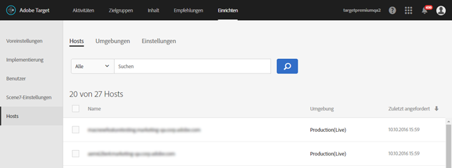

# Hosts

Organisieren Sie Ihre Sites und Umgebung vor der Produktion für einfache Verwaltung und separaten Berichte in [!DNL Adobe Target].

Das Hauptziel bei der Hostverwaltung besteht darin, dafür zu sorgen, dass auf der Seite nicht versehentlich inaktive Inhalte erscheinen. Mit der Hostverwaltung können Sie Berichtsdaten auch nach [Umgebung](/help/administrating-target/environments.md) trennen.

Ein Host ist eine Domäne, von der aus eine [!DNL Target]-Anforderung ausgeführt wird. Auf einer Website ist es normalerweise die `location.hostname`-Eigenschaft der URL, die die [!DNL Target]-Anforderung ausführt.

Standardmäßig beschränkt [!DNL Target] keinen Host, der [!DNL Target]-Anforderungen stellen und [!DNL Target]-Antworten empfangen kann. Wenn neue Hosts Anforderungen stellen, funktionieren diese automatisch. Dieser Prozess ermöglicht auch Tests auf verschiedenen Domänen, die Sie nicht kennen oder nicht vorhersehen können. Wenn Sie dieses Standardverhalten überschreiben möchten, können Sie eine Zulassungsliste oder Blockierungsliste einrichten, um zu begrenzen, welche Hosts mit [!DNL Target] funktionieren.

Um Hosts zu verwalten, klicken Sie auf **[!UICONTROL Administration]** > **[!UICONTROL Hosts]**.

## Erkennen von Hosts {#concept_0D4B43E23AA9408F8B28A57ED754BF65}

Um einen Host zu erkennen und ihn der Liste [!UICONTROL Hosts] hinzuzufügen, müssen die folgenden Bedingungen erfüllt sein:

* Mindestens eine [!DNL Target]-Anforderung muss auf dem Host vorhanden sein
* Eine Seite auf dem Host muss  Folgendes aufweisen:

   * Ein genauer at.js-Verweis
   * Eine [!DNL Target]-Anforderung oder eine automatisch generierte globale [!DNL Target]-Anforderung

* Die Seite mit der [!DNL Target]-Anforderung muss in einem Browser angezeigt werden

Nach Ansicht der Seite wird der Host in der Liste [!UICONTROL Hosts] aufgeführt, sodass Sie ihn in einer Umgebung verwalten und Aktivitäten und Tests starten können.

>[!NOTE]
>
>Dies umfasst sämtliche persönlichen Entwicklungsserver.

Stellen Sie nach dem Hinzufügen eines Hosts zur [!UICONTROL Hostgruppenliste] sicher, dass der Host erkannt wird.

1. Klicken Sie auf **[!UICONTROL Administration]** > **[!UICONTROL Hosts]**.
1. Wird der Host nicht angezeigt, aktualisieren Sie den Browser. 

   Standardmäßig wird ein neu erkannter Host in der Umgebung [!UICONTROL Produktion] platziert. Die [!UICONTROL Production]-Umgebung ist die sicherste Umgebung, da sie die Anzeige inaktiver Aktivitäten von diesen Hosts nicht zulässt.

1. (Bedingt) Klicken Sie auf das Symbol **[!UICONTROL Verschieben]** (  ), um den Host in die Umgebung [!UICONTROL Entwicklung], [!UICONTROL Staging] oder eine andere zu verschieben.

>[!NOTE]
>
>Die Umgebung [!UICONTROL Produktion] kann nicht gelöscht werden, auch wenn Sie sie umbenennen. Es wird angenommen, dass in dieser Umgebung fertig gestellte, aktive Aktivitäten und Tests bereitgestellt werden. In der Standardumgebung ist es nicht zulässig, inaktive Kampagnen anzuzeigen.

## Sortieren oder suchen Sie nach der Hostgruppen-Liste {#section_068B23C9D8224EB78BC3B7C8580251B0}

Um die Liste [!UICONTROL Hosts] zu sortieren, klicken Sie auf eine Spaltenüberschrift ([!UICONTROL Name], [!UICONTROL Umgebung] oder [!UICONTROL Zuletzt angefordert]), um die Liste in auf- oder absteigender Reihenfolge zu sortieren.

Um die Liste [!UICONTROL Hosts] zu durchsuchen, geben Sie einen Suchbegriff in das Feld [!UICONTROL Search Hosts] ein.

## Erstellen Sie Zulassungslisten, die Hosts angeben, die berechtigt sind, [!DNL Target]-Anforderungen an [!DNL Target] zu senden. {#allowlist}

Sie können eine Zulassungsliste erstellen, die Hosts (Domänen) angibt, die berechtigt sind, [!DNL Target]-Anforderungen an [!DNL Target] zu senden. Alle anderen Hosts, die Anforderungen generieren, erhalten eine kommentierte Fehlermeldung zur Autorisierung. Standardmäßig werden alle Hosts, die eine [!DNL Target]-Anforderung enthalten, mit [!DNL Target] in der [!UICONTROL Production]-Umgebung registriert und haben Zugriff auf alle aktiven und genehmigten Aktivitäten. Wenn dieser Ansatz nicht gewünscht wird, können Sie stattdessen mithilfe der Zulassungsliste bestimmte Hosts aufzeichnen, die berechtigt sind, [!DNL Target]-Anforderungen zu stellen und [!DNL Target]-Inhalte zu empfangen. Alle Hosts werden weiterhin in der Liste [!UICONTROL Hosts] angezeigt, und Umgebung können weiterhin verwendet werden, um diese Hosts zu gruppieren und ihnen verschiedene Ebenen zuzuweisen, z. B. ob der Host aktive und/oder inaktive Aktivitäten sehen kann.

So erstellen Sie eine Zulassungsliste:

1. Klicken Sie in der Liste [!UICONTROL Hosts] auf **[!UICONTROL Hosts autorisieren]**.
1. Aktivieren Sie den Umschalter **[!UICONTROL Autorisierte Hosts für Content Versand]** aktivieren.
1. hinzufügen Sie die gewünschten Hosts im Feld **[!UICONTROL Host enthält]**.

   Es können mehrere Hosts, einer pro Zeile, aufgeführt sein.

1. hinzufügen die gewünschten Hosts im Feld **[!UICONTROL Host enthält nicht]**, wie gewünscht.

   Es können mehrere Hosts, einer pro Zeile, aufgeführt sein.

1. Klicken Sie auf **[!UICONTROL Speichern]**.

Wenn eine [!DNL Target]-Anforderung auf einem nicht autorisierten Host erfolgt, antwortet der Aufruf mit `/* no display - unauthorized mbox host */`.

>[!IMPORTANT]
>
>**Best Practices** für Sicherheit: Wenn Sie die Ubox-Funktion von verwenden,  [!DNL Target]steuert diese Zulassungsliste auch die Liste der Domänen, zu denen Ihr   Umleitungs-Scan navigiert. Stellen Sie sicher, dass Sie alle Domänen hinzufügen, denen Sie umleiten möchten, wenn Sie Ubox als Teil Ihrer Implementierung verwenden. Wenn die Zulassungsliste nicht angegeben ist, ist [!DNL Adobe] nicht in der Lage, die Umleitungs-URLs zu überprüfen und vor möglichen bösartigen Umleitungen zu schützen.
>
>Die Zulassungsliste hat Vorrang vor Umgebung. Löschen Sie alle Hosts, bevor Sie die Funktion &quot;Zulassungsliste&quot;verwenden, und dann werden nur die Hosts angezeigt, die von der Zulassungsliste zugelassen sind. Anschließend können Sie die Hosts in die gewünschten Umgebungen verschieben.

Manchmal erscheinen Hosts anderer Sites in Ihren Umgebungen. Eine Domäne wird in der Liste angezeigt, wenn die Domäne at.js aufruft. Wenn beispielsweise eine Ihrer Webseiten auf den Server eines anderen kopiert wird, wird diese Domäne in Ihrer Umgebung angezeigt. Es können auch Domänen von Spider-Engines, Übersetzungssites oder lokalen Festplatten angezeigt werden.

In Fällen, in denen `mboxHost` an einen API-Aufruf weitergegeben wird, wird die Konversion für die weitergegebene Umgebung aufgezeichnet. Wenn keine Umgebung übergeben wird, ist der Host im Aufruf standardmäßig [!UICONTROL Produktion].

Sie können auch eine Blockierungsliste erstellen, die Hosts (Domänen) angibt, die keine [!DNL Target]-Anforderungen an [!DNL Target] senden können, indem Sie die gewünschten Hosts im Feld [!UICONTROL Host enthält nicht] hinzufügen.

>[!NOTE]
>
>Die Liste [!UICONTROL Autorisierte Hosts] wird sowohl für [!DNL Target]-Hosts als auch für Standard-Umleitungs-Hosts verwendet. hinzufügen alle vorhandenen Domänen, die für die Verwendung des [!DNL Adobe Target] JavaScript SDK (at.js) *AND*-Domänen zugelassen sind, die in den Ubox-Standard-Umleitungs-URLs verwendet werden. hinzufügen alle neuen ähnlichen Domänen in Zukunft der Zulassungsliste.

## Einen Host {#section_F56355BA4BC54B078A1A8179BC954632} löschen

Sie können einen Host, der nicht mehr gebraucht wird, löschen.

1. Klicken Sie in der Liste [!UICONTROL Hosts] auf das Symbol **[!UICONTROL Löschen]**.
1. Klicken Sie auf **[!UICONTROL Löschen]**, um den Löschvorgang zu bestätigen.

>[!NOTE]
>
>Der Host wird erneut aufgeführt, wenn jemand zu einer Seite navigiert, die eine [!DNL Target]-Anforderung auf dem Host enthält.

## Fehlerbehebung für Hosts {#concept_B3D7583FA4BB480382CC7453529FE1B7}

Probieren Sie folgende Methoden zur Fehlerbehebung aus, falls Probleme mit Ihren Hosts auftreten:

**Der Host wird nicht in der Liste für Ihr Konto angezeigt.**

* Aktualisieren Sie die Seite [!UICONTROL Hosts] Ihres Browsers.
* Vergewissern Sie sich, dass die [!DNL Target]-Anforderung einschließlich des at.js-Verweises korrekt ist.
* Suchen Sie nach einer der [!DNL Target]-Anforderungen auf dem Host. Es ist möglich, dass keine [!DNL Target] Anforderung auf dem Host jemals in einem Browser gerendert wurde.

**In der [!UICONTROL Hostgruppenliste] werden zufällige oder unbekannte Domänen angezeigt.**

Eine Domäne wird in dieser Liste angezeigt, wenn eine Anforderung an [!DNL Target] aus der Domäne erfolgt. Häufig werden Domänen von Spider-Engines, Übersetzungssites oder lokalen Festplatten angezeigt. Wenn eine aufgeführte Domäne von Ihrem Team nicht verwendet wird, können Sie auf [!UICONTROL Löschen] klicken, um sie zu entfernen.

**Meine  [!DNL Target] Anfrage gibt /* keine Anzeige - nicht autorisierter Mbox-Host */ zurück.**

Wenn eine [!DNL Target]-Anforderung auf einem nicht autorisierten Host erfolgt, antwortet die Anforderung mit /* Keine Anzeige - nicht autorisierter Mbox-Host */.
