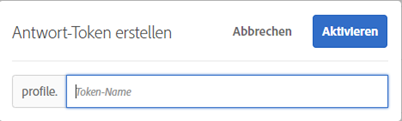

# Antwort-Token

Mithilfe von Antwort-Token können Sie [!DNL Adobe Target]-spezifische Informationen automatisch an die Webseite Ihrer Marke ausgeben. Diese Informationen können Details zur Aktivität, zum Angebot, zum Erlebnis, zum Benutzerprofil, zu geografischen Informationen und mehr enthalten. Diese Details bieten zusätzliche Antwortdaten, um sie für interne oder Drittanbieter-Tools freizugeben oder für das Debugging zu verwenden.

Mithilfe von Antwort-Token können Sie festlegen, welche Variablen (in Schlüssel/Wert-Paaren) verwendet werden sollen, und dann aktivieren, dass sie als Teil einer [!DNL Target]-Antwort gesendet werden. Sie aktivieren eine Variable mithilfe des Schalters und die Variable wird mit [!DNL Target]-Antworten gesendet, die in Netzwerkaufrufen validiert werden können. Antwort-Token funktionieren auch im Modus [!UICONTROL Vorschau] .

Ein wichtiger Unterschied zwischen Plug-ins und Antwort-Token besteht darin, dass Plug-ins JavaScript für die Seite bereitstellen, die bei der Bereitstellung ausgeführt wird. Antwort-Token stellen jedoch ein Objekt bereit, das dann gelesen und mithilfe von Ereignis-Listenern bearbeitet werden kann. Der Antwort-Token-Ansatz ist sicherer und ermöglicht eine einfachere Entwicklung und Wartung von Drittanbieter-Integrationen.

>[!NOTE]
>
>Antwort-Token sind in at.js , Version 1.1 oder neuer verfügbar.

>[!IMPORTANT]
>
>Die Funktion des Antwort-Tokens mit [!DNL Adobe Experience Platform Web SDK] wird in einer zukünftigen Version verfügbar sein (Datum noch festzulegen). Die nachstehende Dokumentation zu Antwort-Token und dem Platform Web SDK ist als Spitzenwert enthalten.

| Target SDK | Vorgeschlagene Aktionen |
|--- |--- |
| [Adobe Experience Platform Web SDK](/help/c-implementing-target/c-implementing-target-for-client-side-web/aep-web-sdk.md) | Stellen Sie sicher, dass Sie die Platform Web SDK-Version 2.6.0 oder höher verwenden. Informationen zum Herunterladen der neuesten Version des Platform Web SDK finden Sie unter [Installieren des SDK](https://experienceleague.adobe.com/docs/experience-platform/edge/fundamentals/installing-the-sdk.html) im Handbuch *Übersicht über das Platform Web SDK* . Informationen zu neuen Funktionen in den einzelnen Versionen des Platform Web SDK finden Sie unter [Versionshinweise](https://experienceleague.adobe.com/docs/experience-platform/edge/release-notes.html) im Handbuch *Übersicht über das Platform Web SDK* . |
| [at.js](/help/c-implementing-target/c-implementing-target-for-client-side-web/c-how-atjs-works/how-atjs-works.md) | Stellen Sie sicher, dass Sie at.js der Version 1.1 oder neuer verwenden. Weitere Informationen zum Herunterladen der neuesten Version von at.js finden Sie unter [Herunterladen von „at.js“](/help/c-implementing-target/c-implementing-target-for-client-side-web/how-to-deployatjs/implementing-target-without-a-tag-manager.md). Weitere Informationen zu neuen Funktionen in den einzelnen Versionen von at.js finden Sie unter [„at.js“-Versionsdetails](/help/c-implementing-target/c-implementing-target-for-client-side-web/target-atjs-versions.md).<br>Kunden, die at.js verwenden, sollten Antwort-Token nutzen und auf Plug-ins verzichten. Einige Plug-ins, die auf internen Methoden basieren, die in &quot;mbox.js&quot;, aber nicht in &quot;at.js&quot;vorhanden sind, werden zwar bereitgestellt, schlagen aber fehl. Weitere Informationen finden Sie unter [Einschränkungen von „at.js“](/help/c-implementing-target/c-implementing-target-for-client-side-web/t-mbox-download/c-target-atjs-implementation/target-atjs-limitations.md). |

## Verwenden von Antwort-Token {#section_A9E141DDCBA84308926E68D05FD2AC62}

1. Stellen Sie sicher, dass Sie die Platform Web SDK-Version 2.6.0 (oder neuer) oder at.js-Version 1.1 (oder neuer) verwenden.

   Für weitere Informationen:

   * **Platform Web SDK**: Siehe  [Installieren des ](https://experienceleague.adobe.com/docs/experience-platform/edge/fundamentals/installing-the-sdk.html) SDKs im  *Übersichtshandbuch zum* Platform Web SDK.
   * **at.js**: Siehe  [at.js herunterladen](/help/c-implementing-target/c-implementing-target-for-client-side-web/how-to-deployatjs/implementing-target-without-a-tag-manager.md#concept_1E1F958F9CCC4E35AD97581EFAF659E2).

1. Klicken Sie in [!DNL Target] auf **[!UICONTROL Administration]** > **[!UICONTROL Antwort-Token]**.

   

1. Aktivieren Sie die gewünschten Antwort-Token, z. B. `activity.id` und `option.id`.

   Die folgenden Parameter sind standardmäßig verfügbar:

   | Typ | Parameter | Hinweise |
   |--- |--- |--- |
   | Integrierte Profile | `profile.activeActivities` | Gibt eine Reihe an `activityIds` aus, für die der Besucher qualifiziert ist. Die Inkrementierung erfolgt im Zuge der Benutzerqualifizierung. Auf einer Seite mit zwei [!DNL Target] -Anforderungen, die zwei verschiedene Aktivitäten bereitstellen, enthält die zweite Anforderung beispielsweise beide Aktivitäten. |
   |  | `profile.isFirstSession` | Gibt „true“ oder „false“ zurück. |
   |  | `profile.isNewSession` | Gibt „true“ oder „false“ zurück. |
   |  | `profile.daysSinceLastVisit` | Gibt die Anzahl der Tage seit dem letzten Zugriff des Besuchers zurück. |
   |  | `profile.tntId` | Gibt die tntID des Besuchers zurück. |
   |  | `profile.marketingCloudVisitorId` | Gibt die Experience Cloud-ID des Besuchers zurück. |
   |  | `profile.thirdPartyId` | Gibt die Drittanbieter-ID des Besuchers zurück. |
   |  | `profile.categoryAffinity` | Gibt die Lieblingskategorie des Besuchers zurück. |
   |  | `profile.categoryAffinities` | Gibt eine Reihe der Top-5-Kategorien des Besuchers als Zeichenfolgen zurück. |
   | Aktivität | `activity.name`<br>`activity.id`<br>`experience.name`<br>`experience.id`<br>`option.name`<br>`option.id` | Details der aktuellen Aktivität. Beachten Sie, dass „option“ und „offer“ gleich sind. |
   | Geo | `geo.country`<br>`geo.state`<br>`geo.city`<br>`geo.zip`<br>`geo.dma`<br>`geo.domainName`<br>`geo.ispName`<br>`geo.connectionSpeed`<br>`geo.mobileCarrier` | Weitere Informationen zur Verwendung von Geo-Targeting in Aktivitäten finden Sie unter [Geo](/help/c-target/c-audiences/c-target-rules/geo.md). |
   | Traffic-Zuordnungsmethode<br>(gilt nur für [!UICONTROL Automatisches Targeting] und [!UICONTROL Automated Personalization] -Aktivitäten.) | `experience.trafficAllocationId` | Gibt 0 zurück, wenn ein Besucher ein Erlebnis aus dem &quot;Kontroll&quot;-Traffic erhalten hat, und 1, wenn er ein Erlebnis aus der &quot;gezielten&quot;Traffic-Verteilung erhalten hat. |
   |  | `experience.trafficAllocationType` | Gibt &quot;Kontrolle&quot;oder &quot;Targeting&quot;zurück. |

   Benutzerprofil- und Kundenattribute werden ebenfalls in der Liste angezeigt.

   >[!NOTE]
   >
   >Parameter mit Sonderzeichen werden in der Liste nicht angezeigt. Es werden nur alphanumerische Zeichen und Unterstriche unterstützt.

1. (Bedingt) Wenn Sie einen Profilparameter als Antwort-Token verwenden möchten, der Parameter jedoch nicht über eine [!DNL Target]-Anforderung übergeben wurde und daher nicht in die [!DNL Target]-Benutzeroberfläche geladen wurde, können Sie die Schaltfläche [!UICONTROL Antwort-Token hinzufügen] verwenden, um das Profil zur Benutzeroberfläche hinzuzufügen.

   Klicken Sie auf **[!UICONTROL Antwort-Token hinzufügen]**, geben Sie den Namen des Tokens ein und klicken Sie dann auf **[!UICONTROL Aktivieren]**.

   

1. Erstellen Sie eine Aktivität.

## Antworten und Antwort-Token lesen

Der Prozess, mit dem Sie auf [!DNL Target]-Antworten und Antwort-Token warten, hängt davon ab, ob Sie über eine [!DNL Platform Web SDK]- oder at.js-Implementierung verfügen.

###  [!DNL Platform Web SDK] Badgeusing the Handle object class

Verwenden Sie die Handle-Objektklasse, die über ein Metadaten-Objekt und ein Datenobjekt verfügt, um auf [!DNL Target]-Antworten zu warten und die Antwort-Token zu lesen.

Im folgenden Antwortbeispiel wird direkt ein [!DNL Platform Web SDK] benutzerdefinierter Ereignishandler zur HTML-Seite hinzugefügt (in der Tabelle werden die im Code verwendeten Objekte erläutert):

| Objekt | Informationen |
| --- | --- |
| Typ - Personalization.decision | Ob die Entscheidung vom [!DNL Target]- oder Offer decisioning-Provider getroffen wurde. |
| DecisionProvider - TGT | TGT-[!DNL Target]. [!DNL Target] stellt die Metadaten und Werte des Antwort-Tokens für die Seite bereit. |
| Meta | An die Seite übergebene Metadaten. |
| Daten | Werte der Metadaten, die an die Seite übergeben werden. |

```html
<html>

<head>
 ...
 <script src="alloy.js"></script>
 <script>
  {
   "requestId": "4d0a7cfd-952c-408c-b3b8-438edc38250a",
   "handle": [{
    "type": "personalization:decisions",
    "payload": [{
     "id": "....",
     "scope": "__view__",
     "scopeDetails": {
      "decisionProvider": "TGT",
      "activity": {
       "id": "..."
      },
      "experience": {
       "id": "...."
      }
     },
     "items": [{
      "id": "123",
      "schema": "https://ns.adobe.com/personalization/dom-action",
      "meta": {
       "activity.id": "...",
       "activity.name": "...",
       "profile.foo": "...",
       "profile.bar": "..."
      },
      "data": {
       "id": "123",
       "type": "setHtml",
       "selector": "#foo",
       "prehidingSelector": "#foo",
       "content": "<div>Hello world</div>"
      }
     }]
    }]
   }]
  }
  });
 </script>
</head>

<body>
 ...
</body>

</html>
```

###  badgeat.js mithilfe benutzerdefinierter Ereignisse

Verwenden Sie [benutzerdefinierte at.js-Ereignisse](/help/c-implementing-target/c-implementing-target-for-client-side-web/atjs-custom-events.md), um die [!DNL Target]-Antwort zu überwachen und die Antwort-Token zu lesen.

Mit dem folgenden Code-Beispiel wird direkt ein benutzerdefinierter [!DNL at.js]-Eventhandler auf der HTML-Seite hinzugefügt:

```html
<html> 
  <head> 
    .... 
    <script src="at.js"></script> 
    <script> 
      document.addEventListener(adobe.target.event.REQUEST_SUCCEEDED, function(e) { 
        console.log("Request succeeded", e.detail); 
      }); 
    </script> 
  <head> 
  <body> 
  ... 
  </body> 
</html>
```

## FAQs zu Antwort-Token {#section_3DD5F32C668246289CDF9B4CDE1F536D}

**Welche Rolle wird zum Aktivieren oder Deaktivieren von Antwort-Token benötigt?**

Antwort-Token können nur von Benutzern mit der Rolle [!DNL Target] [!UICONTROL Administrator] aktiviert oder deaktiviert werden.

**Was passiert, wenn ich [!DNL Platform Web SDK] 2.6.0 (oder früher) verwende?

Sie haben keinen Zugriff auf Antwort-Token.

**Was passiert, wenn ich at.js 1.0 (oder früher) verwende?**

Sie sehen die Antwort-Token, at.js kann sie jedoch nicht verwenden.

**Können beide  [!DNL Target Classic] Plug-ins und Antwort-Token gleichzeitig aktiv sein?**

Plug-ins und Antwort-Token sind parallel verfügbar. Plug-ins werden jedoch in Zukunft nicht mehr unterstützt.

**Werden Antwort-Token über alle  [!DNL Target] Antworten oder nur über  [!DNL Target] Antworten bereitgestellt, die eine Aktivität bereitstellen?**

Antwort-Token werden nur über [!DNL Target]-Antworten bereitgestellt, die eine Aktivität bereitstellen.

**Mein  [!DNL Target Classic] Plugin enthielt JavaScript. Wie reproduziere ich diese Funktionalität mithilfe von Antwort-Token?**

Bei der Migration zu Antwort-Token muss dieser JavaScript-Typ in Ihrer Codebase oder Tag-Management-Lösung beibehalten werden. Sie können diesen Code mithilfe von benutzerdefinierten Ereignissen vom Typ [!DNL Platform Web SDK] oder [!DNL at.js] Trigger und die Antwort-Token-Werte an Ihre JavaScript-Funktionen übergeben.

**Warum wird mein Profil-/Kundenattribut-Parameter nicht in der Liste der Antwort-Token angezeigt?**

[!DNL Target] aktualisiert Parameter normalerweise alle 15 Minuten. Diese Aktualisierung hängt von der Benutzeraktion ab und die Daten werden nur aktualisiert, wenn Sie die Antwort-Token-Seite anzeigen. Wenn Ihre Parameter nicht in der Liste der Antwort-Token angezeigt werden, hat [!DNL Target] die Daten noch nicht aktualisiert.

Wenn Ihr Parameter außer nicht alphanumerischen Zeichen oder anderen Symbolen als Unterstrichen etwas enthält, wird der Parameter nicht in der Liste angezeigt. Momentan werden nur alphanumerische Zeichen und Unterstriche unterstützt.

**Stellt das Antwort-Token weiterhin Inhalte bereit, wenn es ein gelöschtes Profilskript oder einen Profilparameter verwendet?**

Antwort-Token extrahieren Informationen aus Benutzerprofilen und stellen diese Informationen dann bereit. Wenn Sie ein Profilskript oder einen Profilparameter löschen, heißt das nicht, dass die Informationen aus den Benutzerprofilen entfernt wurden. Die Benutzerprofile enthalten weiterhin Daten, die dem Profilskript entsprechen. Das Antwort-Token stellt den Inhalt weiterhin bereit. Für Benutzer, die diese Informationen nicht in ihren Profilen gespeichert haben, oder für neue Besucher wird dieses Token nicht bereitgestellt, da die Daten nicht in ihren Profilen vorhanden sind.

[!DNL Target] deaktiviert das Token nicht automatisch. Wenn Sie ein Profilskript löschen und das Token nicht mehr bereitgestellt werden soll, müssen Sie das Token selbst deaktivieren.

**Ich habe mein Profilskript umbenannt. Warum ist das Token, das dieses Skript verwendet, weiterhin mit dem alten Namen aktiv?**

Wie zuvor erwähnt, agieren Antwort-Token mit den für Benutzer gespeicherten Profilinformationen. Obwohl Sie Ihr Profilskript umbenannt haben, wird für Benutzer, die Ihre Website besucht haben, der alte Profilskriptwert in ihren Profilen gespeichert. Das Token nimmt weiterhin den alten Wert auf, der bereits in den Benutzerprofilen gespeichert ist. Wenn Sie den Inhalt nun für den neuen Namen bereitstellen möchten, müssen Sie das vorherige Token deaktivieren und das neue Token aktivieren.

**Wann werden meine Attribute aus der Liste entfernt, wenn sie sich geändert haben?**

[!DNL Target] führt in regelmäßigen Abständen eine Aktualisierung der Attribute durch. Jedes Attribut, das nicht aktiviert wird, wird bei der nächsten Aktualisierung entfernt. Wenn Sie jedoch über ein Attribut verfügen, das aktiviert wurde und entfernt wurde, wird dieses Skript erst dann aus der Attributliste entfernt, wenn Sie es deaktivieren. Beispielsweise haben Sie ein Profilskript entfernt, das als Token verwendet wurde. [!DNL Target] entfernt die deaktivierten Attribute erst aus der Liste, wenn sie gelöscht oder umbenannt werden.

## Daten an Google Analytics senden

In den folgenden Abschnitten wird beschrieben, wie Sie [!DNL Target]-Daten an Google Analytics senden. Daten, die von Antwort-Token gesendet werden, können auch an andere Drittanbieter-Integrationen gesendet werden.

###  BadgeSenden von Daten an Google Analytics über Platform Web SDK

Google Analytics können Daten über die Platform Web SDK-Version 2.6.0 (oder höher) senden, indem Sie den folgenden Code auf der HTML-Seite hinzufügen.

>[!NOTE]
>
>Stellen Sie sicher, dass sich das Schlüsselwertpaar des Antwort-Tokens unter dem `alloy(“sendEvent”` -Objekt befindet.

```
<script type="text/javascript"> 
   (function(i, s, o, g, r, a, m) { 
   i['GoogleAnalyticsObject'] = r; 
   i[r] = i[r] || function() { 
   (i[r].q = i[r].q || []).push(arguments) 
   }, i[r].l = 1 * new Date(); 
   
   
   a = s.createElement(o), 
   m = s.getElementsByTagName(o)[0]; 
   a.async = 1; 
   a.src = g; 
   m.parentNode.insertBefore(a, m) 
   })(window, document, 'script', 'https://www.google-analytics.com/analytics.js', 'ga'); 
   ga('create', 'Google Client Id', 'auto'); 
</script> 
<script type="text/javascript">
   alloy("sendEvent", {
   
   
   })
   .then(({ renderedPropositions, nonRenderedPropositions }) => {
   // concatenate all the propositions
   const propositions = [...renderedPropositions, ...nonRenderedPropositions];
   // extractResponseTokens() extract the meta from item -> meta
   const tokens = extractResponseTokens(propositions);
   const activityNames = []; 
   const experienceNames = []; 
   const uniqueTokens = distinct(tokens); 
   
   
   uniqueTokens.forEach(token => { 
   activityNames.push(token["activity.name"]); 
   experienceNames.push(token["experience.name"]); 
   }); 
   
   
   ga('send', 'event', { 
   eventCategory: "target", 
   eventAction: experienceNames, 
   eventLabel: activityNames 
   }); 
   
   
   });
</script>
```

###  badgeSenden von Daten an Google Analytics über at.js {#section_04AA830826D94D4EBEC741B7C4F86156}

Daten können via at.js an Google Analytics gesendet werden, indem Sie auf der HTML-Seite den folgenden Code hinzufügen:

```javascript
<script type="text/javascript"> 
  (function(i, s, o, g, r, a, m) { 
    i['GoogleAnalyticsObject'] = r; 
    i[r] = i[r] || function() { 
      (i[r].q = i[r].q || []).push(arguments) 
    }, i[r].l = 1 * new Date(); 
    a = s.createElement(o), 
      m = s.getElementsByTagName(o)[0]; 
    a.async = 1; 
    a.src = g; 
    m.parentNode.insertBefore(a, m) 
  })(window, document, 'script', 'https://www.google-analytics.com/analytics.js', 'ga'); 
  ga('create', 'Google Client Id', 'auto'); 
</script> 
 
<script type="text/javascript"> 
  document.addEventListener(adobe.target.event.REQUEST_SUCCEEDED, function(e) { 
    var tokens = e.detail.responseTokens; 
 
    if (isEmpty(tokens)) { 
      return; 
    } 
 
    var activityNames = []; 
    var experienceNames = []; 
    var uniqueTokens = distinct(tokens); 
 
    uniqueTokens.forEach(function(token) { 
      activityNames.push(token["activity.name"]); 
      experienceNames.push(token["experience.name"]); 
    }); 
 
    ga('send', 'event', { 
      eventCategory: "target", 
      eventAction: experienceNames, 
      eventLabel: activityNames 
    }); 
  }); 
 
  function isEmpty(val) { 
    return (val === undefined || val == null || val.length <= 0) ? true : false; 
  } 
 
  function key(obj) { 
     return Object.keys(obj) 
    .map(function(k) { return k + "" + obj[k]; }) 
    .join(""); 
  } 
 
  function distinct(arr) { 
    var result = arr.reduce(function(acc, e) { 
      acc[key(e)] = e; 
      return acc; 
    }, {}); 
   
    return Object.keys(result) 
    .map(function(k) { return result[k]; }); 
  } 
</script>
```

## Debugging

Die folgenden Abschnitte enthalten Informationen zum Debugging von Antwort-Token:

###  BadgeGoogle Analytics und Debugging

Mit dem folgenden Code können Sie das Debugging mit Google Analytics durchführen:

```javascript
<script type="text/javascript"> 
  (function(i, s, o, g, r, a, m) { 
    i['GoogleAnalyticsObject'] = r; 
    i[r] = i[r] || function() { 
      (i[r].q = i[r].q || []).push(arguments) 
    }, i[r].l = 1 * new Date(); 
    a = s.createElement(o), 
      m = s.getElementsByTagName(o)[0]; 
    a.async = 1; 
    a.src = g; 
    m.parentNode.insertBefore(a, m) 
  })(window, document, 'script', 'https://www.google-analytics.com/analytics.js', 'ga'); 
  ga('create', 'Google Client Id', 'auto'); 
</script> 
 
<script type="text/javascript"> 
  document.addEventListener(adobe.target.event.REQUEST_SUCCEEDED, function(e) { 
    var tokens = e.detail.responseTokens; 
 
    if (isEmpty(tokens)) { 
      return; 
    } 
 
    var activityNames = []; 
    var experienceNames = []; 
    var uniqueTokens = distinct(tokens); 
 
    uniqueTokens.forEach(function(token) { 
      activityNames.push(token["activity.name"]); 
      experienceNames.push(token["experience.name"]); 
    }); 
 
    ga('send', 'event', { 
      eventCategory: "target", 
      eventAction: experienceNames, 
      eventLabel: activityNames 
    }); 
  }); 
 
  function isEmpty(val) { 
    return (val === undefined || val == null || val.length <= 0) ? true : false; 
  } 
 
  function key(obj) { 
     return Object.keys(obj) 
    .map(function(k) { return k + "" + obj[k]; }) 
    .join(""); 
  } 
 
  function distinct(arr) { 
    var result = arr.reduce(function(acc, e) { 
      acc[key(e)] = e; 
      return acc; 
    }, {}); 
   
    return Object.keys(result) 
    .map(function(k) { return result[k]; }); 
  } 
```

### Debugging mit der Entsprechung des ttMeta-Plug-ins

Das Äquivalent des ttMeta-Plug-ins für Debugging-Zwecke kann durch Hinzufügen des folgenden Codes zu der HTML-Seite erstellt werden:

```javascript
<script type="text/javascript" > 
  document.addEventListener(adobe.target.event.REQUEST_SUCCEEDED, function (e) { 
    window.ttMETA= typeof(window.ttMETA)!="undefined" ? window.ttMETA : []; 
 
    var tokens=e.detail.responseTokens; 
 
    if (isEmpty(tokens)) { 
      return; 
    } 
     
    var uniqueTokens = distinct(tokens); 
 
    uniqueTokens.forEach(function(token) { 
      window.ttMETA.push({ 
        'CampaignName': token["activity.name"], 
        'CampaignId' : token["activity.id"], 
        'RecipeName': token["experience.name"], 
        'RecipeId': token["experience.id"], 
        'OfferId': token["option.id"], 
        'OfferName': token["option.name"], 
        'MboxName': e.detail.mbox}); 
      console.log(ttMETA); 
    }); 
  }); 
 
  function isEmpty(val){ 
    return (val === undefined || val == null || val.length <= 0) ? true : false; 
  } 
 
  function key(obj) { 
     return Object.keys(obj) 
    .map(function(k) { return k + "" + obj[k]; }) 
    .join(""); 
  } 
 
  function distinct(arr) { 
    var result = arr.reduce(function(acc, e) { 
      acc[key(e)] = e; 
      return acc; 
    }, {}); 
   
    return Object.keys(result) 
    .map(function(k) { return result[k]; }); 
  } 
</script>
```

##  jsTraining-Video: Antwort-Token und benutzerdefinierte at.js-Ereignisse {#section_3AA0A6C8DBD94A528337A2525E3E05D5}

Im folgenden Video wird erläutert, wie Sie mithilfe von Antwort-Token und benutzerdefinierten at.js-Ereignissen Profilinformationen von [!DNL Target] an Drittanbietersysteme weitergeben können.

>[!NOTE]
>
>Die Menübenutzeroberfläche [!DNL Target] [!UICONTROL Administration] (ehemals [!UICONTROL Setup]) wurde überarbeitet, um eine verbesserte Leistung, eine Verkürzung der Wartungszeit bei der Veröffentlichung neuer Funktionen und eine produktübergreifende Verbesserung des Benutzererlebnisses zu erzielen. Die Informationen im folgenden Video sind korrekt. Die Optionen befinden sich jedoch an etwas anderen Orten.

>[!VIDEO](https://video.tv.adobe.com/v/23253/)
