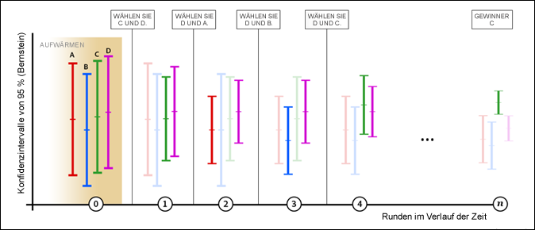

# [!UICONTROL Automatische Zuordnung – Überblick]

Eine [!UICONTROL Aktivität vom Typ &quot;Automatische Zuordnung]&quot;in [!DNL Adobe Target] identifiziert einen Gewinner unter zwei oder mehr Erlebnissen und ordnet dem Gewinner automatisch mehr Traffic zu, um Konversionen zu erhöhen, während der Test weiter ausgeführt und das Lernen fortgesetzt wird.

Beim Erstellen einer A/B-Aktivität mit dem geleiteten Arbeitsablauf mit drei Schritten können Sie die Option [!UICONTROL Automatisch dem besten Erlebnis zuordnen] auswählen.

## Die Herausforderung {#section_85D5A03637204BACA75E19646162ACFF}

Mit A/B-Standardtests sind Kosten verbunden. Sie müssen Traffic generieren, um die Leistung jedes einzelnen Erlebnisses zu messen und durch Analysen die erfolgreichsten Erlebnisse zu ermitteln. Die Verteilung von Traffic bleibt auch dann festgelegt, wenn Sie erkennen, dass einige Erlebnisse andere übertreffen. Außerdem ist es schwierig, die Stichprobengröße korrekt zu bestimmen, und die Aktivität muss komplett durchlaufen, bevor Sie einen Sieger finden. Und es besteht immer noch die Möglichkeit, dass der identifizierte Gewinner kein wahrer Gewinner ist.

## Die Lösung: [!UICONTROL Automatische Zuordnung] {#section_98388996F0584E15BF3A99C57EEB7629}

[!UICONTROL Die Funktion „Automatisierte Zuordnung“ senkt diese Kosten sowie die Kosten für die Bestimmung eines erfolgreichsten Erlebnisses. ] [!UICONTROL Die Funktion „Automatisierte Zuordnung“ überwacht die Zielmetrikleistung aller Erlebnisse und sendet proportional mehr neue Teilnehmer an Erlebnisse mit einer hohen Leistung. ] Es wird ausreichend Traffic für die Erkundung der anderen Erlebnisse reserviert. Sie können die Vorteile des Tests an Ihren Ergebnissen erkennen, selbst wenn die Aktivität gerade ausgeführt wird: Die Optimierung erfolgt parallel zum Lernen.

[!UICONTROL Die Funktion „Automatisierte Zuordnung“ überführt Besucher nach und nach zu den erfolgreichsten Erlebnissen, anstatt dass Sie mit dem Bestimmen eines Siegers warten müssen, bis die Aktivität abgeschlossen ist. ] Sie profitieren schneller von Steigerungen, da den Aktivitätsteilnehmern, die zu weniger erfolgreichen Erlebnissen geleitet worden wären, nun potenziell erfolgreiche Erlebnisse angezeigt werden.

Ein normaler A/B-Test in [!DNL Target] zeigt nur paarweise Vergleiche von Herausforderern mit Kontrollelementen. Wenn beispielsweise eine Aktivität über Erlebnisse verfügt: A, B, C und D, wobei A die Kontrolle ist, würde ein normaler [!DNL Target] A/B-Test A mit B, A mit C und A mit D vergleichen.

In solchen Tests verwenden die meisten Produkte, einschließlich [!DNL Target], einen Student-t-Test, um eine P-Wert-basierte Konfidenz zu erzielen. Mithilfe dieses Konfidenzwerts wird dann ermittelt, ob sich der Herausforderer ausreichend vom Kontrollelement unterscheidet. [!DNL Target] führt jedoch nicht automatisch die impliziten Vergleiche (B versus C, B versus D und C versus D) durch, die erforderlich sind, um das &quot;beste&quot;Erlebnis zu finden. Aus diesem Grund müssen Marketingexperten die Ergebnisse manuell analysieren, um das Gewinnererlebnis zu ermitteln.

[!UICONTROL Die automatisierte Zuordnung führt alle impliziten Vergleiche über alle Erlebnisse hinweg durch und ergibt dann einen „wahren“ Gewinner. ] Es gibt in diesem Test keinen Bedarf für ein „Kontrollerlebnis“.

[!UICONTROL Automatische ] Zuordnung ordnet neuen Besuchern automatisch Erlebnisse zu, bis sich das Konfidenzintervall des besten Erlebnisses nicht mit dem Konfidenzintervall anderer Erlebnisse überschneidet. Normalerweise könnte dieser Prozess zu falsch-positiven Ergebnissen führen, aber [!UICONTROL Automatische Zuordnung] verwendet Konfidenzintervalle basierend auf der [Bernstein-Ungleichung](https://en.wikipedia.org/wiki/Bernstein_inequalities_%28probability_theory%29), die wiederholte Auswertungen kompensiert. An diesem Punkt gibt es einen echten Gewinner. Wenn [!UICONTROL Automatische Zuordnung] gestoppt wird, sofern keine wesentliche Zeitabhängigkeit gegenüber den Besuchern besteht, die auf die Seite gelangen, besteht eine Wahrscheinlichkeit von mindestens 95 %, dass [!UICONTROL Automatische Zuordnung] ein Erlebnis zurückgibt, dessen wahre Antwort nicht schlechter als 1 % (relativ) weniger als die wahre Antwort des erfolgreichsten Erlebnisses ist.

## Verwendung von [!UICONTROL Automatische Zuordnung] im Vergleich zu A/B oder [!UICONTROL Automated Personalization] {#section_3F73B0818A634E4AAAA60A37B502BFF9}

* Die Funktion **[!UICONTROL Automatisierte Zuordnung]** verwenden Sie, wenn Sie Ihre Aktivitäten von Anfang an optimieren und so schnell wie möglich feststellen möchten, welche die erfolgreichsten Erlebnisse sind. Durch eine häufigere Darstellung von leistungsstarken Erlebnissen wird die Gesamtleistung der Aktivität gesteigert.
* Verwenden Sie einen standardmäßigen **[A/B-Test](/help/c-activities/t-test-ab/test-ab.md#task_05E33EB15C4D4459B5EAFF90A94A7977)**, wenn Sie die Leistung aller Erlebnisse vor der Optimierung Ihrer Site charakterisieren möchten. Ein A/B-Test hilft Ihnen, alle Ihre Erlebnisse nach Rang zu ordnen, während [!UICONTROL Automatische Zuordnung] die besten Ergebnisse findet, aber keine Differenzierung zwischen den leistungsschwächeren Werten garantiert.
* Verwenden Sie [Automated Personalization](/help/c-activities/t-automated-personalization/automated-personalization.md#task_8AAF837796D74CF893CA2F88BA1491C9), wenn Sie Optimierungsalgorithmen mit höchster Komplexität wünschen, z. B. Modelle für maschinelles Lernen, die Prognosen basierend auf individuellen Profilattributen erstellen. [!UICONTROL Die automatische ] Zuordnung untersucht das aggregierte Verhalten von Erlebnissen (wie A/B-Standardtests) und unterscheidet nicht zwischen Besuchern.

## Wesentliche Vorteile {#section_0913BF06F73C4794862561388BBDDFF0}

* Behält die Genauigkeit eines A/B-Tests bei
* Ermittelt einen statistisch bedeutenden Sieger schneller als mit manuellen A/B-Tests
* Bietet höhere durchschnittliche Kampagnensteigerungen im Vergleich zu manuellen A/B-Tests

## Terminologie   {#section_670F8785BA894745B43B6D4BFF953188}

Die folgenden Begriffe sind nützlich, wenn [!UICONTROL Automatische Zuordnung] besprochen wird:

**Multi-Armed Bandit:** Eine [Multi-Armed Bandit](https://en.wikipedia.org/wiki/Multi-armed_bandit)-Vorgehensweise („Mehrarmiger Bandit“) zur Optimierung gleicht forschendes Lernen und die Verwertung dieses Lernens aus.

## Funktionsweise des Algorithmus {#section_ADB69A1C7352462D98849F2918D4FF7B}

Die Gesamtlogik hinter [!UICONTROL Automatische Zuordnung] beinhaltet sowohl die gemessene Leistung (z. B. Konversionsrate) als auch Konfidenzintervalle der kumulativen Daten. Im Gegensatz zu einem standardmäßigen A/B-Test, bei dem Traffic gleichmäßig zwischen Erlebnissen aufgeteilt wird, ändert [!UICONTROL Automatische Zuordnung] die Traffic-Zuordnung für alle Erlebnisse.

* 80 % der Besucher werden mithilfe der unten beschriebenen intelligenten Logik zugeordnet.
* 20 % der Besucher werden auf zufälliger Basis den verschiedenen Erlebnissen zugeordnet, um eine Anpassung an sich änderndes Besucherverhalten zu ermöglichen.

Die Multi-Armed Bandit-Methode hält einige Erlebnisse für die Erforschung frei, während die leistungsstarken Erlebnisse ausgewertet werden. Es werden mehr neue Besucher in leistungsstärkere Erlebnisse platziert, und gleichzeitig wird die Reaktionsfähigkeit auf sich ändernde Bedingungen beibehalten. Diese Modelle werden mindestens einmal pro Stunde aktualisiert, um sicherzustellen, dass das Modell auf die neuesten Daten reagiert.

Sobald mehr Besucher an der Aktivität teilnehmen, erweisen sich einige Erlebnisse als erfolgreicher und erhalten mehr Traffic. 20 Prozent des Datenverkehrs werden weiterhin per Zufall verteilt, um alle Erlebnisse zu erforschen. Wenn ein Erlebnis mit einer schlechteren Leistung anfängt, sich zu verbessern, erhält es mehr Traffic. Oder: Wenn eine erfolgreiche Aktivität nachlässt, wird diesem Erlebnis weniger Traffic zugeordnet. Zum Beispiel wenn ein Ereignis dazu führt, dass Besucher nach anderen Informationen auf Ihrer Medienwebsite suchen oder wenn Wochenendverkäufe auf Ihrer Retail-Website unterschiedliche Ergebnisse liefern.

Die folgende Abbildung zeigt, wie der Algorithmus während eines Tests mit vier Erlebnissen möglicherweise funktioniert:

Die Abbildung zeigt, wie sich der den einzelnen Erlebnissen zugeordnete Traffic ändert, während die Aktivität mehrere Runden durchläuft, bis ein Gewinner gefunden ist.

| Rund | Beschreibung |
|--- |--- |
|  | **Aufwärmrunde (0)**: Während der Aufwärmrunde wird für jedes Erlebnis gleich viel Traffic zugeteilt, bis jedes Erlebnis in der Aktivität mindestens 1.000 Besucher und 50 Konversionen aufweist.<ul><li>Erlebnis A = 25 %</li><li>Erlebnis B = 25 %</li><li>Erlebnis C = 25 %</li><li>Erlebnis D = 25 %</li></ul>Nachdem jedes Erlebnis 1.000 Besucher und 50 Konversionen erreicht hat, startet Target die automatisierte Zuordnung von Traffic. Sämtliche Zuordnungen werden in Runden vorgenommen, wobei für jede Runde zwei Erlebnisse herausgesucht werden. Nur zwei Erlebnisse gelangen in die nächste Runde: D und C.  Zukünftig werden den beiden Erlebnissen 80 % des Traffics gleichmäßig zugeordnet. Die anderen beiden Erlebnisse nehmen weiterhin teil, werden jedoch nur als Teil der zufälligen Traffic-Zuordnung von 20 % bereitgestellt, wenn neue Besucher an der Aktivität teilnehmen. Sämtliche Zuordnungen werden stündlich aktualisiert (erkennbar an der Rundenangabe auf der X-Achse in der Abbildung oben). Nach jeder Runde werden die kumulativen Daten verglichen. |
|  | **Runde 1**: Während dieser Runde werden 80% des Traffics den Erlebnissen C und D zugeordnet (jeweils 40%). 20 % des Traffics werden auf zufälliger Basis den Erlebnissen A, B, C und D zugeordnet (jeweils 5 %). Während dieser Runde werden beim Erlebnis A gute Leistungen verzeichnet.<ul><li>Der Algorithmus wählt das Erlebnis D für die nächste Runde aus, da es die höchste Konversionsrate erzielt hat (erkennbar an der Markierung auf der vertikalen Skala jeder Aktivität).</li><li>Außerdem wählt der Algorithmus auch das Erlebnis A für die nächste Runde aus, da es die höchste Obergrenze des Bernstein-95-%-Konfidenzintervalls der verbleibenden Erlebnisse erreicht hat.</li></ul>Die Erlebnisse D und A gelangen eine Runde weiter. |
|  | **Runde 2**: Während dieser Runde werden 80% des Traffics den Erlebnissen A und D zugeordnet (jeweils 40%). 20 % des Traffics werden auf zufälliger Basis zugeordnet, das heißt A, B, C und D erhalten jeweils 5 % des Traffics. Während dieser Runde werden beim Erlebnis B gute Leistungen verzeichnet.<ul><li>Der Algorithmus wählt das Erlebnis D für die nächste Runde aus, da es die höchste Konversionsrate erzielt hat (erkennbar an der Markierung auf der vertikalen Skala jeder Aktivität).</li><li>Außerdem wählt der Algorithmus auch das Erlebnis B für die nächste Runde aus, da es die höchste Obergrenze des Bernstein-95-%-Konfidenzintervalls der verbleibenden Erlebnisse erreicht hat.</li></ul>Die Erlebnisse D und B gelangen eine Runde weiter. |
|  | **Runde 3**: Während dieser Runde werden 80% des Traffics den Erlebnissen B und D zugeordnet (jeweils 40%). 20 % des Traffics werden auf zufälliger Basis zugeordnet, das heißt A, B, C und D erhalten jeweils 5 % des Traffics. Während dieser Runde werden beim Erlebnis D weiterhin gute Leistungen verzeichnet und auch das Erlebnis C läuft gut.<ul><li>Der Algorithmus wählt das Erlebnis D für die nächste Runde aus, da es die höchste Konversionsrate erzielt hat (erkennbar an der Markierung auf der vertikalen Skala jeder Aktivität).</li><li>Außerdem wählt der Algorithmus auch das Erlebnis C für die nächste Runde aus, da es die höchste Obergrenze des Bernstein-95-%-Konfidenzintervalls der verbleibenden Erlebnisse erreicht hat.</li></ul>Die Erlebnisse D und C gelangen eine Runde weiter. |
|  | **Runde 4**: Während dieser Runde werden 80% des Traffics den Erlebnissen C und D zugeordnet (jeweils 40%). 20 % des Traffics werden auf zufälliger Basis zugeordnet, das heißt A, B, C und D erhalten jeweils 5 % des Traffics. Während dieser Runde werden beim Erlebnis C gute Leistungen verzeichnet.<ul><li>Der Algorithmus wählt das Erlebnis C für die nächste Runde aus, da es die höchste Konversionsrate erzielt hat (erkennbar an der Markierung auf der vertikalen Skala jeder Aktivität).</li><li>Außerdem wählt der Algorithmus auch das Erlebnis D für die nächste Runde aus, da es die höchste Obergrenze des Bernstein-95-%-Konfidenzintervalls der verbleibenden Erlebnisse erreicht hat.</li></ul>Die Erlebnisse C und D gelangen eine Runde weiter. |
|  | **Runde n**: Im weiteren Verlauf der Aktivität zeigt sich, dass ein Erlebnis die besten Leistungen erreicht. Dieser Prozess geht so lange weiter, bis ein „siegreiches“ Erlebnis ermittelt ist. Wenn sich das Konfidenzintervall des Erlebnisses mit der höchsten Konversionsrate nicht mit dem Konfidenzintervall anderer Erlebnisse überschneidet, wird es als Gewinner bezeichnet. Ein [Badge wird auf der Seite der Gewinneraktivität](/help/c-activities/automated-traffic-allocation/determine-winner.md) und in der Liste [!UICONTROL Aktivität] angezeigt.<ul><li>Der Algorithmus erklärt das Erlebnis C zum klaren Gewinner</li></ul>An diesem Punkt ordnet der Algorithmus 80 % des Traffics Erlebnis C zu, während 20 % des Traffics weiterhin auf zufälliger Basis allen Erlebnissen (A, B, C und D) zugeordnet werden. C erhält insgesamt 85 % des Traffics. In dem unwahrscheinlichen Fall, dass das Konfidenzintervall des Gewinners erneut anfängt, andere Intervalle zu überdecken, kehrt der Algorithmus zu dem Verhalten der obigen Runde 4 zurück. **Wichtig**: Wenn Sie während des Prozesses vorzeitig einen Gewinner manuell auswählen, riskieren Sie, das falsche Erlebnis auszuwählen. Daher empfiehlt es sich unbedingt, so lange zu warten, bis der Algorithmus das „siegreiche“ Erlebnis ermittelt hat. |

>[!NOTE]
>
>Wenn eine Aktivität nur über zwei Erlebnisse verfügt, erhalten beide Erlebnisse gleichen Traffic, bis [!DNL Target] ein erfolgreichstes Erlebnis mit 75 % Konfidenz findet. An diesem Punkt werden zwei Drittel des Traffics an den Gewinner und ein Drittel an den Verlierer weitergeleitet. Danach werden, wenn ein Erlebnis 95 % der Konfidenz erreicht, 90 % des Traffics dem Gewinner zugeordnet und 10 % werden dem Verlierer zugeordnet. [!DNL Target] behält immer einen Teil des Traffics bei, der an das &quot;verlierende&quot;Erlebnis gesendet wird, um zu verhindern, dass am Ende falsch-positive Ergebnisse auftreten (d. h., einige Erkundungen beizubehalten).

Nach Aktivierung einer [!UICONTROL Aktivität vom Typ &quot;Automatische Zuordnung]&quot;sind folgende Vorgänge über die Benutzeroberfläche nicht zulässig:

* Umschalten des Modus „Traffic-Zuordnung“ auf „Manuell“
* Ändern des Zielmetriktyps
* Ändern der Optionen im Bedienfeld „Erweiterte Einstellungen“

## Erfahren Sie, wie die automatisierte Zuordnung funktioniert

Weitere Informationen finden Sie unter [Die automatisierte Zuordnung kann Ihnen schnellere Testergebnisse und einen höheren Umsatz liefern als ein manueller Test](/help/c-activities/automated-traffic-allocation/faster-results-higher-revenue.md)

## Einschränkungen  {#section_5C83F89F85C14FD181930AA420435E1D}

**Die Funktion  [!UICONTROL Automatische ] Zuordnung funktioniert nur mit einer erweiterten Metrikeinstellung:  [!UICONTROL Anzahl erhöhen und Benutzer in Aktivität belassen]**

Die folgenden erweiterten Metrikeinstellungen werden nicht unterstützt: [!UICONTROL Anzahl erhöhen], [!UICONTROL Benutzer freigeben], [!UICONTROL Wiedereintritt erlauben und Anzahl erhöhen] und [!UICONTROL Benutzer und Leiste von Wiedereintritt freigeben].

**Häufig wiederkehrende Besucher können die Konversionsraten von Erlebnissen erhöhen.**

Wenn ein Besucher, der Erlebnis A anzeigt, häufig zurückkehrt und mehrere Male konvertiert, wird die Konversionsrate (CR) von Erlebnis A künstlich erhöht. Vergleichen Sie dieses Ergebnis mit Erlebnis B, bei dem Besucher konvertieren, aber nicht häufig zurückkehren. Daher sieht das CR von Erlebnis A besser aus als das CR von Erlebnis B, sodass neue Besucher eher A als B zugeordnet werden. Wenn Sie sich dafür entscheiden, einmal pro Teilnehmer zu zählen, sind die CR von A und CR von B möglicherweise identisch.

Wenn wiederkehrende Besucher zufällig verteilt werden, wird ihre Wirkung auf die Konversionsrate wahrscheinlich eher ausgeglichen. Um diese Auswirkung zu beschränken, sollten Sie die Änderung der Zählmethode der Zielmetrik erwägen, um jeden Teilnehmer nur einmal zu zählen.

**Differenziert zwischen High Performern, nicht zwischen Low Performern.**

[!UICONTROL Die automatisierte Zuordnung kann gut zwischen leistungsstarken Erlebnissen unterscheiden (und einen Sieger ermitteln). ] Es kann vorkommen, dass Sie nicht genug zwischen den leistungsschwachen Erlebnissen unterscheiden können.

Wenn Sie eine statistisch signifikante Differenzierung zwischen allen Erlebnissen erstellen möchten, sollten Sie möglicherweise den manuellen Traffic-Zuordnungsmodus in Erwägung ziehen.

**Zeitkorrelierte (oder je nach Kontext variierende) Konversionsraten beeinflussen die Zuordnungsmengen.**

Einige Faktoren, die während eines standardmäßigen A/B-Tests ignoriert werden können, da sie sich gleichmäßig auf alle Erlebnisse auswirken, können bei einem [!UICONTROL automatisierte Zuordnung]-Test nicht ignoriert werden. Der Algorithmus ist gegenüber den beobachteten Konversionsraten empfindlich. Nachfolgend finden Sie Beispiele für Faktoren, die sich ungleichmäßig auf die Erlebnisleistung auswirken können:

* Erlebnisse mit variierender kontextueller Relevanz (Zeit, Ort, Geschlecht usw.).

   Beispiel:

   * „Zum Glück ist Freitag“ führt an Freitagen zu höheren Konversionen.
   * „Starthilfe für Ihren Montag“ hat an Montagen höhere Konversionen.
   * &quot;Für den Winter an der Ostküste aufrüsten&quot;führt zu einer höheren Konversion an Standorten an der Ostküste oder im Winter.

Die Verwendung von Erlebnissen mit variierender kontextueller Relevanz kann die Ergebnisse in einem [!UICONTROL Test mit automatischer Zuordnung] stärker verfälschen als in einem A/B-Test, da der A/B-Test die Ergebnisse über einen längeren Zeitraum analysiert.

* Erlebnisse mit variierenden Verzögerungen in der Konversion, möglicherweise aufgrund der Dringlichkeit der Nachricht.

   Zum Beispiel signalisiert „30 Prozent Rabatt nur noch heute“ dem Besucher, noch heute zu konvertieren, während „50 Prozent Rabatt auf Ihren ersten Einkauf“ nicht denselben Handlungsdruck auslöst.

## Häufig gestellte Fragen   {#section_0E72C1D72DE74F589F965D4B1763E5C3}

Sehen Sie sich die folgenden häufig gestellten Fragen und Antworten an, während Sie mit [!UICONTROL Aktivitäten mit automatischer Zuordnung] arbeiten:

### Unterstützt [!UICONTROL Analytics for Target] (A4T) [!UICONTROL Automatisierte Zuordnung] Aktivitäten?

Ja. Weitere Informationen finden Sie unter [A4T-Unterstützung für automatische Zuordnungs- und automatische Targeting-Aktivitäten](/help/c-integrating-target-with-mac/a4t/a4t-at-aa.md).

### Werden wiederkehrende Besucher automatisch zu leistungsstarken Erlebnissen weitergeleitet?

Nein. Nur neue Besucher werden automatisch zugeordnet. Wiederkehrende Besucher sehen weiterhin ihr ursprüngliches Erlebnis, um die Gültigkeit des A/B-Tests zu schützen.

### Wie behandelt der Algorithmus falsch-positive Ergebnisse?

Der Algorithmus garantiert eine Konfidenz von 95 % oder eine Falsch-positiv-Rate von 5 %, wenn Sie warten, bis ein Gewinnerabzeichen angezeigt wird.

### Wann beginnt [!UICONTROL Automatische Zuordnung] mit der Zuordnung von Traffic?

Der Algorithmus setzt ein, nachdem sämtliche Erlebnisse in der Aktivität mindestens 1.000 Besucher und 50 Konversionen erreicht haben.

### Wie aggressiv wertet der Algorithmus aus?

80 % des Traffics werden mit [!UICONTROL Automatische Zuordnung] und 20 % des Traffics werden zufällig bereitgestellt. Wenn ein Gewinner ermittelt ist, erhält dieser die gesamten 80 %, während alle Erlebnisse, einschließlich des Gewinners, ihren jeweiligen Anteil an den 20 % des Traffics erhalten.

### Werden sehr schwache Erlebnisse überhaupt angezeigt?

Ja. Die Multi-Armed Bandit-Methode stellt sicher, dass mindestens 20 % des Datenverkehrs für die Erforschung von Änderungsmustern oder Konversionsraten in allen Erlebnissen reserviert werden.

### Was passiert mit Aktivitäten mit langen Konversionsverzögerungen?

Solange alle optimierten Erlebnisse ähnliche Verzögerungen aufweisen, ist das Verhalten dasselbe wie bei einer Aktivität mit schnellerem Konversionszyklus. Es dauert jedoch länger, den Schwellenwert für 50 Konversionen zu erreichen, bevor der Traffic-Zuordnungsprozess beginnt.

### Worin unterscheidet sich [!UICONTROL Automatische Zuordnung] von [!UICONTROL Automated Personalization]?

[!UICONTROL Bei der automatisierten Personalisierung werden die Profilattribute aller Besucher verwendet, um das beste Erlebnis zu bestimmen. ] Dadurch wird die Aktivität für den jeweiligen Besucher nicht nur optimiert, sondern auch personalisiert.

[!UICONTROL Die automatisierte Zuordnung] ist dagegen ein A/B-Test, der einen aggregierten Gewinner ergibt (das beliebteste Erlebnis, aber nicht unbedingt das effektivste Erlebnis für jeden Besucher).

### Erhöhen wiederkehrende Besucher die Konversionsrate in meiner Erfolgsmetrik?

Derzeit bevorzugt die Logik Besucher, die schnell konvertieren oder häufiger besuchen, da diese Besucher die Gesamtkonversionsrate des Erlebnisses, zu dem sie gehören, vorübergehend erhöhen. Der Algorithmus passt sich häufig von selbst an, sodass die Steigerung der Konversionsrate bei jeder Momentaufnahme verstärkt wird. Wenn die Site zahlreiche wiederkehrende Besucher erhält, können ihre Konversionen die Gesamtkonversionsrate für das Erlebnis, zu dem sie gehören, potenziell erhöhen. Es bestehen gute Chancen, dass wiederkehrende Besucher per Zufall verteilt werden; in diesem Fall wird die Gesamtwirkung (Anstieg) ausgeglichen. Um diese Auswirkung zu beschränken, sollten Sie die Änderung der Zählmethode der Erfolgsmetrik erwägen, um jeden Teilnehmer nur einmal zu zählen.

### Kann ich den Rechner für die Stichprobengröße verwenden, wenn ich [!UICONTROL Automatische Zuordnung] verwende, um zu schätzen, wie lange die Aktivität braucht, um den Gewinner zu identifizieren?

Sie können den vorhandenen [Stichprobengrößenrechner](https://experienceleague.adobe.com/tools/calculator/testcalculator.html?lang=de) verwenden, um eine Schätzung der Dauer der Testausführung zu erhalten. (Wie bei herkömmlichen A/B-Tests wenden Sie die Bonferroni-Korrektur an, wenn Sie mehr als zwei Angebote oder mehr als eine Konversionsmetrik/Hypothese testen.) Dieser Rechner ist für herkömmliche A/B-Tests mit festem Horizont konzipiert und liefert nur eine Schätzung. Die Verwendung des Taschenrechners für eine Aktivität vom Typ [!UICONTROL Automatische Zuordnung] ist optional, da [!UICONTROL Automatische Zuordnung] einen Gewinner erklärt. Sie müssen keinen festen Zeitpunkt auswählen, um die Testergebnisse anzuzeigen. Die bereitgestellten Werte sind immer statistisch gültig. In unseren Experimenten haben wir Folgendes gefunden:
* Beim Testen von genau zwei Erlebnissen findet [!UICONTROL Automatische Zuordnung] schneller einen Gewinner als beim Test mit festem Horizont (d. h. dem vom Stichprobengrößenrechner empfohlenen Zeitrahmen), wenn der Leistungsunterschied zwischen Erlebnissen groß ist. [!UICONTROL Automatische Zuordnung] benötigt jedoch möglicherweise zusätzliche Zeit, um einen Gewinner zu identifizieren, wenn der Leistungsunterschied zwischen Erlebnissen gering ist. In diesen Fällen wären Tests mit festem Horizont in der Regel ohne ein statistisch signifikantes Ergebnis beendet worden.
* Beim Testen von mehr als zwei Erlebnissen findet [!UICONTROL Automatische Zuordnung] schneller einen Gewinner als beim Test mit festem Horizont (d. h. dem vom Stichprobengrößenrechner empfohlenen Zeitrahmen), wenn ein einzelnes Erlebnis alle anderen Erlebnisse deutlich übertrifft. Wenn zwei oder mehr Erlebnisse beide im Vergleich zu anderen Erlebnissen &quot;gewinnen&quot;, aber eng miteinander übereinstimmen, erfordert [!UICONTROL Automatische Zuordnung] möglicherweise mehr Zeit, um zu ermitteln, welche höher ist. In diesen Fällen wären Tests mit festgelegtem Horizont normalerweise zu dem Schluss gekommen, dass die &quot;erfolgreichsten&quot;Erlebnisse besser waren als die Erlebnisse mit geringerer Leistung, aber nicht ermittelt hätten, welches Erlebnis überlegen war.

### Sollte ich ein leistungsschwaches Erlebnis aus einer [!UICONTROL Aktivität mit automatischer Zuordnung] entfernen, um den Prozess zur Ermittlung eines Gewinners zu beschleunigen?

Es gibt wirklich keinen Grund, ein leistungsschwaches Erlebnis zu entfernen. [!UICONTROL Die automatische ] Zuordnung liefert automatisch öfter leistungsstarke Erlebnisse und liefert weniger häufig leistungsschwache Erlebnisse. Wenn Sie ein leistungsschwaches Erlebnis in der Aktivität lassen, wirkt sich dies nicht wesentlich auf die Geschwindigkeit aus, mit der ein Gewinner ermittelt wird.

20 % der Besucher werden zufällig über alle Erlebnisse verteilt. Der Traffic, der für ein leistungsschwaches Erlebnis bereitgestellt wird, ist minimal (20 % geteilt durch die Anzahl der Erlebnisse).

### Kann ich die Zielmetrik in der Mitte durch eine [!UICONTROL Automatische Zuordnung] -Aktivität ändern? {#change-metric}

[!DNL Adobe] empfiehlt nicht, die Zielmetrik in der Mitte einer Aktivität zu ändern. Auch wenn es möglich ist, die Zielmetrik während einer Aktivität in der Benutzeroberfläche von [!DNL Target] zu ändern, sollten Sie dies nicht tun, sondern stattdessen eine neue Aktivität starten. [!DNL Adobe] garantiert nicht, was passiert, wenn Sie die Zielmetrik in einer Aktivität ändern, nachdem sie ausgeführt wird.

Diese Empfehlung gilt gleichermaßen für [!UICONTROL automatische Zuordnungs]-, [!UICONTROL automatische Targeting]- und [!UICONTROL Automated Personalization]-Aktivitäten, die [!DNL Target] oder [!DNL Analytics] (A4T) als Berichtsquelle verwenden.

### Kann ich die Berichtsquelle in der Mitte durch eine [!UICONTROL Automatische Zuordnung] -Aktivität ändern? {#change-reporting}

[!DNL Adobe] empfiehlt nicht, die Berichtsquelle in der Mitte einer Aktivität zu ändern. Obwohl es möglich ist, die Berichtsquelle (von [!DNL Target] zu A4T oder umgekehrt) während einer Aktivität mithilfe der [!DNL Target] -Benutzeroberfläche zu ändern, sollten Sie immer eine neue Aktivität starten. [!DNL Adobe] garantiert nicht, was passiert, wenn Sie die Berichtsquelle in einer Aktivität ändern, nachdem sie ausgeführt wird.

Diese Empfehlung gilt gleichermaßen für [!UICONTROL automatische Zuordnungs]-, [!UICONTROL automatische Targeting]- und [!UICONTROL Automated Personalization]-Aktivitäten, die [!DNL Target] oder [!DNL Analytics] (A4T) als Berichtsquelle verwenden.

### Kann ich die Option [!UICONTROL Berichtsdaten zurücksetzen] bei Ausführung einer [!UICONTROL Aktivität vom Typ &quot;Automatische Zuordnung]&quot;verwenden?

Die Verwendung der Option [!UICONTROL Berichtsdaten zurücksetzen] für [!UICONTROL Aktivitäten mit automatischer Zuordnung] wird nicht empfohlen. Obwohl die sichtbaren Berichtsdaten entfernt werden, entfernt diese Option nicht alle Trainings-Datensätze aus dem Modell [!UICONTROL Automatische Zuordnung]. Statt die Option [!UICONTROL Berichtsdaten zurücksetzen] für [!UICONTROL Aktivitäten mit automatischer Zuordnung] zu verwenden, erstellen Sie eine neue Aktivität und deaktivieren Sie die ursprüngliche Aktivität. (Diese Anleitung gilt auch für die Aktivitäten [!UICONTROL Automatisches Targeting] und [!UICONTROL Automated Personalization] .)

### Wie erstellt [!UICONTROL Automatische Zuordnung] Modelle in Bezug auf Umgebungen?

[!UICONTROL Automatische ] Zuordnung von ebuilds-Modellen basierend auf dem Traffic- und Konversionsverhalten, das nur in der Standardumgebung aufgezeichnet wurde. Standardmäßig ist [!UICONTROL Produktion] die Standardumgebung. Die Standardumgebung kann jedoch unter [!DNL Target] [Administration > Umgebungen](/help/administrating-target/environments.md) geändert werden.

Tritt ein Treffer in einer anderen (nicht standardmäßigen) Umgebung auf, wird der Traffic entsprechend dem beobachteten Konversionsverhalten in der Standardumgebung verteilt. Das Ergebnis dieses Treffers (Konversion oder Nicht-Konversion) wird zu Berichtszwecken aufgezeichnet, aber nicht im Modell [!UICONTROL Automatische Zuordnung] berücksichtigt.

Bei Auswahl einer anderen Umgebung zeigt der Bericht Traffic und Konversionen für diese Umgebung an. Die für einen Bericht standardmäßig ausgewählte Umgebung ist die für das gesamte Konto ausgewählte Standardeinstellung. Die Standardumgebung kann nicht pro Aktivität festgelegt werden.

## Schulungsvideos {#section_893E5B36DC4A415C9B1D287F51FCCB83}

In den folgenden Videos erhalten Sie weitere Informationen zu den in diesem Artikel behandelten Konzepten.

### Arbeitsablauf für Aktivitäten – Targeting (2:14) 

In diesem Video sind Informationen zur Einrichtung der Traffic-Zuordnung enthalten.

* Zuweisen einer Zielgruppe zur Aktivität
* Regulieren von Traffic nach oben oder unten
* Auswählen der Zuordnungsmethode für den Traffic
* Zuweisen von Traffic zu verschiedenen Erlebnissen

>[!VIDEO](https://video.tv.adobe.com/v/17385)

### Erstellen von A/B-Tests (8:36) 

In diesem Video wird gezeigt, wie mithilfe des geleiteten Target-Arbeitsablaufs mit drei Schritten ein A/B-Test erstellt wird. [!UICONTROL Die automatische ] Zuordnung wird ab 4:45 erläutert.

* Erstellen einer A/B-Aktivität in [!DNL Adobe Target]
* Zuordnen von Traffic mithilfe einer manuellen Aufteilung oder automatischen Traffic-Zuordnung

>[!VIDEO](https://video.tv.adobe.com/v/17391)
