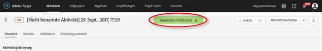
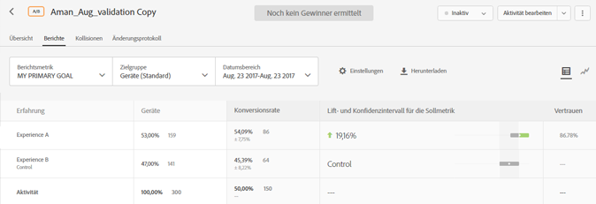
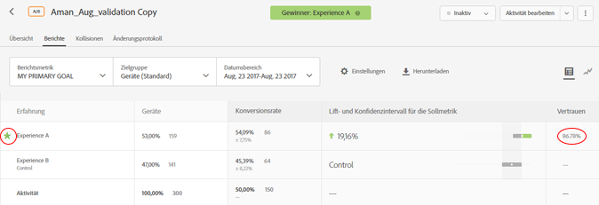

# Ermitteln eines Gewinners{#determine-a-winner}

Den Gewinner in einer A/B-Aktivität mit automatisierter Zuordnung erkennen Sie an Indikatoren in der Target-Benutzeroberfläche.

Viele Marketingexperten machen den Fehler, ein Erlebnis vorzeitig zum Gewinner zu erklären, bevor endgültige Ergebnisse vorliegen. Wir haben es nun leichter für Sie gemacht, den Gewinner zu ermitteln.

## Anzeigen des Siegerabzeichens in der Target-Benutzeroberfläche {#section_24007470CF5B4D30A06610CE8DD23CE3}

Bei der Verwendung der Funktion [!UICONTROL „Automatisierte Zuordnung“] zeigt [!DNL Target] oben auf der Seite der Aktivität ein Abzeichen mit „Noch kein Gewinner“ an, bis die Aktivität die Mindestanzahl an Konversionen mit ausreichender Konfidenz erreicht hat.

Wenn ein eindeutiger Gewinner feststeht, zeigt [!DNL Target] „Gewinner: Erlebnis X“ an.

>[!NOTE]
>
>Aktivitäten mit Automatisierte Zuordnung dienen dazu, das beste Erlebnis aus allen Optionen zu ermitteln, anstatt nur paarweise Vergleiche mit Kontrollwerten durchzuführen.

## Statistische Garantien bei automatisierter Zuordnung {#section_7AF3B93E90BA4B80BC9FC4783B6A389C}

Nach Abschluss einer A/B-Aktivität garantiert die automatische Zuordnung, dass der ermittelte Gewinner eine effektive Falsch-positiv-Rate von 5 % aufweist. Das bedeutet, dass der festgestellte Gewinner nur 5 % der Zeit nicht das beste Erlebnis aller in der Aktivität vorhandenen Erlebnisse ist. Für einen A/A-Test (mit identischen Erlebnissen) schließen wir einen Test nach weniger als 5 % der Zeit ab. Zu erwarten ist, dass der A/A-Test (mit identischen Erlebnissen) unbegrenzt lange läuft, ohne dass ein Siegerabzeichen angezeigt wird.

Wir verwenden keine p-Wert-basierte Konfidenz für automatisierte Zuordnung.

Die Spalte „Konfidenz“ in einer Aktivität mit automatisierter Zuordnung (siehe folgende Abbildung) zeigt mit einer Fehlerspanne von 1 %, wie wahrscheinlich ein Erlebnis der Gewinner ist (d. h., der Algorithmus verwendet einen minimalen nachweisbaren Effekt von 1 % zwischen der besten und der zweitbesten Konversionsrate). Beachten Sie, dass der Algorithmus diese Wahrscheinlichkeit anhand der [Bernstein-Ungleichheit](https://en.wikipedia.org/wiki/Bernstein_inequalities_(probability_theory)) berechnet.

Bei normalen A/B-Tests wird die Konfidenz basierend auf P-Werten berechnet. Für die automatische Zuordnung werden keine P-Werte verwendet. Mit P-Werten wird „grob“ die Wahrscheinlichkeit berechnet, mit der ein bestimmtes Erlebnis vom Kontrollelement abweicht. Diese P-Werte können nur verwendet werden, um zu bestimmen, ob ein Erlebnis vom Kontrollelement abweichen kann. Die Werte können nicht genutzt werden, um festzustellen, ob ein Erlebnis sich von einem anderen Erlebnis unterscheidet, das nicht das Kontrollerlebnis ist.

Die folgende Abbildung zeigt eine Aktivität, zu der noch kein Gewinner feststeht:

Diese Abbildung zeigt eine Aktivität, zu der es einen Gewinner gibt:

## Häufig gestellte Fragen {#section_C8E068512A93458D8C006760B1C0B6A2}

**Die Aktivität ist seit mehreren Tagen online. Warum werden sämtliche Konfidenzwerte noch immer mit 0 % angegeben?**

Die folgenden Gründe erläutern, warum für sämtliche Aktivitäten in der Spalte [!UICONTROL Konfidenz] des Berichts der Wert 0 % angezeigt wird:

* Bei manuellen A/B-Tests und der automatischen Zuordnung werden verschiedene Statistiken zur Anzeige der Konfidenzwerte eingesetzt.

   Für A/B-Tests werden P-Werte verwendet, die auf [Student-T-Tests](https://en.wikipedia.org/wiki/Student%27s_t-test) basieren. Ein P-Wert ist die Wahrscheinlichkeit, den beobachteten (oder einen extremeren) Unterschied zwischen einem Erlebnis und dem Steuerelement zu ermitteln, da in Wirklichkeit kein solcher Unterschied vorliegt. Diese P-Werte können nur verwendet werden, um festzustellen, ob die beobachteten Daten mit einem bestimmten Erlebnis konsistent sind und das Steuerelement identisch ist. Die Werte können nicht genutzt werden, um festzustellen, ob ein Erlebnis sich von einem anderen Erlebnis unterscheidet, das nicht das Kontrollerlebnis ist.

   Bei der automatischen Zuordnung wird die Wahrscheinlichkeit gezeigt, mit der ein bestimmtes Erlebnis aus allen Erlebnissen als Gewinner hervorgeht. Das bedeutet, dass nur ein erfolgreichstes Erlebnis (dasjenige Erlebnis, das am wahrscheinlichsten als Gewinner hervorgeht) über einen Wert verfügt, der nicht 0 ist. Alle anderen Erlebnisse werden als wahrscheinliche Verlierer eingestuft und mit dem Wert 0 % angezeigt.

* Die Konfidenz wird in der automatischen Zuordnung nur angezeigt, nachdem das erfolgreichste Erlebnis einen Wert von mehr als 60 % erzielen konnte. Die automatische Zuordnung ist im Durchschnitt zweimal so schnell wie ein normaler A/B-Test. Um festzustellen, wie lange ein normaler A/B-Test ausgeführt werden würde, verwenden Sie einen [Rechner für Stichprobengröße](https://docs.adobe.com/content/target-microsite/testcalculator.html): Konversionsrate der Kontrolle als „Grundkonversionsrate“ einsetzen, „5%“ als „Steigerung“ und 95% als „Konfidenz“. Typischerweise wird die Konfidenz angezeigt, nachdem jedes Erlebnis mindestens 50 % der erforderlichen Stichproben pro Erlebnis sammeln konnte. Somit erhalten Sie einen Überblick darüber, wann die Konfidenz höchstwahrscheinlich angezeigt wird.
* Wird im Bericht überall der Wert 0 % angezeigt, ist die Aktivität höchstwahrscheinlich noch nicht lange genug online.

