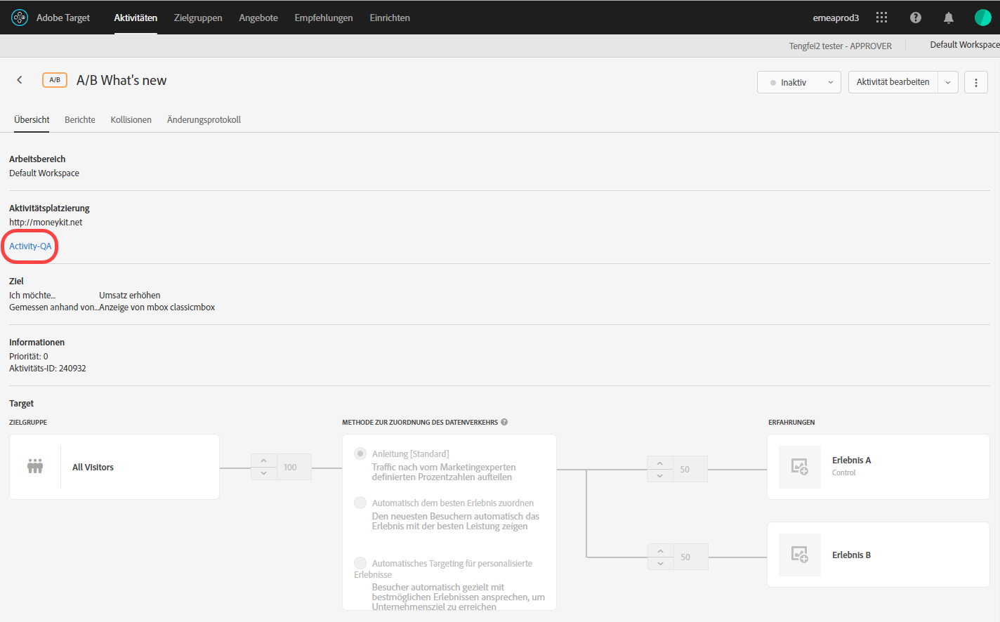
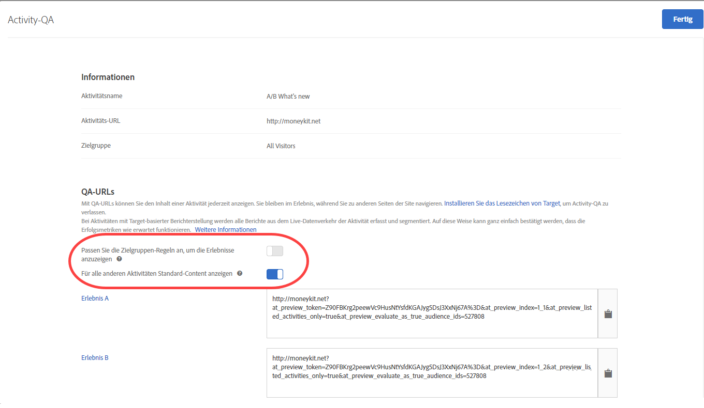

# Aktivitäts-QA {#activity-qa}

Verwenden Sie QS-URLs in Adobe Target, um eine durchgängige Qualitätssicherung mit Vorschauen-Links durchzuführen, die sich nie ändern, optionales Targeting von Audiencen und QS-Berichte, der aus Live-Aktivitäten segmentiert bleibt.

## Überblick {#section_11B761A522A14E61978275772210A4C2}

Mithilfe von Aktivitäts-QAs können Sie Ihre Target-Aktivitäten vor dem Live-Start in vollem Umfang testen. Die QA-Funktionalität für Aktivitäten beinhaltet Folgendes:

* Links für die Freigabe für Team-Mitglieder, die sich nie ändern oder nie neu generiert werden müssen. Dies ist unabhängig von an den Erlebnissen oder Aktivitäten vorgenommenen Aktualisierungen. Dadurch können Sie Ihre Aktivitäten vollständig über die gesamte User Journey hinweg testen.
* Zielgruppenbedingungen werden optional respektiert, sodass Vermarkter Targeting-Kriterien testen oder Targeting-Kriterien für QA ignorieren können, ohne die Zielgruppenbedingungen erfüllen zu müssen.
* QA-Berichte werden erfasst, sodass Vermarkter bestätigen können, dass Metriken erwartungsgemäß inkrementiert werden und die QA-Berichtsdaten von den Produktionsberichten separiert bleiben (für Nicht-A4T-Berichte).
* Die Fähigkeit, ein Erlebnis isoliert oder in Verbindung mit anderen Live-Aktivitäten, die die Kriterien des Versands erfüllen (Seitenanfrage/Zielgruppe/Audience), Vorschau.
* Die Fähigkeit, einen QA-Bericht der gesamten User Journey zu erstellen. Mit dem QA-Link können Sie einmal auf Ihre Seite zugreifen und die gesamte Seite in Aktivitäts-QA durchsuchen. Sie bleiben in Activity-QA, bis Sie die Sitzung beenden oder Sie das  [QA Target-Bookmarklet](../../c-activities/c-activity-qa/activity-qa-bookmark.md#concept_A8A3551A4B5342079AFEED5ECF93E879) verwenden, um das Beenden von Aktivitäts-QA zu erzwingen. Diese Funktion ist besonders hilfreich, wenn Sie eine Aktivität haben, die sich über mehrere Webseiten erstreckt.

   >[!NOTE]
   >
   >Dies gilt für at.js-Implementierungen mit Version 2.*x* oder höher. For at.js 1.*x* - und mbox.js-Implementierungen ist dies nur der Fall, wenn der Browser des Besuchers keine Drittanbieter-Cookies blockiert.

## Zugreifen auf und Freigeben einer QA-URL {#section_1C59BAA247B247BDB125D1BE8EAD4547}

1. Klicken Sie auf der Seite [!UICONTROL Übersicht] einer Aktivität (alle Typen außer „Automatisierte Personalisierung“) auf den Link **[!UICONTROL Aktivitäts-QA]**.

   

1. Konfigurieren Sie die folgenden Einstellungen:

   

   * **Passen Sie die Zielgruppen-Regeln an, um die Erlebnisse anzuzeigen:** Mitunter möchten Sie sicherstellen, dass die Zielgruppenzuordnung funktioniert. In anderen Situationen möchten Sie lediglich die Anmutung der Aktivität prüfen. Wenn sich diese Einstellung in der Stellung „ein“ befindet, müssen Tester die Targeting-Anforderungen erfüllen, um sich für die Anzeige der Erlebnisse zu qualifizieren. Für Erlebnis-Targeting (XT)-Aktivitäten wird eine einzelne Aktivitäts-URL bereitgestellt. Das angezeigte Erlebnis richtet sich danach, ob Sie sich für eine der Targeting-Regeln qualifizieren.

      Wenn sich diese Einstellung in der Stellung „aus“ befindet, werden beim Klicken auf die Links die Erlebnisse angezeigt (unabhängig davon, ob Sie sich qualifizieren oder nicht). Bei der QA-Ausführung können Sie die Festlegung einer erforderlichen bzw. nicht erforderlichen Respektierung des Zielgruppen-Targetings ändern.

   * **Standardinhalt für alle anderen Aktivitäten anzeigen:** Wenn diese Option auf die &quot;on&quot;-Position umgeschaltet wird, wird Standardinhalt für alle anderen Aktivitäten angezeigt (z. B. wird die Vorschau isoliert angezeigt, ohne alle anderen Live-Aktivitäten auf derselben Seite/[!DNL Target] Anforderung zu berücksichtigen).

      Achten Sie auf Folgendes, wenn diese Einstellung auf „aus“ festgelegt ist:

      * Wenn Kollisionen zwischen der getesteten und anderen Live-Aktivitäten vorliegen,  [gelten die normalen Prioritätsregeln](../../c-activities/priority.md#concept_1780C11FEA57440499F0047DD6900E0F). Aufgrund dessen ist es möglich, dass die gewünschte QA-Aktivität nicht angezeigt wird.
      * Die Metriken werden für die angezeigten Aktivitäten inkrementiert, jedoch nicht in der QA-Berichtsumgebung.

1. Klicken Sie auf **[!UICONTROL Fertig]**, um Ihre Änderungen zu speichern.
1. Geben Sie die Activity-Link-URLs zu Testzwecken für Mitglieder Ihrer Organisation frei.

   Activity-Links laufen niemals ab, und die Links müssen nicht erneut gesendet werden, wenn jemand Änderungen an einer Aktivität oder an einem Erlebnis vornimmt. Wenn Sie jedoch eine andere Zielgruppe aus der Zielgruppenbibliothek anwenden, anstatt die Aktivität einfach zu bearbeiten, wird ein neuer Link generiert, den Sie erneut freigeben müssen.

   Mithilfe der einzelnen Activity-Link-URLs (für Exp A, Exp B usw.) können Sie die User Journey vom entsprechenden Erlebnis starten. Sie können auf die für ein Erlebnis generierte URL klicken und dann mit dem normalen Website-Browsing fortfahren, um Erlebnisse auf mehreren Seiten anzuzeigen (wenn mehrere Seiten vorhanden sind). Pro Erlebnis wird nur eine URL generiert. Dies ist selbst dann der Fall, wenn das Erlebnis mehrere Seiten überspannt (Vorlagentest oder Test mit mehreren Seiten).

   Sie können auf der Website navigieren, um die anderen Seiten anzuzeigen, weil Aktivitäts-QA hängt. Beachten Sie, dass dies für at.js-Implementierungen mit Version 2 gilt.*x* oder höher. Für at.js 1.*x* - und mbox.js-Implementierungen ist dies nur der Fall, wenn der Browser des Besuchers keine Drittanbieter-Cookies blockiert.

1. Wenn Sie die über Activity-Link-URLs generierten Berichte anzeigen möchten, klicken Sie auf die Seite **[!UICONTROL Berichte]** der Aktivität, klicken Sie auf das Symbol **[!UICONTROL Einstellungen]** () und wählen Sie dann **[!UICONTROL QS-Modus]** aus der Dropdown-Liste **[!UICONTROL Umgebung]** aus.

## Zu beachten {#section_B256EDD7BFEC4A6DA72A8A6ABD196D78}

* Der Link [!UICONTROL Aktivitäts-QA] wird auf der Seite [!UICONTROL Übersicht] aller Aktivitätstypen angezeigt, außer für die automatisierte Personalisierung (AP). Sie können  [Links](../../c-activities/t-automated-personalization/experience-preview.md#task_586C6655A6FD4AF08F5678FC3F481EFC) für AP-Aktivitäten in der Vorschau anzeigen.
* Aktivitäts-QA-URLs sind für Aktivitäten mit Analytics als Berichtsquelle (A4T) verfügbar. Treffer, die generiert werden, während QA mit Aktivitäts-QA ausgeführt wird, werden in dieselbe Report Suite geleitet, wie die Daten der Aktivität, auch nachdem die Aktivität live geschaltet wurde.
* Aktivitäts-QA zeigt keinen Inhalt für archivierte Aktivitäten oder Aktivitäten an, deren Enddatum vorüber ist. Wenn Sie eine beendete Aktivität deaktivieren, müssen Sie die Aktivität erneut speichern, damit Aktivitäts-QA funktioniert.
* In Target Standard/Premium importierte Aktivitäten (beispielsweise aus Target Classic) unterstützen keine QA-URLs.
* Bei Aktivitäten für die automatisierte Zuweisung, das automatische Targeting und für Recommendations wird das Modell nicht von den in Aktivitäts-QA erfassten Besuchen beeinflusst.
* Da Activity-QA nach dem Website-Browsen in Aktivitäts-QA hängt, muss die Target-Sitzung ablaufen oder Target muss Sie aus Aktivitäts-QA freigeben, bevor Sie Ihre Website wie ein normaler Besucher anzeigen können. Verwenden Sie das [Target QS-Bookmarklet](../../c-activities/c-activity-qa/activity-qa-bookmark.md#concept_A8A3551A4B5342079AFEED5ECF93E879), um das Beenden der Aktivitäts-QS zu erzwingen.

   Sie können sich auch manuell selbst aus dem Modus lösen, indem Sie auf Ihrer Site eine Seite laden, wobei der Parameter `at_preview_token` einen leeren Wert hat (beispielsweise `https://www.mysite.com/?at_preview_token=`).

* Wenn Sie während der Erstellung der Aktivität [Verfeinerungen im formularbasierten Composer](../../c-experiences/form-experience-composer.md#task_FAC842A6535045B68B4C1AD3E657E56E) oder [Seitenbereitstellungsoptionen im Visual Experience Composer](../../c-experiences/c-visual-experience-composer/viztarget-options.md#reference_3BD1BEEAFA584A749ED2D08F14732E81) „URL ist“ angegeben haben, funktioniert die QS-URL nicht, da die Aktivitäts-QS URL-Parameter anhängt. Klicken Sie zur Lösung dieses Problems auf die QA-URL, um zu Ihrer Site zu navigieren. Entfernen Sie die angehängten Parameter aus der URL und laden Sie dann die neue URL.
* Wenn Sie at.js 1 haben.*Der QS-Modus für x* oder mbox.js ist nicht fixierbar, wenn Sie Safari oder einen anderen Browser verwenden, der Drittanbieter-Cookies blockiert. In diesen Fällen müssen Sie die Parameter für die Vorschau zu jeder URL hinzufügen, zu der Sie navigieren. Dasselbe gilt, wenn Sie [CNAME](/help/c-implementing-target/c-considerations-before-you-implement-target/implement-cname-support-in-target.md)implementiert haben.
* Wenn in einer Aktivität mehrere Erlebniszielgruppen verwendet werden (z. B. eine US- und UK-Site, die in derselben Aktivität enthalten sind), werden für die vier Kombinationen (Erlebnis A/US-Site, Erlebnis A/UK-Site, Erlebnis B/US-Site, Erlebnis B/UK-Site) keine QA-Links generiert. Es werden nur zwei QA-Links (Erlebnis A und Erlebnis B) erstellt, und die Benutzer müssen sich für die entsprechende Zielgruppe qualifizieren, um die Seite anzeigen zu können. Eine Person mit QA für UK kann die US-Site nicht anzeigen.
* Alle Parameter und Werte vom Typ `at_preview` sind bereits URL-kodiert. Meistens funktioniert alles erwartungsgemäß. Möglicherweise haben einige Kunden jedoch Systeme zur Lastverteilung oder Webserver, die versuchen, die Abfragezeichenfolgenparameter erneut zu kodieren.

   Aufgrund dieser doppelten Kodierung kann Target den richtigen Tokenwert nicht extrahieren, wenn Sie versuchen, `at_preview_token` zu dekodieren, wodurch die Vorschau nicht funktioniert.

   Wir empfehlen Ihnen, mit Ihrem IT-Team zu sprechen, um sicherzustellen, dass alle Parameter der Vorschau auf die Zulassungsliste gesetzt werden, damit diese Werte in keiner Weise verändert werden.

   In der folgenden Tabelle werden die Parameter Liste, die in Ihrer Domäne auf die Zulassungsliste gesetzt werden können:

   | Parameter | Typ | Wert | Beschreibung |
   |--- |--- |--- |--- |
   | `at_preview_token` | Verschlüsselte Zeichenfolge | Erforderlich; kein Standardwert | Ein verschlüsseltes Element, das die Liste der Kampagnen-IDs enthält, die im QA-Modus ausgeführt werden dürfen. |
   | `at_preview_index` | Zeichenfolge | Empty | Das Format des Parameters ist `<campaignIndex>` oder `<campaignIndex>_< experienceIndex>` Beide Indexes beginnen mit 1. |
   | `at_preview_listed_activities_only` | Boolescher Wert (true/false) | Standardwert: false | Bei „true“ werden alle in den `at_preview_index`-Parametern angegebenen Kampagnen verarbeitet. Bei „false“ werden alle Kampagnen der Seite bearbeitet, selbst wenn sie nicht im Vorschau-Token angegeben wurden. |
   | `at_preview_evaluate_as_true_audience_ids` | Zeichenfolge | Empty | Underscore-separated (&quot;_&quot;) list of segmentId-s that should always (at targetting and reporting level) be evaluated as &quot;true&quot; in the scope of the [!DNL Target] request. |
   | `_AT_Debug` | Zeichenfolge | Fenster oder Konsole | Konsolenprotokollierung oder neues Fenster. |
   | `adobe_mc_ref` |  |  | Übergibt gibt die verweisende URL der Standardseite an die neue Seite. Bei der Nutzung mit `AppMeasurement.js`-Version 2.1 (oder höher) verwendet [!DNL Adobe Analytics] diesen Parameterwert als Verweis-URL auf der neuen Seite. |
   | `adobe_mc_sdid` |  |  | Übergibt die [!DNL Supplemental Data Id] (SDID) und [!DNL Experience Cloud Org Id] von der Standardseite an die neue Seite, damit Analytics für Target (A4T) die Target-Anfrage auf der Standardseite mit der Analytics-Anfrage auf der neuen Seite verknüpfen kann. |

* Die Benutzeroberfläche von Target QA-Modus zeigt nur die erste URL eines Erlebnisses in einer mehrseitigen Aktivität an. Hierbei wird angenommen, dass Sie einen Reisetest erstellen und von URL1 zu URL2 wechseln. Wenn Sie jedoch unabhängig zu URL 2 wechseln möchten, kopieren Sie alle URL-Parameter, die neben URL1 angegeben sind, und wenden Sie sie nach dem Platzieren eines „?“ auf URL2 an, genau wie Sie sie in URL1 sehen.
