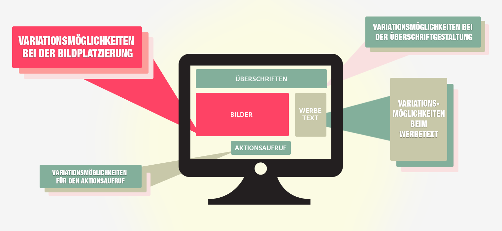

# Multivarianz-Tests – Überblick 

[!UICONTROL Bei Multivariate Tests] (MVT) in [!DNL Adobe Target] werden Kombinationen aus Angeboten in Elementen auf einer Seite verglichen, um zu bestimmen, welche Kombination die beste Leistung für eine bestimmte Zielgruppe erzielt. Zudem gibt der Test an, welches Element den größten Einfluss auf den Erfolg der Aktivität hat.

## MVT overview {#section_C73A2D1409EC42C9B0EDD4B976651C5E}

Multivariate Tests unterstützen Sie dabei, den relativen Einfluss bestimmter Elemente auf die Konversion im Vergleich zu anderen Elementen auf der Seite aufzudecken. Außerdem können sie dabei helfen, eine Elementkombination zu entwickeln, die sich als besonders effektiv erwiesen hat.

Ein Vorteil von Multivariater Tests im Vergleich zu A/B-Tests besteht darin, dass Sie sich anzeigen lassen können, welche Elemente auf Ihrer Seite den größten Einfluss auf die Konversion haben. Dies wird auch als „Haupteffekt“ bezeichnet. Diese Information hilft Ihnen zum Beispiel zu ermitteln, wo Sie Inhalt platzieren sollten, der die meiste Aufmerksamkeit erhalten soll.

Multivarianz-Tests helfen Ihnen auch dabei, zusammengesetzte Effekte zwischen zwei und mehr Elementen auf einer Seite zu ermitteln. Zum Beispiel kann eine bestimmte Anzeige zu mehr Konversionen führen, wenn sie mit einem bestimmten Banner oder Heldenbild kombiniert wird. Dies wird auch als „Interaktionseffekt“ bezeichnet.

[!DNL Target] verwendet vollständige Multivariater Tests, um Sie bei der Optimierung Ihres Inhalts zu unterstützen. Ein vollständiger Multivariater Test testet alle möglichen Inhaltskombinationen mit gleicher Wahrscheinlichkeit. Wenn Sie zum Beispiel über zwei Seitenelemente mit je drei Angeboten verfügen, entspricht dies neun möglichen Kombinationen (3 x 3). Drei Elemente, von denen zwei jeweils drei mögliche Angebote und eines zwei Angebote enthalten, entsprechen 18 Optionen (3 x 3 x 2).

In Target entspricht jede Kombination einem Erlebnis. Der Multivariater Test vergleicht die einzelnen Erlebnisse, sodass Sie erfahren, welche Kombinationen am erfolgreichsten sind. Daten werden gleichzeitig erfasst und analysiert, um zu verstehen, wie die Erfolgsmetrik durch die einzelnen Orte und Angebote beeinflusst wird.

Aufgrund der Anzahl der Kombinationen, die sich generieren lassen, erfordert ein Multivariater Test mehr Zeit und mehr Traffic als ein A/B-Test. Der auf der Seite eingehende Traffic muss ausreichend sein, um statistisch signifikante Ergebnisse für jedes Erlebnis zu erzielen. Um sinnvolle Ergebnisse zu erhalten, müssen Sie den eingehenden Traffic auf Ihrer Seite verstehen und die optimale Anzahl von Kombinationen über die richtige Zeitdauer testen. Die [Traffic-Schätzung](/help/c-activities/c-multivariate-testing/t-create-multivariate-test/traffic-estimator.md#task_71AA6922AFD447EA8C5E610A78ABA714) von Target kann Ihnen dabei helfen, einen Test zu entwerfen, der mit Ihrem Traffic funktioniert. Bevor Sie die Traffic-Schätzung verwenden, müssen Sie über gute Statistiken verfügen, aus denen die Anzahl der Impressionen und Konversionen hervorgeht, die Ihre Seite normalerweise erhält. Berücksichtigen Sie Ihr tägliches Traffic-Niveau. Je mehr Erlebnisse in einer Aktivität enthalten sind, desto mehr Traffic muss die Aktivität einbeziehen bzw. desto länger muss Ihre Aktivität ausgeführt werden. Wenn Ihr Traffic nicht sehr hoch ist, sollten Sie eine kleinere Anzahl von Kombinationen testen; anderenfalls könnte zu viel Zeit erforderlich sein, um gehaltvolle Testergebnisse zu erzielen.

## MVT terminology {#section_DF475CA7F34B4CFDB7BE7363761D64AE}

Das Verständnis grundlegender Begriffe kann für die Einrichtung eines Multivariater Tests hilfreich sein.

Es gibt verschiedene Begriffe, die branchenweit unterschiedlich verwendet werden. In diesem Abschnitt werden die von [!DNL Target] verwendeten Begriffe definiert.

**Kombination:** Die Inhaltsvarianten, die erstellt werden, wenn Sie verschiedene Inhaltsoptionen an verschiedenen Orten testen. Wenn Sie zum Beispiel drei Orte mit jeweils drei Inhaltsoptionen testen, ergeben sich 27 mögliche Kombinationen (3 x 3 x 3). Einem Besucher auf Ihrer Seite wird eine Kombination angezeigt, die auch als Erlebnis bezeichnet wird.

**Inhalt:** Text oder Bild, der/das eine Testvariation an einem Ort darstellt. Bei einem Multivariater Test werden verschiedene Inhaltsoptionen an verschiedenen Orten verglichen. Bei der MVT-Methode wird der Inhalt zuweilen als *Stufe* bezeichnet.

**Element:** Ein DOM-Element, das Inhaltsvarianten enthält, die im Rahmen eines Multivarianz-Tests getestet werden sollen. Siehe auch *Ort*.

**Ort:** Ein spezifischer Inhaltsbereich auf einer Seite, der oftmals in einem einzelnen DOM-Element enthalten ist. Bei der MVT-Methode wird der Ort zuweilen als *Faktor* bezeichnet. Ein vollständiger Multivariater Test vergleicht alle möglichen Angebotskombinationen in Ihren Orten.

## When to use MVT vs A/B {#section_3D2B966B6671406C861A1843EA41D28C}

Multivarianz-Tests können gemeinsam mit A/B-Tests zur Optimierung Ihrer Seite verwendet werden. Die gemeinsame Verwendung dieser Tests wird zum Beispiel in folgenden Fällen empfohlen:

* Verwenden Sie einen A/B-Test, um Ihr Seitenlayout zu optimieren, und anschließend einen Multivarianz-Test, um die jeweils besten Inhalte für die einzelnen Elemente auf der Seite festzulegen..

   Ein A/B-Test ermöglicht wichtige Aussagen zum Layout und Multivarianz-Tests eignen sich hervorragend, um Inhalte in den Elementen Ihres Seitenentwurfs zu testen. Die Durchführung eines A/B-Tests am Layout vor dem Test verschiedener Inhaltsoptionen kann Ihnen dabei helfen, das beste Layout und den wirksamsten Inhalt festzulegen.

* Verwenden Sie einen Multivarianz-Test um zu ermitteln, welches Element am wichtigsten ist, und anschließend einen stärker fokussierten A/B-Test für dieses Element.

   Wenn die Anzahl der verschiedenen Erlebnisse mehr als fünf beträgt und zwei oder mehr Elemente umfasst, sollten Sie einen Multivarianz-Test in Erwägung ziehen, bevor Sie Ihre A/B-Tests durchführen. Der Multivarianz Test zeigt, welche Bereiche auf der Seite aller Wahrscheinlichkeit nach die Konversion verbessern. Dies sind die Elemente, auf die sich ein Marketingexperte konzentrieren sollte. So kann ein Multivarianz-Test zum Beispiel zeigen, dass ein Aktionsaufruf das wichtigste Element zur Erreichung Ihrer Ziele ist. Sobald Sie festgelegt haben, welche Elemente und Inhalte am nützlichsten sind, um Sie bei der Erreichung Ihrer Ziele zu unterstützen, können Sie einen A/B-Test durchführen, um die Ergebnisse weiter zu verfeinern, wie zum Beispiel den vergleichenden Test zweier spezifischer Bilder oder den Vergleich von Formulierungen oder Farben eines Aktionsaufrufs. Mit der Durchführung eines oder mehrerer A/B-Tests im Anschluss an einen Multivarianz-Test können Sie den bestmöglichen Inhalt für die von Ihnen gewünschten Ergebnisse ermitteln.

## Zu beachten {#section_979FE3F398654C1EA1C86E7DBC9A8DAD}

* Verwenden Sie einen Multivarianz-Test, wenn Sie mindestens drei Elemente testen müssen. Wenn Sie weniger haben, starten Sie eine Reihe von  A/B-Tests.
* Wählen Sie die Seitenelemente aus, von denen Sie glauben, dass sie den größten Einfluss auf die Ergebnisse haben.
* Vermeiden Sie die Einbeziehung zu vieler Elemente oder Orte in einen Test. Je größer die Anzahl, desto länger die Testdauer.
* Planen Sie den Testentwurf im Voraus. Es wird nicht empfohlen, einen Beginn nach der Live-Schaltung und der Erfassung und Analyse von Daten zu bearbeiten.
* Es wird empfohlen, dass die Elemente unabhängig voneinander sind.

   Testen Sie z. B. Ihr Layout und Ihren Inhalt nicht im selben Test.

* Planen Sie in Anbetracht der gestiegenen Anzahl der Erlebnisse zusätzliche Zeit für die Qualitätssicherung ein. Sie können auch partielle Tests verwenden, um den Traffic zu verringern, der für einen Multivarianz-Test erforderlich ist. Weitere Informationen finden Sie unter Teilweise Tests unten:

## Teilweise Prüfung

[!DNL Target] bietet vollfaktorielle Multivariater Tests als integrierte Aktivitätsoption. In Statistiken bietet Design of Experiments viele Ansätze bzw. Designs, um zu bestimmen, welche Faktoren Ergebnisse beeinflussen. One such approach is the [Taguchi Method](https://en.wikipedia.org/wiki/Taguchi_methods) for partial-factorial testing. Mit Taguchi können Marketingexperten einen Satz von Voraussetzungen festlegen, der die Anzahl der Permutationen von Erlebnissen reduziert, die getestet werden müssen, und senkt gleichzeitig die Traffic-Anforderungen für einen multivariaten Test. Dieser Funktionalitäts- und Testansatz kann in [!DNL Target] unter Nutzung [dieser Offline-Tabelle](/help/assets/MVT-Taguchi-Partial-Factorial-Design-02102017.xlsx) verwendet werden.

Wenn Ihr Team andere Design of Experiments-Ansätze verwendet, können Sie diese Berechnungstabelle als Referenz-Implementierung für benutzerdefinierte Experiment-Designs verwenden.

Bedenken Sie die folgenden Tipps bei der Verwendung der Offline-Berechnungstabelle:

* Wählen Sie die Elemente, die Sie ändern möchten, sowie die Anzahl der Versionen der einzelnen Elemente aus (3x2, 4x3 usw.).
* Seien Sie bei der Nummerierung konsequent. Wenn die Schaltfläche beispielsweise Element 1 ist und die Optionen blau, grün und gelb sind, ist die blaue Schaltfläche 1-1, die grüne Schaltfläche ist 1-2 und die gelbe Schaltfläche ist 1-3.
* Die Offline-Tabelle bietet die angemessene Anzahl benötigter Erfahrungen (vier für 3x2, neun für 4x3 usw.).
* Erstellen Sie die Erlebnisse im A/B-Workflow mit [Visual Experience Composer (VEC)](/help/c-experiences/experiences.md). Sie können benutzerdefinierten Code verwenden, HTML, WYSIWYG oder eine beliebige Kombination davon bearbeiten.
* Führen Sie, nachdem die Aktivität beendet ist (basierend auf dem Stichprobengrößenrechner) Ergebnisse über die Tabelle aus, um die restlichen Details zu erhalten.

Weitere Informationen und Best Practices finden Sie unter [Best Practices für Multivarianz-Tests](/help/c-activities/c-multivariate-testing/best-practices.md#reference_53635817FFB741EF8C4E56CC70688EDD).

## Schulungsvideos:

In den folgenden Videos erhalten Sie weitere Informationen zu den in diesem Artikel behandelten Konzepten.

### Aktivität Types (9:03) - 

In diesem Übersichtsvideo werden die in Target Standard/Premium verfügbaren Aktivitäten erläutert. Multivariate Tests werden ab 4:20 erklärt.

* Beschreiben Sie die Arten von Aktivitäten, die Teil von [!DNL Adobe Target] sind
* Auswählen des für Ihre Ziele geeigneten Aktivitätstyps
* Beschreibung des für alle Aktivitätstypen gültigen Arbeitsablaufs mit drei Schritten

>[!VIDEO](https://video.tv.adobe.com/v/17386)

### Erstellen von Multivarianz-Tests (9:25) - 

In diesem Video wird erklärt, wie mithilfe des geleiteten Target-Arbeitsablaufs mit drei Schritten ein Multivarianz-Test aufgebaut, geplant und erstellt wird.

* Definieren und gestalten eines Multivariater Tests
* Erstellen eines Multivarianz-Tests

>[!VIDEO](https://video.tv.adobe.com/v/17395)