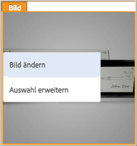
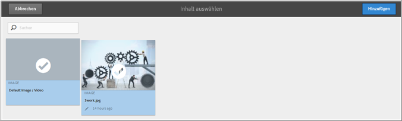
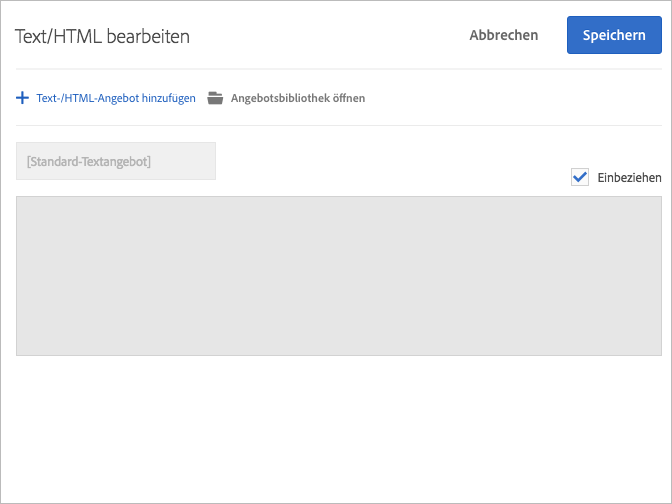

# Erstellen von Kombinationen{#create-combinations}

Verwenden Sie den Visual Experience Composer, um die Angebote zu erstellen, die Sie bei Ihrem Test berücksichtigen möchten.

>[!NOTE]
>
>Sie können bei der Auswahl von Objekten auf der Seite auf **[!UICONTROL Auswahl erweitern]** klicken, um das übergeordnete Element zusätzlich zum ursprünglich ausgewählten Element auszuwählen. Wenn Sie ein übergeordnetes Element auswählen, werden alle untergeordneten Elemente dieses Elements automatisch ausgewählt. Sie können diese Auswahl mehrere Male erweitern.

Der Visual Experience Composer ermöglicht die Bearbeitung von Angeboten, Angebotsnamen und Ortsnamen. Es wird eine Überlagerung eingeblendet, damit Sie sehen können, an welchen Stellen Sie Änderungen vorgenommen haben.

## Bildangebote   {#section_A48333211DB149ED926AE467D0032914}

Testen Sie mehrere Bildangebote an einem Ort, um zu ermitteln, welches Bild am erfolgreichsten ist.

1. Klicken Sie auf ein Bild auf Ihrer Seite und wählen Sie dann **[!UICONTROL Bild ändern]**.

   

1. Wählen Sie alle Bilder aus, die Sie in den Test einbeziehen möchten, und klicken Sie anschließend auf **[!UICONTROL Speichern]**.

   

Jedes Bild wird zu einem eigenen Erlebnis an diesem Ort.

## HTML-Angebote   {#section_DF016101AFA9412C9B99862C23DE77B1}

Testen Sie mehrere Text-/HTML-Angebote an einem Ort, um zu ermitteln, welches Angebot am erfolgreichsten ist.

1. Klicken Sie auf ein Text-/HTML-Angebot auf Ihrer Seite und klicken Sie anschließend auf **[!UICONTROL Text-/HTML ändern]**.

   

1. Klicken Sie auf **[!UICONTROL Text/HTML-Angebot hinzufügen]**, benennen Sie das Angebot und geben Sie dann den Code für das Text-/HTML-Angebot ein.

   

   >[!NOTE]
   >
   >Internet Explorer 10 unterstützt keine HTML 5-Eingabeplatzhalter. Infolgedessen bleibt der Platzhaltertext „Inhalt hinzufügen“ bei der Eingabe von Inhalt im Textfeld stehen, wenn Sie IE10 verwenden.

   Wiederholen Sie diese Schritte für alle weiteren Text-/HTML-Angebote, die Sie einbeziehen möchten.

1. Klicken Sie auf **[!UICONTROL Speichern]**.

Jedes Text-/HTML-Angebot wird zu einem eigenen Erlebnis an diesem Ort.

## Best Practices {#section_2E98C23D2F1A460FA732A31799CE6291}

* Vermeiden Sie die Einbeziehung von mehr Orten als für den Test notwendig. Jedes Erlebnis, das Sie in den Test einbeziehen, führt zu einer erheblichen Steigerung des Datenverkehrs und der erforderlichen Zeit für die Erreichung annehmbarer Ergebnisse. Wenn Sie zum Beispiel über Seitenelemente mit je drei Angeboten verfügen, entspricht dies neun möglichen Kombinationen (3 x 3). Drei Elemente, von denen zwei drei mögliche Angebote und eines zwei Angebote enthalten, entsprechen 18 Optionen (3 x 3 x 2). Mit jedem zusätzlichen Element und Angebot steigt die Anzahl erheblich.
* Sie können nun bei der Erstellung von multivariaten Tests über 10 Prozent der Erlebnisse aus dem Test ausschließen, vorausgesetzt Sie sind damit einverstanden, dass für die Analyse Offline-Berichterstellungen genutzt werden.
* Nutzen Sie die Vorschaufunktion, um unerwünschte Inhaltskombinationen zu vermeiden. Zum Beispiel kann es zwei Bilder geben, die verschiedene Rabatte für denselben Artikel oder Service anbieten. Wenn beide Bilder auf derselben Seite eingeblendet werden, ist dies unlogisch und sorgt wahrscheinlich für Verwirrung.
* Verwenden Sie die Traffic-Schätzung, um sicherzustellen, dass Ihr Test für das Datenverkehrsaufkommen konzipiert ist, das auf Ihrer Seite anfällt. Vergewissern Sie sich, dass die Traffic-Schätzung Ihre Testkonfiguration freigibt, sodass Sie die gewünschten Ergebnisse erhalten.
* Sie müssen mindestens drei Testelemente haben. Wenn Sie weniger haben, starten Sie eine Reihe von  A/B-Tests.
* Es wird empfohlen, dass sich die Alternativen der einzelnen Elemente deutlich voneinander unterscheiden.
* Eine bewährte, wenn auch nicht erforderliche Vorgehensweise besteht darin, für jedes Element die gleiche Anzahl von Alternativen zu verwenden.

