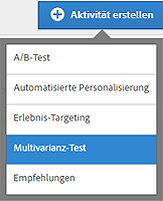
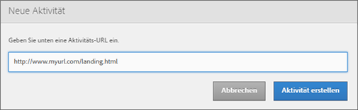
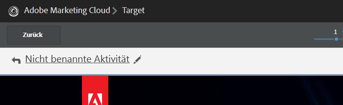
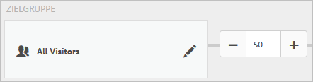
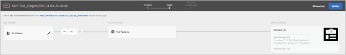
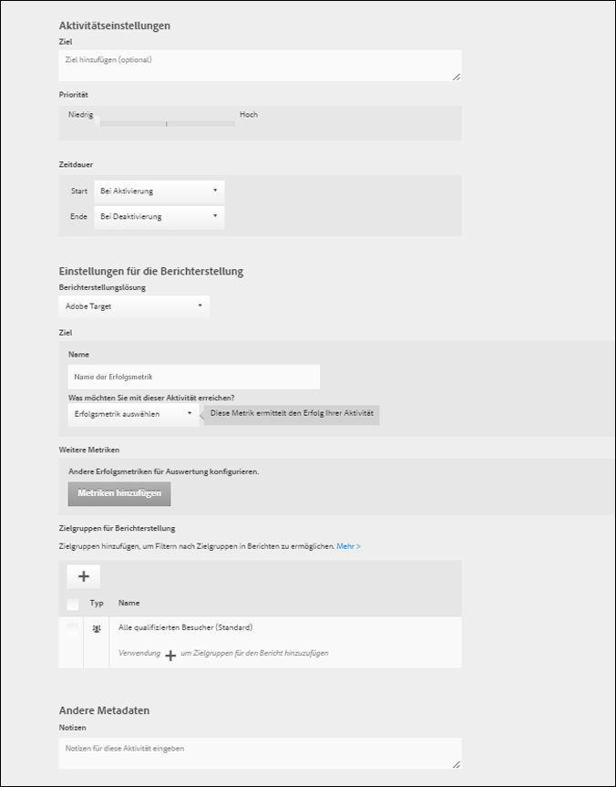

# Erstellen eines Multivarianz-Tests{#create-a-multivariate-test}

Visual Experience Composer in Target ermöglicht Ihnen, Ihren Test einfach direkt auf einer targetfähigen Seite zu erstellen und Teile der Seite in Target zu verändern.

Der Point-and-Click-Editor in Target ermöglicht Ihnen, einen beliebigen Ort auszuwählen und mehrere Angebote hinzuzufügen.

Der Multivarianz-Test benötigt einen Page-First-Bericht. Anders ausgedrückt bedeutet das, dass der Test auf einer spezifischen URL ausgeführt wird, mit den Erlebnissen, die Sie für diese Seite entwerfen.

1. Klicken Sie auf **[!UICONTROL Aktivität erstellen]** &gt; **[!UICONTROL Multivarianz-Test]**.

   

1. [Geben Sie die URL](../../../c-activities/c-multivariate-testing/t-create-multivariate-test/url.md#concept_C12E4A85FF3B4E518E3110F6CF1AF9C0) für die Seite an, die Sie testen möchten, und klicken Sie anschließend auf **[!UICONTROL Aktivität erstellen]**.

   

   >[!NOTE]
   >
   >Verwenden Sie eine vollständige URL einschließlich HTTP oder HTTPS am Anfang.

   Wenn eine Nachricht eingeblendet wird, die Sie dazu auffordert, Ihren Browser für gemischte Inhalte zu aktivieren, folgen Sie den Anweisungen in der Nachricht. Nachdem Sie Ihren Browser für gemischte Inhalte aktiviert haben, beginnen Sie erneut mit Schritt 1.

   Der Visual Experience Composer wird geöffnet.

   Informationen zur Problembehebung für den VEC finden Sie bei Bedarf unter [Fehlerbehebung für den Visual Experience Composer](../../../c-experiences/c-visual-experience-composer/r-troubleshoot-composer/troubleshoot-composer.md#reference_77743144F10143A3A89D56E116D296E4).
1. Geben Sie einen Namen für die Aktivität ein.

   

   Folgende Zeichen sind im Aktivitätsnamen nicht zulässig:

   | Zeichen | Beschreibung |
   |--- |--- |
   | / | Vorwärtsschrägstrich |
   | ? | Fragezeichen |
   | # | Raute  |
   | : | Doppelpunkt |
   | = | Gleich |
   | + | Plus |
   | - | Minus |
   | @ | At-Zeichen |

1. [Erstellen Sie die Angebote an jedem Ort](../../../c-activities/c-multivariate-testing/t-create-multivariate-test/add-offers.md#concept_DCE6B45C30F7419B8EC17AFDEE8D8AA6).

   

   Sie können folgende Angebotsarten hinzufügen:

   * HTML
   * Bild
   * Text

1. [Sehen Sie sich Ihre Erlebnisse in der Vorschau an](../../../c-activities/c-multivariate-testing/t-create-multivariate-test/preview-experiences.md#task_21A700587E88453A9FC2210C0DE53A28).

   

   Sie können jedes Erlebnis ansehen und diejenigen, die Sie nicht in Ihren Test aufnehmen möchten, ausschließen.
1. [Verwenden Sie die Traffic-Schätzung](../../../c-activities/c-multivariate-testing/t-create-multivariate-test/traffic-estimator.md#task_71AA6922AFD447EA8C5E610A78ABA714), um die Umsetzbarkeit Ihres Testplans zu überprüfen.

     

1. Wählen Sie die Zielgruppe und den Prozentsatz qualifizierter Besucher aus, die an der Aktivität teilnehmen sollen.

   

   Beispiel: Sie können Einträge auf 50 % aller Besucher oder 45 % der Zielgruppe aus Kalifornien begrenzen.

   >[!NOTE]
   >
   >Zusätzlich zur Auswahl einer bestehenden Zielgruppe können Sie verschiedene Zielgruppen miteinander kombinieren, um anstelle neuer Zielgruppen eine Ad-hoc-Zielgruppe zu erstellen. Weitere Informationen finden Sie unter [Mehrere Zielgruppen kombinieren](../../../c-target/combining-multiple-audiences.md#concept_A7386F1EA4394BD2AB72399C225981E5).

1. [Prüfen Sie die Testzusammenfassung](../../../c-activities/c-multivariate-testing/t-create-multivariate-test/test-summary.md#reference_971AB225963A4DC18EEB5B0E20F0A4A7) und nehmen Sie etwaig gewünschte Änderungen vor. Klicken Sie dann auf **[!UICONTROL Weiter]**.

   

1. [Legen Sie Ziele und Einstellungen](../../../c-activities/c-multivariate-testing/t-create-multivariate-test/goals-and-settings.md#reference_B25389FD6F3A4989801E740364B089CC) für den Test fest.

   

1. Klicken Sie auf **[!UICONTROL Speichern und Schließen]**, um die Aktivität zu erstellen.

## Schulungsvideo: Erstellen von multivarianten Tests (9:25)

In diesem Video wird gezeigt, wie mithilfe des geleiteten Target-Arbeitsablaufs mit drei Schritten ein Multivarianz-Test geplant und erstellt wird.

* Definieren und gestalten eines Multivarianz-Tests
* Erstellen eines Multivarianz-Tests

>[!VIDEO](https://video.tv.adobe.com/v/17395)
