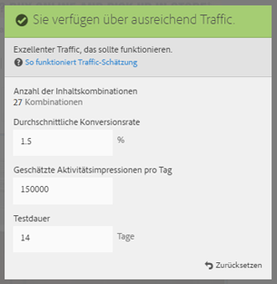
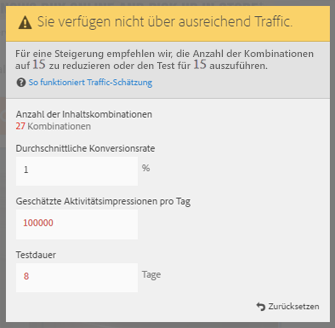

# Erstellen eines Multivarianz-Tests{#create-a-multivariate-test}

The [!UICONTROL Visual Experience Composer] (VEC) in [!DNL Target] makes it easy to create your test right on a Target-enabled page and to modify portions of the page within [!DNL Target].

Der Point-and-Click-Editor in Target ermöglicht Ihnen, einen beliebigen Ort auszuwählen und mehrere Angebote hinzuzufügen.

The [!UICONTROL Multivariate Test] (MVT) takes a page-first report. Anders ausgedrückt bedeutet das, dass der Test auf einer spezifischen URL ausgeführt wird, mit den Erlebnissen, die Sie für diese Seite entwerfen.

1. Klicken Sie auf **[!UICONTROL Aktivität erstellen]** &gt; **[!UICONTROL Multivarianz-Test]**.

   

   >[!NOTE]
   >
   >Die verfügbaren Aktivitätstypen hängen von Ihrem Target-Konto ab. Einige Aktivitätstypen werden in Ihrer Liste eventuell nicht angezeigt. For example, [!UICONTROL Automated Personalization] is a [Target Premium feature](/help/c-intro/intro.md#premium).
   >
   >For more information about the various activity types available in [!DNL Target] and their differences, see [Activities](../../../c-activities/activities.md#concept_D317A95A1AB54674BA7AB65C7985BA03). See [Target Activity types](/help/c-activities/target-activities-guide.md) to help you decide which activity type best suites your needs.

1. Select **[!UICONTROL Visual (Default)]**, if necessary.

   

   Wenn Sie den formularbasierten Experience Composer bevorzugen, wählen Sie [!UICONTROL Formular aus]. See [Form-Based Experience Composer](/help/c-experiences/form-experience-composer.md) for more information.

   >[!NOTE]
   >
   >Zusätzlich zum VEC und Form-Based Experience Composer bietet Target die Einzelseitenanwendung VEC und VEC für mobile Apps an. For more information about the various composers, see [Experiences and Offers](/help/c-experiences/experiences.md).
   >
   >Informationen zur Problembehebung für den VEC finden Sie bei Bedarf unter [Fehlerbehebung für den Visual Experience Composer](/help/c-experiences/c-visual-experience-composer/r-troubleshoot-composer/troubleshoot-composer.md).
   >
   >The [!UICONTROL Choose Workplace] option in the preceding illustration is a [Target Premium](/help/c-intro/intro.md) feature. Wenn diese Option nicht angezeigt wird, verfügt Ihr Unternehmen über eine Target Standard-Lizenz.]

1. (Conditional) If you are a Target Premium customer, [choose a workspace](/help/administrating-target/c-user-management/property-channel/property-channel.md).

1. [Geben Sie die URL](../../../c-activities/c-multivariate-testing/t-create-multivariate-test/url.md#concept_C12E4A85FF3B4E518E3110F6CF1AF9C0) für die Seite an, die Sie testen möchten, und klicken Sie auf **[!UICONTROL Weiter]**.

   >[!NOTE]
   >
   >Verwenden Sie eine vollständige URL einschließlich HTTP oder HTTPS am Anfang.

   Wenn eine Nachricht eingeblendet wird, die Sie dazu auffordert, Ihren Browser für gemischte Inhalte zu aktivieren, folgen Sie den Anweisungen in der Nachricht. Nachdem Sie Ihren Browser für gemischte Inhalte aktiviert haben, beginnen Sie erneut mit Schritt 1.

   Der Visual Experience Composer wird geöffnet.

1. Geben Sie einen Namen für die Aktivität ein.

   

   Folgende Zeichen sind im Aktivitätsnamen nicht zulässig:

   | Zeichen | Beschreibung |
   |--- |--- |
   | / | Vorwärtsschrägstrich |
   | ? | Fragezeichen |
   | # | Raute |
   | : | Doppelpunkt |
   | = | Gleich |
   | + | Plus |
   | - | Minus |
   | @ | At-Zeichen |

1. [Erstellen Sie die Angebote an jedem Ort](../../../c-activities/c-multivariate-testing/t-create-multivariate-test/add-offers.md#concept_DCE6B45C30F7419B8EC17AFDEE8D8AA6).

   

   Sie können folgende Angebotsarten hinzufügen:

   * HTML
   * Bild
   * Text

1. Click **[!UICONTROL Preview]** to [preview your experiences](/help/c-activities/c-multivariate-testing/t-create-multivariate-test/preview-experiences.md).

   

   Sie können jedes Erlebnis ansehen und diejenigen, die Sie nicht in Ihren Test aufnehmen möchten, ausschließen. To exclude one or more experiences, select the desired checkboxes, then click **[!UICONTROL Exclude]** .

   

1. [Verwenden Sie die Traffic-Schätzung](../../../c-activities/c-multivariate-testing/t-create-multivariate-test/traffic-estimator.md#task_71AA6922AFD447EA8C5E610A78ABA714), um die Umsetzbarkeit Ihres Testplans zu überprüfen.

   

   Die folgende Abbildung zeigt an, dass die Aktivität nicht über ungenügenden Traffic verfügt.

   

   Die folgende Abbildung zeigt an, dass die Aktivität nicht über ungenügenden Traffic verfügt.

   

1. Click **[!UICONTROL Next]** to advance to the [!UICONTROL Targeting] page.]

1. Wählen Sie die Zielgruppe und den Prozentsatz qualifizierter Besucher aus, die an der Aktivität teilnehmen sollen.

   

   Beispiel: Sie können Einträge auf 50 % aller Besucher oder 45 % der Zielgruppe aus Kalifornien begrenzen.

   >[!NOTE]
   >
   >Zusätzlich zur Auswahl einer bestehenden Zielgruppe können Sie verschiedene Zielgruppen miteinander kombinieren, um anstelle neuer Zielgruppen eine Ad-hoc-Zielgruppe zu erstellen. Weitere Informationen finden Sie unter [Mehrere Zielgruppen kombinieren](../../../c-target/combining-multiple-audiences.md#concept_A7386F1EA4394BD2AB72399C225981E5).

1. [Überprüfen Sie die Testzusammenfassung](../../../c-activities/c-multivariate-testing/t-create-multivariate-test/test-summary.md#reference_971AB225963A4DC18EEB5B0E20F0A4A7) und nehmen Sie die gewünschten Änderungen vor und klicken Sie dann auf **[!UICONTROL Weiter]**.

1. [Legen Sie Ziele und Einstellungen](../../../c-activities/c-multivariate-testing/t-create-multivariate-test/goals-and-settings.md#reference_B25389FD6F3A4989801E740364B089CC) für den Test fest.

1. Klicken Sie auf **[!UICONTROL Speichern und Schließen]**, um die Aktivität zu erstellen.

## Schulungsvideo: Erstellen von multivarianten Tests (9:25)

In diesem Video wird gezeigt, wie mithilfe des geleiteten Target-Arbeitsablaufs mit drei Schritten ein Multivarianz-Test geplant und erstellt wird.

* Definieren und gestalten eines Multivariater Tests
* Erstellen eines Multivarianz-Tests

>[!VIDEO](https://video.tv.adobe.com/v/17395?captions=ger)
