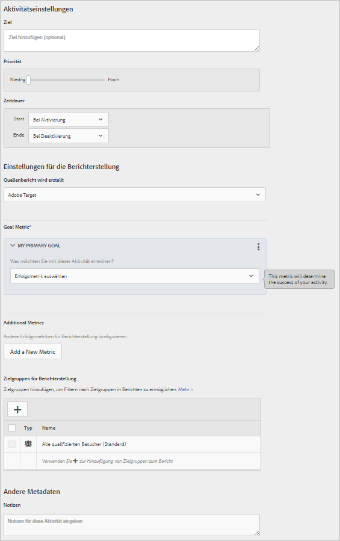

# Ziele und Einstellungen (Multivarianz-Tests)

Auf der Seite &quot;Ziele und Einstellungen&quot;in Adobe Target geben Sie Informationen zu den Zielen Ihrer [!UICONTROL Multivarianz] (MVT)-Tests ein.

* Aktivitätseinstellungen
* Berichterstellungseinstellungen
* Sonstige Metadaten

Welche Einstellungen verfügbar sind, hängt davon ab, ob Sie Target oder Analytics als Datenquelle verwenden.

## Aktivitätseinstellungen {#section_DCBDC354261F420EBD4B43EA34947BAC}

Die folgenden Einstellungen sind verfügbar:

### Ziel

Geben Sie ein optionales Ziel ein. Beim Ziel kann es sich um beliebige Informationen handeln, die Ihnen und Ihren Team-Mitgliedern beim Identifizieren der Kampagne helfen.

### Priorität

Abhängig von Ihren Einstellungen variieren die Optionen und die Oberfläche für Prioritäten. Sie können die veralteten Einstellungen „Hoch“, „Mittel“ und „Niedrig“ verwenden oder eine genauere Einstufung mit Werten von 0 bis 999 aktivieren.

Die Priorität wird verwendet, wenn mehrere Aktivitäten dem gleichen Ort mit der gleichen Zielgruppe zugewiesen sind. Wenn dem Ort zwei oder mehr Aktivitäten zugewiesen sind, wird die Aktivität mit der höchsten Priorität angezeigt.

Wenn diese Option in S[!UICONTROL Administration] > [!UICONTROL Berichte] (Standard) nicht aktiviert ist, geben Sie eine Priorität an: Niedrig, mittel oder hoch.

Klicken Sie zum Aktivieren der Feinabstufungen auf [!UICONTROL Administration] > [!UICONTROL Berichte] und schalten Sie dann die Option Feinkörnige Prioritäten aktivieren auf die Position &quot;Ein&quot;.

Ist diese Option aktiviert, legen Sie einen Wert zwischen 0 und 999 fest:

* 0 = Niedrig
* 999 = Hoch

Bei Aktivitäten, die in älteren Versionen von Target Standard/Premium erstellt wurden, wird eine niedrige Priorität in den Wert 0, eine mittlere in den Wert 5 und eine hohe in den Wert 10 umgewandelt. Diese Werte können nach Wunsch angepasst werden.

>[!NOTE]
>
>Wenn Sie genauer unterteilte Prioritäten verwendet haben und die Option deaktivieren möchten, müssen zunächst alle Prioritätswerte auf 0, 5 und 10 zurückgesetzt werden.

### Dauer

Die Aktivität kann bei Genehmigung starten, oder Sie können ein bestimmtes Datum und eine bestimmte Uhrzeit festlegen. Ebenso kann die Aktivität bei Deaktivierung oder zu einem festgelegten Datum und einer festgelegten Uhrzeit enden. Die Zeitauswahl verwendet eine 24-Stunden-Uhr, wobei 00:00 Uhr Mitternacht entspricht. Die Zeitzone wird auf die in Ihrem Browser konfigurierte Zeitzone eingestellt. Wenn Sie eine andere Zeitzone verwenden möchten, stellen Sie in Ihrem Browser eine andere Zeitzone ein und starten Sie ihn neu.

## Berichterstellungseinstellungen   {#section_13119392051044FBA6387D9B3B1C43CF}

Die folgenden Einstellungen sind verfügbar:

### Berichterstellungslösung

Geben Sie an, ob die Daten von Adobe Target oder Adobe Analytics erfasst werden. Informationen über die Unterschiede zwischen den Berichterstellungslösungen und deren jeweilige Vorteile finden Sie unter [Adobe Analytics als Berichterstellungsquelle für Target](/help/c-integrating-target-with-mac/a4t/a4t.md).

Wenn Sie Analytics als Berichtsquelle für Target auswählen, wählen Sie eine Analytics-Report Suite, um Target-Aktivitätsdaten zu empfangen. Wählen Sie dazu zunächst ein Analytics-Unternehmen aus, an das Ihr Konto gebunden ist, und wählen Sie anschließend die der Aktivität entsprechende Report Suite aus. Es stehen nur Report Suites, die für die Verbindung mit Adobe Target bereitgestellt werden, zur Auswahl zur Verfügung. Wenn nicht die erwarteten Report Suites angezeigt werden, versuchen Sie, sich bei Adobe Experience Cloud ab- und dann wieder anzumelden, und wiederholen Sie den Vorgang. Wenn die Report Suite weiterhin nicht in der Liste zu finden ist, wenden Sie sich an den Kundendienst.

Analytics for Target erfordert einen Trackingserver, damit die Ergebnisse richtig in Berichten zusammengefasst werden. Im Feld für den Trackingserver erscheint ein Standard-Trackingserver. Sollten Sie mehr als einen Trackingserver verwenden, müssen Sie prüfen, dass in diesem Feld der richtige Server aufgeführt ist. Weitere Informationen zu diesem Thema finden Sie unter [Verwendung eines Analytics-Trackingservers](/help/c-integrating-target-with-mac/a4t/analytics-tracking-server.md#task_72077BA7E93C4A65A715A18F32228823).

Sollte in Ihren Kontoeinstellungen eine Berichterstellungslösung angegeben sein, wird die angegebene Lösung verwendet und diese Einstellung ist nicht sichtbar.

>[!NOTE]
>
>Sie können Ihre Berichtsquelle nach Liveschaltung einer Aktivität nicht mehr ändern, da die Berichte sonst nicht mehr konsistent wären.

### Ziel

Wählen Sie die Aktion, die von einem Besucher ergriffen wird, um das Ziel zu erreichen. Wählen Sie zum Beispiel eine Konversionsmetrik und stellen Sie dann die Parameter ein, anhand derer festgestellt wird, dass ein Erfolg erreicht wurde.

>[!NOTE]
>
>Wenn Analytics als Berichterstellungslösung festgelegt ist, lautet die einzige verfügbare Zielmetrik „Konversion“. Es ist nicht möglich, Analytics-Metriken als Ziel auszuwählen.

Bei der Auswahl Ihrer Erfolgsmetrik wird ein Selektor angezeigt. Verwenden Sie diesen Selektor, um Einzelheiten zu dieser Erfolgsmetrik auszuwählen.

Bei Aktivierung bietet der geschätzte Wert des Konversionsfeldes (nicht verfügbar für Seitenergebnis-Metriken) einen Wert für Ihr Ziel, jedoch nicht für andere Metriken. Mit diesem Wert kann Target die geschätzte Umsatzsteigerung berechnen. Dieses Feld ist optional, ohne Eintrag kann jedoch kein Umsatzwachstum für eine nicht umsatzbezogene Metrik berechnet werden. Die Schätzung verwendet für alle Umsatzmetriken (Umsatz pro Besucher, durchschnittlicher Bestellwert, Gesamtverkäufe und Bestellungen) die Metrik „Umsatz pro Besucher“. Der Datentyp ist eine Währung.

Nach Erreichen des Aktivitätsziels sieht ein Besucher weiterhin den Aktivitätsinhalt, es sei denn, dieser Besucher ist qualifiziert für eine Aktivität mit höherer Priorität. Wenn der Besucher das Ziel erneut erreicht, wird dies als eine weitere Konversion gezählt. Beachten Sie, dass sich dieses Verhalten vom Standardverhalten in Target Classic unterscheidet, da Besucher dort als neu gezählt werden, wenn Sie den Test erneut sehen.

### Zusätzliche Metriken

Erstellen Sie zusätzliche Erfolgsmetriken.

Diese Einstellung ist nicht verfügbar, wenn Analytics als Berichterstellungslösung eingestellt ist. In diesem Fall werden die für die Analytics-Berichtssuite definierten Metriken angewendet.

Zielgruppen für die Berichterstellung

### Standardmäßig zeigen Berichte Ergebnisse für alle qualifizierten Besucher. Sie können Berichtszielgruppen hinzufügen, um nur Informationen über bestimmte Zielgruppen zu zeigen.

## Erweiterte Einstellungen {#section_E2FE441AFB324E498793ABB025ED9974}

Erweiterte Einstellungen sind für Zielmetriken Multivarianz-Test verfügbar.

>[!NOTE]
>
>Wenn Sie Adobe Analytics als Ihre Berichterstellungsquelle verwenden, werden die Einstellungen vom Analytics-Server verwaltet. Die Option für erweiterte Einstellungen steht nicht zur Verfügung.

### Welche Erfolgsmetrik muss erreicht werden, bevor diese Metrik erhöht wird?

Verwenden Sie diese Option, um die Erfolgsmetrik nur dann als erreicht zu werten, wenn jemand vorher bereits eine andere Erfolgsmetrik erreicht hat. So kann eine Testkonversion nur dann gültig sein, wenn der Besucher das Angebot anklickt oder auf eine bestimmte Seite gelangt, bevor die Konversion erfolgt.

Sie können für mehrere Metriken eine Abhängigkeit bereitstellen und die flexible Auswahl ermöglichen, ob die Metrik erreicht werden soll oder nicht, damit sich die Anzahl erhöht.

Sie müssen beide (oder mehrere) Erfolgsmetriken definieren, bevor Sie eine Abhängigkeit voneinander festlegen können.

Mithilfe der Option Abhängigkeit hinzufügen kann die Erfolgsmetrik inkrementiert werden, wenn eine andere Erfolgsmetrik erreicht oder nicht erreicht wurde.

So fügen Sie eine Abhängigkeit hinzu:

1. Klicken Sie nach dem Hinzufügen zusätzlicher Metriken auf **[!UICONTROL Erweiterte Einstellungen]**.
2. Klicken Sie auf die Option Abhängigkeit hinzufügen:

   

3. Verschieben Sie die gewünschte Metrik per Drag-and-drop vom linken Bereich in den rechten Bereich. Klicken Sie dann auf **[!UICONTROL Erreicht]**, um die Einstellung zwischen Erreicht und Nicht erreicht zu wechseln .

   

Sie können Abhängigkeiten bearbeiten oder entfernen, nachdem Sie sie hinzugefügt haben.

### Was passiert, wenn ein Benutzer auf diese Zielmetrik trifft?

Es gibt drei Möglichkeiten, nachdem ein Besucher die Zielmetrik erreicht hat:

* Wählen Sie „Anzahl erhöhen und Benutzer in Aktivität belassen“ aus, um festzulegen, wie die Anzahl erhöht wird.
* Wählen Sie „Anzahl erhöhen, Benutzer freigeben und Wiedereintritt erlauben“ aus, um festzulegen, welches Erlebnis dem Benutzer angezeigt wird, wenn er die Aktivität wieder aufnimmt.
* Wählen Sie „Anzahl erhöhen, Benutzer freigeben und an Wiedereintritt hindern“ aus, um festzulegen, was dem Benutzer statt der Aktivitätsinhalte angezeigt wird.

Weitere Informationen zu erweiterten Einstellungen finden Sie unter [Erfolgsmetriken](/help/c-activities/r-success-metrics/success-metrics.md#reference_D011575C85DA48E989A244593D9B9924).

## Sonstige Metadaten {#section_2E8917BEFB954480A4206B9E9E917F80}

Die folgende Einstellung ist verfügbar:

### Hinweise

Geben Sie sämtliche Informationen ein, die für Sie und Ihre Team-Mitglieder von Nutzen sind. Die Größe des Anmerkungen-Feldes kann geändert werden.

## Schulungsvideos

In den folgenden Videos erhalten Sie weitere Informationen zu den in diesem Artikel behandelten Konzepten.

### Aktivität Settings (3:02) 

In diesem Video erhalten Sie Informationen zu Aktivitätseinstellungen.

* Eingeben eines Ziels für Ihre Aktivität
* Festlegen der Priorität Ihrer Aktivitäten
* Planen von Start- und Endzeitpunkt der Aktivität
* Hinzufügen von Zielgruppen für Berichterstellung und zur Erstellung von Berichtsfiltern
* Eingeben von Notizen zu Aktivitäten

>[!VIDEO](https://video.tv.adobe.com/v/17381)

### Erstellen von Multivarianz-Tests (9:25) 

In diesem Video wird gezeigt, wie mithilfe des geleiteten Target-Arbeitsablaufs mit drei Schritten ein Multivarianz-Test erstellt wird. Ziele und Einstellungen werden ab 7:00 erläutert.

* Definieren und gestalten eines Multivariater Tests
* Erstellen eines Multivarianz-Tests

>[!VIDEO](https://video.tv.adobe.com/v/17395)
