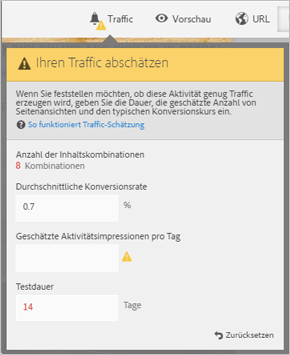
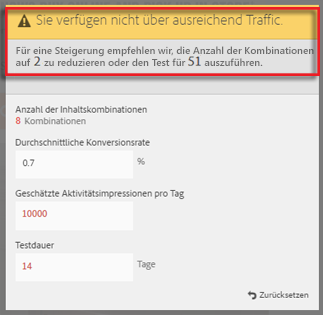
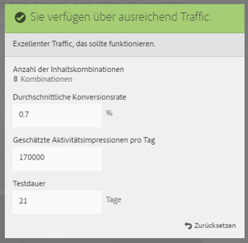

# Schätzen des für einen erfolgreichen Test erforderlichen Traffics

Da ein Multivariater Test mehrere Erlebnisse vergleicht, ist es wichtig zu wissen, wie hoch der erforderliche Traffic ist, um aussagekräftige Ergebnisse zu erzielen. Die Traffic-Schätzung verwendet Statistiken über Ihre Seite und die Anzahl der getesteten Erlebnisse, um das Traffic-Aufkommen und die erforderliche Testdauer für einen erfolgreichen Test zu schätzen.

Die Traffic-Schätzung prognostiziert die erforderliche Stichprobengröße, um Folgendes zu gewährleisten:

* 95 % Konfidenz

   Das bedeutet, dass die Wahrscheinlichkeit eines Falsch-Positiv-Werts im Fall einer real nicht vorhandenen Steigerung bei 5 % (100 % - Konfidenzniveau) liegt.
* 80 % Teststärke

   Das bedeutet, dass die Wahrscheinlichkeit, dass der Test eine tatsächliche Steigerung von 25 % oder mehr aufdeckt, bei 80 % liegt.
* 25 % zuverlässig bestimmbare Mindeststeigerung

   Target berechnet den erforderlichen Traffic, um mit 80-prozentiger Wahrscheinlichkeit eine tatsächliche Steigerung von 25 % oder mehr zu ermitteln.

Der Test verwendet die Bonferroni-Korrektur zur Korrektur von Mehrfachvergleichen. Diese Methode gilt als konservativ, was durch Erzwingen eines relativ hohen Wertes für die zuverlässig bestimmbare Mindeststeigerung kompensiert wird.

Die Traffic-Schätzung liefert auch Feedback, aus dem Sie erfahren, ob Sie über ausreichend Traffic verfügen, damit der von Ihnen entworfene Test erfolgreich ist.

1. Klicken Sie im Experience Composer auf das **[!UICONTROL Traffic]**-Symbol.

   Die Traffic-Schätzung wird geöffnet. Sie können erneut auf das **[!UICONTROL Traffic]**-Symbol klicken, um die Traffic-Schätzung auszublenden.

   

1. Geben Sie die übliche Konversionsrate, den Schätzwert für die Besucher pro Tag und die Testdauer an.

   * [!UICONTROL Anzahl der Inhaltskombinationen]: Wird automatisch anhand der Anzahl der erstellten Erlebnisse als Bestandteil Ihrer Aktivität nach etwaigen Ausschlüssen berechnet.
   * [!UICONTROL Typische Konversionsrate]: Die Konversionsrate wird als Prozentsatz ausgedrückt und basiert auf Ihrer Schätzung oder auf historischen Daten aus Ihrem Analysesystem
   * [!UICONTROL Geschätzte Besucher pro Tag]: Dies ist die Anzahl der Besucher, die diese Seite basierend auf den Targeting-Kriterien wahrscheinlich ansehen werden. Dies kann auf Ihren Analytics-Daten basieren.
   * [!UICONTROL Testdauer]: Die Anzahl der Tage, während derer die Aktivität ausgeführt werden soll.

   Die Traffic-Schätzung verwendet diese Statistik, um zu ermitteln, welche Anpassungen erforderlich sind, um einen erfolgreichen Test auszuführen.

   Im oberen Bereich der Traffic-Schätzung werden die von ihnen eingegebenen Werte berechnet und die Ergebnisse werden angezeigt.

   

   Wenn Sie die Zahlen ändern, ändern sich auch die Schätzwerte. Wenn Sie zum Beispiel eine große Anzahl von Erlebnissen testen und Ihre Konversionsrate und die Impressionen zu niedrig sind, zeigt die Traffic-Schätzung an, wie lange der Test noch ausgeführt werden muss, um erfolgreich zu sein. Oder wenn Ihr Traffic langsam ist, kann die Traffic-Schätzung eine niedrigere Anzahl von Erlebnissen vorschlagen, sodass Sie den Test über die gewünschte Anzahl von Tagen ausführen können.

   Wenn Sie nicht über ausreichend Traffic verfügen, können Sie eine oder beide der folgenden Maßnahmen ergreifen:

   * Reduzieren Sie die Anzahl der Angebotskombinationen sowie die Anzahl der Orte.
   * Verlängern der Testdauer.

   Passen Sie die Zahlen so lange an, bis die Traffic-Schätzung Ihnen mitteilt, dass Sie über ausreichend Traffic verfügen. Dann können Sie Ihren Entwurf entsprechend entwerfen.

   

