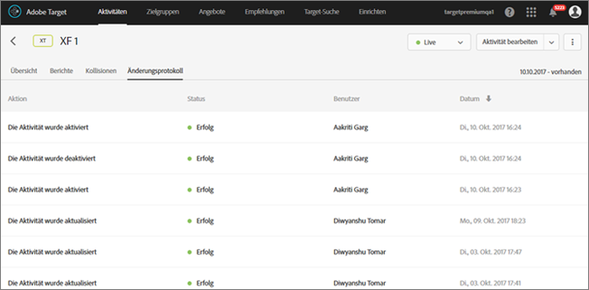

# Aktivitätsänderungsprotokoll{#activity-change-log}

Im Änderungsprotokoll befindet sich ein Datensatz zu den Personen, die Ihre Aktivitäten geändert haben; er gibt auch den Zeitpunkt dieser Änderungen an.

1. Öffnen Sie die Aktivität und klicken Sie auf **[!UICONTROL Änderungsprotokoll]**.

   

   Das Datum und der Benutzer werden bei jeder Erstellung, Aktualisierung, Aktivierung und Deaktivierung einer Aktivität aufgelistet. Änderungen an benutzerdefinierten Zielen und in der Aktivität verwendeten Angeboten werden ebenfalls aufgelistet. In der Spalte „Status“ wird angezeigt, ob die Aktion abgeschlossen, ausstehend oder fehlgeschlagen ist.

   Aktualisieren Sie die Seite, um die Statusänderungen zu sehen.
