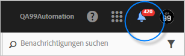
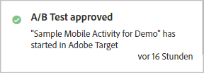
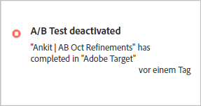
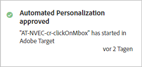
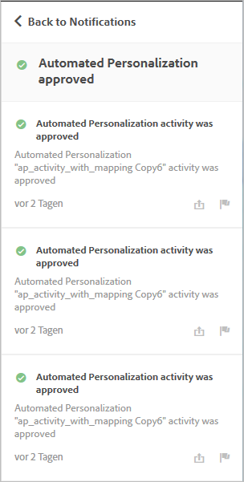

# Aktivitätsbenachrichtigungen{#activity-notifications}

Target kann mithilfe von Adobe Pulse Benachrichtigungen mit anderen Adobe Experience Cloud-Lösungen austauschen. Target sendet zwei Arten von Benachrichtigungen für alle Aktivitätstypen: eine bei Liveschaltung der Aktivität und eine bei ihrer Deaktivierung.

Benachrichtigungen von [!DNL Target] können in allen Lösungen von Benutzern gelesen werden, die in einer [!DNL Experience Cloud]-Produktumgebung mit [!DNL Target Standard/Premium] arbeiten.

Weitere Informationen zum Einrichten von Benachrichtigungen finden Sie [unter Benachrichtigungen](https://marketing.adobe.com/resources/help/en_US/mcloud/notifications.html) in der [!DNL Adobe Experience Cloud] Dokumentation.

Auf Benachrichtigungen in [!DNL Target] können Sie überall zugreifen, mit Ausnahme des Erstellungsarbeitsablaufs für Aktivitäten. Klicken Sie auf das Glockensymbol in der Überschrift der Seite, um das Benachrichtigungswidget ein- oder auszublenden.

[!DNL Target] sendet für sämtliche Aktivitätstypen zwei Arten von Benachrichtigungen:

* Wenn eine Aktivität verfügbar wird und die Bereitstellung des Angebots beginnt

   Beispiel:

   

* Wenn eine Aktivität deaktiviert wird und das Angebot nicht mehr verfügbar ist

   Beispiel:

   

Ähnliche Benachrichtigungen erscheinen auch dann, wenn eine geplante Aktivität ihr Startdatum erreicht oder beim Erreichen ihres Enddatums beendet wird.

Alle [!DNL Target]-Benachrichtigungen enthalten zur einfachen Erkennung den Namen der Aktivität, die genehmigt oder deaktiviert wurde, und die Wörter „Adobe Target“.

Wenn eine einzelne Aktivität mehrere Benachrichtigungen desselben Typs sendet, werden diese zu einer Karte zusammengefasst und die Anzahl an Benachrichtigungen darauf angezeigt. Beispiel:

Klicken Sie auf die Benachrichtigungskarte, um sich Einzelheiten zu den einzelnen Benachrichtigungen anzeigen zu lassen.

Wenn Sie zum Beispiel auf die Karten oben klicken, erscheinen diese drei Benachrichtigungen:

## Einschränkungen {#section_B466EB20B2554CE7B1915374B39F4322}

* Benachrichtigungen enthalten keine Informationen darüber, wer die Aktivität genehmigt, deaktiviert oder importiert hat.
* MVT-Benachrichtigungen erscheinen als „A/B-Test“, da sie in [!DNL Target Classic] als A/B-Kampagnen synchronisiert werden.

