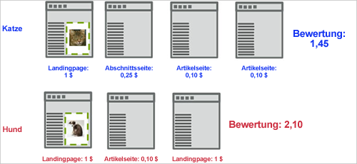
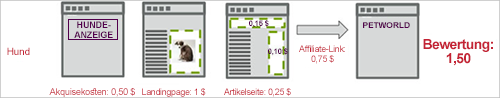

# Ergebniserfassung

Die Einsatzmetrik Ergebniserfassung in [!DNL Adobe Target] berechnet ein aggregiertes Ergebnis basierend auf dem Wert, der den auf der Site besuchten Seiten zugewiesen wurde, ab dem Zeitpunkt, zu dem der Besucher die erste Anzeige der Kampagne [!DNL Target]-Anforderung sieht.

Im folgenden Beispiel wird gezeigt, wie die Bewertungsinteraktion in einer Kampagne berechnet wird, in der zwei Erlebnisse (mit dem Bild einer Katze und dem Bild eines Hundes) geprüft werden.

In diesem Beispiel wird dem Benutzer zuerst die Katze angezeigt. Angenommen, eine globale [!DNL Target]-Anforderung gibt einen Seitenergebnis basierend auf dem Wert der Seite ein. Wenn der Marketingspezialist die Seitenanzahl-Interaktion mit einer mit `**any Target request**` verknüpften Erfolgsmetrik erfasst hat, wird die Besuchszahl für alle Anforderungen, die nach der Anzeigenanforderung um das Katzenbild gesehen werden, akkumuliert.

Die erste Seite fügt 1 zum Ergebnis hinzu, die zweite Seite 0,25, die dritte 0,10 und die vierte 0,10, insgesamt 1,45. Dies kann entweder als Währung oder als Punkte interpretiert werden. Bei einem weiteren Besuch findet der Besucher das Hundebild vor. Der Benutzer hat zwar weniger Seiten besucht, das Ergebnis ist aber mit 2,10 höher als beim anderen Besuch, da der Besucher wertvollere Seiten besucht hat.

Sie können Erwerbskosten und Partnerlinkkosten über AdBoxes und Weiterleitungen mit einbeziehen. Siehe hierzu auch den folgenden Seitenfluss. Beachten Sie, dass in diesem Beispiel sowohl [!DNL Target]-Anforderungen auf der Artikelseite eine Punktzahl übergeben, die möglicherweise eine bekannte CPM darstellt.

## Zuweisen eines Seitenergebnisses

Sie können jeder Seite auf Ihrer Site nach persönlichem Ermessen einen Wert zuweisen. Zum Beispiel lassen sich auf einer Koch-Site möglicherweise auf den Sonderseiten mehr Geld mit Werbung generieren als im Erlebnisbereich. Möglicherweise befinden sich im Sonderbereich wertvollere Artikel als im Erlebnisbereich. Mit der Seitenzahl können Sie eine Bewertung des Gesamtwerts des Besuchs ermitteln, sodass Personen, die mehr Sonderartikel lesen, mehr Punkte erhalten, als jemand, der nur durch die Seiten blättert.

Es gibt zwei Methoden zur Zuweisung eines Ergebnisses zu einer Seite:

* Erstellen Sie in der Anforderung [!DNL Target] einen Parameter mit dem Namen `mboxPageValue`.

   Beispiel: `('global_mbox', 'mboxPageValue=10');`

   Der angegebene Wert wird dem Ergebnis jedes Mal hinzugefügt, wenn die Seite mit dieser [!DNL Target]-Anforderung angezeigt wird. Wenn mehrere Anforderungen auf der Seite Ergebniswerte enthalten, entspricht das Ergebnis für die Seite der Gesamtwert aller Anforderungswerte. `mboxPageValue` ist ein reservierter Parameter, der zum Übergeben von Werten in einer Zielgruppe-Anforderung verwendet wird, um eine Interaktionsbewertung zu erfassen. Es können positive and negative Werte übergeben werden. Die Summe wird am Ende jedes Besuchs berechnet, um das Gesamtergebnis für den Besuch zu errechnen.

* Geben Sie den Parameter `?mboxPageValue=n` in die URL der Seite ein.

   Beispiel: `https://www.mydomain.com?mboxPageValue=5`

   Bei Verwendung dieser Methode wird der angegebene Wert dem Ergebnis für jede [!DNL Target]-Anforderung auf der Seite hinzugefügt. Wenn Sie beispielsweise den Parameter `?mboxPageValue=10`übergeben und auf der Seite drei [!DNL Target]-Anforderungen vorhanden sind, beträgt das Ergebnis für die Seite 30.

>[!NOTE]
>
>Zielgruppen, die sich oberhalb der ersten Anzeige der Aktivität befinden, werden nicht in das Ergebnis einbezogen.[!DNL Target]

Es empfiehlt sich, Werte in der [!DNL Target]-Anforderung zuzuweisen. Auf diese Weise können Sie die Werte, die Sie messen, genau bestimmen, je nach Inhalt der einzelnen Anforderungen.

>[!NOTE]
>
>Zur einfacheren Wartung können Sie die Wertezuweisungen des Seitenergebnisses Ihrer Site in der Datei [!DNL at.js] oder [!DNL mbox.js] mit bedingter JavaScript-Logik konfigurieren. So müssen Sie keinen weiteren Code zu Ihren Seiten hinzufügen. Wenden Sie sich an Ihren Berater, wenn Sie weitere Hilfe benötigen.

Sie können auch beide Methoden miteinander kombinieren. Dies könnte jedoch zu einem unerwartet hohen Ergebnis führen. Wenn Sie z. B. drei [!DNL Target]-Anforderungen den Wert 10 und einer vierten Anforderung keinen Wert zuweisen und dann den URL-Parameter `?mboxPageValue=5` übergeben, beträgt Ihr Seitenergebnis 50, 30 für die drei Anforderungen mit zugewiesenen Werten und dann 5 für jede der vier Anforderungen auf der Seite.

Der Zähler Beginn mit der ersten Anzeigeanforderung, nicht mit der Einstiegsanforderung. Wenn Sie z. B. die Aktivität auf der Homepage ohne Display-Anforderung eingeben und dann mit der Katalogseite, die eine Display-Anforderung enthält, verknüpfen, beginnt der Zähler, wenn Sie zur Katalogseite wechseln.

Sie können auch negative Werte für Seiten vergeben, die Sie Geld kosten und auf den Besucher keine positive Wirkung haben. Die negativen Werte gehen ebenfalls in das Gesamtergebnis ein. Diese Methode kann für Seiten verwendet werden, die Benutzer von einer Werbung aus erreichen. So können Sie die Höhe des CPC erkennen. Sie eignet sich auch für eine Support- oder Kontaktseite, bei deren Besuch mit einer nachfolgenden Supportanfrage zu rechnen ist.
