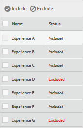

#  Anzeigen einer Erlebnisvorschau für automatisierte Personalisierung im Visual Experience Composer{#preview-experiences-for-automated-personalization-in-the-visual-experience-composer}

Da ein automatisierter Personalisierungstest mehrere Angebote auf einer Seite vergleicht, ist es hilfreich, die Seite mit jedem Erlebnis in einer Vorschau anzuzeigen.

1. Klicken Sie im Experience Composer auf **[!UICONTROL Vorschau]**.

   Es erscheint eine Liste aller Erlebnisse.

   

1. Klicken Sie auf ein spezifisches Erlebnis in der Liste, um es anzuzeigen.

1. Wählen Sie zum Ausschließen eines Erlebnisses aus der Aktivität das betreffende Erlebnis aus und klicken Sie auf **[!UICONTROL Ausschließen]**.

   

   Sie können auswählen, ein Erlebnis auszuschließen, das widersprüchliche Varianten anzeigt oder ästhetisch nicht ausgewogen ist.

   Standardmäßig sind alle Erlebnisse in der Aktivität „Automatisierte Personalisierung“ eingeschlossen. Um ein Erlebnis einzubeziehen, das zuvor ausgeschlossen wurde, wählen Sie das ausgeschlossene Erlebnis und klicken Sie auf **[!UICONTROL Einbeziehen]**.

Klicken Sie auf **[!UICONTROL Vorschaumodus verlassen]**, um zu Experience Composer zurückzukehren, sodass Sie Änderungen vornehmen können, oder klicken Sie auf **Weiter], um zum Targeting-Schritt zu wechseln.[!UICONTROL **
