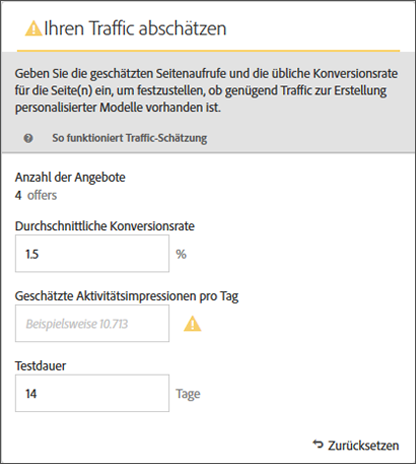
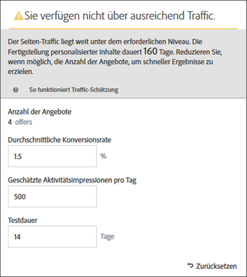
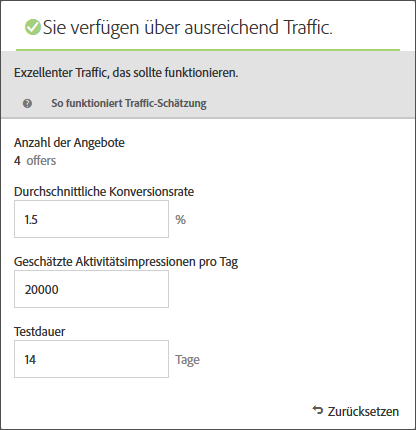

#  Schätzen des für einen erfolgreichen Test erforderlichen Traffics{#estimate-the-traffic-required-for-success}

Die [!UICONTROL Traffic-Schätzung] liefert Feedback, mit dem Sie wissen, ob Sie über ausreichend Traffic verfügen, damit Ihre [!DNL Adobe Target]-Aktivität erfolgreich ist.

Da eine [!UICONTROL Automated Personalization]-Aktivität mehrere Angebot-Kombinationen verwendet, ist es wichtig zu wissen, wie viel Traffic erforderlich ist, um aussagekräftige Ergebnisse zu erzielen. Die [!UICONTROL Traffic-Schätzung] verwendet Statistiken über Ihre Seite und die Anzahl der getesteten Erlebnisse, um die Traffic-Menge und die Testdauer zu schätzen, die für eine erfolgreiche Aktivität erforderlich ist.

Die [!UICONTROL Traffic-Schätzung] ermittelt, ob genügend Traffic vorhanden ist, um personalisierte Modelle zu generieren, indem die geschätzten Seitenimpressionen verglichen und die für die Seiten typischen Konversionsrat werden. Idealerweise gewährleistet die korrekte Stichprobengröße bei einer erfolgreichen Aktivität, dass personalisierter Inhalt innerhalb von 50 % der Dauer der Aktivität oder innerhalb von 14 Tagen bereit ist (je nachdem, welcher Fall zuerst eintritt). Dies bietet ausreichend Zeit, um personalisierten Inhalt zu erhalten und zu verstehen, welcher Inhalt bereitgestellt werden sollte.

Beachten Sie, dass [!DNL Target] nach dem Zufallsprinzip Erlebnisse bereitstellt, bis die Personalisierungsalgorithmen erstellt wurden. Das Häkchen-Symbol neben jedem Angebot zeigt an, wann das Modell für dieses Angebot fertig ist und [!DNL Target] mit der Bereitstellung personalisierter Inhalte beginnen kann. Da eine Steigerung erst erwartet wird, wenn die Modelle fertig sind, können Sie anhand der visuellen Angabe die richtige Erwartung festlegen. Verwenden Sie die [!UICONTROL Traffic-Schätzung] in [!UICONTROL Visual Experience Composer] (VEC), um eine Richtlinie darüber zu erhalten, wann die Modelle fertig sein werden.

## Traffic-Schätzung verwenden

1. Klicken Sie in [!UICONTROL Visual Experience Composer] auf **[!UICONTROL Traffic]**.

   

   Die [!UICONTROL Traffic-Schätzung] wird geöffnet. Sie können erneut auf **[!UICONTROL Traffic]**[!UICONTROL  klicken, um die Traffic-Schätzung auszublenden].

   

1. Geben Sie die typische Konversionsrate (oder die Konversionsrate, die Sie von dieser Aktivität erwarten), die geschätzten Aktivitätsimpressionen pro Tag und die Testdauer an.

   * **Anzahl der Angebot**: Wird automatisch basierend auf der Anzahl der Erlebnisse berechnet, die als Teil Ihrer Aktivität nach Ausschlüssen erstellt werden.
   * **Typische Konversionsrate**: Die Konversionsrate wird als Prozentsatz ausgedrückt und basiert auf Ihrer Schätzung oder auf historischen Daten aus Ihrem Analysesystem.
   * **Geschätzte Besuche pro Tag**: Dies ist die Anzahl der Besuche pro Tag von Besuchern, die die Aktivität auf der Grundlage der Targeting-Kriterien Ansicht haben. Dies kann auf Ihren Analytics-Daten basieren. Beachten Sie, dass es sich bei dieser Zahl um Besuche und nicht um Unique Visitors handeln sollte.
   * **Testdauer**: Die Anzahl der Tage, während derer die Aktivität ausgeführt werden soll.

   Die [!UICONTROL Traffic-Schätzung]r verwendet diese Statistiken, um zu ermitteln, welche Anpassungen erforderlich sind, um einen erfolgreichen Test durchzuführen.

   Oben im [!UICONTROL Traffic-Schätzung] werden die eingegebenen Werte berechnet und die Ergebnisse angezeigt.

   

   Wenn Sie die Zahlen ändern, ändern sich auch die Schätzwerte. Wenn Sie beispielsweise eine große Anzahl von Kombinationen testen und Ihre Konversionsrat- und Impressionen zu niedrig sind, zeigt die [!UICONTROL Traffic-Schätzung] an, wie lange der Test ausgeführt werden muss, um erfolgreich zu sein. Wenn Ihr Traffic gering ist, kann die [!UICONTROL Traffic-Schätzung] eine niedrigere Anzahl von Angebot-Kombinationen empfehlen, damit Sie den Test in der gewünschten Anzahl von Tagen ausführen können.

   Wenn Sie nicht über ausreichend Traffic verfügen, können Sie eine oder alle der folgenden Maßnahmen ergreifen:

   * Erwägen Sie, anstelle von [!UICONTROL Automated Personalization] eine [Auto-Zielgruppe](/help/c-activities/auto-target/auto-target-to-optimize.md)-Aktivität zu verwenden, um Erlebnisse mit mehreren Angebot-Änderungen in einer Erlebnisvariante zu erstellen.
   * Reduzieren Sie die Anzahl der Angebot-Kombinationen in Ihrer [!UICONTROL Automated Personalization]-Aktivität.
   * Erhöhen Sie die Dauer der Aktivität.

   Passen Sie die Zahlen an, bis die Traffic-Schätzung [!UICONTROL für ] sagt, dass Sie über ausreichend Traffic verfügen, und entwerfen Sie dann Ihren Test entsprechend.

   

   Wenn der Traffic ausreicht, wird auf dem Symbol [!UICONTROL Traffic] eine grüne Prüfung angezeigt. Wenn der Traffic nicht ausreicht, wird als Symbol ein roter Warnhinweis angezeigt.

## Häufig gestellte Fragen zur Traffic-Schätzung

Berücksichtigen Sie die folgenden häufig gestellten Fragen beim Arbeiten mit der [!UICONTROL Traffic-Schätzung]:

### Warum werden keine personalisierten Modelle von [!DNL Target] erstellt, wenn meine AP-Aktivität ausreichend Traffic aufweist?

Unter bestimmten Umständen ist Ihr Traffic möglicherweise groß genug, um ein personalisiertes Modell zu erstellen, aber dieser Traffic könnte [!DNL Target] darüber informieren, dass es keinen bedeutenden Unterschied zwischen dem personalisierten Modell und dem Zufallsprinzip gibt. Obwohl das Modell in [!DNL Target] erstellt und getestet wurde, wird es nicht bereitgestellt, da das Modell nicht wesentlich besser als zufällig ist.

Ein möglicher Grund dafür, dass das Modell nicht besser als zufällig ist, könnte sein, dass sich die Angebot nicht wesentlich voneinander unterscheiden. Ist dies der Fall, können Sie versuchen, die Angebot visueller anders zu gestalten, wenn das Messaging ähnlich ist, oder Sie können versuchen, das Messaging selbst zu ändern.
