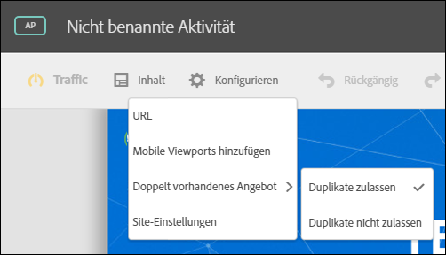
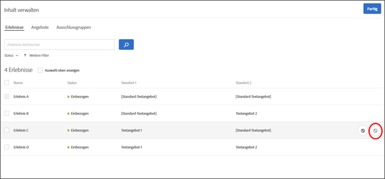
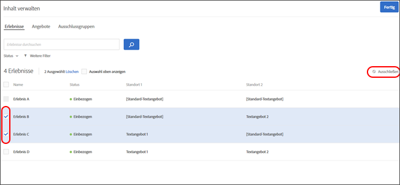
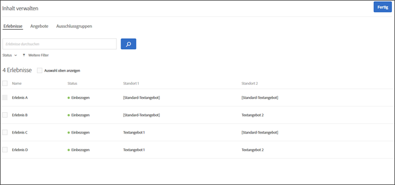
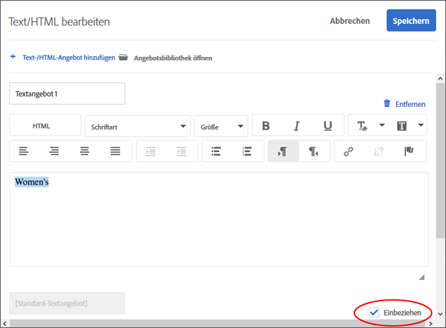
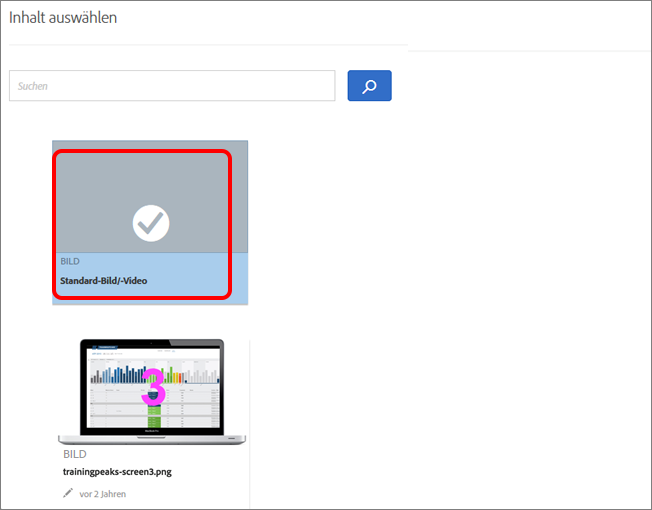
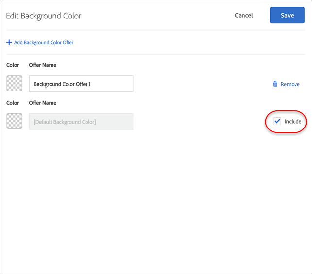

# Verwalten von Ausschlüssen{#manage-exclusions}

Verwalten Sie Ausschlussgruppen und doppelte Angebote in AP-Aktivitäten (automatisierte Personalisierung).

## Erstellen von Ausschlussgruppen {#task_AAAA6C7239A84F7696C8492F04B575A2}

Erstellen Sie Ausschlussgruppen in AP-Aktivitäten (automatisierte Personalisierung), um sicherzustellen, dass Erlebnisse mit den vorgesehenen Angeboten automatisch ausgeschlossen werden.

Ausschlussgruppen eignen sich hervorragend, um sicherzustellen, dass nicht kompatible Angebote nicht an verschiedenen Stellen in demselben Erlebnis dargestellt werden. Nehmen wir beispielsweise an, es liegen zwei Angebote vor: eines beinhaltet 20 % Rabatt auf alle Waren und das andere 15 % Rabatt. Diese beiden Angebote sollten den Besuchern grundsätzlich nie innerhalb desselben Erlebnisses präsentiert werden. Indem Sie diese beiden Angebote einer Ausschlussgruppe hinzufügen, können Sie sicherstellen, dass dies nie der Fall sein wird.

Sie können auch einschränken, welche Zielgruppen bestimmte Angebote in AP-Aktivitäten anzeigen können. Weitere Informationen finden Sie unter [Automatisierte Personalisierungsangebote](/help/c-activities/t-automated-personalization/ap-target-offers.md).

**So erstellen Sie eine Ausschlussgruppe:**

1. Klicken Sie beim Erstellen oder Bearbeiten einer AP-Aktivität in der Header-Leiste auf **[!UICONTROL Inhalt verwalten]**.
1. Klicken Sie im Dialogfeld [!UICONTROL Inhalt verwalten]**auf[!UICONTROL Ausschlussgruppe]**.

   

   Wenn Sie zuvor Ausschlussgruppen erstellt haben, werden sie in der Liste angezeigt. Wenn Sie noch keine Ausschlussgruppe erstellt haben, werden Sie aufgefordert, eine zu erstellen.
1. Klicken Sie auf **[!UICONTROL Ausschlussgruppe erstellen]**.

   

1. (Erforderlich) Geben Sie einen beschreibenden Namen für die Ausschlussgruppe an.

   Ein beschreibender Name hilft Ihnen oder anderen Benutzern, schnell eine Gruppe zu finden und ihren Zweck zu verstehen.

1. Suchen Sie die gewünschten Angebote, die Sie der Ausschlussgruppe hinzufügen möchten, und wählen Sie sie aus.

   Sie können mehrere Angebote vom selben Standort in einer Ausschlussgruppe auswählen.

1. Klicken Sie auf **[!UICONTROL Speichern]**.

Die Angebote in der Ausschlussgruppe werden von nun an automatisch aus denselben Erlebnissen ausgeschlossen.

## Ausschließen duplizierter Angebote {#concept_4EF78013F80E48EFA024AE0274C9F037}

Verhindern Sie die Duplizierung von Angeboten aus der Bibliothek, wenn diese bei [!UICONTROL automatischer Personalisierung] an verschiedenen Orten eingesetzt werden.

Möglicherweise verfügen Sie über eine Aktivität mit sechs Orten auf einer Seite mit 12 Angeboten. Hier besteht die Gefahr, dass das gleiche Angebot in einer Aktivität mehrmals angezeigt wird. Dadurch wird verhindert, dass doppelte Angebote gleichzeitig an unterschiedlichen Positionen in derselben Aktivität angezeigt werden.

Klicken Sie auf **[!UICONTROL Konfigurieren]** &gt; **[!UICONTROL Doppelt vorhandenes Angebot]** und wählen Sie **[!UICONTROL Duplikate zulassen]** oder **[!UICONTROL Duplikate nicht zulassen]** aus.

## Standardinhalt ausschließen {#task_C17D36EF58AF4908B17A3D84CA6DE85A}

Schließen Sie spezifische Erlebnisse aus, wenn Sie bestimmte Angebotskombinationen aus Ihrer Aktivität vom Typ „Automatisierte Personalisierung“ ausschließen möchten.

Es gibt möglicherweise bestimmte Kombinationen, die nicht gut gemeinsam funktionieren, oder Sie möchten möglicherweise die Anzahl der getesteten Erlebnisse eingrenzen, um die Traffic-Anforderungen für Ihre Aktivität zu verringern.

1. Klicken Sie beim Erstellen oder Bearbeiten einer AP-Aktivität in der Header-Leiste auf **Inhalt verwalten.**

   Die Liste [!UICONTROL Erlebnisse] zeigt jedes Erlebnis an, das anhand der Permutationen sämtlicher Inhalts- und Positionsoptionen generiert wurde.

1. Sie können Erlebnisse nach Bedarf ausschließen.

   Sie können spezifische Erlebnisse ausschließen, indem mit dem Mauszeiger über das gewünschte Erlebnis fahren und dann auf das Ausschlusssymbol klicken.

   

   Alternativ können Sie Erlebnisse in einem Batch-Vorgang ausschließen/einschließen, indem Sie das Kontrollkästchen für die entsprechenden Erlebnisse aktivieren und dann in der oberen rechten Ecke des Dialogfelds auf die Schaltfläche **Ausschließen** klicken. Die Schaltfläche „Ausschließen“ wird angezeigt, wenn mindestens ein Erlebnis aktiviert ist.

   

   Sie können diese Listenansicht so filtern, dass nur ausgeschlossene oder nur eingeschlossene Aktivitäten angezeigt werden. Klicken Sie dazu auf die Dropdownliste [!UICONTROL Status].

   Die Erlebnisse werden nun aus der Aktivität ausgeschlossen und ihr [!UICONTROL Status] lautet [!UICONTROL Ausgeschlossen].

   

## Standardinhalt ausschließen   {#task_DCB4528989DF4C05A3A4729E5891D18F}

In manchen Fällen möchten Sie Ihren Standardinhalt möglicherweise nicht als ein Teil Ihrer Aktivität vom Typ „Automatisierte Personalisierung“ einbeziehen. Wie Sie auf diese Einstellung zugreifen, unterscheidet sich vom Erstellen von Ausschlussgruppen. Sie können diese Methode verwenden, um nur über ein Angebot (unterscheidet sich von Ihrem Standardinhalt) an einer Position als Teil Ihrer Aktivität vom Typ „Automatisierte Personalisierung“ zu verfügen.

Das Ausschließen von Standardinhalt ist eine sehr gute Möglichkeit, um das Erscheinungsbild der restlichen Seite zu ändern, um die von Ihnen mit der Aktivität vom Typ „Automatisierte Personalisierung“ getesteten Angebote anzupassen. Wenn Sie beispielsweise die Farbpalette der von Ihnen getesteten Angebote abgleichen möchten, können Sie die Hintergrundfarbe Ihrer Seite ändern und die standardmäßige Hintergrundfarbe ausschließen.

**So schließen Sie Standardinhalt mit Visual Experience Composer (VEC) aus:**

1. Wählen Sie beim Erstellen oder Bearbeiten einer AP-Aktivität den zu ersetzenden Inhalt aus und klicken Sie auf **[!UICONTROL Text/HTML ändern]** oder **[!UICONTROL Bild ändern]** oder **[!UICONTROL Hintergrundfarbe ändern]**, um darauf zuzugreifen.
1. Erstellen Sie im Dialogfeld Ihren neuen Inhalt und deaktivieren Sie **Einbeziehen** rechts neben dem Standardinhalt (oder deaktivieren Sie das Standardbild/-video auf dem Bildschirm „Inhalt auswählen“).

   Je nach Inhalts-/Angebotstyp befindet sich das Kontrollkästchen [!UICONTROL Einbeziehen] an einer etwas anderen Position.

   Für Text-/HTML-Inhalt:

   

   Für Bild-/Videoinhalt:

   

   Für die Hintergrundfarbe:

   

1. Klicken Sie auf **[!UICONTROL Speichern]**.

   Sie können die Erlebnisse über die von Ihnen angegebenen Angebote unter [!UICONTROL Inhalt verwalten] anzeigen. Sie werden feststellen, dass in [!UICONTROL Inhalt verwalten] keine Erlebnisse mit dem von Ihnen ausgeschlossenen Standardangebot erstellt sind.

   

**So schließen Sie mit dem formularbasierten Experience Composer Standardinhalt aus:**

1. Klicken Sie beim Erstellen oder Bearbeiten einer AP-Aktivität unter **[!UICONTROL Inhalt]** auf **[!UICONTROL Text/HTML ändern]** oder **[!UICONTROL Bildangebot ändern]**.
1. Erstellen Sie im Dialogfeld Ihren neuen Inhalt und deaktivieren Sie **[!UICONTROL Einbeziehen]rechts neben dem Standardinhalt (oder deaktivieren Sie das Standardbild/-video auf dem Bildschirm „Inhalt auswählen“).**

   Je nach Inhalts-/Angebotstyp befindet sich das Kontrollkästchen „Einbeziehen“ an einer etwas anderen Position.

   Für Text-/HTML-Inhalt:

   

   Für Bild-/Videoinhalt:

   

1. Klicken Sie auf **[!UICONTROL Speichern]**.

   Sie können die Erlebnisse über die von Ihnen angegebenen Angebote unter [!UICONTROL Inhalt verwalten] anzeigen. Sie werden feststellen, dass in [!UICONTROL Inhalt verwalten] keine Erlebnisse mit dem von Ihnen ausgeschlossenen Standardangebot erstellt sind.

   
