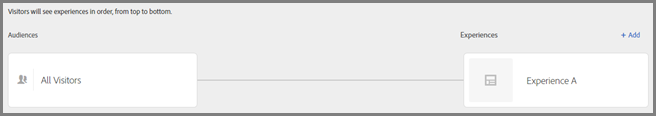

# Erlebnis erstellen{#create-experience}

Der Experience Composer stellt eine visuelle Benutzeroberfläche zur Bearbeitung von Erlebnissen auf Ihrer Seite zur Verfügung.

Weitere Informationen zu Erlebnissen finden Sie unter [Erlebnisse](../../../c-experiences/experiences.md#concept_A2E10F6AFB3D4AEAB6951EE14688848D).

1. Klicken Sie auf **[!UICONTROL Erlebnis hinzufügen]**.

   >[!NOTE]
   >
   >Wenn Sie mit einem Erlebnis auf eine Zielgruppe abzielen, müssen Sie die Zielgruppe auswählen, bevor Sie ein Erlebnis hinzufügen können. Es wird eine Meldung angezeigt, um Sie an die Auswahl Ihrer Zielgruppe zu erinnern.

1. Geben Sie die Aktivitäts-URL ein, wenn Sie dazu aufgefordert werden. Geben Sie die vollständige URL ein (einschließlich `https://`) und klicken Sie anschließend auf **[!UICONTROL Weiter]**.

   Der Experience Composer (siehe [Erlebnisse](../../../c-experiences/experiences.md#concept_1D011219034B492BB03C08B3BB80E3F0)) öffnet die Seite, die in Ihren Kontoeinstellungen angegeben ist. Um eine andere Seite anzuzeigen, klicken Sie auf das Globussymbol, geben Sie die URL in das Feld „URL auswählen“ im Experience Composer ein und klicken Sie auf **[!UICONTROL Weiter]**. Wenn Sie eine URL für eine Site eingegeben haben, die keinen Target Standard-JavaScript-Code enthält, können Sie keine Seitenelemente auswählen.

   Standardmäßig gestattet der Visual Experience Composer das Ändern von Elementen mit JavaScript nicht (zum Beispiel sich drehende Banner). Sie können JavaScript deaktivieren, wenn Sie diese Elemente mit dem Visual Experience Composer ändern möchten.

   >[!NOTE]
   >
   >Wenn Sie die URL ändern, nachdem Sie für ein oder mehrere Erlebnisse Änderungen auf der Seite vorgenommen haben, wird das Erlebnis bei der Verwendung der neuen Seite zurückgesetzt und die vorgenommenen Änderungen gehen verloren.

1. Wählen Sie die Elemente, die Sie ändern möchten, und nehmen Sie die gewünschten Änderungen vor.

   Wenn Sie den Mauszeiger über die Elemente auf Ihrer Seite bewegen, werden diese Elemente hervorgehoben. Alle hervorgehobenen Elemente können mit dem Experience Composer geändert werden.

   Wenn Sie mit Target Classic (früher Test&amp;Target) eine Mbox auf der Seite erstellt haben, wird diese Mbox als Element mit dem Mbox-Namen angezeigt und kann wie jedes andere Element bearbeitet werden.

   Eine Liste der Aktionen, die für ein Element auf der angezeigten Seite durchgeführt werden können, um das Erlebnis zu ändern, finden Sie unter [Visual Experience Composer-Optionen](/help/c-experiences/c-visual-experience-composer/viztarget-options.md).

   >[!NOTE]
   >
   >Wenn Sie ein Bild aus einer anderen Quelle als der Hauptseite bereitstellen (z. B. ein Bild, das auf akamei.net gehostet und auf dell.com bereitgestellt wird), wird das Bild nicht in der Miniaturansicht der Seite, die auf dem Flussdiagramm zu sehen ist, angezeigt.

1. Aktivieren Sie das Kontrollkästchen, wenn Sie den Entwurf des Erlebnisses abgeschlossen haben.

   Das Aktivitätsdiagramm wird angezeigt:

   

   Wenn ein Erlebnis domänenübergreifenden Inhalt enthält, wird die Miniaturansicht möglicherweise nicht ordnungsgemäß angezeigt und durch ein Symbol ersetzt.
1. Erstellen Sie, falls erwünscht, weitere Erlebnisse.

   >[!NOTE]
   >
   >Sie können Zielgruppen-/Erlebnispaare beim Erstellen oder Bearbeiten von XT-Aktivitäten per Drag &amp; Drop verschieben, um die Paare in der gewünschten Reihenfolge anzuordnen. Die Besucher werden der Reihe nach von oben nach unten für Erlebnisse bewertet.

   

   Beim Erlebnis-Targeting kommt es auf die Reihenfolge an. Wenn ein Besucher unter das erste Zielgruppen-/Erlebnispaar fällt, wird das erste Erlebnis bereitgestellt.

   Nehmen wir beispielsweise an, Ihnen war nicht bewusst, dass es beim Erstellen einer XT-Aktivität auf die Reihenfolge ankommt. Später im Verlauf des Tests stellen Sie fest, dass sich Besucher, die sich Ihrer Meinung nach eigentlich für Erlebnis B oder C qualifizieren müssten, stattdessen für Erlebnis A qualifizieren. Eine Ursache dafür könnte sein, dass sich die Zielgruppen nicht gegenseitig ausschließen und sich nicht in der richtigen Reihenfolge befinden (z. B. Erlebnis A = USA, Erlebnis B = San Francisco und Erlebnis C = Kalifornien). In diesem Szenario qualifizieren sich alle Benutzer aus den USA für Erlebnis A, selbst wenn sie in San Francisco oder in einem anderen Ort in Kalifornien leben. Sie können die Reihenfolge der Zielgruppen-/Erlebnispaare von der stärksten Einschränkung zur geringsten Einschränkung ändern (San Francisco &gt; Kalifornien &gt; USA), ohne die gesamte Aktivität neu erstellen zu müssen.

## Umbenennen, Bearbeiten oder Löschen eines Erlebnisses

Sie können in einem Erlebnis innerhalb einer A/B- oder XT-Aktivität (Erlebnis-Targeting) auf das Bearbeitungssymbol (drei vertikale Ellipsen) klicken und folgende Optionen auswählen:

* Umbenennen
* Bearbeiten
* Löschen

Klicken Sie auf **[!UICONTROL Weiter], wenn Sie diesen Schritt abgeschlossen haben.**

## Duplizieren eines Erlebnisses

Sie können ein Erlebnis aus einer XT-Aktivität (Erlebnis-Targeting) kopieren, um kleinere Änderungen vorzunehmen, ohne das Erlebnis vollständig neu erstellen zu müssen.

Klicken Sie auf der Seite **[!UICONTROL Erlebnisse]** (der erste Schritt im Drei-Schritte-Workflow) auf die drei vertikalen Ellipsen und anschließend auf **[!UICONTROL Duplizieren]**.

## Schulungsvideo: Verwenden von Visual Experience Composer

In diesem Video erhalten Sie Informationen zum Verwenden der Optionen in Visual Experience Composer.

* Inhalt einer Seite ändern
* Layout einer Seite ändern

>[!VIDEO](https://video.tv.adobe.com/v/17399)