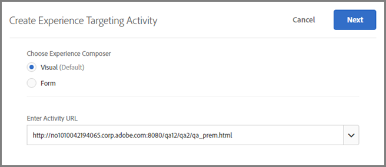
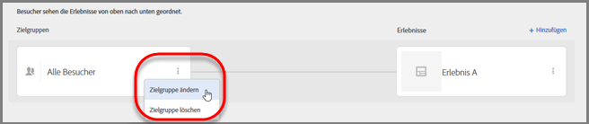
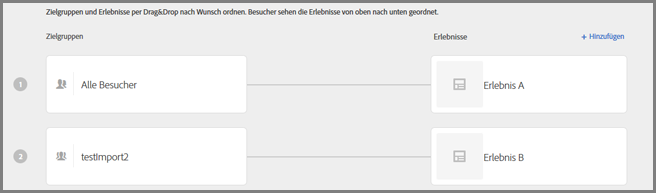
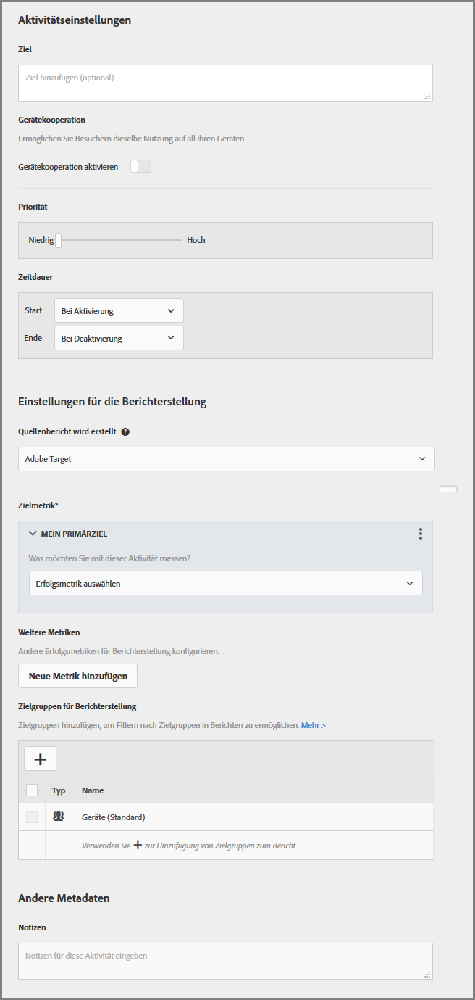

# Erstellen einer Erlebnis-Targeting-Aktivität{#create-an-experience-targeting-activity}

Verwenden Sie den Visual Experience Composer, um eine Erlebnis-Targeting-Aktivität auf einer für Target aktivierten Seite zu erstellen und Teile der Seite in Target zu verändern.

1. Klicken Sie in der Liste [!UICONTROL Aktivitäten] auf **[!UICONTROL Aktivität erstellen]** &gt; **[!UICONTROL Erlebnis-Targeting]**.

   

   >[!NOTE]
   >
   >Die verfügbaren Aktivitätstypen hängen von Ihrem Target-Konto ab. Einige Aktivitätstypen werden in Ihrer Liste eventuell nicht angezeigt.

   Weitere Informationen über die Aktivitätstypen finden Sie unter [Aktivitäten](../../../c-activities/activities.md#concept_D317A95A1AB54674BA7AB65C7985BA03).
1. Geben Sie Ihre [Aktivitäts-URL](../../../c-activities/t-experience-target/t-xt-create/xt-activity-url.md#concept_D28549AAA0A14E3BB5F05F32BE8ABC90) ein und klicken Sie dann auf **[!UICONTROL Weiter]**.

   

   Wenn Ihr Konto mit einer Standard-URL konfiguriert wurde, dann wird diese URL standardmäßig angezeigt. Sie können von der Standard-URL zu einer anderen URL wechseln.

   Informationen zur Problembehebung für den VEC finden Sie bei Bedarf unter [Fehlerbehebung für den Visual Experience Composer](../../../c-experiences/c-visual-experience-composer/r-troubleshoot-composer/troubleshoot-composer.md#reference_77743144F10143A3A89D56E116D296E4).

   Wenn Sie den formularbasierten Experience Composer bevorzugen, wählen Sie diese Option aus. Weitere Informationen finden Sie unter [Formularbasierter Experience Composer](https://marketing.adobe.com/resources/help/de_DE/target/target/t_form_experience_composer.html).

   Der Visual Experience Composer wird geöffnet und zeigt die Seite an, die in der URL angegeben ist.
1. Geben Sie an der verfügbaren Stelle einen Namen für die Aktivität ein.

   

   Folgende Zeichen sind im Aktivitätsnamen nicht zulässig:

   | Zeichen | Beschreibung |
   |--- |--- |
   | `/` | Vorwärtsschrägstrich |
   | `?` | Fragezeichen |
   | `#` | Raute |
   | `:` | Doppelpunkt |
   | `=` | Gleich |
   | `+` | Plus |
   | `-` | Minus |
   | `@` | At-Zeichen |

1. [Erstellen Sie neue Erlebnisse](../../../c-activities/t-experience-target/t-xt-create/xt-add-experience.md#task_454646F2895242D3B92DC395A0CE1A00), indem Sie die Elemente auf der Seite ändern.

   Der Experience Composer (siehe [Erlebnisse](../../../c-experiences/experiences.md#concept_1D011219034B492BB03C08B3BB80E3F0)) öffnet die Seite, die in Ihren Kontoeinstellungen angegeben ist. Um eine andere Seite anzuzeigen, klicken Sie auf das Globussymbol, geben Sie die URL in das Feld „URL auswählen“ im Experience Composer ein und klicken Sie auf **[!UICONTROL Weiter]**. Wenn Sie eine URL für eine Site eingegeben haben, die keinen Target Standard-JavaScript-Code enthält, können Sie keine Seitenelemente auswählen.

   Standardmäßig gestattet der Visual Experience Composer das Ändern von Elementen mit JavaScript nicht (zum Beispiel sich drehende Banner). Sie können JavaScript deaktivieren, wenn Sie diese Elemente mit dem Visual Experience Composer ändern möchten.

   >[!NOTE]
   >
   >Wenn Sie die URL ändern, nachdem Sie für ein oder mehrere Erlebnisse Änderungen auf der Seite vorgenommen haben, wird das Erlebnis bei der Verwendung der neuen Seite zurückgesetzt und die vorgenommenen Änderungen gehen verloren.

   Wenn Sie den Mauszeiger über die Elemente auf Ihrer Seite bewegen, werden diese Elemente hervorgehoben. Alle hervorgehobenen Elemente können mit dem Experience Composer geändert werden.

   Wenn Sie mit Target Classic (früher Test&amp;Target) eine Mbox auf der Seite erstellt haben, wird diese Mbox als Element mit dem Mbox-Namen angezeigt und kann wie jedes andere Element bearbeitet werden.

   >[!NOTE]
   >
   >Wenn Sie ein Bild aus einer anderen Quelle als der Hauptseite bereitstellen (z. B. ein Bild, das auf akamei.net gehostet und auf dell.com bereitgestellt wird), wird das Bild nicht in der Miniaturansicht der Seite, die auf dem Flussdiagramm zu sehen ist, angezeigt.

1. Klicken Sie auf **[!UICONTROL Weiter]**.

   Das Flussdiagramm wird geöffnet.

   

   Das Flussdiagramm führt Sie durch die Schritte zur Auswahl der Zielgruppe für die Aktivität und zum Einrichten der Erlebnisse.
1. Bewegen Sie die Maus über die Zielgruppe, klicken Sie auf das daraufhin angezeigte **[!UICONTROL Bearbeitungssymbol]** (drei vertikale Ellipsen), klicken Sie auf **[!UICONTROL Zielgruppe ändern]** und wählen Sie dann die Zielgruppe für das erste Erlebnis in der Aktivität aus.

   

   Die Zielgruppenbibliothek wird angezeigt. Die Zielgruppenbibliothek enthält Zielgruppen, die bereits definiert wurden, einschließlich einiger häufiger Zielgruppen, die als Teil von Target vorgefertigt sind. Sie können entweder eine Zielgruppe aus der Bibliothek auswählen oder [eine neue Zielgruppe erstellen](../../../c-target/c-audiences/audiences.md#concept_65BE870D290E412D8BBF557EEA67C271). Wählen Sie „Alle Besucher“, um das gleiche Erlebnis für alle Teilnehmer anzuzeigen.

   >[!NOTE]
   >
   >Zusätzlich zur Auswahl einer bestehenden Zielgruppe können Sie verschiedene Zielgruppen miteinander kombinieren, um anstelle neuer Zielgruppen eine Ad-hoc-Zielgruppe zu erstellen. Weitere Informationen finden Sie unter [Mehrere Zielgruppen kombinieren](../../../c-target/combining-multiple-audiences.md#concept_A7386F1EA4394BD2AB72399C225981E5).

   Wenn Sie eine Zielgruppe erstellen, können Sie einen Standort (mbox) auswählen und Parameter für ihn festlegen. Wählen Sie unter „Benutzerdefinierte Parameter“ die Mbox und geben Sie dann die gewünschten Parameter an.

   >[!NOTE]
   >
   >Zielgruppen werden automatisch im Hintergrund importiert, wenn Sie die Zielgruppenliste öffnen und die importierten Zielgruppen älter als 10 Minuten sind.

   Sie können auf das [!UICONTROL Bearbeitungssymbol] (drei vertikale Ellipsen) und dann auf [!UICONTROL „Zielgruppe entfernen“] klicken, um eine vorhandene Zielgruppe zu entfernen.
1. Klicken Sie auf **[!UICONTROL Erlebnis-Targeting hinzufügen]**.

   >[!NOTE]
   >
   >Wenn Sie mit einem Erlebnis auf eine Zielgruppe abzielen, müssen Sie die Zielgruppe auswählen, bevor Sie ein Erlebnis hinzufügen können. Es wird eine Meldung angezeigt, um Sie an die Auswahl Ihrer Zielgruppe zu erinnern.

1. (Optional) Klicken Sie auf **[!UICONTROL Hinzufügen]** und richten Sie zusätzliche Targeting-Erlebnisse ein.

   

   Klicken Sie auf **[!UICONTROL Weiter], wenn Sie diesen Schritt abgeschlossen haben.**
1. Legen Sie [Ziele und Einstellungen](../../../c-activities/t-experience-target/t-xt-create/xt-goals-and-settings.md#reference_B25389FD6F3A4989801E740364B089CC) für die Aktivität fest.

   

1. Klicken Sie auf **[!UICONTROL Speichern &amp; Schließen]**.
