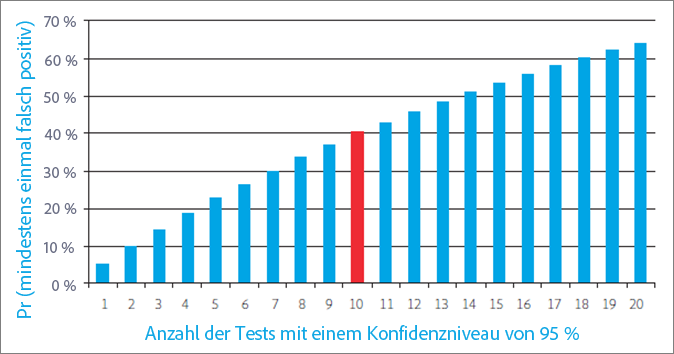
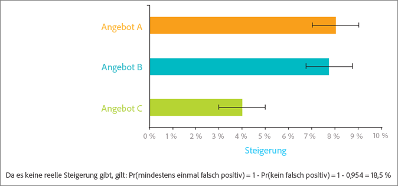
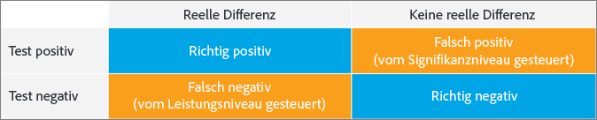
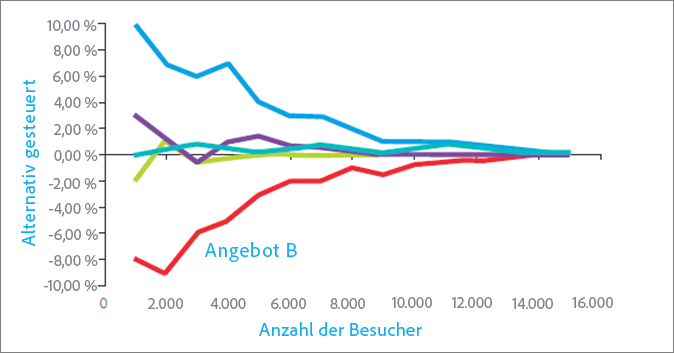
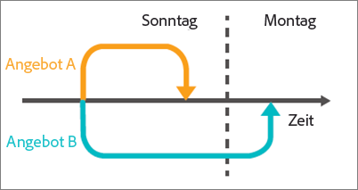
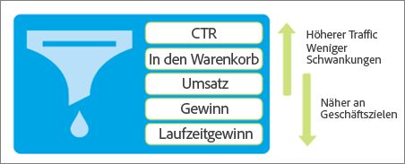

# Zehn häufige A/B-Testfallen und wie sie vermieden werden können

A/B-Tests in [!DNL Adobe Target] bilden das Rückgrat der meisten Programm zur Optimierung des digitalen Marketings und unterstützen Marketingexperten dabei, Angebot-optimierte und zielgerichtete Erlebnisse für ihre Besucher und Kunden bereitzustellen. In diesem Abschnitt werden zehn der größten Fallstricke beschrieben, denen Firmen beim Durchführen von A/B-Tests ausgesetzt sind. Er bietet außerdem Wege zur Vermeidung dieser Fehler. So steigert Ihr Unternehmen die Investitionsrendite seiner Tests und kann sich auf die Ergebnisse seiner A/B-Tests verlassen.

## Pitfall 1: Ignorieren der Auswirkungen des Signifikanzniveaus {#section_55F5577A13C6470BA1417C2B735C6B1D}

Wie wahrscheinlich ist es, dass Ihr Test einen signifikanten Unterschied der Konversionsrate zweier Angebote ergibt, wenn dieser tatsächlich nicht vorhanden ist? Diese Information liefert das *Signifikanzniveau* eines Tests. Solche irreführenden Ergebnisse werden oft als „falsch positiv“ bezeichnet und in der Welt der Statistik „Fehler 1. Art“ genannt (wenn Sie die in der Tat korrekte Nullhypothese fälschlicherweise zurückweisen).

Wenn Sie das Signifikanzniveau eines A/B-Tests angeben, stecken Sie in einem Zwiespalt zwischen Ihrer Annahme, dass ein Erlebnis besser ist als das andere, obwohl das nicht wirklich zutrifft (Fehler 2. Art oder falsch positiv), und der Tatsache, dass Sie keinen statistischen Unterschied zwischen den Erlebnissen sehen, obwohl es tatsächlich einen echten Unterschied gibt (Fehler 2. Art oder falsch negativ). Das *Konfidenzniveau* wird ermittelt, bevor ein Test durchgeführt wird.

Das *Konfidenzintervall*, das nach Abschluss eines Tests bestimmt wird, wird von drei Schlüsselfaktoren beeinflusst: Stichprobenumfang des Tests, Signifikanzniveau und Populationsvarianz. Da der Marketer das Signifikanzniveau vor dem Entwerfen des Tests ausgewählt hat und die Populationsvarianz nicht beeinflusst werden kann, ist der einzige „kontrollierbare“ Faktor die Stichprobengröße. Der für ein Konfidenzintervall erforderliche Stichprobenumfang und die daraus resultierende Zeit, die benötigt wird, um diesen Stichprobenumfang zu erreichen, ist eine wichtige Entscheidung, die ein Marketer während des Testentwurfs treffen muss.

Ein weiterer, damit unmittelbar zusammenhängender Begriff, das *Konfidenzniveau*, entspricht eher dem Ansatz mit dem halbvollen Glas. Anstatt wie das Signifikanzniveau die Wahrscheinlichkeit anzuzeigen, dass Sie ein falsch-positives Ergebnis erhalten, liefert das Konfidenzniveau die Wahrscheinlichkeit, mit der Ihr Test diesen Fehler nicht macht.

Konfidenzniveau und Signifikanzniveau hängen aus folgenden Gründen direkt zusammen:

100-%-Konfidenzniveau = Signifikanzniveau

Marketingexperten verwenden in A/B-Tests häufig ein Konfidenzniveau von 95 %. Gemäß der obigen Gleichung entspricht dies einem Signifikanzniveau von 5 %. Wenn Sie Tests mit einem Konfidenzniveau von 95 % durchführen, heißt dies, dass eine 5-prozentige Chance besteht, dass eine statistisch signifikante Steigerung gefunden wird, während tatsächlich zwischen den Angeboten kein Unterschied vorliegt.

Die folgende Abbildung zeigt, dass mit der Anzahl der durchgeführten Tests die Wahrscheinlichkeit steigt, dass einer der Tests ein falsch-positives Ergebnis liefert. Wenn Sie z. B. 10 Tests mit einem Konfidenzniveau von 95 % durchführen, besteht eine Chance von rund 40 %, dass eines oder mehrere falsch-positive Ergebnisse gefunden werden (angenommen es gibt keine reale Steigerung: Pr(mindestens ein falsch-positives Ergebnis) = 1 - Pr(keine falsch-positiven Ergebnisse) = 1 - 0,95^10 = 40 %).

Im Fall einer Marketing-Organisation sind 95 % in der Regel ein vernünftiger Kompromiss zwischen dem Risiko einer falsch positiven und einer falsch negativen Entscheidung.

Es gibt jedoch zwei Situationen, in denen es sich lohnt, sehr genau auf das Konfidenzniveau und seine Auswirkungen auf die Testergebnisse zu achten: die Segmentierung nach dem Test und das Testen mehrerer Angebote.

* **Segmentierung nach dem Test:** Marketingexperten bearbeiten die Ergebnisse eines Tests häufig basierend auf Besuchersegmenten, nachdem der A/B-Test beendet ist. Gängige Segmente sind der Browsertyp, der Gerätetyp, geografische Regionen, Tageszeit und neue Besucher im Vergleich zu zurückkehrenden Besuchern. Diese Praxis der Segmentierung nach dem Test liefert ausgezeichnete Einblicke in Besuchersegmente. Im Gegenzug können Marketingexperten diese Einblicke nutzen, um zielgerichtetere, relevantere und differenziertere Inhalte zu erstellen.

   Wenn kein realer Unterschied der Konversionsrate vorliegt, entspricht die Wahrscheinlichkeit eines falsch-positiven Ergebnisses bei jedem Test eines Segments dem Signifikanzniveau. Und, wie bereits erwähnt, mit der Anzahl der durchgeführten Tests steigt die Wahrscheinlichkeit, mindestens ein falsch-positives Testergebnis zu erhalten. Im Grunde entspricht jedes nach dem Test erstellte Segment einem separaten Test. Mit einem Signifikanzniveau von 5 % erhalten Sie im Durchschnitt jedes Mal ein falsch-positives Ergebnis, sobald Sie 20 nach dem Test erstellte Segmente untersuchen. Die obige Abbildung zeigt, wie die Wahrscheinlichkeit ansteigt.

   Wie oben bereits erwähnt ist die Wahrscheinlichkeit, dass Sie mindestens ein falsches Positiv unter diesen Tests erhalten, größer, je mehr Tests Sie durchführen. Im Wesentlichen stellt jedes Post-Test-Segment einen separaten Test dar, was die Wahrscheinlichkeit eines falschen Positivs erhöht. Dieser Anstieg kann noch deutlicher ausfallen, wenn die Segmente korreliert werden.

   Sollten Sie daher keine Segmentierung nach dem Test durchführen? Nein, nach dem Test erstellte Segmente sind wertvoll. Um dieses kumulative Problem mit falsch-positiven Ergebnissen bei der Segmentierung nach dem Test zu vermeiden, sollten Sie ein Segment nach der Identifizierung stattdessen in einem neuen Test testen. Alternativ können Sie die im Folgenden vorgestellte Bonferroni-Korrektur anwenden.

* **Testen mehrerer Angebote:** Marketingexperten testen häufig mehr als zwei Angebote (oder Erlebnisse) gegeneinander. Aus diesem Grund gibt es Lösungen für A/B-Tests, die als A/B/n-Tests bezeichnet werden, wobei n für die Anzahl der gleichzeitig getesteten Angebote steht.

   Es ist wichtig, zu beachten, dass *jedes* getestete Angebot eine Falsch-Positiv-Rate in der Höhe des oben beschriebenen Signifikanzniveaus besitzt. Auch hierbei werden im Grunde mehrere Tests durchgeführt, wenn mehrere Angebote in einer einzigen Testumgebung miteinander verglichen werden. Wenn Sie z. B. fünf Angebote in einem A/B/C/D/E-Test vergleichen, bilden Sie damit vier Vergleiche: Kontrolle mit B, Kontrolle mit C, Kontrolle mit D, Kontrolle mit E. Mit einem Konfidenzniveau von 95 % ergibt sich anstelle einer 5-prozentigen Wahrscheinlichkeit für ein falsch-positives Ergebnis tatsächlich eine Wahrscheinlichkeit von 18,5 %. 2

   Um Ihr Konfidenzniveau insgesamt bei 95 % zu halten und dieses Problem zu vermeiden, können Sie die Bonferroni-Korrektur anwenden. Mithilfe dieser Korrektur wird das Signifikanzniveau einfach durch die Anzahl der Vergleiche geteilt, um das benötigte Signifikanzniveau zu erhalten, mit dem Sie ein Konfidenzniveau von 95 % erzielen.

   Wenn die Bonferroni-Korrektur auf das obige Beispiel angewendet wird, verwenden Sie ein Signifikanzniveau von 5 % / 4 = 1,25 %, was einem Konfidenzniveau von 98,75 % für einen einzelnen Test entspricht (100 % - 1,25 % = 98,75 %). Durch diese Anpassung wird das effektive Konfidenzniveau bei 95 % gehalten, wenn Sie, wie in unserem Beispiel, vier Tests durchführen.

## Pitfall 2: Gewinner mehrerer Angebot-Tests ohne statistisch signifikanten Unterschied erklären {#section_FA83977C71DB4F69B3D438AF850EF3B6}

Beim Testen mehrerer Angebote erklären Marketingexperten häufig das Angebot mit der höchsten Steigerung zum Gewinner des Tests, obwohl es keinen statistisch signifikanten Unterschied zwischen dem Gewinner und dem Zweitplatzierten gibt. Diese Situation tritt auf, wenn der Unterschied zwischen den Alternativen kleiner ist als der Unterschied zwischen den Alternativen und dem Kontrollelement. Die folgende Abbildung zeigt dieses Konzept, wobei die schwarzen Fehlerbalken Konfidenzintervalle mit 95 % Steigerung darstellen. Die tatsächliche Steigerung der einzelnen Angebote relativ zum Kontrollangebot liegt mit einer Wahrscheinlichkeit von 95 % innerhalb des Konfidenzintervalls - dem durch die Fehlerbalken angezeigten Bereich.

Bei den Angeboten A und B wurde im Test die höchste Steigerung beobachtet und es wäre unwahrscheinlich, dass Angebot C diese Angebote in einem zukünftigen Test übertreffen könnte, da das Konfidenzintervall von C sich nicht einmal mit den Konfidenzintervallen von A oder B überschneidet. Aber auch wenn Angebot A im Test die höchste Steigerung aufweist, ist es dennoch möglich, dass Angebot B in einem zukünftigen Test eine bessere Leistung zeigt, weil sich die Konfidenzintervalle überschneiden.

Im Grunde sollten hier beide Angebote, A und B, als Gewinner des Tests angesehen werden.

Es ist in der Regel nicht umsetzbar, den Test lang genug auszuführen, um die wahre relative Leistung der Alternativen zu erkennen, und häufig ist der Leistungsunterschied zwischen den Alternativen zu gering, um sich substantiell auf die Konversionsrate auszuwirken. In solchen Fällen können Sie das Ergebnis als ein Unentschieden interpretieren und anhand anderer Überlegungen, wie die Strategie oder die Ausrichtung an anderen Elementen der Seite, bestimmen, welches Angebot implementiert wird. Bei mehreren Tests müssen Sie mehr als einen Gewinner akzeptieren, was Ihnen in manchen Fällen beachtliche Möglichkeiten für die Entwicklungsrichtung Ihrer Website eröffnet.

Beachten Sie, dass Sie, wenn Sie das Angebot mit der höchsten Konversionsrate ermitteln möchten, jedes Angebot mit jedem anderen vergleichen. Im obigen Beispiel haben Sie n = 5 Angebote. Sie benötigen also n * (n-1) / 2 Vergleiche, d. h. 5 * (5-1) / 2 = 10 Vergleiche. In diesem Fall erfordert die Bonferroni-Korrektur ein Signifikanzniveau des Tests von 5 % / 10 = 0,5 %, was einem Konfidenzniveau von 99,5 % entspricht. Für ein so hohes Konfidenzniveau kann es jedoch erforderlich sein, dass der Test über einen zu langen Zeitraum laufen muss.

## Pitfall 3: Ignorieren der Auswirkungen statistischer Leistung {#section_0D517079B7D547CCAA75F80981CBE12A}

Die Teststärke ist die Wahrscheinlichkeit, dass ein Test einen realen Unterschied zwischen den Konversionsraten von Angeboten erkennt. Aufgrund der zufälligen - auch als „stochastisch“ bezeichneten - Natur von Konversionsereignissen, kann es vorkommen, dass ein Test keinen statistisch signifikanten Unterschied zeigt, obwohl langfristig ein realer Unterschied der Konversionsrate zweier Angebote vorhanden ist. Sie können es Pech oder Zufall nennen. Wenn ein realer Unterschied der Konversionsrate nicht erkannt wird, wird dies als falsch-negatives Ergebnis oder als Fehler der 2. Art bezeichnet.

Es gibt zwei Schlüsselfaktoren, die die Leistungsfähigkeit eines Tests festlegen. Der erste ist die Stichprobenumfang, d. h. die Anzahl der Besucher, die in den Test einbezogen werden. Der zweite ist die Größenordnung des Unterschieds in der Konversionsrate, die der Test ermitteln soll. Vielleicht ist es offensichtlich, aber wenn es Ihnen nur darum geht, große Unterschiede bei Konversionsraten zu erkennen, dann ist die Wahrscheinlichkeit, dass der Test diese großen Unterschiede tatsächlich erkennt, weitaus größer und sozusagen vergleichbar mit dem Erkennen eines Elefants in Ihrem Wohnzimmer im Vergleich zur Suche nach einer Fliege beim Blick durch eine Papierrolle. Je kleiner also der Unterschied ist, den Sie feststellen möchten, desto größer muss der Stichprobenumfang sein und desto mehr Zeit benötigen Sie, um den größeren Stichprobenumfang zu erhalten.

Die Marketingexperten von heute erzielen aus einer beachtlichen Anzahl an Tests keine optimale Leistung. Sie verwenden nämlich zu kleine Stichproben. Das führt dazu, dass sie eine kleine Chance haben, richtig-positive Ergebnisse zu erkennen, selbst wenn tatsächlich ein substanzieller Unterschied der Konversionsrate vorhanden ist. Wenn Sie ständig zu schwache Tests ausführen, kann die Anzahl der falsch-positiven Ergebnisse im Bereich oder sogar über der Anzahl der richtig-positiven Ergebnisse liegen. Dies führt häufig zur Implementierung neutraler Änderungen an einer Site (Zeitverschwendung) oder zu Änderungen, die die Konversionsraten sogar verringern.

Damit Ihre Tests die gewünschte Leistung bringen, beachten Sie, dass zu einem gängigen Standard für einen leistungsstarken Test ein Konfidenzniveau von 95 % und eine Teststärke von 80 % gehören. Ein solcher Test bietet eine Wahrscheinlichkeit von 95 %, dass es nicht zu falsch-positiven Ergebnissen kommt, und eine Wahrscheinlichkeit von 80 %, dass falsch-negative Ergebnisse ausbleiben.

## Schritt 4: Verwenden von einseitigen Tests {#section_8BB136D1DD6341FA9772F4C31E9AA37C}

Bei einseitigen Tests wird ein kleinerer beobachteter Unterschied der Konversionsraten von Angeboten benötigt, um einen Gewinner für ein bestimmtes Signifikanzniveau zu bestimmen. Dies erscheint verlockend, da Gewinner schneller und häufiger als mit zweiseitigen Tests bestimmt werden können. Aber alles hat seinen Preis, auch einseitige Tests.

In einem einseitigen Test wird getestet, ob Angebot B besser ist als Angebot A. Die Richtung des Tests muss vor Testbeginn (a priori) festgelegt werden. Das heißt, dass Sie entscheiden müssen, ob Sie testen möchten, ob B besser als A oder A besser als B ist, *bevor* Sie den Test starten. Wenn Sie jedoch die Ergebnisse des A/B-Tests nehmen und feststellen, dass B besser als A ist und *danach* beschließen, einen einseitigen Test durchzuführen, um zu sehen, ob dieser Unterschied statistisch signifikant ist, dann verstoßen Sie gegen die dem statistischen Test zugrunde liegenden Annahmen. Dies bedeutet, dass Ihre Konfidenzintervalle unzuverlässig sind und dass der Test eine höhere Falsch-Positiv-Rate liefert, als erwartet.

Sie können einen einseitigen Test so betrachten, dass Sie einen Antrag in einem Prozess einem Richter vorlegen, der bereits ein Urteil gefällt hat. In einem einseitigen Test haben Sie bereits entschieden, welches Angebot gewinnen wird, und weisen dies jetzt nach, anstatt allen Erlebnissen die gleiche Chance zu geben, zum Gewinner zu werden. Einseitige Tests sollten nur in seltenen Situationen verwendet werden, in denen Sie sich ausschließlich dafür interessieren, ob ein Angebot besser als das andere ist und nicht umgekehrt. Um das Problem des einseitigen Tests zu vermeiden, sollten Sie eine A/B-Test-Lösung nutzen, die immer zweiseitige Tests nutzt, z. B. [!DNL Adobe Target].

## Pitfall 5: Überwachungstests {#section_EA42F8D5967B439284D863C46706A1BA}

Marketingexperten überwachen häufig A/B-Tests bis der Test ein signifikantes Ergebnis ermittelt hat. Warum weitertesten, wenn die statistische Bedeutung erreicht wurde?

Leider ist die Sache nicht so einfach. Auch wenn ich Ihnen keinen Strich durch die Rechnung machen möchte, ist es aber so, dass sich die Überwachung der Ergebnisse negativ auf die effektive statistische Bedeutung des Tests auswirkt. Es sorgt sogar für einen starken Anstieg der Wahrscheinlichkeit von falsch-positiven Ergebnissen und sorgt dafür, dass die Konfidenzintervalle unzuverlässig werden.

Das mag verwirrend klingen. Es klingt so, als würde das einfache Betrachten der Ergebnisse in der Mitte des Tests dafür sorgen, dass diese ihre statistische Bedeutung verlieren. Das trifft es nicht genau. Im folgenden Beispiel wird erklärt, warum.

Angenommen Sie simulieren 10.000 Konversionsereignisse für zwei Angebote, die beide eine Konversionsrate von 10 % besitzen. Da die Konversionsraten gleich sind, sollten Sie keinen Unterschied der Konversionssteigerung feststellen, wenn Sie die beiden Angebote gegeneinander testen. Bei der Verwendung eines Konfidenzintervalls von 95 % ergibt der Test die erwartete Falsch-Positiv-Rate von 5 %, nachdem alle 10.000 Beobachtungen erfasst sind. Wenn wir 100 dieser Tests durchführen, erhalten wir daher durchschnittlich fünf falsch-positive Ergebnisse (tatsächlich sind in diesem Beispiel alle positiven Ergebnisse falsch, weil es keinen Unterschied zwischen den Konversionsraten der beiden Angebote gibt). Wenn wir den Test jedoch während der Ausführung 10 mal auswerten - jeweils nach 1.000 Beobachtungen - stellt sich heraus, dass die Falsch-Positiv-Rate auf 16 % ansteigt. Die Überwachung des Tests hat das Risiko falsch-positiver Ergebnisse mehr als verdreifacht! Wie kann das sein?

Um zu verstehen, warum dies passiert, müssen wir die verschiedenen Aktionen berücksichtigen, die durchgeführt werden, wenn ein signifikantes Ergebnis entdeckt wird und wenn es nicht entdeckt wird. Wenn ein statistisch signifikantes Ergebnis entdeckt wird, wird der Test beendet und ein Gewinner bestimmt. Wenn das Ergebnis jedoch nicht statistisch signifikant ist, lassen wir den Test weiterlaufen. Diese Situation favorisiert das positive Ergebnis enorm und verfälscht daher das effektive Signifikanzniveau des Tests.

Zur Vermeidung dieses Problems sollten Sie einen angemessenen Testzeitraum festlegen, bevor Sie den Test starten. Es ist gut, die Testergebnisse während des Tests im Auge zu behalten, um sicherzustellen, dass der Test korrekt implementiert wurde. Ziehen Sie daraus jedoch keine Schlussfolgerungen und stoppen Sie den Test nicht, bevor die erforderliche Anzahl von Besuchern erreicht wurde. Mit anderen Worten: Nicht gucken!

## Pitfall 6: Tests vorzeitig beenden{#section_DF01A97275E44CA5859D825E0DE2F49F}

Es ist verlockend, einen Test zu stoppen, wenn eines der Angebote in den ersten Tagen des Tests viel besser oder schlechter abschneidet als die anderen. Wenn jedoch die Anzahl der Beobachtungen gering ist, dann ist die Wahrscheinlichkeit hoch, dass eine positive oder negative Steigerung zufällig beobachtet wurde, da die Konversionsrate als Durchschnitt einer geringen Besucherzahl ermittelt wurde. Wenn der Test mehr Datenpunkte erfasst, nähern sich die Konversionsraten ihren eigentlichen langfristigen Werten an.

Die folgende Abbildung zeigt fünf Angebote, die dieselben langfristigen Konversionsraten besitzen. Angebot B hat für die ersten 2.000 Besucher eine geringe Konversionsrate und es dauert lange, bis die geschätzte Konversionsrate zur tatsächlichen langfristigen Rate zurückkehrt.

Dieses Phänomen wird als Regression zum Mittelwert bezeichnet und kann zu Enttäuschungen führen, wenn ein Angebot, das an den ersten Tagen des Tests eine gute Leistung zeigt, dieses Leistungsniveau langfristig nicht halten kann. Es kann auch zu Umsatzverlusten führen, wenn ein gutes Angebot nicht implementiert wird, weil es zufälligerweise während der ersten Tage des Tests eine schlechte Leistung gebracht hat.

Wie bei den Problemen mit der Überwachung Ihres Tests ist es auch hier am besten, wenn Sie eine angemessene Anzahl Besucher ermitteln, bevor Sie den Test durchführen, und den Test dann laufen lassen, bis dieser Anzahl Besucher die Angebote bereitgestellt wurden.

## Pitfall 7: Ändern der Traffic-Zuordnung während des Testzeitraums {#allocation}

Es wird empfohlen, die Traffic-Zuordnungsprozentsätze während des Testzeitraums nicht zu ändern, da dies die Testergebnisse verfälschen kann, bis sich die Daten normalisieren.
Angenommen, Sie verfügen über eine A/B-Test-Aktivität, bei der 80 % des Traffics Erlebnis A (Kontrolle) zugewiesen werden und 20 % des Traffics Erlebnis B zugeordnet werden. Während des Testzeitraums ändern Sie die Zuordnung für jedes Erlebnis auf 50 %. Einige Tage später ändern Sie die Traffic-Zuordnung zu Erlebnis B auf 100 %.

Wie werden Benutzer in diesem Szenario Erlebnissen zugeordnet?

Wenn Sie die Zuordnung für Erlebnis B manuell auf 100 % ändern, verbleiben Besucher, die ursprünglich Erlebnis A (das Steuerelement) zugeordnet waren, in ihrem ursprünglich zugewiesenen Erlebnis (Erlebnis A). Die Änderung der Traffic-Zuordnung wirkt sich nur auf neue Teilnehmer aus.

Wenn Sie Prozentwerte ändern oder den Fluss der Besucher in die einzelnen Erlebnisse stark beeinflussen möchten, sollten Sie eine neue Aktivität erstellen oder die Aktivität kopieren und dann die Prozentsätze für die Traffic-Zuordnung bearbeiten.

Wenn Sie die Prozentsätze für verschiedene Erlebnisse während des Testzeitraums ändern, dauert es einige Tage, bis sich die Daten normalisieren, insbesondere wenn viele Käufer Besucher zurückgeben.
Ein weiteres Beispiel: Wenn die Traffic-Zuordnung Ihres A/B-Tests auf 50/50 aufgeteilt ist und Sie dann die Aufteilung auf 80/20 ändern, können die Ergebnisse in den ersten Tagen nach dieser Änderung verfälscht aussehen. Wenn die durchschnittliche Konvertierungszeit hoch ist, d. h. der Einkauf mehrere Stunden oder sogar Tage dauert, können sich diese verzögerten Konversionen auf Ihre Berichte auswirken. In dem ersten Erlebnis, bei dem die Anzahl von 50 % auf 80 % stieg und die durchschnittliche Zeit bis zur Umstellung zwei Tage beträgt, werden am ersten Testtag nur Besucher von 50 % der Bevölkerung umgerechnet, obwohl heute 80 % der Bevölkerung in das Erlebnis eintreten. Dadurch sieht es so aus, als ob die Konvertierung Konversionsrat gefallen wäre, aber sie wird sich wieder normalisieren, nachdem diese 80 % der Besucher zwei Tage gebraucht haben.

## Pitfall 8: Keine Berücksichtigung von Neuartigkeitseffekten {#section_90F0D24C40294A8F801B1A6D6DEF9003}

Wenn ein Test nicht ausreichend lange läuft, können weitere unerwartete Effekte auftreten. Diesmal handelt es sich nicht um ein statistisches Problem, sondern um eine einfache Reaktion der Besucher auf eine Änderung. Wenn Sie einen bewährten Teil Ihrer Website ändern, kann es passieren, dass zurückkehrende Besucher anfangs weniger umfangreich mit dem neuen Angebot interagieren, weil die üblichen Abläufe geändert wurden. Dies kann dazu führen, dass ein sehr gutes neues Angebot so lange eine weniger gute Leistung bringt, bis sich die zurückkehrenden Besucher damit vertraut gemacht haben. Im Hinblick auf die langfristigen Steigerungen, die ein sehr gutes Angebot liefern wird, ist dies ein kleiner Preis.

Um festzustellen, ob das neue Angebot aufgrund eines Neuigkeitseffekts leistungsschwach ist oder weil es wirklich schlecht ist, können Sie Ihre Besucher in neue und zurückkehrende Besucher segmentieren und die Konversionsraten vergleichen. Wenn es sich lediglich um den Neuigkeitseffekt handelt, wird das neue Angebot mit den neuen Besuchern gewinnen. Irgendwann wird das Angebot auch mit zurückkehrenden Benutzern gewinnen, sobald sich diese an die Änderungen gewöhnt haben.

Der Neuigkeitseffekt kann auch umgekehrt wirken. Besucher reagieren häufig positiv auf eine Änderungen, nur weil diese etwas Neues bringt. Nach einer Weile, wenn der neue Inhalt auf die Besucher alt und weniger spannend wirkt, geht die Konversionsrate zurück. Dieser Effekt lässt sich schwerer identifizieren, kann aber durch eine sorgfältige Überwachung der Änderungen der Konversionsrate erkannt werden.

## Pitfall 9: Keine Berücksichtigung von Unterschieden im Bezugszeitraum {#section_B166731B5BEE4E578816E351ECDEA992}

Der Betrachtungszeitraum ist der Zeitraum ab dem die A/B-Test-Lösung ein Angebot einem Besucher präsentiert bis zu dessen Konversion durch den Besucher. Dieser kann bei Angeboten wichtig sein, die sich erheblich auf den Betrachtungszeitraum auswirken, z. B. Angebote mit einem Stichtag, also zeitlich befristete Angebote.

Solche Angebote verleiten Besucher dazu, früher zu konvertieren und werden favorisiert, wenn der Test direkt nach dem Ablauf des Angebots gestoppt wird, da das Alternativangebot möglicherweise länger läuft oder nicht befristet ist und daher einen längeren Betrachtungszeitraum besitzt. Die Alternative würde im Zeitraum nach dem Ende des Tests Konversionen erhalten, wenn Sie den Test jedoch nach dem Stichtag beenden, werden weitere Konversionen nicht in Bezug zur Konversionsrate der Tests gesetzt.

Die folgende Abbildung zeigt zwei Angebote, die zwei unterschiedliche Besucher an einem Sonntag zur selben Zeit sehen. Der Betrachtungszeitraum für Angebot A ist kurz und der Besucher konvertiert zu einem späteren Zeitpunkt desselben Tages. Angebot B besitzt jedoch einen längeren Betrachtungszeitraum und der Besucher, der Angebot B gesehen hat, lässt sich das Angebot ein wenig durch den Kopf gehen und konvertiert dann am darauffolgenden Montag. Wenn Sie den Test Sonntagnacht beenden, wird die zu Angebot A gehörende Konversion in der Konversionsmetrik von Angebot A berücksichtigt, wohingegen die zu Angebot B gehörende Konversion in der Konversionsmetrik von Angebot B nicht berücksichtigt wird. Dies stellt für Angebot B einen signifikanten Nachteil dar.

Um dieses Problem zu vermeiden, müssen Sie Besuchern, die das Angebot gesehen haben, ausreichend Zeit für die Konversion lassen, bevor Sie den Test beenden. So erhalten Sie einen fairen Vergleich der Angebote.

## Pitfall 10: Verwenden von Metriken, die keine Geschäftsziele widerspiegeln {#section_F0CD6DC7993B4A6F9BEEBB31CD1D9BEE}

Marketingexperten sind möglicherweise versucht, im oberen Trichter Konversionsmetriken mit hohem Traffic und geringer Varianz zu verwenden, wie die Clickthrough-Rate (CTR), um schneller eine passende Anzahl von Testkonversionen zu erzielen. Sie müssen sich jedoch sorgfältig überlegen, ob die CTR eine angemessene Vertreterin für dass Geschäftsziel ist, das Sie erreichen möchten. Angebote mit höheren CTRs können leicht zu geringerem Umsatz führen. Dies kann passieren, wenn Angebote Besucher mit geringerer Kaufneigung anziehen oder wenn das Angebot als solches zu geringerem Umsatz führt, weil es z. B. rabattiert ist.

Sehen Sie sich das folgende Beispiel an. Das Skiangebot generiert eine viel höhere CTR als das Radsportangebot, da die Besucher jedoch durchschnittlich für das Radsportangebot weitaus mehr Geld ausgeben, ist der erwartete Umsatz höher, wenn das Radsportangebot einem Besucher präsentiert wird. Ein A/B-Test mit CTR als Metrik würde daher ein Angebot auswählen, das den Umsatz nicht maximiert, also nicht dem grundlegenden Geschäftsziel entspricht.

Um dieses Problem zu vermeiden, müssen Sie Ihre Geschäftsmetriken sorgfältig überwachen, um die Auswirkungen von Angeboten zu erkennen, oder besser noch möglichst eine Metrik verwenden, die näher an Ihren Geschäftszielen liegt.

## Schlussfolgerung: Erfolg mit A/B-Tests durch Erkennung und Umgehung der Fallstricke {#section_54D33248163A481EBD4421A786FE2B15}

Nachdem Sie jetzt die gängigen Fallstricke der A/B-Tests kennen, können Sie hoffentlich erkennen, wann und wo Sie diesen möglicherweise zum Opfer gefallen sind. Wir hoffen außerdem, dass wir Ihnen mehr Wissen zu einigen der Statistik- und Wahrscheinlichkeitskonzepten im Zusammenhang mit A/B-Tests vermitteln konnten, die sich häufig wie eine Domäne für Mathematiker anfühlen.

Anhand der folgenden Schritte können Sie diese Fallen vermeiden und bessere Ergebnisse aus Ihren A/B-Tests erzielen:

* Überlegen Sie sorgfältig auf der Grundlage relevanter Geschäftsziele, welche die beste Metrik für den Test ist.
* Legen Sie vor dem Teststart ein Konfidenzniveau fest und beachten Sie diesen Grenzwert, wenn Sie nach dem Ende des Tests die Ergebnisse auswerten.
* Berechnen Sie die Stichprobengröße (Anzahl der Besucher), bevor der Test gestartet wird.
* Warten Sie bis die berechnete Stichprobengröße erreicht wurde, bevor Sie den Test stoppen.
* Passen Sie das Konfidenzniveau an, wenn Sie nach dem Test segmentieren oder mehr als eine Alternative bewerten, indem Sie z. B. die Bonferroni-Korrektur verwenden.

