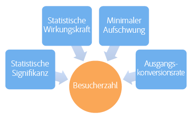
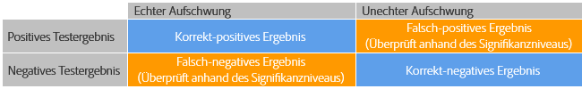
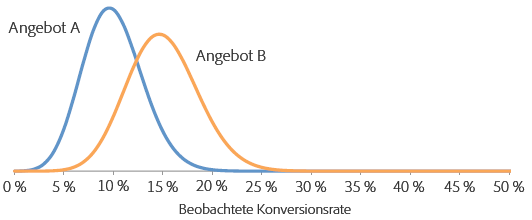
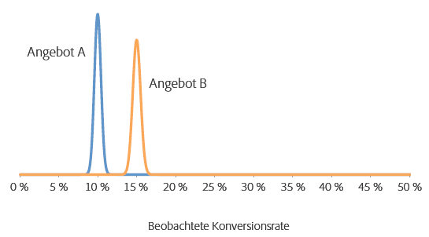
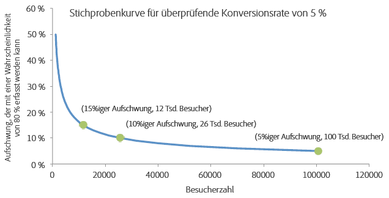

# Wie lange sollten A/B-Tests laufen?{#how-long-should-you-run-an-a-b-test}

Für einen erfolgreichen A/B-Test ist eine ausreichende Anzahl von Besuchern erforderlich (Stichprobengröße), um die Konversionsrate zu steigern. Aber wie lässt sich bestimmen, wie lange ein A/B-Test ausgeführt werden muss? Dieser Artikel enthält Informationen hinsichtlich Aktivitäten zur automatischen Zuordnung sowie den Target-Stichprobengrößenrechner, mit dem Sie sicherstellen können, dass Ihre Aktivität ausreichend Besucher umfasst, um Ihre Ziele zu erreichen.

Es ist verlockend, einen Test zu stoppen, wenn eines der Angebote in den ersten Tagen der Aktivität deutlich besser oder schlechter abschneidet als die anderen. Wenn jedoch die Anzahl der Beobachtungen gering ist, ist die Wahrscheinlichkeit hoch, dass eine positive oder negative Steigerung nur zufällig beobachtet wurde, da die Konversionsrate als Durchschnitt einer geringen Besucherzahl ermittelt wurde. Wenn die Aktivität mehr Datenpunkte erfasst, nähern sich die Konversionsraten ihren eigentlichen, langfristigen Werten an.

Aktivitäten frühzeitig zu stoppen, ist einer der neun häufigsten Fehler bei der Durchführung von A/B-Tests. Weitere Informationen finden Sie unter [Neun häufige Fehler bei A/B-Tests und wie diese vermieden werden](../../c-activities/t-test-ab/common-ab-testing-pitfalls.md#concept_578A7947C9554868B30F12DFF9E3F8E3).

Target bietet Tools, mit denen Sie sicherstellen können, dass Ihre Aktivität eine ausreichende Stichprobengröße umfasst, um Ihre Konversionsziele zu erreichen:

* **Automatische Zuordnung:** Bei der Aktivität „Automatische Zuordnung“ handelt es sich um einen A/B-Test, der einen Gewinner unter zwei oder mehr Erlebnissen ermittelt und dem Gewinnererlebnis automatisch mehr Traffic zuordnet, um Konversionen zu erhöhen, während der Test weiter ausgeführt und das Lernen fortgesetzt wird.

   Mit A/B-Standardtests sind Kosten verbunden. Sie müssen Traffic generieren, um die Leistung jedes einzelnen Erlebnisses zu messen und durch Analysen die erfolgreichsten Erlebnisse zu ermitteln. Die Verteilung von Traffic bleibt auch dann festgelegt, wenn Sie erkennen, dass einige Erlebnisse andere übertreffen. Außerdem ist es schwierig, die Stichprobengröße korrekt zu bestimmen, und die Aktivität muss komplett durchlaufen, bevor Sie einen Sieger finden. Nachdem Sie all das durchgeführt haben, besteht immer noch die Möglichkeit, dass der ermittelte Sieger kein wirklicher Sieger ist.

   Die Lösung lautet „Automatische Zuordnung“. Die Funktion „Automatisierte Zuordnung“ senkt diese Kosten sowie die Kosten für die Bestimmung eines erfolgreichsten Erlebnisses. Die Funktion „Automatisierte Zuordnung“ überwacht die Zielmetrikleistung aller Erlebnisse und sendet proportional mehr neue Teilnehmer an Erlebnisse mit einer hohen Leistung. Es wird ausreichend Traffic für die Erkundung der anderen Erlebnisse reserviert. Sie können die Vorteile des Tests an Ihren Ergebnissen erkennen, selbst wenn die Aktivität gerade ausgeführt wird: Die Optimierung erfolgt parallel zum Lernen.

   Die Funktion „Automatisierte Zuordnung“ überführt Besucher nach und nach zu den erfolgreichsten Erlebnissen, anstatt dass Sie mit dem Bestimmen eines Siegers warten müssen, bis die Aktivität abgeschlossen ist. Sie profitieren schneller von Steigerungen, da den Aktivitätsteilnehmern, die zu weniger erfolgreichen Erlebnissen geleitet worden wären, nun potenziell erfolgreiche Erlebnisse angezeigt werden.

   Bei der Verwendung der Funktion „Automatisierte Zuordnung“ zeigt Target oben auf der Seite der Aktivität ein Abzeichen mit „Noch kein Gewinner“ an, bis die Aktivität die Mindestanzahl an Konversionen mit ausreichender Konfidenz erreicht hat. Target bestimmt dann das erfolgreichste Erlebnis, indem oben auf der Aktivitätsseite ein entsprechendes Symbol angezeigt wird.

   Weitere Informationen finden Sie unter [Automatische Zuordnung](../../c-activities/automated-traffic-allocation/automated-traffic-allocation.md#concept_A1407678796B4C569E94CBA8A9F7F5D4).

* **Target-Stichprobengrößenrechner:** Wenn Sie statt der automatischen Zuordnung manuelle A/B-Tests durchführen wollen, können Sie mit dem Target-Stichprobengrößenrechner die für einen erfolgreichen Test erforderliche Stichprobengröße bestimmen. Ein manueller A/B-Test ist ein fester Horizonttest, daher ist der Rechner äußerst hilfreich. Die Verwendung des Rechners für eine Aktivität mit automatisierter Zuordnung ist optional, da die automatisierte Zuordnung einen Gewinner für Sie festlegt. Der Rechner gibt Ihnen eine grobe Schätzung der benötigten Stichprobengröße. Im Folgenden finden Sie weiter Informationen zur Verwendung des Rechners.

## Adobe Target-Stichprobengrößenrechner  {#section_6B8725BD704C4AFE939EF2A6B6E834E6}

Before setting up your A/B test, access the Adobe Target [sample size calculator](https://docs.adobe.com/content/target-microsite/testcalculator.html).

Vor der Durchführung von A/B-Tests muss eine angemessene Stichprobengröße (Anzahl der Besucher) festgelegt werden, um den Zeitraum zu ermitteln, über den der Test ausgeführt werden sollte, bevor die Ergebnisse ausgewertet werden. Eine einfache Überwachung des Tests bis zur Erreichung der statistischen Bedeutung führt zu einer erheblichen Unterschätzung des Konfidenzintervalls und bewirkt, dass der Test unzuverlässig ist. Mit diesem Ergebnis wird beabsichtigt, dass - für den Fall, dass ein statistisch signifikantes Ergebnis entdeckt wird - der Test gestoppt und ein Gewinner ernannt wird. Sollte das Ergebnis jedoch nicht statistisch signifikant sein, wird der Test weiter ausgeführt. Diese Vorgehensweise begünstigt das positive Ergebnis erheblich, wodurch die Falsch-Positiv-Rate zunimmt und das effektive Signifikanzniveau des Tests verzerrt wird.

Dies hat eine große Anzahl von Falsch-Positiv-Werten zur Folge, was zur Implementierung von Angeboten führt, welche langfristig nicht die prognostizierte Steigerung liefern. Eine ungenügende Steigerung ist für sich genommen bereits ein unbefriedigendes Ergebnis. Noch schwerer wiegt jedoch, dass durch die Unfähigkeit zur genauen Prognose der Steigerung im Lauf der Zeit das Vertrauen der Organisation in Testverfahren schwindet.

Dieser Artikel erörtert die Faktoren, die bei der Ermittlung der Stichprobengröße abzuwägen sind, und stellt einen Tabellenrechner vor, mit dem sich eine angemessene Stichprobengröße schätzen lässt. Die Berechnung des Stichprobenumfangs mit dem Stichprobenkalkulator (Link siehe oben) vor Beginn eines A/B-Tests stellt sicher, dass Sie stets qualitativ hochwertige A/B-Tests durchführen, die den statistischen Standards entsprechen.

Es gibt fünf benutzerdefinierte Parameter zur Definition eines A/B-Tests. Diese Parameter sind miteinander verknüpft, sodass sich der fünfte berechnen lässt, wenn vier der Parameter festgelegt wurden:

* Statistische Bedeutung
* Teststärke
* Zuverlässig bestimmbare Mindeststeigerung
* Baseline-Konversionsrate
* Anzahl der Besucher

Bei einem A/B-Test werden die statistische Bedeutung, Teststärke, zuverlässig bestimmbare Mindeststeigerung und Baseline-Konversionsrate durch einen Analysten festgelegt. Anschließend wird die erforderliche Anzahl der Besucher aus diesen Zahlen berechnet. Dieser Artikel erörtert diese Elemente und enthält Richtlinien zu deren Ermittlung für einen spezifischen Test.

Die unten stehende Abbildung veranschaulicht die vier möglichen Ergebnisse eines A/B-Tests.

Es ist wünschenswert, keine Falsch-Positiv-Werte bzw. Falsch-Negativ-Werte zu erhalten. Dies kann jedoch durch einen statistischen Test niemals garantiert werden. Es ist immer möglich, dass beobachtete Trends nicht repräsentativ für die zugrundeliegenden Konversionsraten sind. Zum Beispiel ist bei einem Münzwurftest (Test, ob bei Münzwurf Kopf oder Zahl als Ergebnis wahrscheinlicher ist) auch bei einer idealen Münze ein zufälliges Ergebnis von zehnmal Kopf bei zehn Würfen denkbar. Die statistische Bedeutung und die Teststärke tragen zur Quantifizierung der Falsch-Positiv- und Falsch-Negativ-Raten bei und ermöglichen es, diese für einen gegebenen Test auf einem vertretbaren Niveau zu halten.

## Statistische Bedeutung {#section_8230FB9C6D1241D8B1786B72B379C3CD}

Das Signifikanzniveau eines Tests bestimmt die Wahrscheinlichkeit, dass ein Test einen signifikanten Unterschied der Konversionsraten von zwei verschiedenen Angeboten ergibt, zwischen denen tatsächlich kein echter Unterschied besteht. Dies wird als falsch-positiv bzw. als Fehler 1. Art bezeichnet. Das Signifikanzniveau ist ein vom Benutzer angegebener Schwellenwert und stellt einen Trade-off zwischen der Toleranz für falsch-positive Werte und der Anzahl der Benutzer dar, die in den Test einbezogen werden müssen.

Bei einem A/B-Test wird zunächst angenommen, dass beide Angebote dieselbe Konversionsrate aufweisen. Anschließend wird die Wahrscheinlichkeit des beobachteten Ergebnisses auf Basis dieser Annahme berechnet. Wenn diese Wahrscheinlichkeit (p-Wert) kleiner als der vorab definierte Schwellenwert (das Signifikanzniveau) ist, kommt Target zu dem Schluss, dass die ursprüngliche Annahme - beide Angebote weisen dieselbe Konversionsrate auf - nicht korrekt ist und daher die Konversionsraten von A und B bei gegebenem Signifikanzniveau statistisch voneinander abweichen.

Ein allgemein übliches Signifikanzniveau bei A/B-Tests beträgt 5 %, was einem Konfidenzniveau von 95 % entspricht (Konfidenzniveau = 100 % - Signifikanzniveau). Ein Konfidenzniveau von 95 % bedeutet, dass Sie jedes Mal, wenn Sie einen Test durchführen, mit einer Wahrscheinlichkeit von 5 % eine statistisch signifikante Steigerung beobachten werden, auch wenn kein Unterschied zwischen den Angeboten besteht.

Typische Interpretationen des Konfidenzniveaus werden in der unten stehenden Tabelle zusammengefasst:

| Konfidenzniveau | Interpretation |
|--- |--- |
| &lt; 90% | Kein Beweis, dass es einen Unterschied zwischen den Konversionsraten gibt |
| 90-95 % | Schwacher Beweis, dass es einen Unterschied zwischen den Konversionsraten gibt |
| 95-99 % | Moderater Beweis, dass es einen Unterschied zwischen den Konversionsraten gibt |
| 99-99,9 % | Starker Beweis, dass es einen Unterschied zwischen den Konversionsraten gibt |
| +99,9 % | Sehr starker Beweis, dass es einen Unterschied zwischen den Konversionsraten gibt |

Es wird empfohlen, immer ein Konfidenzniveau von 95 % oder neuer zu verwenden.

Es ist erstrebenswert, das höchstmögliche Konfidenzniveau zu verwenden, sodass der Test wenige Falsch-Positiv-Werte ergibt. Ein höheres Konfidenzniveau erfordert jedoch eine höhere Besucheranzahl, wodurch sich der Zeitbedarf für den Test erhöht. Darüber hinaus bewirkt eine Steigerung des Konfidenzniveaus eine Senkung der Teststärke.

## Teststärke {#section_1169C27F8E4643719D38FB9D6EBEB535}

Die Teststärke eines A/B-Tests ist die Wahrscheinlichkeit der Aufdeckung eines echten Unterschieds der Konversionsrate in einer bestimmten Größenordnung. Aufgrund der zufälligen (stochastischen) Natur der Konversionsereignisse ist es möglich, dass ein statistisch signifikanter Unterschied - zufällig - nicht beobachtet wird, obwohl es einen echten Unterschied bei der Konversionsrate zwischen den beiden Angeboten gibt. Dies wird als falsch-negativ bzw. als Fehler der 2. Art bezeichnet.

Die Teststärke wird oft ignoriert, weil ihre Ermittlung im Gegensatz zur statistischen Bedeutung für die Durchführung eines A/B-Tests nicht erforderlich ist. Das Ignorieren der Teststärke geht jedoch mit einer erheblichen Wahrscheinlichkeit einher, dass echte Unterschiede zwischen den Konversionsraten verschiedener Angebote durch den Test nicht erkannt werden, weil die Stichprobe zu klein ist. Das führt dazu, dass der Test von Falsch-Positiv-Werten dominiert wird.

Eine hohe Teststärke ist wünschenswert, damit der Test mit großer Wahrscheinlichkeit einen echten Unterschied der Konversionsraten erkennt und weniger Falsch-Negativ-Werte ergibt. Jedoch ist für die Erhöhung der Teststärke eine große Besucheranzahl zur Ermittlung einer gegebenen Steigerung erforderlich, wodurch der Zeitbedarf für den Test zunimmt.

Ein üblicher Wert für die Teststärke ist 80 %, was bedeutet, dass der Test mit achtzigprozentiger Wahrscheinlichkeit einen Unterschied ermittelt, der der zuverlässig bestimmbaren Mindeststeigerung entspricht. Die Ermittlung kleinerer Steigerungen durch den Test ist weniger wahrscheinlich, die Ermittlung größerer Steigerungen wiederum wahrscheinlicher.

## Zuverlässig bestimmbare Mindeststeigerung {#section_6101367EE9634C298410BBC2148E33A9}

Die meisten Organisationen möchten den kleinstmöglichen Unterschied der Konversionsrate ermitteln, da sich eine Implementierung selbst bei einer geringen Steigerung lohnt. Wenn Sie jedoch möchten, dass der A/B-Test mit hoher Wahrscheinlichkeit eine sehr geringe Steigerung ermittelt, würde die Anzahl der einzubeziehenden Besucher eine prohibitive Höhe erreichen. Grund dafür ist, dass die Schätzung der beiden Konversionsraten bei einem geringen Unterschied zwischen den Konversionsraten mit hoher Genauigkeit erfolgen muss, um den Unterschied zu ermitteln, wofür eine große Anzahl von Besuchern erforderlich ist. Deswegen sollte die zuverlässig bestimmbare Mindeststeigerung durch geschäftliche Anforderungen festgelegt werden, die den Trade-off zwischen der Entdeckung geringer Steigerungen und der Durchführung des Tests über längere Zeiträume berücksichtigen.

Zum Beispiel wird angenommen, dass zwei Angebote (A und B) echte Konversionsraten von 10 % und 15 % aufweisen. Wenn diese Angebote für 100 Besucher eingeblendet werden, besteht aufgrund der stochastischen Natur der Konversionen eine 95-prozentige Wahrscheinlichkeit, dass für Angebot A Konversionsraten zwischen 4 % und 16 % und für Angebot B Konversionsraten zwischen 8 % und 22 % beobachtet werden. Diese Bandbreiten werden in der Statistik als Konfidenzintervalle bezeichnet. Sie repräsentieren die Konfidenz bezüglich der Genauigkeit der geschätzten Konversionsraten. Je größer die Stichprobe (mehr Besucher), desto mehr können Sie darauf vertrauen, dass die Schätzwerte für die Konversionsrate genau sind.

Die unten stehende Abbildung veranschaulicht diese Wahrscheinlichkeitsverteilungen.

Aufgrund der großen Überlappung dieser beiden Bandbreiten kann der Test nicht ermitteln, ob die Konversionsraten voneinander abweichen. Aus diesem Grund ermöglicht ein Test mit 100 Besuchern keine Unterscheidung zwischen den beiden Angeboten. Wenn die Angebote jedoch jeweils 5.000 Besuchern präsentiert werden, besteht eine 95-prozentige Wahrscheinlichkeit, dass die beobachteten Konversionsraten in die Bandbreiten 9 % bis 11 % sowie 14 % bis 16 % fallen.

In diesem Fall ist es unwahrscheinlich, dass der Test zu einem falschen Schluss kommt, sodass der Test mit 5.000 Besuchern eine Unterscheidung zwischen den beiden Angeboten ermöglicht. Der Test mit 5.000 Besuchern weist ein Konfidenzintervall von ca. +/-1 % auf. Das bedeutet, dass der Test Unterschiede von etwa 1 % erkennen kann. Aus diesem Grund wären noch mehr Besucher erforderlich, wenn die echten Konversionsraten der Angebote bzw. bei 10 % und 10,5 % und nicht bei 10 % und 15 % liegen würden.

## Baseline-Konversionsrate {#section_39380C9CA3C649B6BE6E1F8A06178B05}

Die Baseline-Konversionsrate ist die Konversionsrate des Kontrollangebotes (Angebot A). Oftmals können Sie sich auf Basis früherer Erfahrungen eine gute Vorstellung von der Konversionsstufe für das Angebot machen. Wenn dies nicht der Fall ist (zum Beispiel, weil es sich um einen neuen Angebotstyp oder ein neues kreatives Element handelt), kann der Test einen ganzen Tag oder länger ausgeführt werden, um eine ungefähre Schätzung der Baseline-Konversionsrate zu erhalten, die bei der Berechnung der Stichprobengröße verwendet werden kann.

## Schätzen der Stichprobengröße {#section_19009F165505429E95291E6976E498DD}

Es kann schwierig sein, die Opportunitätskosten für die Ausführung eines Tests über einen langen Zeitraum mit dem Risiko falscher Positivwerte und falscher Negativwerte abzuwägen. Es liegt auf der Hand, dass Sie keine falschen Entscheidungen treffen möchten, jedoch sollte auch eine Lähmung durch zu strikte bzw. rigide Teststandards vermieden werden. Als allgemeine Richtlinie werden ein Konfidenzniveau von 95 % und eine Teststärke von 80 % empfohlen.

Der Stichprobenkalkulator (Link siehe oben) fragt Sie nach der statistischen Bedeutung (Empfehlung: 95 %) und der statistischen Aussagekraft (Empfehlung: 80 %). Nach Eingabe der Baseline-Konversionsrate und des täglichen Traffics für alle Angebote gibt die Tabelle die erforderliche Anzahl der Besucher zur Erkennung einer Steigerung von 1 %, 2 %, 5 %, 10 %, 15 % und 20 % mit einer Wahrscheinlichkeit an, die der angegebenen Teststärke entspricht. Die Tabelle ermöglicht dem Benutzer auch die Eingabe einer benutzerdefinierten zuverlässig erkennbaren Mindeststeigerung. Darüber hinaus gibt die Tabelle die Anzahl der Wochen an, die erforderlich sind, um den Test auf dem vom Benutzer angegebenen Traffic-Niveau zu basieren. Die erforderliche Wochenanzahl wird auf die nächste volle Woche aufgerundet, um zu vermeiden, dass die Ergebnisse durch Wochentagseffekte beeinflusst werden.

Es gibt einen Trade-off zwischen der durch den Test zuverlässig ermittelbaren Mindeststeigerung und der erforderlichen Anzahl der Besucher. Die unten stehende Abbildung, die für eine Baseline-Konversionsrate (Kontrolle) von 5 % gilt, zeigt stark abnehmende Erträge bei einer zunehmenden Anzahl von Besuchern. Die Mindeststeigerung, die zuverlässig ermittelt werden kann, verbessert sich deutlich mit den ersten hinzugefügten Benutzern, es ist jedoch eine zunehmend größere Anzahl von Besuchern erforderlich, um den Test weiter zu verbessern. Die Abbildung trägt dazu bei, einen angemessenen Trade-off zwischen der für die Ausführung des Tests erforderlich Zeit (die durch die Anzahl der erforderlichen Besucher und den Site-Traffic bestimmt wird) und der Mindeststeigerung, die sich durch den Test zuverlässig erkennen lässt, zu ermitteln.

In diesem Beispiel könnten Sie entscheiden, dass die Möglichkeit, eine Steigerung von 5 % (die einer Konversionsrate des alternativen Angebots von (100 % + 5 %) x 5 % = 5,25 % entspricht) bei 80 von 100 Tests zu ermitteln, angemessen ist. Sie benötigen daher eine Stichprobengröße von 100.000 Besuchern für jedes Angebot. Wenn die Site pro Tag 20.000 Besucher aufweist und Sie zwei Angebote testen, muss der Test über 2 x 100.000/20.000 = 10 Tage ausgeführt werden, bevor sich ermitteln lässt, ob das Alternativangebot dem Kontrollangebot statistisch signifikant überlegen ist. Auch hier wird in jedem Fall empfohlen, die erforderliche Zeit auf eine ganze Woche aufzurunden, um Wochentagseffekte zu vermeiden. In diesem Beispiel würde der Test vor der Auswertung der Ergebnisse über zwei Wochen ausgeführt werden.

## Umsatz-pro-Besuch-Metrik  {#section_C704C0861C9B4641AB02E911648D2DC2}

Bei Nutzung des Umsatzes pro Besuch (Revenue per Visit - RPV) als Metrik wird eine weitere Streuungsquelle hinzugefügt, da RPV das Produkt aus Umsatz pro Bestellung und Konversionsrate ist (RPV = Umsatz / Anzahl der Besucher = (Umsatz pro Bestellung x Anzahl der Bestellungen) / Anzahl der Besucher = Umsatz pro Bestellung x (Anzahl der Besucher x CTR) / Anzahl der Besucher = Umsatz pro Bestellung x CTR), mit der jeweils eigenen Varianz. Die Varianz der Konversionsrate kann mithilfe eines mathematischen Modells unmittelbar geschätzt werden, die Varianz von Umsatz pro Bestellung hängt jedoch von der Kampagne ab. Daher sollten Sie Ihr Wissen über diese Varianz aus früheren Kampagnen nutzen oder für die Dauer von ein paar Tagen einen A/B-Test durchführen, um die Varianz des Umsatzes zu schätzen. Die Varianz wird aus den Werten für Summe der Verkäufe, Summe der Verkäufe im Quadrat sowie Anzahl der Benutzer berechnet, die in der herunterladbaren CSV-Datei zu finden sind. Sobald diese ermittelt ist, verwenden Sie die Tabelle, um die erforderliche Zeit zur Durchführung des Tests zu berechnen.

Der Stichprobengrößenrechner (Link siehe oben) kann Ihnen dabei helfen, die RPV-Metrik zu konfigurieren. Wenn Sie den Rechner öffnen, sehen Sie eine Registerkarte mit der Bezeichnung „RPV-Metrik“. Sie benötigen die folgenden Informationen, wenn Sie die RPV-Version des Rechners verwenden:

* Anzahl der Besucher des Kontrollangebots
* Gesamtumsatz des Kontrollangebots

   Vergewissern Sie sich, dass der extreme Auftragsfilter aktiviert ist.
* Die Quadratsumme des Umsatzes für das Kontrollangebot

   Vergewissern Sie sich, dass der extreme Auftragsfilter aktiviert ist.

Im Allgemeinen dauert es bei der Verwendung von RPV als Metrik um 20 bis 30 Prozent länger, bis dasselbe Niveau von statistischer Genauigkeit für dieselbe Stufe der gemessenen Steigerung erreicht ist, da RPV die zusätzliche Varianz von verschiedenen Bestellungsgrößen pro Konversion enthält. Dies sollte bei der Wahl zwischen der direkten Konversionsrate und RPV als Metrik als Basis der endgültigen Geschäftsentscheidung bedacht werden.

## Korrektur für Vergleich mehrerer Angebote {#section_1474113764224D0B85472D8B023CCA15}

Jedes Mal, wenn Sie zwei Angebote vergleichen, entspricht die Wahrscheinlichkeit eines Falsch-Positiv-Werts (Beobachtung eines statistisch signifikanten Unterschieds, auch wenn es keinen Unterschied bei der Konversionsrate gibt) dem Signifikanzniveau. Wenn zum Beispiel fünf Angebote A/B/C/D/E vorliegen und es sich bei A um das Kontrollangebot handelt, werden vier Vergleiche vorgenommen (Kontrolle zu B, Kontrolle zu C, Kontrolle zu D und Kontrolle zu E) und die Wahrscheinlichkeit eines Falsch-Positiv-Werts beträgt 18,5 %, selbst wenn das Konfidenzniveau 95 % beträgt, da Pr (mindestens ein Falsch-Positiv-Wert) = 1 - Pr (keine Falsch-Positiv-Werte) = 1 - 0,95 = 18,5 %. Als Falsch-Positiv-Wert gilt in diesem Zusammenhang, wenn der Kontrollwert besser als die Alternative bzw. wenn die Alternative besser als der Kontrollwert ausfällt, auch wenn es tatsächlich keinen Unterschied zwischen diesen Werten gibt.

## Schlussfolgerung  {#section_AEA2427B90AE4E9395C7FF4F9C5CA066}

Durch Verwendung einer Aktivität mit automatischer Zuordnung ermittelt Target einen Gewinner unter zwei oder mehr Erlebnissen und ordnet dem Gewinnererlebnis automatisch mehr Traffic zu, um Konversionen zu erhöhen, während der Test weiter ausgeführt und das Lernen fortgesetzt wird. Mit der automatischen Zuordnung erreichen Sie Ihre Konversionsziele ohne Aufwand und Ungewissheit.

Durch die Verwendung des in diesem Artikel vorgestellten Stichprobenkalkulators (Link siehe oben) und die Durchführung des Tests über den empfohlenen Zeitraum können Sie sicherstellen, dass Sie jederzeit hochwertige A/B-Tests durchführen, welche die Falsch-positiv- und Falsch-negativ-Raten berücksichtigen, die Sie für den spezifischen Test als angemessen festgelegt haben. Dadurch wird gewährleistet, dass Ihre Tests konsistent und in der Lage sind, die von Ihnen gewünschte Steigerung zuverlässig zu ermitteln.
