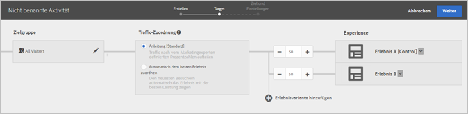
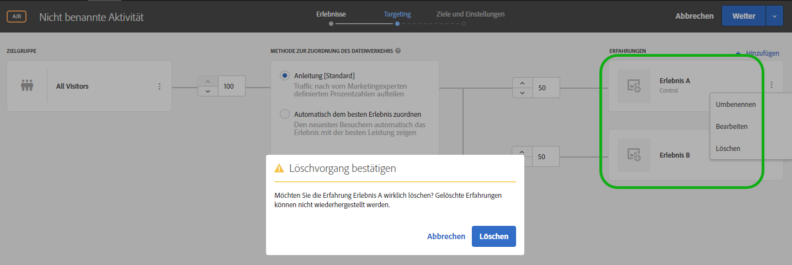

# Hinzufügen von Erlebnissen{#add-experience}

Der Visual Experience Composer stellt eine visuelle Benutzeroberfläche zur Bearbeitung von Erlebnissen auf Ihrer Seite zur Verfügung.

Weitere Informationen zu Erlebnissen finden Sie unter [Erlebnisse](../../../c-experiences/experiences.md#concept_A2E10F6AFB3D4AEAB6951EE14688848D).

1. Klicken Sie auf **[!UICONTROL Erlebnis hinzufügen]**.

   >[!NOTE]
   >
   >Wenn Sie mit einem Erlebnis auf eine Zielgruppe abzielen, müssen Sie die Zielgruppe auswählen, bevor Sie ein Erlebnis hinzufügen können. Es wird eine Meldung angezeigt, um Sie an die Auswahl Ihrer Zielgruppe zu erinnern.

1. Geben Sie die Aktivitäts-URL ein, wenn Sie dazu aufgefordert werden. Geben Sie die vollständige URL ein (einschließlich `https://`) und klicken Sie anschließend auf **[!UICONTROL Weiter]**.

   Der Experience Composer (siehe [Erlebnisse](../../../c-experiences/experiences.md#concept_1D011219034B492BB03C08B3BB80E3F0)) öffnet die Seite, die in Ihren Kontoeinstellungen angegeben ist. Um eine andere Seite anzuzeigen, klicken Sie auf das Globussymbol, geben Sie die URL in das Feld „URL auswählen“ im Experience Composer ein und klicken Sie auf **[!UICONTROL Weiter]**. Wenn Sie eine URL für eine Site eingegeben haben, die keinen Target Standard-JavaScript-Code enthält, können Sie keine Seitenelemente auswählen.

   Standardmäßig gestattet der Visual Experience Composer das Ändern von Elementen mit JavaScript nicht (zum Beispiel sich drehende Banner). Sie können JavaScript deaktivieren, wenn Sie diese Elemente mit dem Visual Experience Composer ändern möchten.

   >[!NOTE]
   >
   >Wenn Sie die URL ändern, nachdem Sie für ein oder mehrere Erlebnisse Änderungen auf der Seite vorgenommen haben, wird das Erlebnis bei der Verwendung der neuen Seite zurückgesetzt und die vorgenommenen Änderungen gehen verloren.

1. Wählen Sie die Elemente, die Sie ändern möchten, und nehmen Sie die gewünschten Änderungen vor.

   Wenn Sie den Mauszeiger über die Elemente auf Ihrer Seite bewegen, werden diese Elemente hervorgehoben. Alle hervorgehobenen Elemente können mit dem Experience Composer geändert werden.

   Wenn Sie mit Target Classic (früher Test&amp;Target) eine Mbox auf der Seite erstellt haben, wird diese Mbox als Element mit dem Mbox-Namen angezeigt und kann wie jedes andere Element bearbeitet werden.

   Eine Liste der Aktionen, die für ein Element auf der angezeigten Seite durchgeführt werden können, um das Erlebnis zu ändern, finden Sie unter [Visual Experience Composer-Optionen](/help/c-experiences/c-visual-experience-composer/viztarget-options.md).

   >[!NOTE]
   >
   >Wenn Sie ein Bild aus einer anderen Quelle als der Hauptseite bereitstellen (z. B. ein Bild, das auf akamei.net gehostet und auf dell.com bereitgestellt wird), wird das Bild nicht in der Miniaturansicht der Seite, die auf dem Flussdiagramm zu sehen ist, angezeigt.

1. Aktivieren Sie das Kontrollkästchen, wenn Sie den Entwurf des Erlebnisses abgeschlossen haben.

   Das Aktivitätsdiagramm wird angezeigt:

   

   Wenn ein Erlebnis domänenübergreifenden Inhalt enthält, wird die Miniaturansicht möglicherweise nicht ordnungsgemäß angezeigt und durch ein Symbol ersetzt.

1. Geben Sie die Prozentzahl der Besucher an, die jedes Erlebnis in der Aktivität sehen.

   Sie können der gleichen Zielgruppe mehrere Erlebnisse zeigen. Es wird ein Diagramm mit der ausgewählten Zielgruppe und den Erlebnissen, die Sie zur Aktivität hinzugefügt haben, angezeigt. Geben Sie an, wie oft Ihr Erlebnis gezeigt werden soll (in Prozent). Sie können den Prozentsatz gleichmäßig auf alle Erlebnisse aufteilen oder für jedes Erlebnis einen höheren oder niedrigeren Prozentsatz festlegen. Die gesamte Anzahl aller Erlebnisse muss 100 % betragen. Sie können auch auf **[!UICONTROL Erlebnis hinzufügen]klicken, um ein weiteres Erlebnis zur Aktivität hinzuzufügen.**

   Klicken Sie auf **[!UICONTROL Weiter], wenn Sie diesen Schritt abgeschlossen haben.**

## Umbenennen, Bearbeiten oder Löschen eines Erlebnisses

Sie können in einem Erlebnis innerhalb einer A/B- oder XT-Aktivität (Erlebnis-Targeting) auf das Symbol „Mehr“ (drei vertikale Ellipsen) klicken und folgende Optionen auswählen:

* Umbenennen
* Bearbeiten
* Löschen

Beachten Sie, dass bei der (Um-)Benennung von Erlebnissen folgende Zeichen nicht zulässig sind:

| Zeichen | Beschreibung |
|--- |--- |
| / | Vorwärtsschrägstrich |
| ? | Fragezeichen |
| # | Raute  |
| : | Doppelpunkt |
| = | Gleich |
| + | Plus |
| - | Minus |
| @ | At-Zeichen |

## Duplizieren eines Erlebnisses

Sie können ein Erlebnis aus einem A/B-Test kopieren, um kleinere Änderungen vorzunehmen, ohne das Erlebnis vollständig neu erstellen zu müssen.

Klicken Sie auf der Seite **[!UICONTROL Erlebnisse]** (der erste Schritt im Drei-Schritte-Workflow) auf die drei vertikalen Ellipsen und anschließend auf **[!UICONTROL Duplizieren]**.

## Schulungsvideo: Verwenden von Visual Experience Composer

Im Video unten erhalten Sie Informationen zur Verwendung der Optionen in Visual Experience Composer. (7:17)

* Inhalt einer Seite ändern
* Layout einer Seite ändern

>[!VIDEO](https://video.tv.adobe.com/v/17399)
