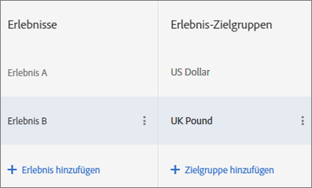

# Verschiedene Erlebniszielgruppen in A/B-Tests{#multiple-experience-versions-in-an-a-b-test}

Sie können in A/B-Aktivitäten verschiedene Versionen des gleichen Erlebnisses für unterschiedliche Zielgruppen zur Verfügung stellen. Im Visual Experience Composer oder dem Form-Based Experience Composer können mehrere Zielgruppen für ein Erlebnis eingerichtet werden.

Benutzer können zwischen Erlebniszielgruppen wechseln, wenn sich ihr Profil entwickelt. Sie werden nicht zwangsläufig für die gesamte Dauer der Aktivität dem gleichen Erlebnis zugeordnet.

Verwenden Sie beispielsweise auf Ihrer Site einen konstanten Entwurf für Seiten oder Produkte und möchten Sie das gleiche Erlebnis für mehrere Zielgruppen bereitstellen (beispielsweise Besucher mit unterschiedlichen Browsersprachen), können Sie mehrere Versionen des gleichen Erlebnisses erstellen. Sie können Englisch und Japanisch sprechenden Besuchern das gleiche Erlebnis bereitstellen, wobei der einzige Unterschied die Sprache ist, in der sie dem Besucher angezeigt wird. Für das Erlebnis werden unabhängig von der Sprache Daten gesammelt, sodass im Bericht die Leistung des Erlebnisses anstatt der Version aufgeführt wird.

Ohne die Möglichkeit zur Einrichtung von Erlebnisversionen müssten Sie (in diesem Beispiel) für jede Sprache eigene Tests einrichten, diese Ergebnisse dann manuell zusammenführen und anschließend versuchen herauszufinden, wie erfolgreich ein einziges Erlebnis sprachübergreifend ist. Die Ergebnisse dieser Vorgehensweise sind weniger genau. Bei einigen Tests sind diese Berechnungen möglicherweise sogar irreführend, da Benutzer randomisiert werden.

Erstellen Sie verschiedene Versionen eines Erlebnisses, erhalten Sie genauere Daten, ohne dazu auf manuelle Berechnungen und Annahmen zurückgreifen zu müssen.

**Szenario**

Sie prüfen zwei Erlebnisse, ein Banner mit Geotargeting und ein allgemeines Banner. Das erste Banner muss an die geografischen Regionen angepasst werden, allgemein soll jedoch getestet werden, ob sich Geotargeting besser eignet als allgemeine Inhalte. Würden Sie für jede Region ein eigenes Erlebnis einrichten, würden Sie messen, wie leistungsstark die einzelnen Regionen im Vergleich zu den anderen sind, nicht jedoch, ob sich Geotargeting im Vergleich zu allgemeinen Bannern lohnt.

In diesem Fall müssen Sie regionsspezifische Versionen des Erlebnisses erstellen, sodass Sie Geotargeting mit einer nicht mit Geotargeting ausgestatteten Kontrollanzeige abgleichen können.

1. [Erstellen Sie wie gewohnt eine A/B-Aktivität.](/help/c-activities/t-test-ab/t-test-create-ab/test-create-ab.md)

   Wählen Sie während der Konfigurierung des Erlebnisses mit mehreren Versionen die Zielgruppen der einzelnen Versionen aus, wie unten dargestellt.

1. Wählen Sie das Erlebnis aus und klicken Sie auf **[!UICONTROL Konfigurieren]** > **[!UICONTROL Zielgruppen]** > **[!UICONTROL Mehrere Zielgruppen]**.

   

1. Klicken Sie auf **[!UICONTROL Zielgruppe hinzufügen]** und wählen Sie die erste Zielgruppe aus. Wiederholen Sie den Vorgang für alle weiteren Zielgruppen.

   

   Wenn die Zielgruppe noch nicht vorhanden ist, klicken Sie auf [Zielgruppe erstellen](../../../c-target/c-audiences/create-audience.md#task_E18BD77A9A8F4ED0AC50569F94556558) und richten Sie sie ein.

   Sollte ein Benutzer mehr als einer Zielgruppe zugeordnet werden, werden Inhalte für alle Zielgruppen bereitgestellt, wovon mindestens einer aus der Liste tatsächlich auf der Seite angezeigt wird.

1. Fahren Sie mit der Einrichtung der Aktivität fort.

**Best Practices**

* Wählen Sie Zielgruppen aus, die sich gegenseitig ausschließen. Wurde die Aktivität im VEC erstellt und erfüllt ein Besucher die Kriterien von mehr als einer Zielgruppe, wird Inhalt für jede der passenden Zielgruppen zurückgegeben, wobei der Inhalt der zuletzt aufgeführten Zielgruppe tatsächlich auf der Seite dargestellt wird.
* Die in der Darstellung festgelegten Aktivitätseintrag-Zielgruppen werden mit den Erlebniszielgruppen mit dem Operator „AND“ kombiniert. Möchte ein Benutzer die Aktivität aufrufen, muss er die Kriterien einer Aktivitätszielgruppe und einer Erlebniszielgruppe erfüllen.
* Fügen Sie die gleichen Zielgruppen als Berichtsegmente hinzu. Somit können Sie die Ergebnisse grob aufgeschlüsselt im Vergleich von Erlebnis A zu Erlebnis B, aber auch fein aufgeschlüsselt für „browser lang ja_JP“ für die Erlebnisse A und B anzeigen. Dies ist jedoch nur in auf Target basierenden Berichten möglich, nicht in Analytics-Berichten.

