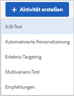
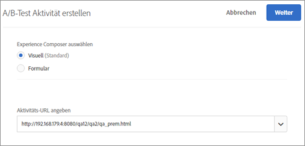
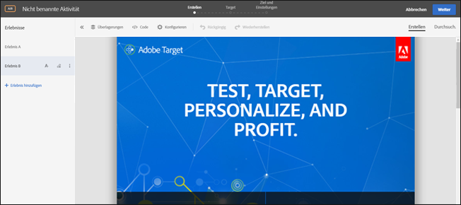
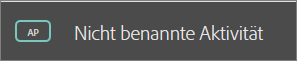
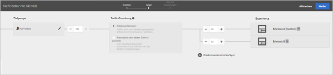
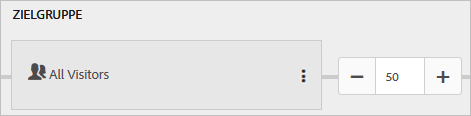
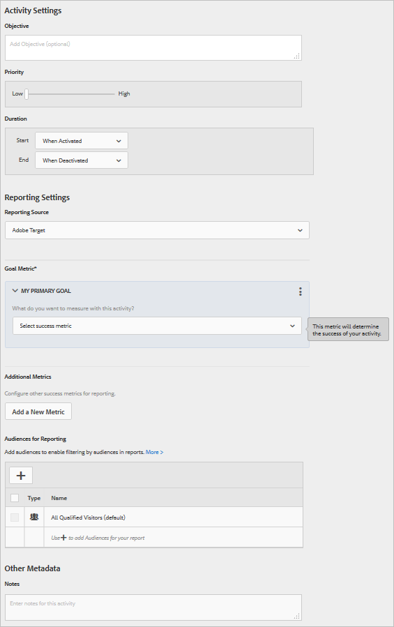

# Erstellen eines A/B-Tests{#create-an-a-b-test}

Verwenden Sie Visual Experience Composer in Target, um Ihren Test direkt auf einer für Target aktivierten Seite zu erstellen und Teile der Seite in Target zu verändern.

1. Klicken Sie in der Liste [!UICONTROL Aktivitäten] auf **[!UICONTROL Aktivität erstellen]** &gt; **[!UICONTROL A/B-Test]**.

   

   >[!NOTE]
   >
   >Die verfügbaren Aktivitätstypen hängen von Ihrem [!DNL Target]-Konto ab. Einige Aktivitätstypen werden in Ihrer Liste eventuell nicht angezeigt.

   Weitere Informationen über die verschiedenen Aktivitätstypen finden Sie unter   [Aktivitäten](../../../c-activities/activities.md#concept_D317A95A1AB54674BA7AB65C7985BA03).

   

1. Wählen Sie, falls nötig, den **[!UICONTROL Visual Experience Composer]** aus.

   Informationen zur Problembehebung für den VEC finden Sie bei Bedarf unter [Fehlerbehebung für den Visual Experience Composer](../../../c-experiences/c-visual-experience-composer/r-troubleshoot-composer/troubleshoot-composer.md#reference_77743144F10143A3A89D56E116D296E4).

   Wenn Sie den formularbasierten Experience Composer bevorzugen, wählen Sie diese Option aus. Weitere Informationen finden Sie unter [ Form-Based Experience Compose](https://marketing.adobe.com/resources/help/en_US/target/target/t_form_experience_composer.html).
1. Geben Sie Ihre [Aktivitäts-URL](../../../c-activities/t-test-ab/t-test-create-ab/ab-activity-url.md#concept_D28549AAA0A14E3BB5F05F32BE8ABC90) an und klicken Sie dann auf **[!UICONTROL Erstellen]**.

   Wenn Ihr Konto mit einer Standard-URL konfiguriert wurde, dann wird diese URL standardmäßig angezeigt. Sie können von der Standard-URL zu einer anderen URL wechseln.

   Der [!UICONTROL Visual Experience Composer] wird geöffnet und zeigt die Seite an, auf die die URL verweist.

   

1. Geben Sie an der verfügbaren Stelle einen Namen für die Aktivität ein.

   

   Folgende Zeichen sind im Aktivitätsnamen nicht zulässig:

   | Zeichen | Beschreibung |
   |--- |--- |
   | `/` | Vorwärtsschrägstrich |
   | `?` | Fragezeichen |
   | `#` | Raute |
   | `:` | Doppelpunkt |
   | `=` | Gleich |
   | `+` | Plus |
   | `-` | Minus |
   | `@` | At-Zeichen |

1. Erstellen Sie neue Erlebnisse, indem Sie die Elemente auf der Seite ändern.

   Im [!UICONTROL Visual Experience Composer] finden Sie nach der Erstellung einer Aktivität zwei Registerkarten auf der linken Seite: Erlebnis A und Erlebnis B. Erlebnis A ist hierbei das Kontrollerlebnis. Sie werden sich hauptsächlich mit der Registerkarte für Erlebnis B beschäftigen, die Sie nach Wunsch anpassen können. Erlebnis B ist das alternative Erlebnis, das Sie Ihrem Test hinzufügen können. Sie können dem Test mehrere Erlebnisse hinzufügen. Sie können Erlebnis A außerdem aus der Aktivität löschen, wenn Sie kein Standarderlebnis für die Site festlegen möchten.

   Weitere Informationen zum Hinzufügen und Bearbeiten von Erlebnissen finden Sie im Kapitel [!UICONTROL Visual Experience Composer], Abschnitt   [Erlebnis hinzufügen](../../../c-activities/t-test-ab/t-test-create-ab/ab-add-experience.md#task_454646F2895242D3B92DC395A0CE1A00). Möchten Sie Erlebnis B bearbeiten, beginnen Sie mit Schritt 3.

1. Klicken Sie oben im **[!UICONTROL Visual Experience Composer]** auf [!UICONTROL Target], um im geleiteten dreistufigen Arbeitsablauf zum nächsten Schritt zu springen.

   Das Flussdiagramm wird geöffnet.

   

   Das Flussdiagramm führt Sie durch die Schritte zur Auswahl der Zielgruppe für die Aktivität und zum Einrichten der Erlebnisse.
1. Klicken Sie im Feld [!UICONTROL Zielgruppe] auf das Bearbeitungssymbol und [wählen Sie anschließend die Zielgruppe](../../../c-activities/t-test-ab/t-test-create-ab/ab-audience.md#concept_A268236C1224451DB7844BF67F41A087) für Ihre Aktivität aus.

   Standardmäßig ist die Zielgruppe auf „Alle Besucher“ festgelegt. 1. Wählen Sie den Prozentsatz qualifizierter Besucher aus, der an der Aktivität teilnehmen soll.

   

   Beispiel: Sie können Einträge auf 50 % aller Besucher oder 45 % der Zielgruppe aus Kalifornien begrenzen.
1. Richten Sie die Traffic-Zuordnung ein.

   Sie können der gleichen Zielgruppe mehrere Erlebnisse zeigen. Es wird ein Diagramm mit der ausgewählten Zielgruppe und den Erlebnissen, die Sie zur Aktivität hinzugefügt haben, angezeigt.

   Wenn Sie **[!UICONTROL Manuell]** auswählen, geben Sie den Prozentsatz der Teilnehmer an, der jedes Erlebnis sehen kann. Sie können den Prozentsatz gleichmäßig auf alle Erlebnisse aufteilen oder für jedes Erlebnis einen höheren oder niedrigeren Prozentsatz festlegen. Die gesamte Anzahl aller Erlebnisse muss 100 % betragen.

   Wenn Sie **[!UICONTROL Automatisch dem besten Erlebnis zuordnen]** auswählen, werden die meisten Aktivitätsteilnehmer automatisch zu leistungsstärkeren Erlebnissen weitergeleitet. Einige Besucher werden allen Erlebnissen zugeordnet, um die Erforschung von Erlebnissen beizubehalten und Änderungen an Leistungstrends zu erkennen. Siehe [Automatisierte Traffic-Zuordnung](../../../c-activities/automated-traffic-allocation/automated-traffic-allocation.md#concept_A1407678796B4C569E94CBA8A9F7F5D4).

   Wenn Sie **[!UICONTROL Automatisches Targeting zum Optimieren]** auswählen, setzt Target erweiterte maschinelle Lernalgorithmen ein, um Besucher automatisch mit dem besten Erlebnis anzusprechen und so Ihre Ziele zu maximieren.

   >[!NOTE]
   >
   >Dieses „First Look“-Angebot ist in dieser Version nur für einige wenige Kunden zu Test- und Feedback-Zwecken aktiviert.

   Weitere Informationen finden Sie unter [Automatisches Targeting zum Optimieren](../../../c-activities/auto-target-to-optimize.md#concept_67779E5B7F67427A97D7EA2A6FB919B3).

   Sie können auch auf **[!UICONTROL Erlebnis hinzufügen]klicken, um ein weiteres Erlebnis zur Aktivität hinzuzufügen.**
1. Wenn Sie mit der Auswahl Ihrer Zielgruppen und Erlebnisse zufrieden sind, klicken Sie auf **[!UICONTROL Weiter]**, um im geleiteten dreistufigen Arbeitsablauf zum nächsten Schritt zu springen.
1. Legen Sie [Ziele und Einstellungen](../../../c-activities/t-test-ab/t-test-create-ab/ab-goals-and-settings.md#reference_B25389FD6F3A4989801E740364B089CC) für die Aktivität fest.

   

1. Klicken Sie auf **[!UICONTROL Speichern]**.

Nach Erstellung der Aktivität werden in der Registerkarte „Übersicht“ Informationen über die Aktivität inklusive eines Diagramms zu Ihrer Aktivität angezeigt.

## Schulungsvideo: Erstellen von A/B-Tests (8:36)

In diesem Video wird gezeigt, wie mithilfe des geleiteten [!DNL Target]-Arbeitsablaufs mit drei Schritten ein A/B-Test erstellt wird. 

* Erstellen einer A/B-Aktivität in Adobe Target
* Zuordnen von Traffic mithilfe einer manuellen Aufteilung oder automatischen Traffic-Zuordnung

>[!VIDEO](https://video.tv.adobe.com/v/17391)
