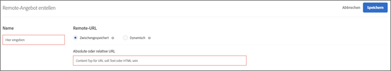

# Remote-Angebote erstellen{#create-remote-offers}

Verwenden Sie Remote-Angebote dazu, außerhalb von Target Inhalt zu hosten, auf den Target zugreift und den das Tool für Benutzerwebseiten zur Verfügung stellt. Diese Inhalte können sich aus Gründen der einfachen Verwendbarkeit oder aus Sicherheitsgründen in einem Content-Management- oder einem anderen System befinden.

>[!NOTE]
>
>Remote-Angebote können nur im formularbasierten Composer erstellt werden. Content will be injected in the [!DNL Target] request locations, so these are most likely not appropriate for a global [!DNL Target] request.
>
>[!DNL Target Classic] verfügte über ähnliche Funktionen: [!UICONTROL Angebot auf Ihrer Seite] und [!UICONTROL Angebot außerhalb von Test&amp;Target].

Einige Beispiele für Remote-Angebote sind:

* Verschiedene Versionen Ihrer Querverkäufe
* Dynamische Warenkorbmeldungen
* Formulare
* Rechner
* Zinsänderungen

**So erstellen Sie ein Remote-Angebot:**

1. Klicken Sie auf **[!UICONTROL Angebote]** und wählen Sie anschließend die Registerkarte **[!UICONTROL Code-Angebote]** aus.
1. Klicken Sie auf **[!UICONTROL Erstellen]** > **[!UICONTROL Remote-Angebot]**.

   

1. Geben Sie einen beschreibenden Namen für das Angebot an.

   Ein beschreibender Name unterstützt Sie und andere dabei, das Angebot problemlos in der Bibliothek [!UICONTROL Assets] aufzufinden.

1. Geben Sie die Remote-URL für das Remote-Angebot an:

   | Option | Beschreibung |
   |--- |--- |
   | Zwischengespeichert | Der Inhalt eines zwischengespeicherten Remote-Angebots wird von Target bereitgestellt. Alle zwei Stunden ruft [!DNL Target] den Inhalt der Remote-URL ab und speichert ihn in Target. Laden Besucher die Seite mit einem Erlebnis, in dem ein Remote-Angebot enthalten ist, wird das Angebot von Target bereitgestellt. Zwischengespeicherte Remote-Angebote bieten gesteigerte Sicherheit, da jemand, der in Target angemeldet ist, den Inhalt nicht bearbeiten kann. Soll der Inhalt bearbeitet werden, müsste sich jemand im Inhaltsverwaltungssystem oder dem System anmelden, in dem der Inhalt gespeichert ist, und ihn dort bearbeiten. Sie können für zwischengespeicherte Remote-Angebote eine absolute oder relative URL angeben. |
   | Dynamisch | Ein dynamisches Remote-Angebot wird vom Inhaltsverwaltungssystem oder einem anderen System bereitgestellt, nicht von Target. Möglicherweise möchten Sie nicht, dass Inhalte regelmäßig in den Zwischenspeicher geladen und anschließend von Target bereitgestellt werden, wenn Besucher die Seite mit einem Erlebnis laden, in dem ein Remote-Angebot enthalten ist. Stattdessen möchten Sie direkt das System aufrufen, in dem der Inhalt gehostet wird, und möglicherweise spezifische Daten weiterleiten, sodass das ausgegebene Angebot für jeden Besucher dynamisch oder angepasst ist. Meldet sich ein Benutzer beispielsweise auf einer Kreditkarten-Website an, auf der ein dynamisches Angebot enthalten ist, können Sie in die URL Parameter für die Kontoinformationen des Benutzers einfügen. In diesem Fall zeigt die Webseite benutzerspezifische Daten an, beispielsweise den Kontostand. Klicken Sie auf [!UICONTROL Hinzufügen Parameter] , um eine oder mehrere [!DNL Target] Anforderungen oder Anforderungsparameter hinzuzufügen. |

1. Klicken Sie auf **[!UICONTROL Speichern]**.

## Best Practices für die Verwendung von Remote-Angeboten {#section_7718512D08E14121B6F6B8C38134F4BC}

Best Practices für die Verwendung von Remote-Angeboten in Ihren Aktivitäten:

* If your offer resides in the same domain as the [!DNL Target] requests, using the [!UICONTROL Cached] option lets you use relative URLs in describing your offer location.

   Beim Verschieben Ihrer Aktivität von den Vorbereitungsservern auf die Produktionsserver hat dieses Verfahren den Vorteil, dass ohne manuelles Ändern der URL automatisch auf den Inhalt zugegriffen werden kann.

* Sollten in Ihrem Test dynamisch vom Server generierte Daten enthalten sein, ist die Option [!UICONTROL Dynamisch] möglicherweise die richtige Wahl.
* Sollten Sie lediglich planen, die Darstellung des Inhalts Ihres bestehenden Remote-Angebots zu prüfen, verwenden Sie den [!UICONTROL Visual Experience Composer], um Aussehen und Eindruck des Inhalts anzupassen, der vom Inhaltsverwaltungssystem ausgegeben wird.
* Verwenden Sie die Auswahlmatrix für dynamische Angebote, um das für den jeweiligen Fall am besten geeignete Angebot auszuwählen. Wenden Sie sich an Ihren Kundenbetreuer, wenn Sie Fragen haben.

## Funktionsweise dynamischer Remote-Angebote {#concept_CC2A969420B34364A9FA78C1CE251818}

Auf dynamischen Seiten können Werte an dynamische Remote-Angebote übergeben werden.

Diese Angebote werden nach dem Rendern der Seite ausgeführt, indem die übergebenen Werte in einem unsichtbaren iframe gesammelt werden, der dann aus dem Frame kopiert und in die Seite eingefügt wird, sodass die übergebenen Werte geladen werden.

## Auswahlmatrix für Remote-Angebote {#reference_B23BEDD29DDD47709A7651AFD27E776B}

Mit der Auswahlmatrix für Remote-Angebote können Sie entscheiden, welcher Typ von Remote-Angebot festgelegt werden soll: [!UICONTROL Zwischengespeichert] oder [!UICONTROL Dynamisch].

| Funktion | Zwischengespeichert | Dynamisch |
|--- |--- |--- |
| Wird bei jeder Anforderung eines Besuchers aktualisiert | Nein | Ja |
| Inhaltsaktualisierungen | Alle 2 Stunden im Cache gespeichert | Sofort nach jeder Anforderung aktualisiert |
| Ladezeit | Schneller | Langsamer aufgrund Anforderungsverarbeitung |
| JavaScript wird auf Seite angezeigt | Ja | Nein, aber kann per URL übergeben werden |
| Angebote können JavaScript enthalten. | Ja | Ja |
| Angebots-URL | Absolut      oder Relativ | Relativ |
| Anfordernder Computer | Adobe-Server | Der Computer des Besuchers, auf dem die Cookies des Besuchers gespeichert sind |