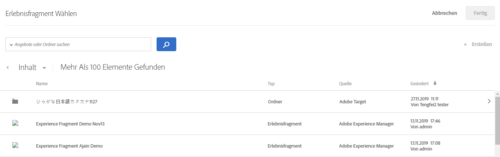

# AEM-Experience Fragments {#aem-experience-fragments}

Informationen zur Verwendung von Experience Fragments, die in [!DNL Adobe Experience Manager] (AEM) in [!DNL Target]-Aktivitäten erstellt werden, um die Optimierung oder Personalisierung zu unterstützen.

>[!NOTE]
>
>Diese Funktion erfordert, dass Sie ein [!DNL Adobe Experience Manager] ([!DNL AEM])-Kunde sind. Weitere Informationen finden Sie unten unter [Anforderungen](../../c-experiences/c-manage-content/aem-experience-fragments.md#section_AE6F0971E1574B3AA324003599B96E5A).

## Überblick {#section_95A91830530F493B81C5C9CDB9B783EA}

Mithilfe von in [!DNL AEM] in [!DNL Target]-Aktivitäten erstellten Experience Fragments können Sie die Benutzerfreundlichkeit und Leistungsfähigkeit von [!DNL AEM] mit den leistungsstarken Funktionen der automatisierten Intelligenz (AI) und des maschinellen Lernens (ML) in [!DNL Target] kombinieren, um Erlebnisse bedarfsgerecht zu testen und zu personalisieren.

[!DNL AEM] kombiniert all Ihre Inhalte und Kreativelemente an einem zentralen Ort, um Sie bei Ihrer Personalisierungsstrategie zu unterstützen. Mit [!DNL AEM] können Sie von einem zentralen Ort aus problemlos Inhalte für Desktops, Tablets und Smartphones erstellen, ohne Code zu schreiben. Es ist nicht erforderlich, Seiten für jedes Gerät zu erstellen. [!DNL AEM] passt jedes Erlebnis automatisch an Ihren Inhalt an.

Mit [!DNL Target] können Sie personalisierte Erlebnisse bedarfsgerecht bereitstellen. Dies erfolgt auf der Grundlage einer Kombination aus regelbasierten und AI-gestützten Ansätzen des maschinellen Lernens, zu denen Verhaltens-, Kontext- und Offline-Variablen zählen. [!DNL Target] ermöglicht Ihnen die problemlose Einrichtung und Ausführung von [A/B-Tests](/help/c-activities/t-test-ab/test-ab.md)- und [multivariaten Aktivitäten](/help/c-activities/c-multivariate-testing/multivariate-testing.md) (MVT), um die besten Angebote, Inhalte und Erlebnisse zu bestimmen.

Experience Fragments sind ein großer Schritt vorwärts, um die Ersteller von Inhalten/Erlebnissen und Manager mit den Optimierungs- und Personalisierungsexperten zu verknüpfen, die Geschäftsergebnisse mit [!DNL Target] optimieren.

## Voraussetzungen  {#section_AE6F0971E1574B3AA324003599B96E5A}

You must be provisioned with the experience fragments functionality within [!DNL Target]. Darüber hinaus müssen Sie [!DNL AEM] 6.3 mit dem richtigen Service Pack oder [!DNL AEM] 6.4 (oder höher) verwenden. Ihr Kundenbetreuer kann Ihnen helfen, die Anforderungen zur Verwendung dieser Funktion zu erfüllen:

* [!DNL Adobe Experience Manager] 6.4 (oder höher).
* [!DNL Adobe Experience Manager] 6.3 SP2 (oder höher).
* [!DNL Adobe Target Standard]- oder [!DNL Adobe Target Premium]-Konto.
* Wenden Sie sich an die [Adobe Target-Kundenunterstützung](/help/cmp-resources-and-contact-information.md#reference_ACA3391A00EF467B87930A450050077C), um die Integration zu aktivieren und Details zur Authentifizierung zu erhalten.

## Erstellen und Konfigurieren von Experience Fragments in [!DNL AEM] {#section_745C8EFE29F547A2958FDBF61A5ADF7B}

Um [!DNL AEM]-Experience Fragments in [!DNL Target] verwenden zu können, müssen Sie die folgenden Schritte ausführen:

### Schritt 1: Integrieren von [!DNL AEM] mit [!DNL Target]

Weitere Informationen finden Sie unter:

* **[!DNL AEM]6.3**: [Abonnieren von Adobe Analytics und Adobe Target](https://docs.adobe.com/docs/en/aem/6-3/administer/integration/marketing-cloud/opt-in.html) in der Dokumentation zu _Adobe Experience Manager 6.3_.
* **[!DNL AEM]6.4**: [Abonnieren von Adobe Analytics und Adobe Target](https://helpx.adobe.com/de/experience-manager/6-4/sites/administering/using/opt-in.html) in der Dokumentation zu _Adobe Experience Manager 6.4_.
* **[!DNL AEM]6.5**: [Abonnieren von Adobe Analytics und Adobe Target](https://helpx.adobe.com/de/experience-manager/6-5/sites/administering/using/opt-in.html) in der Dokumentation zu *Adobe Experience Manager 6.5*.

### Schritt 2: Erstellen vom Experience Fragment

Experience Fragments werden in [!DNL AEM] erstellt. Weitere Informationen finden Sie unter:

* **[!DNL AEM]6.3:** [Experience Fragments](https://docs.adobe.com/docs/en/aem/6-3/author/experience-fragments.html) in der *Adobe Experience Manager 6.3*-Dokumentation.
* **[!DNL AEM]6.4:** [Experience Fragments](https://helpx.adobe.com/de/experience-manager/6-4/sites/authoring/using/experience-fragments.html) in der *Adobe Experience Manager 6.4*-Dokumentation.
* **[!DNL AEM]6.5:** [Experience Fragments](https://helpx.adobe.com/de/experience-manager/6-5/sites/authoring/using/experience-fragments.html) in der *Adobe Experience Manager 6.5*-Dokumentation.

### Schritt 3: Konfigurieren von [!DNL AEM] für das Teilen vom Experience Fragment mit [!DNL Target]

1. Wählen Sie in [!DNL AEM] das gewünschte Experience Fragment oder den Ordner, der dieses Fragment enthält, und klicken Sie dann auf **[!UICONTROL Eigenschaften]**.
2. Klicken Sie auf die Registerkarte **[!UICONTROL Cloud-Services]** und wählen Sie dann in der Dropdown-Liste **[!UICONTROL Cloud-Service-Konfiguration]** den Eintrag **[!UICONTROL Adobe Target]** aus.

   >[!NOTE]
   >
   >Beim vorherigen Schritt wird davon ausgegangen, dass die [!DNL Adobe Target]-Konfiguration von einem Benutzer in Ihrem Unternehmen erstellt wurde.

3. Klicken Sie auf **[!UICONTROL Speichern &amp; Schließen]**.

### Schritt 4: Veröffentlichen vom Experience Fragment und exportieren nach [!DNL Target]

Abhängig von Ihrer [!DNL AEM]-Version finden Sie unter den folgenden Links schrittweise Anweisungen:

* **[!DNL AEM]6.3**: [Exportieren von einem Experience Fragment nach Target](https://helpx.adobe.com/de/experience-manager/6-3/sites/administering/using/experience-fragments-target.html) in der *Adobe Experience Manager 6.3*-Dokumentation.
* **[!DNL AEM]6.4**: [Exportieren von einem Experience Fragment nach Target](https://docs.adobe.com/content/help/de-DE/experience-manager-64/administering/integration/experience-fragments-target.html) in der *Adobe Experience Manager 6.4*-Dokumentation.
* **[!DNL AEM]6.5**: [Exportieren von einem Experience Fragment nach Target](https://helpx.adobe.com/de/experience-manager/6-5/sites/administering/using/experience-fragments-target.html) in der *Adobe Experience Manager 6.5*-Dokumentation.

## Using experience fragments in Target activities {#section_17CE4BE6B2B74CCEBAE0C68DEB84ABB9}

Nach dem Ausführen der zuvor genannten Aufgaben wird das Experience Fragment auf der Seite [!UICONTROL Angebote] in [!DNL Target] angezeigt.

>[!NOTE]
>
>[!DNL Target] sucht derzeit alle zehn Minuten nach zu importierenden Experience Fragments. Das importierte Experience Fragment sollte innerhalb von zehn Minuten in [!DNL Target] verfügbar sein. Dieser Zeitraum soll in Zukunft weiter reduziert werden.

>[!IMPORTANT]
>
>Das Experience Fragment wird derzeit in [!DNL Target] als HTML-Angebot importiert. Note that the experience fragment &quot;primary&quot; version remains in [!DNL AEM]. Sie können das Experience Fragment nicht in [!DNL Target] bearbeiten.

Sie können den Mauszeiger über ein Experience Fragment in der Liste bewegen und dann auf das Symbol für die [!UICONTROL Ansicht]  klicken, um weitere Informationen zum Experience Fragment anzuzeigen, einschließlich der URL des öffentlichen Angebots und des zugehörigen [!DNL AEM]-Pfads.

Mit dem [Visual Experience Composer](/help/c-experiences/c-visual-experience-composer/visual-experience-composer.md) (VEC) oder dem [Form-Based Experience Composer](/help/c-experiences/form-experience-composer.md) können Sie Experience Fragments in [!DNL Target]-Aktivitäten verwenden.

>[!NOTE]
>
>Um die KI- und ML-Funktionen von [!DNL Target] vollständig zu nutzen, können Sie beim Erstellen von A/B-Tests die Option [Automatische Zuordnung](../../c-activities/automated-traffic-allocation/automated-traffic-allocation.md#concept_A1407678796B4C569E94CBA8A9F7F5D4) oder [Automatisierte Personalisierung](/help/c-activities/automated-traffic-allocation/automated-traffic-allocation.md) auswählen.

**So verwenden Sie Experience Fragments mit dem VEC:**

1. Klicken Sie in [!DNL Target] beim Erstellen oder Bearbeiten eines Erlebnisses im [Visual Experience Composer](../../c-experiences/experiences.md#concept_A2E10F6AFB3D4AEAB6951EE14688848D) an die Stelle der Seite, an der Sie [!DNL AEM]-Inhalte einfügen möchten, und wählen Sie dann die gewünschte Option aus, um die Liste [!UICONTROL Experience Fragment auswählen] anzuzeigen.

   * [!UICONTROL Einfügen vor]
   * [!UICONTROL Einfügen nach]
   * [!UICONTROL Mit Experience Fragment tauschen]

   In der Liste [!UICONTROL Experience Fragment] werden alle in [!DNL AEM] erstellten Inhalte angezeigt, die von nun an nativ in [!DNL Target] verfügbar sind.

   >[!NOTE]
   >
   >Die Option [!UICONTROL Mit Experience Fragment tauschen] ist nicht für Bilder verfügbar. Wenn Sie diese Option mit einem Bild verwenden möchten, klicken Sie auf das Container-Element, das das gewünschte Bild enthält.

   

1. Wählen Sie das gewünschte Experience Fragment aus und klicken Sie dann auf **[!UICONTROL Fertig]**.
1. Schließen Sie die Konfiguration der Aktivität ab.

   Weitere Informationen über die Konfiguration der verschiedenen Aktivitätstypen finden Sie in den folgenden Themen:

   * **A/B-Test:** [Erstellen eines A/B-Tests](../../c-activities/t-test-ab/t-test-create-ab/test-create-ab.md#task_68C8079BF9FF4625A3BD6680D554BB72)
   * **Automatische Zuordnung:** [Automatische Zuordnung](../../c-activities/automated-traffic-allocation/automated-traffic-allocation.md#concept_A1407678796B4C569E94CBA8A9F7F5D4)
   * **Automatisches Targeting:** [Automatisches Targeting für personalisierte Erlebnisse](../../c-activities/auto-target-to-optimize.md#concept_67779E5B7F67427A97D7EA2A6FB919B3)
   * **Automatisierte Personalisierung (AP):** [Erstellen einer Aktivität zur automatisierten Personalisierung](../../c-activities/t-automated-personalization/create-ap-activity.md#task_8AAF837796D74CF893CA2F88BA1491C9)
   * **Erlebnis-Targeting (XT):** [Erstellen einer Erlebnis-Targeting-Aktivität](../../c-activities/t-experience-target/t-xt-create/xt-create.md#task_D6B3429AC31549E1A70EDF04B3DDC765)
   * **Multivarianz-Tests (MVT):** [Erstellen eines Multivarianz-Tests](../../c-activities/c-multivariate-testing/t-create-multivariate-test/create-multivariate-test.md#task_BF870FA60A8245AB8F0B775BE32EA710)
   * **Recommendations:** [Erstellen einer Recommendations-Aktivität](../../c-recommendations/t-create-recs-activity/create-recs-activity.md#task_6874328773C64C44A73F0A130AD3F96F)

**So verwenden Sie Experience Fragments mit dem Form-Based Experience Composer:**

1. In [!DNL Target], while creating or editing an experience in the [Form-Based Experience Composer](../../c-experiences/form-experience-composer.md#task_FAC842A6535045B68B4C1AD3E657E56E), select the location on the page where you want to insert [!DNL AEM] content, then select **[!UICONTROL Change Experience Fragment]** to display the [!UICONTROL Choose an Experience Fragment] list.

   

   In der Liste [!UICONTROL Experience Fragment]  werden alle in [!DNL AEM] erstellten Inhalte angezeigt, die von nun an nativ in [!DNL Target] verfügbar sind.

1. Wählen Sie das gewünschte Experience Fragment aus und klicken Sie dann auf **[!UICONTROL Speichern]**.
1. Schließen Sie die Konfiguration der Aktivität ab.

## Zu beachten {#considerations}

* [!DNL Target] sucht derzeit alle zehn Minuten nach zu importierenden Experience Fragments. Das importierte Experience Fragment sollte innerhalb von zehn Minuten in [!DNL Target] verfügbar sein. Dieser Zeitraum soll in Zukunft weiter reduziert werden.
* Das Experience Fragment wird derzeit in [!DNL Target] als HTML-Angebot importiert. Note that the experience fragment &quot;primary&quot; version remains in [!DNL AEM]. Sie können das Experience Fragment nicht in [!DNL Target] bearbeiten.
* Sie können JSON-Angebote als Experience Fragments nach [!DNL Target] importieren. Diese Angebote werden jedoch als HTML-Angebote importiert. JSON-Angebote (Experience Fragments) werden derzeit nicht vollständig in der [!DNL Target]-Benutzeroberfläche unterstützt.
* Sie können keine Erlebnisfragmente mit Adobe IO erstellen. Sie müssen Erlebnisfragmente mit AEM erstellen, wie oben beschrieben.

## Training video: Using AEM experience fragments with Adobe Target  {#section_C0EDC54063464F41A182492D2045BC64}

Das folgende Video zeigt Ihnen, wie Sie Experience Fragments einrichten und verwenden:

>[!VIDEO](https://video.tv.adobe.com/v/22383)

>[!NOTE]
>
>Die [!DNL AEM]-Deeplink-Funktion, die in 4:54 erläutert wurde, wurde entfernt.

Weitere Informationen finden Sie unter [Verwenden von Experience Fragments mit Adobe Target](https://docs.adobe.com/content/help/en/experience-manager-learn/sites/personalization/experience-fragment-target-offer-feature-video-use.html) auf der Seite *Videos und Tutorials für AEM Sites*.
