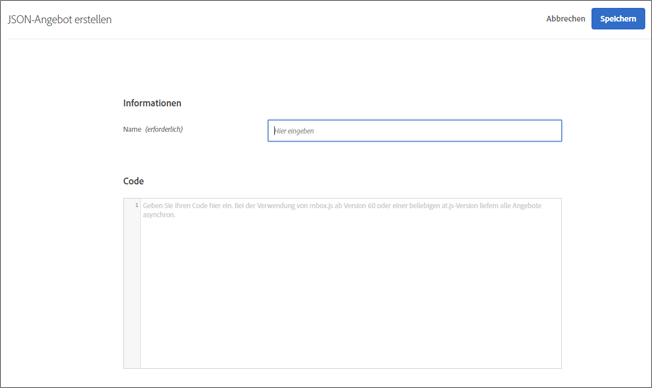
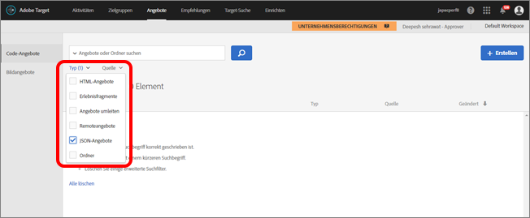

# Erstellen von JSON-Angeboten{#create-json-offers}

Erstellen Sie JSON-Angebot in der [!UICONTROL Angebot-Bibliothek] in [!DNL Adobe Target] zur Verwendung im [!UICONTROL Form-Based Experience Composer].

JSON-Angebot können in formularbasierten Aktivitäten verwendet werden, wobei Anwendungsfälle aktiviert werden, bei denen die [!DNL Target]-Entscheidung erforderlich ist, um ein Angebot im JSON-Format für den Einsatz in SPA Framework- oder serverseitigen Integrationen zu senden.

## JSON-Überlegungen

Beachten Sie Folgendes, wenn Sie mit JSON-Angeboten arbeiten:

* JSON-Angebot sind derzeit nur für die Aktivitäten [!UICONTROL A/B-Test] und [!UICONTROL Erlebnis-Targeting] (XT) verfügbar.
* JSON-Angebot können nur in [formularbasierten Aktivitäten](/help/c-experiences/form-experience-composer.md) verwendet werden.
* JSON kann direkt abgerufen werden, wenn Sie die Server-seitige API, das Mobile-SDK oder das NodeJS-SDK verwenden.
* Im Browser kann JSON NUR über at.js 1.2.3 (oder neuer) und mit  [getOffer()](/help/c-implementing-target/c-implementing-target-for-client-side-web/adobe-target-getoffer.md) abgerufen werden, indem Aktionen mit der Aktion `setJson` gefiltert werden.
* JSON-Angebote werden als native JSON-Objekte und nicht als Zeichenfolgen ausgeliefert. Nutzer dieser Objekte müssen diese also nicht mehr als Zeichenfolgen behandeln und in JSON-Objekte konvertieren.
* JSON-Angebote werden im Gegensatz zu anderen Angeboten (z. B. HTML-Angeboten) nicht automatisch eingesetzt, da es sich bei JSON-Angeboten um nicht visuelle Angebote handelt. Der Entwickler muss Code schreiben, um das Angebot explizit zum Einsatz zu bringen.  [getOffer()](/help/c-implementing-target/c-implementing-target-for-client-side-web/adobe-target-getoffer.md).
* Wenn Sie mbox.js verwenden, werden JSON-Angebote nicht unterstützt.

## JSON-Angebot {#section_BB9C72D59DEA4EFB97A906AE7569AD7A} erstellen

1. Klicken Sie auf **[!UICONTROL Angebote]** > **[!UICONTROL Code-Angebot]**.

   

1. Klicken Sie auf **[!UICONTROL Erstellen]** > **[!UICONTROL JSON-Angebot]**.

   

1. Geben Sie einen Angebotsnamen ein.
1. Schreiben Sie Ihren JSON-Code in das Feld **[!UICONTROL Code]** oder kopieren Sie ihn dorthin.
1. Klicken Sie auf **[!UICONTROL Speichern]**.

## JSON-Beispiel {#section_A54F7BB2B55D4B7ABCD5002E0C72D8C9}

JSON-Angebot werden nur in Aktivitäten unterstützt, die mit dem [Form-Based Experience Composer](/help/c-experiences/form-experience-composer.md) erstellt wurden. Die einzige Möglichkeit, JSON-Angebote zu nutzen, läuft derzeit über direkte API-Aufrufe.

Siehe folgendes Beispiel:

```json
adobe.target.getOffer({ 
  mbox: "some-mbox", 
  success: function(actions) { 
    console.log('Success', actions); 
  }, 
  error: function(status, error) { 
    console.log('Error', status, error); 
  } 
});
```

Die Aktionen, die an den Erfolgs-Callback übergeben werden, sind eine Reihe von Objekten. Angenommen, wir haben ein einzelnes JSON-Angebot mit folgendem Inhalt:

```json
{ 
  "demo": {"a": 1, "b": 2} 
}
```

Die Aktionsreihe hat diese Struktur:

```json
[ 
 { 
   action: "setJson", 
   content: [{ 
     "demo": {"a": 1, "b": 2} 
   }] 
 }  
]
```

Um das JSON-Angebot zu extrahieren, durchlaufen Sie Aktionen, suchen die Aktion mit der Aktion `setJson` und durchlaufen dann das Inhaltsarray.

## Verwendungsfall {#section_85B07907B51A43239C8E3498EF58B1E5}

Angenommen, das folgende JSON-Angebot wird an Ihre Webseite geliefert:

```json
{ 
    "_id": "5a65d24d8fafc966921e9169", 
    "index": 0, 
    "guid": "7c006504-c6f7-468d-a46f-f72531ea454c", 
    "isActive": true, 
    "balance": "$2,075.06", 
    "picture": "https://placehold.it/32x32", 
    "tags": [ 
      "esse", 
      "commodo", 
      "excepteur", 
    ], 
    "friends": [ 
      { 
        "id": 0, 
        "name": "Carla Lyons" 
      }, 
      { 
        "id": 1, 
        "name": "Ollie Mooney" 
      }, 
    ], 
    "greeting": "Hello, Stephenson Fernandez! You have 4 unread messages.", 
    "favoriteFruit": "strawberry" 
} 
  
```

Der folgende Code zeigt Ihnen, wie Sie auf das Attribut „Begrüßung“ zugreifen können:

```json
adobe.target.getOffer({   
  "mbox": "name_of_mbox", 
  "params": {}, 
  "success": function(offer) {           
        console.log(offer[0].content[0].greeting); 
  },   
  "error": function(status, error) {           
      console.log('Error', status, error); 
  } 
});
```

## Filtern von Angeboten nach dem JSON-Angebot-Typ {#section_52533555BCE6420C8A95EB4EB8907BDE}

Sie können die Bibliothek [!UICONTROL Angebot] nach dem JSON-Angebot-Typ filtern, indem Sie auf die Dropdown-Liste **[!UICONTROL Typ]** klicken und anschließend das Kontrollkästchen **[!UICONTROL JSON]** aktivieren.



