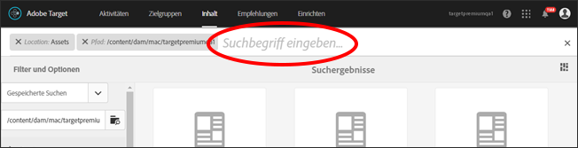
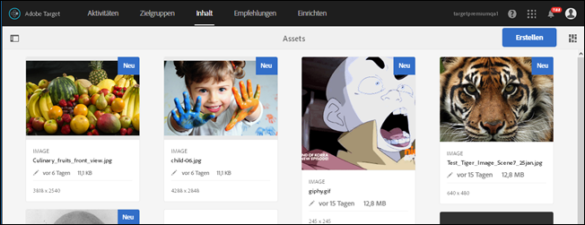
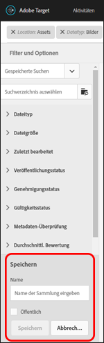
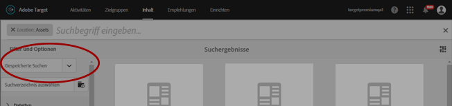

# Durchsuchen von Inhalten und Erstellen intelligenter Sammlungen{#search-content-and-create-smart-collections}

Suchen Sie anhand bestimmter Schlüsselwörter nach Assets und speichern Sie Suchordner, auch „intelligente Sammlungen“ genannt, die automatisch mit Ihren Suchergebnissen aktualisiert werden.

Dieser Abschnitt enthält die folgenden Informationen:

* [Suche nach Assets mit Schlüsselwörtern ](../../c-experiences/c-manage-content/filter-and-search-content.md#section_2465A71BC95942588F586B1EC8B9E5DB)
* [Speichern intelligenter Sammlungen ](../../c-experiences/c-manage-content/filter-and-search-content.md#section_5C95159543B5405EB8C8E47B518DF4AB)

## Suche nach Assets mit Schlüsselwörtern  {#section_2465A71BC95942588F586B1EC8B9E5DB}

1. Klicken Sie auf **[!UICONTROL Angebote]** > **[!UICONTROL Bildangebote]**, um auf die [!UICONTROL Asset-Bibliothek] zuzugreifen.

   Sie können oben rechts auf das Symbol für die [!UICONTROL Kartenansicht] klicken, um Assets im Kartenformat anzuzeigen.

   Oder

   Sie können oben rechts auf das Symbol für die [!UICONTROL Listenansicht] klicken, um Assets im Listenformat anzuzeigen.

1. Klicken Sie oben links auf das Symbol **[!UICONTROL Nur Inhalt]**, um das Suchfeld einzublenden.

   

1. Geben Sie in das Suchfeld ein Schlüsselwort für das Asset/die Assets ein, das oder die Sie finden möchten, und drücken Sie die Eingabetaste.

## Speichern intelligenter Sammlungen  {#section_5C95159543B5405EB8C8E47B518DF4AB}

Sie können gespeicherte Suchen erstellen, auch „intelligente Sammlungen“ genannt, um Zeit zu sparen, wenn Sie ähnliche Suchen durchführen. Mit einer gespeicherten Suche wird eine intelligente Sammlung erstellt, die automatisch mit Suchergebnissen aktualisiert wird.

1. Klicken Sie auf **[!UICONTROL Angebote]** > **[!UICONTROL Bildangebote]**, um auf die [!UICONTROL Asset-Bibliothek] zuzugreifen.

   

1. Klicken Sie oben links auf das Symbol **[!UICONTROL Nur Inhalt]**, um das Feld [!UICONTROL „Filter und Optionen“] in der linken Leiste einzublenden.
1. Klicken Sie auf das Symbol **[!UICONTROL Durchsuchen]**, um das Dialogfeld [!UICONTROL „Pfad auswählen“] einzublenden.

   

1. Lokalisieren Sie den gewünschten Ordner, auf dem die intelligente Sammlung basieren soll, und wählen Sie ihn aus. Klicken Sie anschließend auf das **[!UICONTROL Bestätigungssymbol.]**

   

1. (Optional) Wählen Sie aus den verschiedenen Optionen einige aus, um Ihren Filter beispielsweise auf bestimmte Dateitypen und -größen zu beschränken.
1. Klicken Sie auf **[!UICONTROL Intelligente Sammlung speichern]** unten im Feld [!UICONTROL Filter und Optionen], um die Speicheroptionen anzuzeigen.

   

1. Geben Sie der intelligenten Sammlung einen Namen, aktivieren Sie das Kontrollkästchen **[!UICONTROL Öffentlich]**, wenn alle Benutzer Ihres [!DNL Target]-Kontos Zugriff auf die intelligente Sammlung erhalten sollen, und klicken Sie auf **[!UICONTROL Speichern]**.

   Die intelligente Sammlung wird für die künftige Verwendung der Liste Ihrer gespeicherten Suchen hinzugefügt:

   

Sie können eine gespeicherte intelligente Sammlung bearbeiten, indem Sie sie aus der Dropdownliste [!UICONTROL Gespeicherte Suchen] auswählen und öffnen und anschließend auf [!UICONTROL Intelligente Sammlung bearbeiten] klicken.
