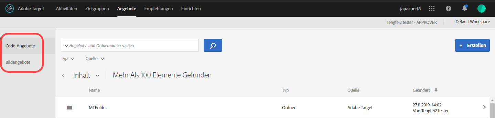
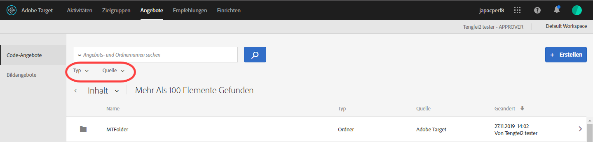
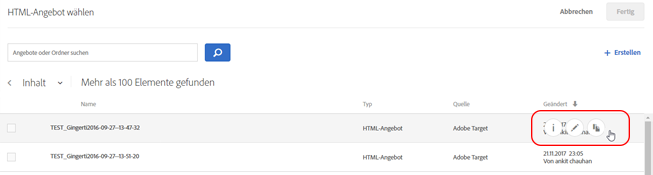
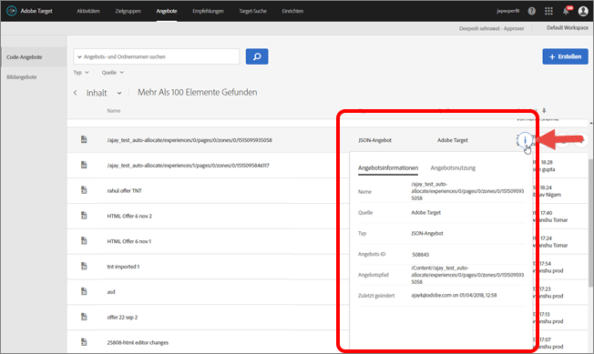
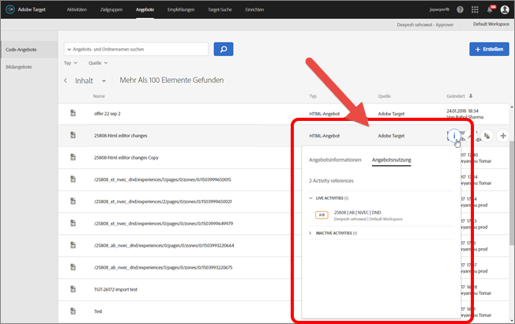
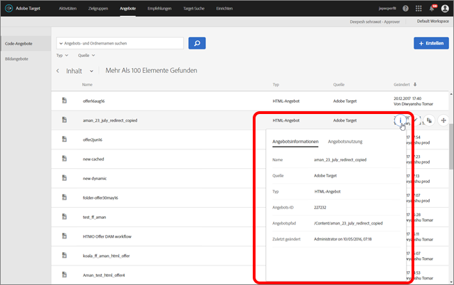
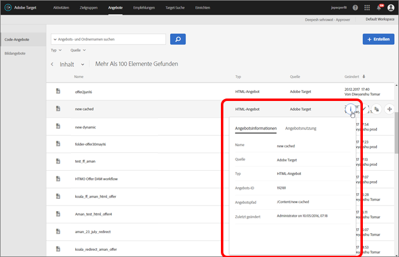

# Angebote{#offers}

Verwalten Sie mithilfe der Angebotsbibliothek die Inhalte Ihres Code- und Bildangebots.

>[!NOTE]
>
>In der Version von Januar 2017 werden in [!DNL Target Classic], [!DNL Adobe Experience Manager] (AEM), [!DNL Adobe Mobile Services] (AMS) und APIs erstellte Angebote in der Benutzeroberfläche von [!DNL Target Standard/Premium] angezeigt. Angebote, die in den letzten zwei Jahren mit diesen Methoden aktualisiert wurden (d. h. ab Version Januar 2015), sind ebenfalls sichtbar. Die ursprüngliche Synchronisation wird ausgeführt, wenn ein Benutzer Ihrer Organisation zum ersten Mal die Seite [!UICONTROL Angebote] öffnet. Es hängt von der vorhandenen Datenmenge ab, wie lange diese Synchronisierung dauert. Nach der eingänglichen Synchronisierung werden Daten laufend aktualisiert. Befanden sich vor dieser Version Code und Bilder im selben Ordner, werden diese von [!DNL Target] auf zwei duplizierte Ordner aufgeteilt. Beachten Sie, dass das Aktualisierungsdatum mit zugehöriger Uhrzeit sich auf den Zeitpunkt bezieht, zu dem der Ordner migriert wurde, und sich nicht auf das ursprüngliche Erstellungsdatum des Ordners auswirkt.

Klicken Sie auf **[!UICONTROL Angebote]**, um die Bibliothek zu öffnen. Die Bibliothek enthält die Angebote, die über [!DNL Target Standard/Premium], [!DNL Target Classic], [!DNL Adobe Experience Manager] (AEM), [!DNL Adobe Mobile Services] (AMS) und APIs erstellt wurden. In [!DNL Target Classic] oder anderen Lösungen erstellte Angebote lassen sich in [!DNL Target Standard/Premium] bearbeiten.

Die [!UICONTROL Angebotsseite] besteht aus zwei Registerkarten auf der rechten Seite: Code-Angebote und Bildangebote. Mithilfe der Registerkarten können Sie Angebote nach Typ anzeigen.

Sie können die Angebote nach Typ (HTML-Angebot, Umleitungsangebot, Remote-Angebot oder Ordner) und nach Quelle (Adobe Target, Adobe Target Classic, Adobe Experience Manager, Adobe Mobile Services oder API) filtern.

Sie können einen Ordner oder ein Angebot bearbeiten oder kopieren, indem Sie mit der Maustaste über das gewünschte Element fahren und auf das Symbol „Bearbeiten“ oder das Symbol „Kopieren“ klicken.

## Angebotsdefinitionen anzeigen  {#section_6B059DD121434E6292CAB393507D010E}

Sie können Details zur Angebotsdefinition in einer Pop-up-Karte in der Angebotsbibliothek anzeigen, ohne das Angebot zu öffnen.

So wird beispielsweise die folgende Angebotsdefinitionskarte für ein HTML-Angebot angezeigt, indem Sie den Mauszeiger über ein Angebot in der Liste „Inhalt“ bewegen und anschließend auf das Informationssymbol klicken:

Die folgenden Informationen sind verfügbar:

* Name
* Quelle
* Typ
* Angebots-ID
* Angebotspfad
* Zuletzt geändert

Klicken Sie auf die Registerkarte [!UICONTROL Angebotsnutzung], um die Aktivitäten anzuzeigen, die sich auf ein Codeangebot in der Pop-up-Karte der jeweiligen Angebotsdefinition beziehen. Diese Funktionalität gilt nicht für Bildangebote. Auf diese Weise können Sie bei der Bearbeitung von Angeboten Auswirkungen auf andere Aktivitäten vermeiden. Zu den Informationen gehören Live-Aktivitäten und inaktive Aktivitäten.

Die folgende Angebotsdefinitionskarte für ein Umleitungsangebot:

Die folgenden Informationen sind verfügbar:

* Name
* Quelle
* Typ
* Angebots-ID
* Angebotspfad
* Zuletzt geändert
* Umleitungs-URL
* Alle URL-Parameter einschließen (an oder aus)
* mbox-Sitzungs-ID weitergeben (an oder aus)

Die folgende Angebotsdefinitionskarte für ein Remoteangebot:

Die folgenden Informationen sind verfügbar:

* Name
* Quelle
* Typ
* Angebots-ID
* Angebotspfad
* Zuletzt geändert
* Umleitungs-URL-Typ
* Absolute oder relative URL

## Schulungsvideo: Das Content-Repository 

In diesem Video wird beschrieben, wie Angebote verwaltet werden.

* Zusammenhang zwischen der [Experience Cloud-Asset-Bibliothek](https://experienceleague.adobe.com/docs/core-services/interface/assets/creative-cloud.html) und der Target-Inhaltsbibliothek
* Benutzerdefinierte HTML-Angebote
* Benutzerdefinierte HTML-Angebote im Visual Experience Composer

>[!VIDEO](https://video.tv.adobe.com/v/17387)