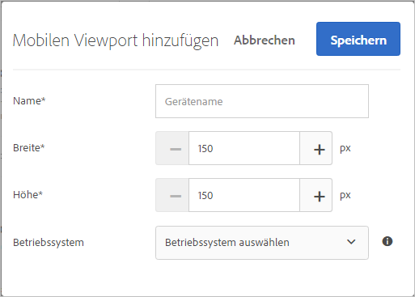
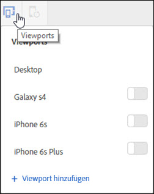

# Mobile Viewports für responsive Erlebnisse{#mobile-viewports-for-responsive-experiences}

Mit mobilen Viewports können Sie eine Vorschau Ihrer Aktivitäten auf unterschiedlich großen Bildschirmen anzeigen.

Die Funktion zur Vorschau zu mobilen Viewports wurde für responsive Sites entwickelt. Verwenden Sie mobile Viewports, wenn Ihre Site responsiv ist und dieselben Elemente auf Ihrer Desktop-Seite in einer anderen Konfiguration auf Ihrer mobilen Seite verwendet werden. Wenn Sie über eine separate mobile Site mit einer separaten Struktur verfügen, zum Beispiel [!DNL m.mysite.com], verwenden Sie eine [mehrseitige Aktivität](../../c-experiences/c-visual-experience-composer/multipage-activity.md#concept_277E096063E14813AC5D8EDFA1D2ED48).

>[!NOTE]
>
>Mobile Viewports sind nicht verfügbar, wenn sie von einem Umleitungsangebot überlagert werden.

Ein Viewport wird durch die Größe des Rechtecks definiert, das von einer Webseite auf Ihrem Bildschirm ausgefüllt wird. Es ist die Größe des Browser-Fensters abzüglich der Bildlaufleisten und Symbolleisten. Browser verwenden „CSS-Pixel“. Für viele Geräte, zum Beispiel solche mit Retina-Bildschirm, ist der Viewport kleiner als die beworbene Geräteauflösung.

Nachstehend finden Sie die Viewports und Auflösungen für einige bekannte Geräte. Denken Sie daran, die Viewport-Größe in Target zu verwenden.

| Gerät | Viewport-Größe | Geräteauflösung |
|---|---|---|
| iPhone X | 375 (B) x 812 (H) | 1125 (B) x 2436 (H) |
| iPhone 8 Plus | 414 (B) x 736 (H) | 1080 (B) x 1920 (H) |
| iPhone 8 | 375 (B) x 667 (H) | 750 (B) x 1334 (H) |
| iPhone 7 Plus | 414 (B) x 736 (H) | 1080 (B) x 1920 (H) |
| iPhone 7 | 375 (B) x 667 (H) | 750 (B) x 1334 (H) |
| iPhone 6 | 375 (B) x 667 (H) | 750 (B) x 1334 (H) |
| iPhone 6s | 414 (B) x 736 (H) | 1080 (B) x 1920 (H) |
| iPad  Pro | 1024 (B) x 1366 (H) | 2048 (B) x 2732 (H) |
| iPad der 3. und 4. Generation | 768 (B) x 1024 (H) | 1536 (B) x 2048 (H) |
| iPad Air 1 und 2 | 768 (B) x 1024 (H) | 1536 (B) x 2048 (H) |
| iPad Mini | 768 (B) x 1024 (H) | 768 (B) x 1024 (H) |
| iPad Mini 2 und 3 | 768 (B) x 1024 (H) | 1536 (B) x 2048 (H) |
| Nexus 6P | 411 (B) x 731 (H) | 1440 (B) x 2560 (H) |
| Nexus 5X | 411 (B) x 731 (H) | 1080 (B) x 1920 (H) |
| Google Pixel | 411 (B) x 731 (H) | 1080 (B) x 1920 (H) |
| Google Pixel XL | 411 (B) x 731 (H) | 1440 (B) x 2560 (H) |
| Google Pixel 2 | 411 (B) x 731 (H) | 1080 (B) x 1920 (H) |
| Google Pixel 2 XL | 411 (B) x 731 (H) | 1440 (B) x 2560 (H) |
| Samsung Galaxy Note 5 | 480 (B) x 853 (H) | 1440 (B) x 2560 (H) |
| LG G5 | 480 (B) x 853 (H) | 1440 (B) x 2560 (H) |
| One Plus 3 | 480 (B) x 853 (H) | 1080 (B) x 1920 (H) |
| Samsung Galaxy S9 | 360 (B) x 740 (H) | 1440 (B) x 2960 (H) |
| Samsung Galaxy S9+ | 360 (B) x 740 (H) | 1440 (B) x 2960 (H) |
| Samsung Galaxy S8 | 360 (B) x 740 (H) | 1440 (B) x 2960 (H) |
| Samsung Galaxy S8+ | 360 (B) x 740 (H) | 1440 (B) x 2960 (H) |
| Samsung Galaxy S7 | 360 (B) x 640 (H) | 1440 (B) x 2560 (H) |
| Samsung Galaxy S7 Edge | 360 (B) x 640 (H) | 1440 (B) x 2560 (H) |
| Nexus 7 (2013) | 600 (B) x 960 (H) | 1200 (B) x 1920 (H) |
| Nexus 9 | 768 (B) x 1024 (H) | 1536 (B) x 2048 (H) |
| Samsung Galaxy Tab 10 | 800 (B) x 1280 (H) | 800 (B) x 1280 (H) |
| Chromebook Pixel | 1280 (B) x 850 (H) | 2560 (B) x 1700 (H) |

Auf verschiedenen Websites sind die Viewport-Größen für gängige Geräte aufgeführt. Beispiel: [https://mediag.com/news/popular-screen-resolutions-designing-for-all/](https://mediag.com/news/popular-screen-resolutions-designing-for-all/) oder lesen Sie die Website des Geräteherstellers.

Wenn Sie eine Aktivität für Benutzer auf einem bestimmten Gerät bereitstellen möchten, wählen Sie im Aktivitätsdiagramm die entsprechende Zielgruppe für das Gerät aus. Verwenden Sie den Mobile Web Composer, um die Seite für das Gerät in der Aktivität zu bearbeiten. Wenn Sie eine Aktivität in all Ihren digitalen Erlebnissen ausführen und sicherstellen möchten, dass es auf allen Geräten ansprechend aussieht, wenden Sie nicht das Targeting an, sondern verwenden Sie mobile Viewports, um auf jeder Bildschirmgröße eine Vorschau für die Aktivität anzuzeigen.

Wenn Sie über eine responsive Site verfügen, wird Ihre Site in der Regel so erstellt, dass beim Zugriff durch ein Gerät mit einer bestimmten Bildschirmgröße eine andere Ansicht geöffnet wird. Diese Bildschirmgrößen, die solche neuen Ansichten auslösen, werden auch als *CSS-Haltepunkte* bezeichnet. Speichern Sie Ihre CSS-Haltepunkte in Target, damit Sie für jede definierte Ansicht eine Vorschau für Ihr Erlebnis anzeigen können. Jedes dieser Erlebnisse wird in der Target-Benutzeroberfläche in einem mobilen Viewport angezeigt. Öffnen Sie die Ansicht für jeden Bildschirm, indem Sie entlang der Oberkante der Anzeige auf diesen Viewport klicken.

Wenn Ihre Site nicht responsiv ist, können Sie zum Anzeigen einer Site weiterhin den Mobile Web Composer verwenden, wenn Ihre Aktivität auf ein bestimmtes Gerät ausgerichtet ist.

>[!NOTE]
>
>Sie können ein Erlebnis zwar innerhalb mobiler Viewports bearbeiten, jedoch werden diese Änderungen auf alle Viewports und Geräte angewendet und nicht nur auf den Viewport, in dem Sie arbeiten. Gleichermaßen wird bei der Bearbeitung eines Erlebnisses in der normalen Desktop-Ansicht die Seite für alle Bildschirmgrößen und nicht nur für die Desktop-Ansicht geändert. Derzeit bieten wir keine Unterstützung für Viewport-spezifische Seitenänderungen.

## Mobile Viewport-Konfiguration {#task_B4B161499DC0470584ED922A4D20FCAB}

Konfigurieren Sie alle mobilen Viewports, die Sie beim Erstellen Ihrer Erlebnisse verfügbar machen möchten.

1. Klicken Sie auf **[!UICONTROL Einrichtung]** &gt; **[!UICONTROL Voreinstellungen]**.
1. Klicken Sie im Abschnitt für die Konfiguration des mobilen Viewports auf der Seite „Kontoeinstellungen“ auf **[!UICONTROL Neu hinzufügen]**, um einen mobilen Viewport hinzuzufügen.

   Um die Konfiguration eines bestehenden mobilen Viewports zu ändern, wählen Sie diesen Viewport aus und klicken Sie anschließend auf das Stiftsymbol „Bearbeiten“.

   

1. Geben Sie einen Namen für den mobilen Viewport ein.

   Geben Sie Ihrem mobilen Viewport einen beschreibenden Namen, der leicht wiederzuerkennen ist. Der Name kann aus bis zu 36 Zeichen bestehen.
1. Geben Sie die Bildschirmgröße des Mobilgeräts mit Breite und Höhe ein.

   Die Breite kann zwischen 150 und 968 Pixeln betragen. Die Breite kann zwischen 150 und 1280 Pixeln betragen. 

   >[!NOTE]

1. (Optional) Wählen Sie das Betriebssystem des Geräts aus.

   Optionen:

   * Android
   * iOS
   * Windows
   * Symbian
   * BlackBerry
   Wenn Sie [Enhanced Experience Composer](../../c-experiences/experiences.md#section_34265986611B4AB8A0E4D6ACC25EF91D) verwenden und ein Betriebssystem auswählen, emuliert Target dieses Gerät, wenn Sie die Seite aufrufen. Wenn Ihre responsive Site auf Android eine andere Oberfläche aufweist als auf iOS, ahmt Target dieses Verhalten nach.
1. Klicken Sie auf **[!UICONTROL Speichern]**.

## Responsive Erlebnisse erstellen {#task_D6332438B5EE48CCA8AF199270F1CAEF}

Fügen Sie Ihren Target-Aktivitäten mobile Viewports hinzu, um responsive Erlebnisse für Mobilgeräte zu erstellen.

1. Erstellen Sie eine Aktivität.
1. Klicken Sie im Visual Experience Composer auf das Symbol **[!UICONTROL Einstellungen]** und wählen Sie anschließend **[!UICONTROL Mobile Viewports hinzufügen]** aus.
1. Klicken Sie auf das Symbol **[!UICONTROL Geräte]** und aktivieren Sie dann jedes Gerät, das über einen mobilen Viewport verfügen soll.

   

   Die mobilen Viewports sind nach Breite aufsteigend (vom kleinsten zum größten) aufgelistet.
1. Bearbeiten Sie die mobilen Viewports nach Bedarf.

   Alle Änderungen, die Sie an den Erlebnissen vornehmen (zum Beispiel, wenn Sie den Text in einer Überschrift ändern), werden für die Erlebnisse auf allen Geräten angewendet.

   Bewegen Sie den Mauszeiger über den Namen eines Viewports, um die Größe des Viewports anzuzeigen.
1. Schalten Sie nach Bedarf zwischen dem Hoch- und dem Querformatmodus um, indem Sie auf das Ausrichtungssymbol klicken.

   * Hochformat: 
   * Querformat: 

## Anwendungsfall: Targeting von zwei iPhone-Versionen {#task_CC3144BF5BA54034996E1D3DB0BC1A35}

In diesem Anwendungsfall wird erklärt, wie Erlebnisse für zwei verschiedene iPhone-Versionen, das iPhone 6 und das iPhone 6 Plus, mithilfe der Funktion Mobile Viewports in Target Standard erstellt werden können.

1. Klicken Sie in Target Standard auf **[!UICONTROL Einrichtung]** &gt; **[!UICONTROL Voreinstellungen]**.
1. Erstellen Sie im Konfigurationsabschnitt der Voreinstellungsseite für Mobile Viewport mobile Viewports für iPhone 6 und iPhone 6 Plus.

   Verwenden Sie für die Viewports folgende Einstellungen:

   | Name | Breite | Höhe | Betriebssystem |
   |---|---|---|---|
   | iPhone 6 | 375 | 667 | iOS |
   | iPhone 6 Plus | 414 | 736 | iOS |

   

1. Erstellen Sie eine Aktivität mit dem Erlebnis, das Sie für das Targeting einsetzen möchten.
1. Wählen Sie das Erlebnis aus, das Sie für Benutzer bereitstellen möchten, die über ein iPhone 6 oder iPhone 6 Plus auf Ihre Site zugreifen.
1. Klicken Sie für die Auswahl Ihres Ziels auf **[!UICONTROL Zielgruppe erstellen]** und konfigurieren Sie wie unten dargestellt eine Zielgruppe:

   

   Da das iPhone gedreht werden kann und so in das Querformat wechselt, müssen sowohl Breite als auch Höhe gleichzeitig größer als 320 sein. Dies führt zu einer Bedingung, die nur die Geräte 6 und 6 Plus erfüllen, wenn als Gerätemodell das iPhone angegeben wird.
1. Klicken Sie auf **[!UICONTROL Speichern]**.
1. Richten Sie die Aktivität wie gewohnt weiter ein.

## Schulungsvideos

In den folgenden Videos erhalten Sie weitere Informationen zu den in diesem Artikel behandelten Konzepten.

### Visual Experience Composer (2 von 2) (7:29)

Im folgenden Demonstrationsvideo erfahren Sie etwas dazu, wie Sie in Visual Experience Composer mit mobilen Viewports arbeiten:

* Erlebnis umbenennen und duplizieren
* Umleitungserlebnis erstellen
* Aktivität auf eine einzelne URL oder eine Gruppe von URLs ausrichten
* Mehrseitige Aktivität erstellen
* Erlebnisse für responsive Websites ansehen und erstellen
* Überlagerungen zum Hervorheben von Elementtypen nutzen

>[!VIDEO](https://video.tv.adobe.com/v/17401)

### Kontovoreinstellungen in Adobe Target

In diesem Video finden Sie Informationen zur Einrichtung von Mobile Viewports in den Kontovoreinstellungen. Dies wird ab 4:40 erläutert.

>[!VIDEO](https://video.tv.adobe.com/v/17379)