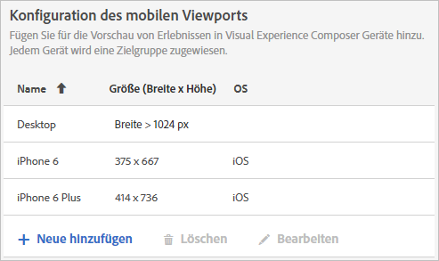

# Mobile Viewports für responsive Erlebnisse

Mit mobilen Viewports können Sie Vorschauen dazu erstellen, wie Ihre [!DNL Adobe Target]-Aktivitäten auf Bildschirmen unterschiedlicher Größe angezeigt werden.

Die Funktion zur mobilen Viewport-Vorschau wurde für responsive Sites entwickelt, die auf verschiedenen Geräten, Fenstern oder Bildschirmgrößen gut dargestellt werden. Responsive Sites passen sich automatisch an jede Bildschirmgröße an, einschließlich Desktop-PCs, Laptops, Tablets oder Mobiltelefone.

>[!NOTE]
>
> * Verwenden Sie mobile Viewports, wenn Ihre Site responsiv ist und dieselben Elemente auf Ihrer Desktop-Seite in einer anderen Konfiguration auf Ihrer mobilen Seite verwendet werden. Wenn Sie eine separate Mobilgeräte-Site mit einer separaten Struktur haben, z. B. `m.mysite.com`, verwenden Sie stattdessen eine [mehrseitige Aktivität](/help/c-experiences/c-visual-experience-composer/multipage-activity.md#concept_277E096063E14813AC5D8EDFA1D2ED48).
   >
   >
* Mobile Viewports sind nicht verfügbar, wenn sie von einem Umleitungsangebot überlagert werden.

Ein Viewport wird durch die Größe des Rechtecks definiert, das von einer Webseite auf Ihrem Bildschirm ausgefüllt wird. Es ist die Größe des Browser-Fensters abzüglich der Bildlaufleisten und Symbolleisten. Browser verwenden „CSS-Pixel“. Für viele Geräte, zum Beispiel solche mit Retina-Bildschirm, ist der Viewport kleiner als die beworbene Geräteauflösung.

Nachstehend finden Sie die Viewports und Auflösungen für einige bekannte Geräte. Denken Sie daran, die Viewport-Größe in [!DNL Target] zu verwenden. Auf verschiedenen Websites sind die Viewport-Größen für gängige Geräte aufgeführt. Weitere Informationen finden Sie unter [https://viewportsizer.com/devices/](https://viewportsizer.com/devices/) oder auf der Website des Geräteherstellers.

| Gerät | Viewport-Größe | Geräteauflösung |
|---|---|---|
| iPhone SE | 375 (B) x 667 (H) | 750 (B) x 1334 (H) |
| iPhone 11 Pro Max | 414 (B) x 896 (H) | 1242 (B) x 2688 (H) |
| iPhone 11 Xs Max. | 414 (B) x 896 (H) | 1242 (B) x 2688 (H) |
| iPhone 11 | 414 (B) x 896 (H) | 828 (B) x 1792 (H) |
| iPhone 11 Xr | 414 (B) x 896 (H) | 828 (B) x 1792 (H) |
| iPhone 11 Pro | 375 (B) x 812 (H) | 1125 (B) x 2436 (H) |
| iPhone 11 X | 375 (B) x 812 (H) | 1125 (B) x 2436 (H) |
| iPhone 11 Xs | 375 (B) x 812 (H) | 1125 (B) x 2436 (H) |
| iPhone X | 375 (B) x 812 (H) | 1125 (B) x 2436 (H) |
| iPhone 8 Plus | 414 (B) x 736 (H) | 1080 (B) x 1920 (H) |
| iPhone 8 | 375 (B) x 667 (H) | 750 (B) x 1334 (H) |
| iPhone 7 Plus | 414 (B) x 736 (H) | 1080 (B) x 1920 (H) |
| iPhone 7 | 375 (B) x 667 (H) | 750 (B) x 1334 (H) |
| iPhone 6s Plus | 414 (B) x 736 (H) | 1080 (B) x 1920 (H) |
| iPhone 6s | 375 (B) x 667 (H) | 750 (B) x 1334 (H) |
| iPhone 6 Plus | 414 (B) x 736 (H) | 1080 (B) x 1920 (H) |
| iPhone 6 | 375 (B) x 667 (H) | 750 (B) x 1334 (H) |
| iPad  Pro | 1024 (B) x 1366 (H) | 2048 (B) x 2732 (H) |
| iPad der 3. und 4. Generation | 768 (B) x 1024 (H) | 1536 (B) x 2048 (H) |
| iPad Air 1 und 2 | 768 (B) x 1024 (H) | 1536 (B) x 2048 (H) |
| iPad Mini | 768 (B) x 1024 (H) | 768 (B) x 1024 (H) |
| iPad Mini 2 und 3 | 768 (B) x 1024 (H) | 1536 (B) x 2048 (H) |
| Nexus 6P | 411 (B) x 731 (H) | 1440 (B) x 2560 (H) |
| Nexus 5X | 411 (B) x 731 (H) | 1080 (B) x 1920 (H) |
| Google Pixel | 411 (B) x 731 (H) | 1080 (B) x 1920 (H) |
| Google Pixel XL | 411 (B) x 731 (H) | 1440 (B) x 2560 (H) |
| Google Pixel 2 | 411 (B) x 731 (H) | 1080 (B) x 1920 (H) |
| Google Pixel 2 XL | 411 (B) x 823 (H) | 1440 (B) x 2880 (H) |
| Samsung Galaxy Note 5 | 480 (B) x 853 (H) | 1440 (B) x 2560 (H) |
| LG G5 | 480 (B) x 853 (H) | 1440 (B) x 2560 (H) |
| One Plus 3 | 480 (B) x 853 (H) | 1080 (B) x 1920 (H) |
| Samsung Galaxy S9 | 360 (B) x 740 (H) | 1440 (B) x 2960 (H) |
| Samsung Galaxy S9+ | 360 (B) x 740 (H) | 1440 (B) x 2960 (H) |
| Samsung Galaxy S8 | 360 (B) x 740 (H) | 1440 (B) x 2960 (H) |
| Samsung Galaxy S8+ | 360 (B) x 740 (H) | 1440 (B) x 2960 (H) |
| Samsung Galaxy S7 | 360 (B) x 640 (H) | 1440 (B) x 2560 (H) |
| Samsung Galaxy S7 Edge | 360 (B) x 640 (H) | 1440 (B) x 2560 (H) |
| Nexus 7 (2013) | 600 (B) x 960 (H) | 1200 (B) x 1920 (H) |
| Nexus 9 | 768 (B) x 1024 (H) | 1536 (B) x 2048 (H) |
| Samsung Galaxy Tab 10 | 800 (B) x 1280 (H) | 800 (B) x 1280 (H) |
| Chromebook Pixel | 1280 (B) x 850 (H) | 2560 (B) x 1700 (H) |

Wenn Sie eine Aktivität für Benutzer auf einem bestimmten Gerät bereitstellen möchten, wählen Sie im Aktivitätsdiagramm die entsprechende Zielgruppe für das Gerät aus. Verwenden Sie den Mobile Web Composer, um die Seite für das Gerät in der Aktivität zu bearbeiten. Wenn Sie eine Aktivität in all Ihren digitalen Erlebnissen ausführen und sicherstellen möchten, dass es auf allen Geräten ansprechend aussieht, wenden Sie nicht das Targeting an, sondern verwenden Sie mobile Viewports, um auf jeder Bildschirmgröße eine Vorschau für die Aktivität anzuzeigen.

Wenn Sie über eine responsive Site verfügen, wird Ihre Site in der Regel so erstellt, dass beim Zugriff durch ein Gerät mit einer bestimmten Bildschirmgröße eine andere Ansicht geöffnet wird. Diese Bildschirmgrößen, die solche neuen Ansichten auslösen, werden auch als CSS-Haltepunkte bezeichnet. CSS-Haltepunkte sind Punkte, an denen Website-Inhalte je nach Gerätebreite antworten, um das optimale Layout für Besucher anzuzeigen. CSS-Haltepunkte werden auch als [Media-Abfragen](https://developer.mozilla.org/en-US/docs/Web/CSS/Media_Queries/Using_media_queries) bezeichnet.

Speichern Sie Ihre CSS-Haltepunkte in [!DNL Target], damit Sie Ihre Erlebnisse für jede von Ihnen definierte Ansicht Vorschau haben. Jedes dieser Erlebnisse wird in einem mobilen Viewport in der [!DNL Target]-Schnittstelle angezeigt. Öffnen Sie die Ansicht für jeden Bildschirm, indem Sie entlang der Oberkante der Anzeige auf diesen Viewport klicken.

Wenn Ihre Site nicht responsiv ist, können Sie zum Anzeigen einer Site weiterhin den Mobile Web Composer verwenden, wenn Ihre Aktivität auf ein bestimmtes Gerät ausgerichtet ist.

>[!IMPORTANT]
>
>Obwohl Sie ein Erlebnis in mobilen Viewports bearbeiten können, gelten diese Änderungen für alle Viewports und Geräte, nicht nur für den Viewport, in dem Sie arbeiten. Gleichermaßen wird bei der Bearbeitung eines Erlebnisses in der normalen Desktop-Ansicht die Seite für alle Bildschirmgrößen und nicht nur für die Desktop-Ansicht geändert. Derzeit bieten wir keine Unterstützung für Viewport-spezifische Seitenänderungen.

## Mobile Viewport-Konfiguration {#task_B4B161499DC0470584ED922A4D20FCAB}

Konfigurieren Sie alle mobilen Viewports, die Sie beim Erstellen Ihrer Erlebnisse verfügbar machen möchten.

1. Klicken Sie auf **[!UICONTROL Administration]** > **[!UICONTROL Visual Experience Composer]**.
1. Um einen neuen mobilen Viewport hinzuzufügen, klicken Sie im Abschnitt **[!UICONTROL Mobile Viewports configuration]** auf **[!UICONTROL Hinzufügen]**.

   

   Um die Konfiguration eines vorhandenen mobilen Viewports zu ändern, wählen Sie diesen Viewport aus und klicken Sie dann auf das Symbol [!UICONTROL Bearbeiten] (Stiftsymbol).

1. Geben Sie einen Namen für den mobilen Viewport ein.

   Geben Sie Ihrem mobilen Viewport einen beschreibenden Namen, der leicht wiederzuerkennen ist. Der Name kann aus bis zu 36 Zeichen bestehen.

1. Geben Sie die Bildschirmgröße des Mobilgeräts mit Breite und Höhe ein.

   Die Breite kann zwischen 150 und 968 Pixeln betragen. Die Breite kann zwischen 150 und 1280 Pixeln betragen.

1. (Optional) Wählen Sie das Betriebssystem des Geräts aus.

   Optionen:

   * Android
   * iOS
   * Windows
   * Symbian
   * BlackBerry

   Wenn Sie [Enhanced Experience Composer](/help/c-experiences/experiences.md#section_34265986611B4AB8A0E4D6ACC25EF91D) verwenden und ein Betriebssystem auswählen, emuliert dieses Gerät, wenn Sie die Seite aufrufen. [!DNL Target] Wenn es z. B. ein anderes Erscheinungsbild für Android als für iOS auf Ihrer responsive Site gibt, [!DNL Target] imitiert dieses Verhalten.

1. Klicken Sie auf **[!UICONTROL Speichern]**.

>[!NOTE]
>
>Wenn Sie versuchen, einen verwendeten mobilen Viewport zu löschen, wird die folgende Meldung angezeigt: &quot;Dieser Viewport ist derzeit einer oder mehreren Aktivitäten zugeordnet. Sie müssen den Viewport aus diesen Aktivitäten entfernen, bevor Sie ihn löschen können.&quot;

## Reaktionsfähiges Erlebnis {#task_D6332438B5EE48CCA8AF199270F1CAEF} erstellen

hinzufügen mobilen Viewports auf Ihre [!DNL Target]-Aktivitäten, um responsive Erlebnisse für Mobilgeräte zu erstellen.

1. Erstellen Sie die [gewünschte Aktivität](/help/c-activities/activities.md).
1. Klicken Sie im Visual Experience Composer auf das Symbol **[!UICONTROL Einstellungen]** und wählen Sie anschließend **[!UICONTROL Mobile Viewports hinzufügen]** aus.

   

1. Klicken Sie auf das Symbol **[!UICONTROL Geräte]** und aktivieren Sie dann jedes Gerät, das über einen mobilen Viewport verfügen soll.

   

   Die mobilen Viewports sind nach Breite aufsteigend (vom kleinsten zum größten) aufgelistet.

1. Bearbeiten Sie die mobilen Viewports nach Bedarf.

   Alle Änderungen, die Sie an den Erlebnissen vornehmen (zum Beispiel, wenn Sie den Text in einer Überschrift ändern), werden für die Erlebnisse auf allen Geräten angewendet.

   Bewegen Sie den Mauszeiger über den Namen eines Viewports, um die Größe des Viewports anzuzeigen.

   

1. Schalten Sie bei Bedarf zwischen Hoch- und Querformat um, indem Sie auf das gewünschte Ausrichtungssymbol klicken.

   

## Verwendungsfall: Zielgruppe zwei iPhone-Versionen {#task_CC3144BF5BA54034996E1D3DB0BC1A35}

Dieser Verwendungsfall zeigt, wie Erlebnisse für zwei iPhone-Versionen konfiguriert werden: iPhone 6 und iPhone 6 Plus.

1. Klicken Sie auf **[!UICONTROL Administration]** > **[!UICONTROL Visual Experience Composer]**.
1. Erstellen Sie im Abschnitt **[!UICONTROL Mobile Viewport-Konfiguration]** mobile Viewports für iPhone 6 und iPhone 6 plus.

   Verwenden Sie für die Viewports folgende Einstellungen:

   | Name | Breite | Höhe | Betriebssystem |
   |---|---|---|---|
   | iPhone 6 | 375 | 667 | iOS |
   | iPhone 6 Plus | 414 | 736 | iOS |

   

1. Erstellen Sie eine Aktivität mit dem Erlebnis, das Sie Zielgruppe wünschen.
1. Wählen Sie das Erlebnis aus, das Sie für Benutzer bereitstellen möchten, die über ein iPhone 6 oder iPhone 6 Plus auf Ihre Site zugreifen.
1. Klicken Sie für die Auswahl Ihres Ziels auf **[!UICONTROL Zielgruppe erstellen]** und konfigurieren Sie wie unten dargestellt eine Zielgruppe:

   

   Da das iPhone gedreht werden kann und so in das Querformat wechselt, müssen sowohl Breite als auch Höhe gleichzeitig größer als 320 sein. Dies führt zu einer Bedingung, die nur die Geräte 6 und 6 Plus erfüllen, wenn als Gerätemodell das iPhone angegeben wird.
1. Klicken Sie auf **[!UICONTROL Speichern]**.
1. Richten Sie die Aktivität wie gewohnt weiter ein.

## Schulungsvideos

In den folgenden Videos erhalten Sie weitere Informationen zu den in diesem Artikel behandelten Konzepten.

### Visual Experience Composer (2 von 2) (7:29)  

Im folgenden Demonstrationsvideo erfahren Sie etwas dazu, wie Sie in Visual Experience Composer mit mobilen Viewports arbeiten:

* Erlebnis umbenennen und duplizieren
* Umleitungserlebnis erstellen
* Aktivität auf eine einzelne URL oder eine Gruppe von URLs ausrichten
* Mehrseitige Aktivität erstellen
* Erlebnisse für responsive Websites ansehen und erstellen
* Überlagerungen zum Hervorheben von Elementtypen nutzen

>[!VIDEO](https://video.tv.adobe.com/v/17401)

### Kontovoreinstellungen in Adobe Target 

Dieses Video enthält Informationen zum Einrichten von mobilen Viewports, beginnend um 4:40 Uhr im Video.

>[!VIDEO](https://video.tv.adobe.com/v/17379)