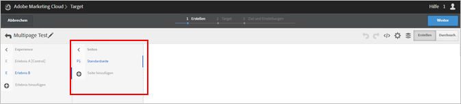

# Mehrseitige Aktivität{#multipage-activity}

Mit einer mehrseitigen Aktivität können Sie eine Story über mehrere Seiten erstellen, mit einem für die einzelnen Seiten spezifischen Design.

Sie möchten beispielsweise vielleicht ein Angebot für kostenlosen Versand bei Einkäufen über einem bestimmten Betrag testen. Dieses Angebot soll dann auf Ihrer Landingpage, einer Kategorieseite und bestimmten Produktseiten erscheinen, doch sie möchten es auf den verschiedenen Seitentypen in unterschiedlichen Größen und an unterschiedlichen Stellen haben. Sie könnten das Angebot auf Ihrer Startseite hervorheben und es mit kleineren Angeboten auf anderen relevanten Seiten verstärken.

Sie können eine mehrseitige Aktivität auch verwenden, um verschiedene Layouts für Ihren Desktop und nicht responsive Mobilgeräteseiten zu definieren. Wenn die Site eine separate mobile Site hat, z. B. [!DNL m.mysite.com] anstelle von [!DNL `www.mysite.com`], sollten Sie stattdessen eine [mehrseitige Aktivität](/help/c-experiences/c-visual-experience-composer/multipage-activity.md#concept_277E096063E14813AC5D8EDFA1D2ED48) erstellen, [!DNL m.mysite.com] als separate Seiten hinzufügen und dann die mobile Bearbeitung anwenden, um passende Änderungen an der Desktop-Version und der mobilen Version im selben Erlebnis vorzunehmen. Verwenden Sie für responsive mobile Sites die [Bearbeitung mobiler Erlebnisse](/help/c-experiences/c-visual-experience-composer/mobile-viewports.md#concept_8E45527C4ABC41D59AA3553BEDC76FA5).

>[!NOTE]
>
>Mehrseitige Aktivitäten wurden für Aktivitäten entwickelt, bei denen das gleiche Angebot auf mehreren Seiten unterschiedlich erscheint. Wenn das Angebot auf allen Seiten gleich angezeigt wird, ist ein [Vorlagentest](/help/c-experiences/c-visual-experience-composer/temtest.md#task_2539D51A18044F82B0D9895636546781) effizienter.

Sie können Vorlagenregeln für alle Seiten im mehrseitigen Test angeben. Sie können beispielsweise einen mehrseitigen Test auf der Startseite und allen Kategorieseiten ausführen, indem Sie Vorlagenregeln auf die Kategorieseite im mehrseitigen Test anwenden. Hier finden Sie [Gleiches Erlebnis auf ähnlichen Seiten](/help/c-experiences/c-visual-experience-composer/temtest.md#task_2539D51A18044F82B0D9895636546781).

So fügen sie einem Test Seiten hinzu:

1. Klicken Sie auf das Zahnradsymbol **[!UICONTROL Konfigurieren]**.
1. Klicken Sie auf **[!UICONTROL Weitere Seiten hinzufügen]**.

   Eine Navigationsleiste wird auf der linken Bildschirmseite angezeigt.

   

1. Geben Sie über diese Navigationsleiste Ihre Seiten an und legen Sie darüber die Standardseite fest.

   Klicken Sie auf **[!UICONTROL Seite hinzufügen]**, um eine weitere Seite hinzuzufügen.

   Klicken Sie auf das Symbol mit den drei vertikalen Ellipsen, um ein Aktionsmenü anzuzeigen:

   

   Mithilfe dieses Menüs können Sie Seiten umbenennen, einen Umleitungstest von innerhalb der mehrseitigen Aktivität aus durchführen oder die Seite löschen.

1. Verwenden Sie den Visual Experience Composer, um das Erscheinungsbild des Angebots auf den einzelnen Seiten zu entwickeln.

