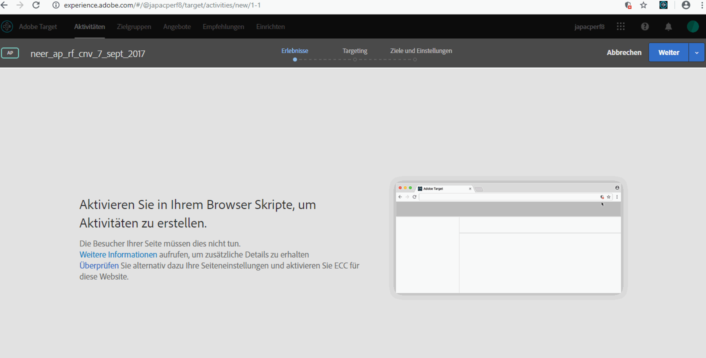

# Enabling mixed content in your browser{#enabling-mixed-content-in-your-browser}

Einige Browser blockieren die Anzeige einer Seite, wenn sicherer Inhalt mit unsicherem Inhalt gemischt wird.

Wenn Visual Experience Composer (VEC) versucht, eine Seite mit gemischtem Inhalt (sicherem und unsicherem) zu öffnen, wird eine Meldung mit einem Hinweis dazu angezeigt, wie Sie die Blockierung in Ihrem Browser deaktivieren, damit eine HTTP-Website oder eine Website mit gemischten Aufrufen (HTTPS und HTTP) geöffnet werden kann.

Zuvor konnten Sie, falls gemischte Inhalte unzulässig waren, in Schritt 1 des dreistufigen geführten Workflows beim Erstellen von Aktivitäten dennoch einige Aktionen ausführen. Von nun an blockiert Target Aktionen in Schritt 1. Wenn diese Meldung angezeigt wird, müssen Sie gemischte Inhalte aktivieren, bevor Sie den Vorgang fortsetzen.

Die Sicherheitseinstellungen Ihres Browsers verhindern möglicherweise, dass gemischter Inhalt oder unsicherer (HTTP-)Inhalt auf einer sicheren (HTTPS-)Seite oder in einem sicheren Frame (z. B. VEC) geladen wird. Wenn Sie die Sicherheitseinstellungen Ihres Browsers nicht deaktivieren möchten, benötigen Sie eine HTTPS-Website.

Wenn Ihre Website in einer unsicheren (HTTP-)Domäne betrieben wird, müssen Sie zulassen, dass VEC aktiven gemischten Inhalt lädt.

>[!NOTE]
>
>Die Zulassung von gemischten Inhalten wirkt sich nur auf VEC und nicht auf Ihre Live-Website aus.

Weitere Informationen finden Sie unter [Gemischte Inhalte](https://developer.mozilla.org/en-US/docs/Web/Security/Mixed_content) auf der *Mozilla-Entwicklernetzwerk* (MDN-)Website.

## Enabling mixed content in Google Chrome {#task_FF297A08F66E47A588C14FD67C037B3A}

Wenn Sie eine Seite über eine sichere Verbindung besuchen, verifiziert Google Chrome, dass der Inhalt auf der Webseite sicher übermittelt wurde.

Siehe [Diese Seite enthält unsichere Inhalte](https://support.google.com/chrome/answer/1342714?hl=en) in der Google Chrome-Hilfe.

### Schulungsvideo: VEC in Chrome Version 79.0.3945.117 oder höher aktivieren (Januar 2020)

Wenn Sie VEC mit der neuesten Version von Chrome (Version 79.0.3945.117 oder höher) verwenden, müssen Sie Ihre Site-Einstellungen aktualisieren. Besucher Ihrer Site müssen diese Schritte nicht ausführen.

>[!VIDEO](https://www.youtube.com/watch?v=6zGCi5Y8eVo)

Im obigen Video werden die erforderlichen Schritte beschrieben:

1. Klicken Sie auf das Sperren- oder Warnsymbol und dann auf Site-Einstellungen.

   

1. Blättern Sie zu Insecure-Inhalt und verwenden Sie dann die Dropdownliste, um Block (Standard) in Allow zu ändern.

   

1. Laden Sie die VEC-Seite neu.

## Enabling mixed content in Mozilla Firefox {#task_5448763B8DC941FD80F84041AEF0A14D}

Firefox blockiert standardmäßig Seiten, auf denen sicherer und unsicherer Inhalt gemischt ist. Es wird empfohlen, zur Verwendung von [!DNL Target] diese Einstellung dauerhaft zu ändern.

1. Geben Sie in Firefox `about:config` in die Adressleiste ein.
1. Quittieren Sie die in Firefox angezeigte Warnmeldung.
1. Geben Sie in die Suchleiste `block_active` ein.
1. Doppelklicken Sie auf ` **[!UICONTROL security.mixed_content.block_active_content]**`.

   Der Wert ändert sich von „true“ zu „false“. Wenn der Wert „false“ anzeigt, sind Sie fertig.  Es wird empfohlen, den Computer nach der Änderung dieser Einstellung neu zu starten.

## Enabling mixed content in Microsoft Internet Explorer {#task_59E7D13C04DF486C92CD78D0C63DDDE8}

Internet Explorer blockiert standardmäßig Seiten, auf denen sicherer und unsicherer Inhalt gemischt ist. Es wird empfohlen, zur Verwendung von Target diese Einstellung dauerhaft zu ändern.

1. Klicken Sie in Internet Explorer auf das Einstellungssymbol > **[!UICONTROL Internetoptionen]**.
1. Öffnen Sie die Registerkarte [!UICONTROL Sicherheit.]
1. Wählen Sie **[!UICONTROL Internet]**und klicken Sie dann auf**[!UICONTROL  Stufe anpassen]**.
1. Wählen Sie **[!UICONTROL Verschiedenes]**.
1. Aktivieren Sie unter [!UICONTROL Verschiedenes]**[!UICONTROL Gemischte Inhalte anzeigen]**.
1. Klicken Sie auf **[!UICONTROL OK]**>**[!UICONTROL  Ja]** > **[!UICONTROL Anwenden]**.

Es wird empfohlen, den Computer nach Änderung dieser Einstellung neu zu starten.

