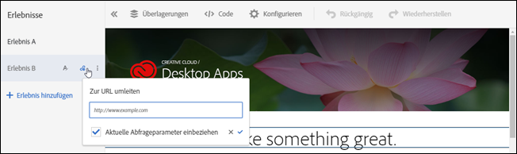

# Zu einer URL umleiten

Verwenden Sie die Option [!UICONTROL Zu URL] umleiten in [!DNL Adobe Target], wenn Sie den Besucher zu einer anderen Seite senden möchten, anstatt Inhalte auf derselben Seite anzuzeigen.

Es kann vorkommen, dass Sie zwei vollkommen verschiedene Seiten testen müssen, anstatt lediglich Inhaltselemente innerhalb einer Seite zu ändern. In diesem Fall vergleicht Ihr A/B-Test Seite A mit Seite B. Richten Sie eine A/B-Testkampagne mit zwei Erlebnissen ein: eines, das auf die Standardseite A verweist, und ein anderes, das auf die Seite B weiterleitet. Wählen Sie in der Registerkarte „Erlebnisaktion“, die Sie durch Klicken auf die Buchstabenbezeichnung für das Erlebnis finden, die Option **[!UICONTROL Zu URL umleiten]** aus und geben Sie die URL von Seite B an. Das Angebot wird so konfiguriert, dass der Besucher auf eine andere Seite umgeleitet wird.

Bei diesem Umleitungsangebot wird JavaScript-Code ausgeführt, um den Browser umzuleiten. Hierbei wird die Methode `window.location.replace();` verwendet, sodass die Seite, von der der Besucher umgeleitet wird, nicht im Browserverlauf gespeichert wird. Daher kann der Besucher die Zurück-Schaltfläche des Browsers wie gewohnt verwenden.

Für umgeleitete Angebote bestehen einige Begrenzungen:

* Für Umleitungsangebote in Aktivitäten mit A4T muss Ihre Implementation bestimmten Mindestanforderungen entsprechen. Darüber hinaus gibt es wichtige Informationen, die Sie benötigen. Weitere Informationen finden Sie unter [Umleitungsangebote – A4T-FAQ](/help/c-integrating-target-with-mac/a4t/r-a4t-faq/a4t-faq-redirect-offers.md#concept_21BF213F10E1414A9DCD4A98AF207905).
* Bei der Verwendung des formularbasierten Experience Composer sollten umgeleitete Angebote nicht in Mboxes verwendet werden, die Teil der Seite sind. Ein umgeleitetes Angebot sollte nur von einem Skript-Tag verwendet werden, das Teil des HTML-Codes `<head>` ist. Sie sollten stets die automatische Erstellung verwenden und das umgeleitete Angebot für die globale Mbox festlegen.

>[!NOTE]
>
>Wenn Sie den Referrer-Wert der Landingpage übergeben möchten, sollten Sie statt eines Umleitungsangebots ein HTML-Angebot verwenden.

So erstellen Sie ein Umleitungsangebot:

1. Erstellen Sie ein Erlebnis.
1. Halten Sie den Mauszeiger über ein Erlebnis und klicken Sie auf das Symbol für die Umleitung auf eine URL ().

   

1. Geben Sie die URL ein.
1. Falls gewünscht, wählen Sie die Option zur Einbeziehung der aktuellen Abfrageparameter.

   Wenn diese Option ausgewählt ist, wird alles, was nach dem ? in der URL des Besuchers steht, zum Zeitpunkt der Weiterleitung an die Weiterleitungs-URL des Besuchers angehängt.

   Diese Option ist standardmäßig ausgewählt.
1. Optional: Erstellen Sie zusätzliche Regeln.

   Zusätzliche Regeln können auf Folgendem basieren:

   * URL
   * Domäne
   * Pfad
   * Hashfragment (#)
   * Abfrage
   * Parameter „mbox“
   Zusätzliche Regeln können mithilfe von „AND“ oder „OR“ an die Aktivitäts-URL angefügt werden. Alle hinzugefügten Regeln werden per „AND“ miteinander verglichen.
