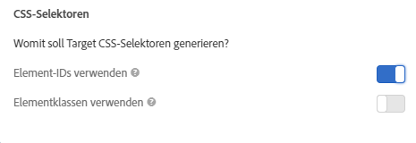

# Element-Selektoren, die im Visual Experience Composer verwendet werden{#element-selectors-used-in-the-visual-experience-composer}

Ein Element-Selektor ist ein CSS-Ausdruck, der eines oder mehrere Elemente kennzeichnen kann.

Grundlegende Informationen zu CSS-Selektoren finden Sie im Dokument [Selektoren](https://developer.mozilla.org/en-US/docs/Web/Guide/CSS/Getting_started/Selectors) im Mozilla Developer Network (MDN).

Sie können festlegen, ob Sie Elementklassen oder Element-IDs in Ihren Kontovoreinstellungen verwenden möchten. Klicken Sie auf **[!UICONTROL Administration > Visual Experience Composer]** und wählen Sie dann Ihre bevorzugten CSS-Selektoren aus.



>[!NOTE]
>
>Elementklassen sind als Selektoren in Aktivitäten mit A/B-Tests, automatisierter Personalisierung und Multivarianz-Tests verfügbar.

Informationen dazu, wann CSS-Selektoren und wann eindeutige IDs verwendet werden sollen, finden Sie unter [Best Practices und Einschränkungen von Visual Experience Composer](/help/c-experiences/c-visual-experience-composer/experience-composer-best-practices.md#concept_E284B3F704C04406B174D9050A2528A6).

## Wie Adobe Target einen Selektor für ein Element erstellt {#section_D89D954BCBFB486CA081BE183776A475}

Target verwendet zur Erstellung eines Selektors einen einfachen Algorithmus. Hier sehen Sie eine sehr kurze Erklärung der Erstellungslogik:

1. Wenn ein Element eine ID enthält, zum Beispiel `id="container"`, dann lautet der Name des Selektors für das Element `#container`.

   Beispiel:

   ```html
   <div class="wrapper">
     <div id="container"> <!-- Selector is computed for this element -->
       <ul class="navigation">
         <li class="item active"> Home </li>
         <li class="item"> Men </li>
         <li class="item"> Women </li>
         <li class="item"> Kids </li>
       </ul>
     </div>
   </div>
   ```

1. Wenn ein Element ein Klassenattribut enthält, versucht Target, die erste Klasse der im Element vorhandenen Klassen zu nutzen.

   Target versucht, das übergeordnete Element zu analysieren, bis es das `<HTML>`-Element oder ein Element mit einer ID findet. Wenn ein Element eine ID enthält und der Selektor auf Basis dessen untergeordneten Elements berechnet wird, trägt die ID dieses untergeordneten Elements zum Selektor bei.

   Beispiel:

   ```html
   <div class="wrapper">
     <div id="container"> <!-- id is present here. It contributes to selector -->
       <ul class="navigation">
         <li class="item active"> Home </li> <!-- Selector is computed for this element -->
         <li class="item"> Men </li>
         <li class="item"> Women </li>
         <li class="item"> Kids </li>
       </ul>
     </div>
   </div>
   ```

   In diesem Beispiel:

   Selektor: `#container` > `ul.navigation:eq(0)` > `li.item:eq(0)` („>“ gibt das unmittelbar untergeordnete Element an.)

   `eq` gibt für den Index an, dass es ein Element mit „tagName=UL“ gibt und die erste Klasse `navigation` lautet. Deshalb ist `index` = 0. Weitere Informationen finden Sie im Artikel [Selektoren](https://developer.mozilla.org/en-US/docs/Web/Guide/CSS/Getting_started/Selectors) im MDN.

1. Wenn ein Element keine Klasse enthält, verwendet Target den `tagName` für das Element und sucht aufwärts im übergeordneten Element, bis es ein `<HTML>`-Element oder ein Element mit einer ID findet.

   Beispiel:

   ```html
   <div class="wrapper">
     <div id="container"> <!-- id is present here. It contributes to selector -->
       <ul class="navigation">
         <li> Home </li>
         <li> Men </li>
         <li class="active"> Women </li>
         <li> Kids </li><!-- Selector is computed for this element -->
       </ul>
     </div>
   </div>
   ```

   Selektor: `#container` > `ul.navigation(0)` > `li:nth-of-type(4)`

   Weitere Informationen zu [nth-of-type finden Sie auf der Webseite „CSS-Tricks“](https://css-tricks.com/almanac/selectors/n/nth-of-type/).

Im oben dargestellten Prozess

* können Sie jeden beliebigen CSS-Selektor verwenden, solange er ein Element eindeutig im DOM identifiziert.
* Die oben genannte Vorgehensweise ist die von Target. Target schreibt diese Vorgehensweise jedoch nicht vor. Sie können jeden beliebigen Selektor hinzufügen, vorausgesetzt Punkt 1 ist zutreffend.
* Sie können jedes beliebige Attribut im Selektor verwenden. Dieses Dokument verwendet den Klassennamen nur als Beispiel.

