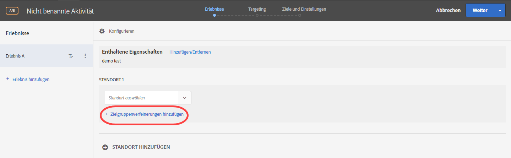
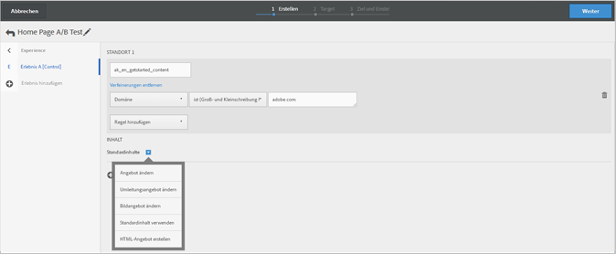
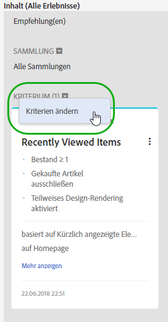
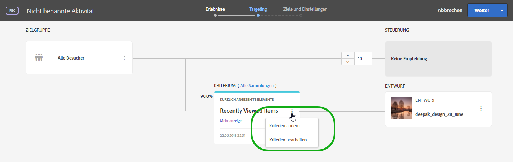

# Form-Based Experience Composer{#form-based-experience-composer}

Der formularbasierte Experience Composer ist eine Benutzeroberfläche, die die Erstellung nicht visueller Erlebnisse und Angebote ermöglicht. Diese Erlebnisse können in A/B-Tests, im Erlebnis-Targeting, in der automatisierten Personalisierung und in Recommendations-Aktivitäten genutzt werden, wenn der Visual Experience Composer nicht verfügbar oder unpraktisch in der Anwendung ist. So können Sie den formularbasierten Composer beispielsweise verwenden, um Erlebnisse und Angebote für E-Mails, Kiosks und Sprachassistenten zu erstellen.

Wenn Sie eine Recommendations-Aktivität erstellen, gibt es keine Erlebnisse. Wählen Sie Ihre Kriterien und Ihren Entwurf aus. Wenn Sie mehrere Kriterien oder Entwürfe auswählen, generiert Target automatisch die Erlebnisse.

1. Klicken Sie auf **[!UICONTROL Aktivität erstellen]** und wählen Sie dann den Typ der Aktivität aus, die Sie erstellen möchten.

   Der Form-Based Experience Composer ist für „A/B-Tests“, „Erlebnis-Targeting“, „Automatisierte Personalisierung“ und Recommendations-Aktivitäten verfügbar.
1. Wählen Sie **[!UICONTROL Form-Based Experience Composer]** im Dialogfeld [!UICONTROL Neue Aktivität].

   Der formularbasierte Experience Composer wird geöffnet.

   

   Dieser Bildschirm sieht anders aus, wenn Sie eine Recommendations-Aktivität erstellen. Recommendations-Aktivitäten schließen keine Erlebnisse ein.
1. Benennen Sie die Aktivität.
1. Wählen Sie einen Standort aus.

   When you click in the [!UICONTROL Select Location] box, a list of available locations appears. Wählen Sie einen dieser Standorte aus. Zur Auswahl des globalen Standorts, der über target.js bereitgestellt wurde, wählen Sie „target-global-mbox“.

   Sie können auch einen Standort eingeben, der hier nicht aufgelistet ist. Dies kann sich als nützlich erweisen, wenn die Mbox noch nicht erstellt oder auf einer Seite angezeigt wurde. Geben Sie den Namen des Orts ein. Seien Sie vorsichtig, wenn Sie einen Standort eingeben, der noch nicht vorhanden ist. Wenn die Schreibweise oder Groß-/Kleinschreibung nicht mit der Schreibweise oder Groß-/Kleinschreibung bei Mbox-Aufruf übereinstimmt, dann wird die Aktivität nicht bereitgestellt. Manually entered locations are saved to the list of available locations. Wenn Sie das nächste Mal versuchen, eine manuell eingegebene Position auszuwählen, ist diese in der Dropdown-Liste [!UICONTROL Standort] auswählen für diese Aktivität verfügbar.

   >[!NOTE]
   >
   >Beim Erstellen einer Aktivität wird durch das Erstellen eines manuell eingegebenen Speicherorts nicht automatisch ein neuer Speicherort erstellt. Der Ortsname wird nur im Kontext der Aktivität gespeichert. Der Speicherort wird erstellt, wenn ein Content Versand-Aufruf erfolgt. Nach der Erstellung des Speicherorts steht er für die Verwendung in anderen Aktivitäten, zum Erstellen von Audiencen usw. zur Verfügung. aus der Dropdown-Liste der verfügbaren Standorte.

1. Klicken Sie auf **[!UICONTROL Zielgruppenverfeinerungen hinzufügen]** und wählen Sie anschließend eine oder mehrere [Zielgruppen](../c-target/target.md#concept_A782F8481A5041EBA75103CB26376522) für diese Aktivität aus.

   

   Im Form-Based Experience Composer wurden Verfeinerungen durch die volle Zielgruppen-Funktionalität ersetzt. Verfeinerungen für vorhandene Aktivitäten wurden in  [Zielgruppen „Nur Aktivität“](../c-target/creating-activity-only-audience.md#concept_A6BADCF530ED4AE1852E677FEBE68483) migriert.
1. Wählen Sie den Inhaltstyp aus, der an diesem Standort angezeigt werden soll.

   

1. Geben Sie für den ausgewählten Content-Typ den Inhalt an.

   **HTML-Angebot ändern:** Wählen Sie ein HTML-Angebot.

   **Bildangebot ändern:** Wählen Sie ein in der Inhaltsbibliothek in Target gespeichertes Bild aus.

   Sie können außerdem einen Link zum Bild hinzufügen (Clickthrough, Ziel, Landing usw.)

   1. Klicken Sie auf [!UICONTROL Bildangebot ändern].
   1. Klicken Sie auf das gewünschte Bild und anschließend auf [!UICONTROL Links bearbeiten].
   1. Geben Sie die gewünschte URL oder Seite Ihrer Site an und klicken Sie auf [!UICONTROL Aktualisieren].

   **JSON-Angebot ändern:** Wählen Sie ein JSON-Angebot.

   **Erlebnisfragment ändern:** Wählen Sie ein Erlebnisfragment.

   **Umleitungsangebot ändern:** Wählen Sie ein Umleitungsangebote.

   **Remote-Angebot ändern:** Wählen Sie ein Remote-Angebot.

   **HTML-Angebot erstellen:**

   1. Klicken Sie auf [!UICONTROL Angebote] und wählen Sie anschließend die Registerkarte [!UICONTROL Code-Angebote] aus.
   1. Klicken Sie auf [!UICONTROL Erstellen] > [!UICONTROL HTML-Angebot].
   1. Geben Sie einen Angebotsnamen ein.
   1. Geben Sie im Feld „Code“ den HTML-Code ein oder kopieren Sie ihn dorthin.
   1. Klicken Sie auf [!UICONTROL Speichern].

   **JSON-Angebot erstellen:**

   1. Klicken Sie auf [!UICONTROL Angebote] und wählen Sie anschließend die Registerkarte [!UICONTROL Code-Angebote] aus.
   1. Klicken Sie auf [!UICONTROL Erstellen] > [!UICONTROL JSON-Angebot].
   1. Geben Sie einen Angebotsnamen ein.
   1. Schreiben Sie Ihren JSON-Code in das Feld „Code“ oder kopieren Sie ihn dorthin.
   1. Klicken Sie auf [!UICONTROL Speichern].

   Im Dropdownmenü „Inhalt“ finden Sie die Option „Empfehlung hinzufügen“ für eine Recommendations-Aktivität. Klicken Sie auf **[!UICONTROL Empfehlung hinzufügen]** und wählen Sie dann den Seitentyp aus. Folgen Sie den üblichen auf der Oberfläche angegebenen Schritten, um [eine Recommendations-Aktivität zu erstellen](/help/c-recommendations/t-create-recs-activity/create-recs-activity.md).

   Bei der Auswahl der Recommendations-Kriterien im formularbasierten Experience Composer gibt es jetzt einen direkten Link zur ausgewählten Kriterienkarte, damit Sie die Kriterien schnell und einfach bearbeiten können.

   

   Auf der Seite „Targeting“ des Drei-Schritte-Workflows zu Target:

   

1. (Optional, for AB activities, Automated Personalization, and Experience Targeting) To repeat this process for additional locations, click **[!UICONTROL Add Location]** and configure the location and content.
1. Click **[!UICONTROL Next]**, then complete the activity creation steps as usual for your activity type.

* [Erstellen eines A/B-Tests](../c-activities/t-test-ab/t-test-create-ab/test-create-ab.md#task_68C8079BF9FF4625A3BD6680D554BB72)
* [Erstellen einer Erlebnis-Targeting-Aktivität](../c-activities/t-experience-target/t-xt-create/xt-create.md#task_D6B3429AC31549E1A70EDF04B3DDC765)
* [Erstellen einer Recommendations-Aktivität](../c-recommendations/t-create-recs-activity/create-recs-activity.md#task_6874328773C64C44A73F0A130AD3F96F)

## Schulungsvideo: Form-Based Composer 

Im folgenden Video wird der Form-Based Experience Composer vorgeführt.

* Aktivität mithilfe von Form-Based Experience Composer erstellen
* Wann Form-Based Experience Composer und wann Visual Experience Composer verwendet werden sollte
* Verfeinerungen zur Ausrichtung auf einen Standort nutzen

>[!VIDEO](https://video.tv.adobe.com/v/17390)