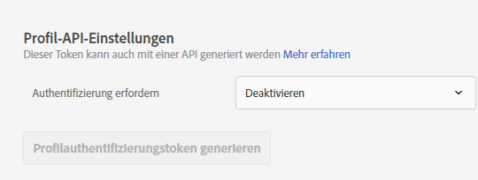
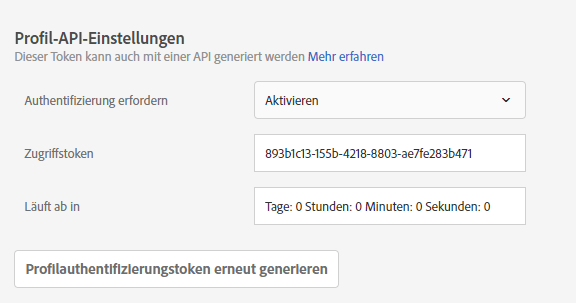

# Profil-API-Einstellungen

Aktivieren oder deaktivieren Sie die Authentifizierung für Batch-Aktualisierungen über Adobe Target APIs und generieren Sie ein Profil-Authentifizierungstoken.

[!DNL Adobe Target] erstellt und pflegt ein Profil für jeden individuellen Benutzer. This profile is stored on the [!DNL Target] edge cluster and is updated in real time after every visit; however, you can update a profile individually or in bulk via API.

Für noch mehr Sicherheit können Sie festlegen, dass beim API-Aufruf für die Massenaktualisierung ein gültiges Zugriffstoken im Header der Anforderung übergeben werden muss.

**So fordern Sie die Authentifizierung und so generieren Sie ein Zugriffstoken mithilfe der Target-Benutzeroberfläche:**

1. Klicken Sie auf **[!UICONTROL Administration]** > **[!UICONTROL Implementierung]**.
1. Schieben Sie unter **[!UICONTROL Profil-API]** den Umschalter **[!UICONTROL Authentifizierung]** erforderlich auf die aktivierte oder deaktivierte Position.

   

1. (Conditional) If you enabled authentication requirements, click **[!UICONTROL Generate New Profile Authentication Token]**.

   

   Das Token läuft gemäß der Angabe im Feld [!UICONTROL Läuft ab in] ab.

   Sie benötigen eine der folgenden Benutzerberechtigungen, um ein Authentifizierungstoken zu generieren:

   * Mindestens [!UICONTROL Editor] -Berechtigung (oder [!UICONTROL Genehmiger])

      Weitere Informationen für [!DNL Target Standard] Kunden finden Sie unter [Festlegen von Rollen und Berechtigungen](/help/administrating-target/c-user-management/c-user-management/user-management.md#roles-permissions) in *Benutzern*. Weitere Informationen für [!DNL Target Premium] Kunden finden Sie unter [Unternehmensberechtigungen](/help/administrating-target/c-user-management/property-channel/properties-overview.md)konfigurieren.

   * Administratorrolle auf der Profil-/Arbeitsbereich-Ebene

      Arbeitsbereiche stehen nur [!DNL Target Premium] Kunden zur Verfügung. For more information, see [Configure enterprise permissions](/help/administrating-target/c-user-management/property-channel/properties-overview.md).

   * Administratorrechte (Berechtigung &quot;Sysadmin&quot;) auf der [!DNL Adobe Target] Produktebene
   >[!NOTE]
   >
   >Sie können auch per API ein Profilauthentifizierungstoken generieren. Weitere Informationen finden Sie unter [Profile](https://developers.adobetarget.com/api/#profiles) auf der [Adobe Target-Entwickler-Website](https://developers.adobetarget.com/).

1. Kopieren Sie das Token und fügen Sie es im Header der Anforderung im folgenden Format ein: „Autorisierung“ : „Bearer“

Click [!UICONTROL Generate New Profile Authentication Token] to regenerate the token as needed.

>[!IMPORTANT]
>
>Wenn Sie dieses Token zurücksetzen, schlagen API-Aufrufe mit dem aktuellen Token fehl. Dies erfordert eine Aktualisierung von Skripten oder Apps, die dieses Token verwenden.
