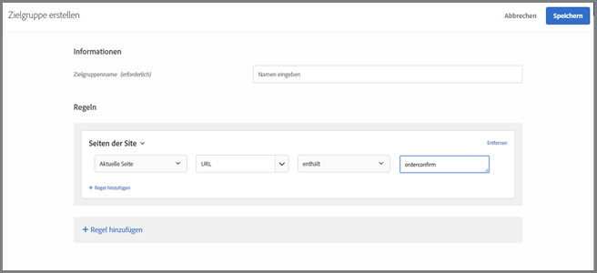
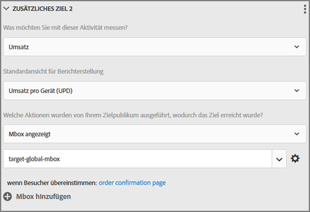

# Häufig gestellte Fragen zu globalen Mboxes{#global-mbox-frequently-asked-questions}

Liste der häufig gestellten Fragen zu globalen Mboxes.

## Kann ich mehrere globale Mboxes verwenden, wenn mein Target-Konto domänenübergreifend festgelegt ist? {#section_B7252BA6C3BB4EF4AE9E53F47FD58ABD}

Für Ihr Konto wird nur eine globale Mbox unterstützt.

Sie können den Ausführungsort Ihrer Aktivitäten beschränken, indem Sie Ihren Aktivitäten URL-Regeln hinzufügen. Weitere Informationen finden Sie unter [Gleiches Erlebnis auf ähnlichen Seiten](../../../c-experiences/c-visual-experience-composer/temtest.md#task_2539D51A18044F82B0D9895636546781).

Sie können auch einen Parameter auf der Seite mit [targetpageparams übergeben](/help/c-implementing-target/c-implementing-target-for-client-side-web/targetpageparams.md) und dann diese Parameter im Abschnitt &quot;URL konfigurieren&quot; im [!UICONTROL Visual Experience Composer] (VEC) auswählen oder indem Sie die Parameter im Form-Based Experience Composer als&quot; Verfeinerungen&quot; hinzufügen.

## Wie übergebe ich Umsatzdaten an eine globale Target-Mbox? {#section_17AEA933BADA4D169CCEDF5833C41306}

Zum Sammeln von Umsatz- und Auftragsinformationen in der target-global-mbox müssen „mbox-Parameter“ an Target gesendet werden. Bei diesen Parametern handelt es sich um Name/Wert-Paare, die zum Senden weiterer Informationen an Target verwendet werden. Target sucht diese Parameter (reservierte Namen) automatisch, um Umsatzdaten aufzufüllen.

Für die `orderConfirmPage` sollten Sie `orderTotal`, `orderId` und `productPurchasedId` weitergeben. Weitere Informationen finden Sie unter [Erstellen einer Mbox für Auftragsbestätigungen – mbox.js](../../../c-implementing-target/c-implementing-target-for-client-side-web/t-mbox-download/orderconfirm-create.md#task_0036D5F6C062442788BB55E872816D82).

Dieselben Parameter müssen an die target-global-mbox via `targetPageParams()` gesendet werden. Weitere Informationen finden Sie unter [Übergeben von Parametern an eine globale Mbox](../../../c-implementing-target/c-implementing-target-for-client-side-web/t-mbox-download/c-understanding-global-mbox/pass-parameters-to-global-mbox.md#concept_33362A04146C4E3C8E7089B65F38B5E5).

Sie sollten dem Konversionsteil auch ein Targeting hinzufügen, sodass Target nur dann Konversionen für die target-global-mbox zählt, wenn die Auftragsbestätigungsseite angezeigt wurde, wie unten dargestellt:

Der oben abgebildete Abschnitt „Webseiten“ enthält die folgenden Auswahlmöglichkeiten: „Aktuelle Seite“, „URL“, „contains“, „orderconfirm“.

Die Optionen in der oben gezeigten Abbildung umfassen die folgenden Einstellungen:

* **Was möchten Sie mit dieser Aktivität messen:** Umsatz
* **Standardansicht für Berichte:** Umsatz pro Besucher
* **Welche Aktion hat Ihre Zielgruppe ausgeführt, um anzugeben, dass Ihr Ziel erreicht wurde?** Anzeige einer mbox, target-global-mbox