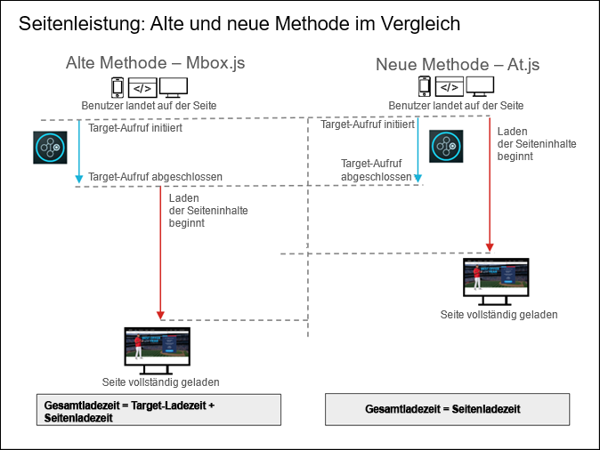

# Häufig gestellte Fragen zu „at.js“{#at-js-frequently-asked-questions}

Antworten auf häufig zu „at.js“ gestellten Fragen

## Welche Vorteile hat die Verwendung von at.js gegenüber mbox.js? {#section_FE30D01A577C46ACB0F787B85F5E0F6B}

Obwohl [!DNL at.js] [!DNL mbox.js] ersetzt, wird [!DNL mbox.js] weiterhin unterstützt. Für die meisten Benutzer birgt [!DNL at.js] allerdings mehr Vorteile als [!DNL mbox.js].

Neben anderen Vorteilen sorgt [!DNL at.js] für kürzere Ladezeiten von Seiten bei Webimplementierungen, bessere Sicherheit und bessere Implementierungsoptionen für Einzelseiten-Apps.

Im folgenden Diagramm wird die Seitenladeleistung von mbox.js und at.js verglichen.



Wie oben gezeigt werden Seiteninhalte bei der Verwendung von mbox.js erst geladen, wenn der Aufruf von [!DNL Target] abgeschlossen wurde. Bei der Verwendung von at.js werden Seiteninhalte schon geladen, wenn der Aufruf von [!DNL Target] eingeleitet wird, nicht erst nach Abschluss des Vorgangs.

## Wie wirkt sich at.js und mbox.js auf Seitenladezeiten aus? {#page-load}

Viele Kunden und Berater möchten wissen, wie sich [!DNL at.js] und [!DNL mbox.js] auf die Seitenladezeit auswirken, insbesondere beim Vergleich neuer Besucher mit zurückkehrenden Besuchern. Leider ist es schwierig, zu messen, wie sich [!DNL at.js] oder [!DNL mbox.js] auf die Seitenladezeit auswirken und genaue Zahlen dazu zu nennen. Das liegt an den Implementationen der einzelnen Kunden.

Wenn die Besucher-API jedoch auf der Seite vorhanden ist, ermöglicht uns das ein besseres Verständnis darüber, wie sich [!DNL at.js] und [!DNL mbox.js] auf die Seitenladezeit auswirken.

>[!NOTE]
>
>Die Besucher-API und [!DNL at.js] oder [!DNL mbox.js] wirken sich nur dann auf die Seitenladezeit aus, wenn Sie die globale Mbox verwenden (das liegt an der Technik, mit der der Haupttext ausgeblendet wird). Regionale Mboxes sind von der Besucher-API-Integration nicht betroffen.

In den folgenden Abschnitten wird die Aktionssequenz für neue und zurückkehrende Besucher beschrieben:

### Neue Besucher

1. Die Besucher-API ist geladen und analysiert und wird ausgeführt.
1. at.js/mbox.js ist geladen und analysiert und wird ausgeführt.
1. Wenn die automatische Erstellung der globalen Mbox aktiviert ist, wird die Target JavaScript-Bibliothek Folgendes tun:

   * Sie wird das Besucher-Objekt instanziieren.
   * Die Target-Bibliothek versucht, Experience Cloud-Besucher-ID-Daten abzurufen.
   * Weil es sich um einen neuen Besucher handelt, versendet die Besucher-API eine domänenübergreifende Anfrage an demdex.net.
   * Nachdem die Experience Cloud-Besucher-ID-Daten abgerufen wurden, wird eine Anfrage an Target gesendet.

### Zurückkehrende Besucher

1. Die Besucher-API ist geladen und analysiert und wird ausgeführt.
1. at.js/mbox.js ist geladen und analysiert und wird ausgeführt.
1. Wenn die automatische Erstellung der globalen Mbox aktiviert ist, wird die Target JavaScript-Bibliothek Folgendes tun:

   * Sie wird das Besucher-Objekt instanziieren.
   * Die Target-Bibliothek versucht, Experience Cloud-Besucher-ID-Daten abzurufen.
   * Die Besucher-API ruft Cookie-Daten ab.
   * Nachdem die Experience Cloud-Besucher-ID-Daten abgerufen wurden, wird eine Anfrage an Target gesendet.

>[!NOTE]
>
>Wenn die Besucher-API vorhanden ist, muss Target bei neuen Besuchern mehrfach über die Verbindung gehen, um sicherzustellen, dass Target-Anfragen die Daten der Experience Cloud-Besucher-ID enthalten. Bei zurückkehrenden Besuchern geht Target nur über die Verbindung, um den personalisierten Inhalt in Target abzurufen.

## Warum sind die Antwortzeiten nach einem Upgrade von einer vorherigen Version von at.js auf Version 1.0.0 scheinbar langsamer? {#section_DFBA5854FFD142B49AD87BFAA09896B0}

Bei [!DNL at.js] der Version 1.0.0 und höher werden alle Anforderungen parallel ausgelöst. In den vorherigen Versionen werden die Anforderungen sequenziell ausgeführt, d. h., die Anforderungen werden in eine Warteschlange verschoben, und Target wartet auf den Abschluss der ersten Anforderung, bevor der Vorgang mit der nächsten Anforderung fortgesetzt wird.

Die Art der Ausführung von Anforderungen in früheren Versionen von [!DNL at.js] unterliegt dem sogenannten „Head of Line Blocking“. In [!DNL at.js] 1.0.0 und höher ist Target zu der parallelen Anforderungsausführung gewechselt.

Wenn Sie sich beispielsweise das Wasserfallmodell der Netzwerkregisterkarte für [!DNL at.js] 0.9.1 ansehen, werden Sie feststellen, dass die nächste Target-Anforderung erst gestartet wird, nachdem die vorherige fertiggestellt wurde. Bei [!DNL at.js] 1.0.0 und höher ist dies nicht der Fall. Dort beginnen alle Anforderungen im Grunde genommen zu derselben Zeit.

Aus Sicht der Antwortzeit kann dies mathematisch wie folgt betrachtet werden:

<ul class="simplelist"> 
 <li> at.js 0.9.1: Antwortzeit aller Target-Anforderungen = Summe der Antwortzeit der Anforderungen </li> 
 <li> at.js 1.0.0 und höher: Antwortzeit aller Target-Anforderungen = Maximum der Antwortzeit der Anforderungen </li> 
</ul>

Wie Sie sehen, schließt [!DNL at.js] 1.0.0 die Anforderungen schneller ab. Zudem laufen [!DNL at.js]-Anforderungen asynchron, sodass Target das Rendern der Seiten nicht blockiert. Selbst wenn der Abschluss von Anforderungen mehrere Sekunden dauert, wird die gerenderte Seite angezeigt. Lediglich einige Teile der Seite bleiben leer, bis Target eine Antwort vom Target Edge erhält.

## Kann ich die Target-Bibliothek asynchron laden? {#section_AB9A0CA30C5440C693413F1455841470}

In at.js 1.0.0 kann die Target-Bibliothek asynchron geladen werden.

So laden Sie at.js asynchron:

* Die empfohlene Vorgehensweise erfolgt über einen Tag-Manager wie Adobe Launch oder Adobe Dynamic Tag manager (DTM). See the [Add Adobe Target](https://experienceleague.adobe.com/docs/experience-cloud/implementing-in-websites-with-launch/implement-solutions/target.html) lesson of the [Implementing the Experience Cloud in Websites with Launch](https://experienceleague.adobe.com/docs/experience-cloud/implementing-in-websites-with-launch/index.html) tutorial for more information.
* Sie können at.js auch asynchron laden, indem Sie dem Skript-Tag zum Laden von at.js das asynchrone Attribut hinzufügen. Sie sollten Folgendes verwenden:

   ```
   <script src="<URL to at.js>" async></script>
   ```

* Sie können at.js auch mithilfe dieses Codes asynchron laden:

   ```
   var script = document.createElement('script'); 
   script.async = true; 
   script.src = "<URL to at.js>"; 
   document.head.appendChild(script);
   ```

Das asynchrone Laden von at.js eignet sich hervorragend, um zu verhindern, dass das Rendern des Browsers blockiert wird. Bei dieser Technik kann es jedoch zu Flackereffekten auf der Webseite kommen.

Sie können ein Flackern vermeiden, indem Sie ein vor-ausgeblendetes Snippet verwenden, das die Seite (oder bestimmte Teile) ausblendet und diese dann nach at.js einblendet und die globale Anfrage vollständig geladen hat. Der Ausschnitt muss vor dem Laden von at.js hinzugefügt werden.

If you are deploying at.js through an asynchronous Launch implementation, be sure to include the pre-hiding snippet directly on your pages, before the Launch Embed code, as described in the [Add the Target Pre-Hiding Snippet](https://experienceleague.adobe.com/docs/experience-cloud/implementing-in-websites-with-launch/implement-solutions/target.html#add-the-target-pre-hiding-snippet) section of the [Implementing the Experience Cloud in Websites with Launch tutorial](https://experienceleague.adobe.com/docs/experience-cloud/implementing-in-websites-with-launch/index.html).

Wenn Sie at.js über eine synchrone DTM-Implementierung bereitstellen, kann das vor-ausgeblendete Snippet über eine Seitenladeregel hinzugefügt werden, die oben auf der Seite ausgelöst wird.

Weitere Informationen finden Sie unter [Verwaltung von Flackern mit „at.js“](/help/c-implementing-target/c-implementing-target-for-client-side-web/c-how-atjs-works/manage-flicker-with-atjs.md).

## Ist „at.js“ mit der Integration von Adobe Experience Manager (AEM) kompatibel?{#section_6177AE10542344239753764C6165FDDC}

[!DNL Adobe Experience Manager] 6.2 mit FP-11577 (oder neuer) unterstützt jetzt [!DNL at.js]-Implementierungen mit der [!UICONTROL Adobe Target Cloud Services]-Integration. Weitere Informationen finden Sie unter [Feature Packs](https://docs.adobe.com/docs/en/aem/6-2/release-notes/feature-packs.html) und [Integrieren mit Adobe Target](https://docs.adobe.com/docs/en/aem/6-2/administer/integration/marketing-cloud/target.html) in der Dokumentation zu *Adobe Experience Manager 6.2*.

## Wie kann ich mit at.js{#section_4D78AAAE73C24E578C974743A3C65919} ein Flackern beim Laden von Seiten verhindern ?

Mit Target wird das Flackern beim Laden von Seiten auf verschiedenen Wegen vermieden: Weitere Informationen finden Sie unter  [Verwaltung von Flackern mit „at.js“](/help/c-implementing-target/c-implementing-target-for-client-side-web/c-how-atjs-works/manage-flicker-with-atjs.md#concept_AA168574397D4474B993EEAB90865EBA).

## Wie groß ist at.js? {#section_6A25C9A14C66441785A7635FEF5C4475}

Die at.js-Datei hat beim Download eine Größe von etwa 109 KB. Da die meisten Server Dateien jedoch automatisch komprimieren, um die Dateigröße zu verringern, ist at.js bei Komprimierung (mit GZIP oder einer ähnlichen Anwendung) auf dem Server etwa 34 KB groß und wird in dieser Größe auch geladen, wenn Benutzer Ihre Webseite besuchen. Die Komprimierungseinstellungen des Servers, auf dem at.js installiert ist, bestimmen die tatsächliche Größe der Datei.

## Warum ist at.js größer als mbox.js? {#section_AA1C43897E46448FA3E26EEC10ED7E51}

at.js-Implementierungen verwenden nur eine Bibliothek ([!DNL at.js]), während bei mbox.js-Implementierungen zwei Bibliotheken ([!DNL mbox.js] und [!DNL target.js]) zum Einsatz kommen. Es wäre also gerechter, at.js mit mbox.js *und* `target.js` zu vergleichen. Beim Vergleich der komprimierten Größen der beiden Versionen ist ersichtlich, dass die at.js-Version 1.2 34 KB groß ist und die mbox.js-Version 63 eine Größe von 26,2 KB hat. ``

at.js ist deshalb größer, weil im Vergleich zu mbox.js deutlich mehr DOM-Parsing durchgeführt wird. Dies ist erforderlich, da at.js „Rohdaten“ in der JSON-Antwort erhält und diese zunächst verarbeiten muss. mbox.js verwendet `document.write()`, das Parsing wird vom Browser übernommen.

Trotz der größeren Datei zeigen unsere Tests, dass Seiten mit at.js schneller geladen werden als Seiten mit mbox.js. Zudem bietet at.js eine höhere Sicherheit, da keine zusätzlichen dynamischen Dateien geladen werden und `document.write` nicht benötigt wird.

## Enthält at.js jQuery? Kann ich diese Komponente von „at.js“ löschen, wenn ich jQuery bereits auf meiner Website verwende? {#section_E4604E46E7B34460B8DD6A78D9B476F9}

at.js arbeitet derzeit mit Teilen von jQuery, deshalb wird Ihnen oben in at.js der MIT-Lizenzhinweis angezeigt. jQuery wird nicht ausgelöst und die Bibliothek übt keinen Einfluss auf die bereits auf Ihrer Seite eingebettete jQuery-Bibliothek aus, bei der es sich möglicherweise um eine andere Version handelt. Der jQuery-Code in at.js lässt sich nicht löschen.

## Unterstützt „at.js“ Safari und domänenübergreifende Einstellungen, die als „nur x“ eingestellt sind? {#section_114EC271A6E045E1B2183B66F1B71285}

Nein, ist die domänenübergreifende Einstellung auf „nur x“ festgelegt und sind Drittanbieter-Cookies in Safari deaktiviert, setzen sowohl [!DNL mbox.js] als auch at.js ein deaktiviertes Cookie und es werden für diese Kundendomäne keine Mbox-Abfragen ausgeführt.

Sollen Safari-Besucher unterstützt werden, wäre eine bessere X-Domäne „deaktiviert“ (setzt nur ein Erstanbieter-Cookie) oder „aktiviert“ (setzt in Safari nur ein Erstanbieter-Cookie, während in anderen Browsern Erst- und Drittanbieter-Cookies gesetzt werden).

## Kann ich at.js und mbox.js nebeneinander laden? {#section_4DCAF38DBAEB430CA486FAEFAE0E0A29}

Nicht auf derselben Seite. Während der Implementierung und dem Testen von [!DNL at.js] können Sie jedoch [!DNL at.js] auf einigen Seiten und [!DNL mbox.js] auf anderen Seiten ausführen, bis Sie [!DNL at.js] vollständig validiert haben.

## Kann ich den Visual Experience Composer von Target in meinen Einzelseiten-Apps verwenden? {#section_459C1BEABD4B4A1AADA6CF4EC7A70DFB}

Ja. Sie können VEC für Ihre SPA benutzen, wenn Sie at.js 2.x verwenden. Weitere Informationen finden Sie unter [Visual Experience Composer (VEC) für Einzelseiten-Apps (SPAs)](/help/c-experiences/spa-visual-experience-composer.md).

## Kann ich den Adobe Experience Cloud-Debugger für at.js-Implementierungen verwenden? {#section_FF3CF4C5FD2F4DB1BF1A6B39DA161637}

Ja. Sie können außerdem mboxTrace für das Debugging oder die Entwicklerwerkzeuge Ihres Browsers verwenden und zum Isolieren von Mbox-Aufrufen nach „mbox“ filtern, um die Netzwerkanforderungen zu analysieren.

## Kann ich mit at.js{#section_8E31D2E8A27642098934D7DACFB2A600} Sonderzeichen in meinen Mbox-Namen verwenden ?

Ja, genau wie bei mbox.js.

## Warum werden meine Mboxes nicht auf meinen Webseiten ausgelöst? {#section_4BA5DA424B734324AAB51E4588FA50F5}

Target-Kunden verwenden mitunter Cloud-basierte Instanzen mit [!DNL Target] zum Testen oder für einfache Machbarkeitsprüfungen. Diese Domänen sind neben vielen anderen Teil der [öffentlichen Suffix-Liste](https://publicsuffix.org/list/public_suffix_list.dat).

Modere Browser speichern keine Cookies, wenn Sie diese Domänen verwenden - es sei denn, Sie passen die Einstellung `cookieDomain` mit targetGlobalSettings() an. Weitere Informationen finden Sie unter [Verwenden Cloud-basierter Instanzen mit Target](/help/c-implementing-target/c-implementing-target-for-client-side-web/c-target-debugging-atjs/targeting-using-cloud-based-instances.md#concept_A2077766948F4EA081CE592D8998F566).

## Können IP-Adressen bei der Verwendung von at.js als Cookie-Domäne dienen? {#section_8BEEC91A3410459D9E442840A3C88AF7}

Ja, wenn Sie [at.js, Version 1.2 oder neuer](/help/c-implementing-target/c-implementing-target-for-client-side-web/target-atjs-versions.md#reference_DBB5EDB79EC44E558F9E08D4774A0F7A) verwenden. Es wird jedoch dringend empfohlen, immer die neueste Version zu verwenden.

>[!NOTE]
>
>Die folgenden Beispiele sind nicht notwendig, wenn Sie at.js der Version 1.2 oder neuer verwenden.

Abhängig davon, wie Sie [targetGlobalSettings](/help/c-implementing-target/c-implementing-target-for-client-side-web/targetgobalsettings.md) verwenden, müssen Sie möglicherweise weitere Änderungen am Code vornehmen, nachdem Sie at.js heruntergeladen haben. Benötigen Sie beispielsweise etwas voneinander abweichende Einstellungen für Ihre Implementierungen von [!DNL Target] auf verschiedenen Websites und konnten Sie diese Einstellungen nicht dynamisch mit JavaScript festlegen, nehmen Sie diese Anpassungen manuell vor, nachdem Sie die Datei heruntergeladen haben und bevor Sie sie auf der entsprechenden Website hochladen.

In den folgenden Beispielen können Sie die at.js-Funktion `targetGlobalSettings()` zum Einfügen eines Code-Ausschnitts verwenden, um IP-Adressen zu unterstützen:

Dieses Beispiel betrifft eine einzelne IP-Adresse:

```
if (window.location.hostname === '123.456.78.9') { 
    window.targetGlobalSettings = window.targetGlobalSettings || {}; 
    window.targetGlobalSettings.cookieDomain = window.location.hostname; 
}
```

Dieses Beispiel betrifft einen IP-Adressbereich:

```
if (/^123\.456\.78\..*/g.test(window.location.hostname)) { 
    window.targetGlobalSettings = window.targetGlobalSettings || {}; 
    window.targetGlobalSettings.cookieDomain = window.location.hostname; 
}
```

## Warum werden mir Warnhinweise wie zum Beispiel „Aktionen mit fehlenden Selektoren“ angezeigt?  {#section_C36BED5B16634361A1BA46FCB731489D}

Diese Nachrichten stehen in keiner Verbindung zur [!DNL at.js]-Funktionalität. Die [!DNL at.js]-Bibliothek versucht, alles zu melden, das nicht im DOM zu finden ist.

Nachfolgend finden Sie mögliche Grundursachen für diesen Warnhinweis:

* Die Seite wird dynamisch erstellt und at.js kann das Element nicht finden.
* Die Seite wird langsam erstellt (aufgrund eines langsamen Netzwerks) und at.js kann den Selektor im DOM nicht finden.
* Die Seitenstruktur, auf der diese Aktivität ausgeführt wird, wurde geändert. Wenn Sie die Aktivität erneut im Visual Experience Composer (VEC) öffnen, sollte Ihnen ein Warnhinweis angezeigt werden. Sie sollten die Aktivität aktualisieren, damit alle erforderlichen Elemente gefunden werden können.
* Die zugrundeliegende Seite ist Teil einer Einzelseiten-App (SPA) oder die Seite enthält Elemente, die weiter unten auf der Seite auftauchen und der „Selektor-Polling-Mechanismus“ von [!DNL at.js] kann diese Elemente nicht finden. Es ist unter Umständen hilfreich, den `selectorsPollingTimeout` zu erhöhen. Weitere Informationen finden Sie unter [targetGlobalSettings()](/help/c-implementing-target/c-implementing-target-for-client-side-web/targetgobalsettings.md).
* Eine beliebige Klick-Tracking-Metrik versucht, sich zu jeder Seite hinzuzufügen, unabhängig von der URL, in der die Metrik eingerichtet wurde. Diese Situation ist zwar harmlos, hat aber viele dieser Warnhinweise zur Folge.

   Um die bestmöglichen Ergebnisse zu erzielen, sollten Sie die aktuellste Version von [!DNL at.js] herunterladen und verwenden. Weitere Informationen finden Sie unter [„at.js“-Versionsdetails](/help/c-implementing-target/c-implementing-target-for-client-side-web/target-atjs-versions.md#reference_DBB5EDB79EC44E558F9E08D4774A0F7A) und [Herunterladen von „at.js“](/help/c-implementing-target/c-implementing-target-for-client-side-web/how-to-deployatjs/implementing-target-without-a-tag-manager.md#concept_1E1F958F9CCC4E35AD97581EFAF659E2).

## Was ist die Domain tt.omtrdc.net, zu der die Aufrufe des Target-Servers gehen? {#section_999C29940E8B4CAD8A957A6B1D440317}

[!DNL tt.omtrdc.net] ist der Domainname für das EDGE-Netzwerk von Adobe, mit dem alle Server-Aufrufe für Target empfangen werden.

## Warum verwenden at.js und mbox.js nicht die Cookie-Flags „HttpOnly“ und „Secure“?{#section_74527E3B41B54B0A83F217C3E664ED1F}

„HttpOnly“ kann nur über Server-seitigen Code festgelegt werden. Target-Cookies, wie z. B. Mbox, werden über JavaScript-Code erstellt und gespeichert. Target kann das Cookie-Flag „HttpOnly“ also nicht verwenden.

„Secure“ kann nur über JavaScript festgelegt werden, wenn die Seite mit HTTPS geladen wurde. Wenn die Seite nur mit HTTP geladen wird, kann JavaScript dieses Flag nicht festlegen. Darüber hinaus ist das Cookie bei der Verwendung des Flags „Secure“ nur auf HTTPS-Seiten verfügbar.

Damit Target Benutzer richtig verfolgen kann – und weil Cookies Client-seitig generiert werden –, verwendet Target keines dieser Flags.

## Wie oft sendet at.js Netzwerkanfragen?  {#section_57C5235DF7694AF093A845D73EABADFD}

Die gesamte Entscheidungsfindung von Adobe Target findet Server-seitig statt. Das bedeutet, dass at.js jedes Mal, wenn die Seite neu geladen oder eine öffentliche at.js-API aufgerufen wird, eine Netzwerkanfrage gesendet wird.

## Können wir im besten Fall davon ausgehen, dass Benutzer durch das Ausblenden, Ersetzen und Wiedereinblenden von Inhalten keine Beeinträchtigung der Seitenladezeit bemerken werden? {#section_CB3C566AD61F417FAC0EC5AC706723EB}

at.js vermeidet das Vorab-Ausblenden des HTML-Bodys oder anderer DOM-Elemente über einen längeren Zeitraum, dies ist jedoch von den Netzwerkbedingungen und der Aktivitätseinrichtung abhängig. at.js bietet [Einstellungen](/help/c-implementing-target/c-implementing-target-for-client-side-web/targetgobalsettings.md), mit denen Sie den CSS-Style zum Ausblenden des Bodys anpassen können, um nicht den gesamten HTML-Body, sondern nur bestimmte Teile der Seite auszublenden. Hierbei wird erwartet, dass diese Teile DOM-Elemente enthalten, die „personalisiert“ werden müssen.

## Wie lautet die Reihenfolge der Ereignisse in einem durchschnittlichen Szenario, in dem sich ein Benutzer für eine Aktivität qualifiziert?  {#section_56E6F448E901403FB77DF02F44C44452}

Bei der at.js-Anfrage handelt es sich um eine asynchrone `XMLHttpRequest`, weshalb wir folgende Schritte ausführen:

1. Die Seite wird geladen.
1. at.js blendet den HTML-Body vorab aus. Es gibt eine Einstellung, mit der sich anstelle des gesamten HTML-Bodys nur ein bestimmter Container ausblenden lässt.
1. Die at.js-Anfrage wird gesendet.
1. Nachdem die Target-Antwort eingegangen ist, extrahiert Target die CSS-Selektoren.
1. Mit den CSS-Selektoren erstellt Target STYLE-Tags, um die anzupassenden DOM-Elemente vorab auszublenden.
1. Der STYLE zum Vorab-Ausblenden des HTML-Bodys wird entfernt.
1. Target beginnt mit dem Abrufen der DOM-Elemente.
1. Wenn ein DOM-Element gefunden wird, wendet Target DOM-Änderungen an und der STYLE zum Vorab-Ausblenden des Elements wird entfernt.
1. Wenn keine DOM-Elemente gefunden werden, werden durch ein globales Timeout alle Elemente eingeblendet, um Seitenfehler zu verhindern.

## Wie oft war der Seiteninhalt vollständig geladen und sichtbar, wenn at.js das Element, das durch die Aktivität geändert wird, zum letzten Mal einblendet? {#section_01AFF476EFD046298A2E17FE3ED85075}

Wie oft war der Seiteninhalt im oben aufgeführten Szenario vollständig geladen und sichtbar, wenn at.js das Element, das durch die Aktivität geändert wird, zum letzten Mal einblendet? Anders ausgedrückt: Die Seite ist vollständig sichtbar, ausgenommen der Aktivitätsinhalt, der kurz nach dem anderen Inhalt eingeblendet wird.

at.js blockiert nicht das Seiten-Rendering. Benutzer bemerken möglicherweise leere Bereiche auf der Seite, an denen sich die von Target angepassten Elemente befinden. Wenn der anzuwendende Inhalt nicht viele Remote-Assets, wie z. B. Skripte oder Bilder, enthält, wird alles schnell dargestellt.

## Wie wirkt sich eine vollständig zwischengespeicherte Seite auf das oben aufgeführte Szenario aus? Ist es in diesem Fall wahrscheinlicher, dass der Aktivitätsinhalt merklich nach dem Rest des Seiteninhalts geladen wird?  {#section_CE76335A3E0B41CB8253DEE5E060FCDA}

Wenn eine Seite in einem CDN gespeichert ist, das sich nahe am Standort des Benutzers, aber nicht in der Nähe der Target-Edge befindet, erlebt dieser Benutzer möglicherweise Verzögerungen. Target-Edges sind jedoch über die ganze Welt verteilt, sodass dies in der Regel kein Problem darstellt.

## Ist es möglich, ein Hero-Bild anzuzeigen, das nach kurzer Verzögerung ersetzt wird?  {#section_C25B07B25B854AAE8DEE1623D0FA62A3}

Stellen Sie sich folgendes Szenario vor:

Das Target-Timeout beträgt fünf Sekunden. Ein Benutzer lädt eine Seite, die eine Aktivität zum Anpassen des Hero-Bilds aufweist. at.js sendet die Anfrage, um zu bestimmen, ob eine Aktivität angewendet werden muss, die erste Antwort bleibt jedoch aus. Wir können also davon ausgehen, dass der Benutzer den regulären Inhalt des Hero-Bilds sieht, da keine Antwort von Target zu etwaigen anzuwendenden Aktivitäten eingegangen ist. Nach vier Sekunden gibt Target eine Antwort mit den Aktivitätsinhalten zurück.

Ist es zu diesem Zeitpunkt möglich, dass die alternative Version angezeigt wird? Nach vier Sekunden könnte das Hero-Bild also ausgetauscht werden. Würde der Benutzer diesen Austausch bemerken?

Das Hero-DOM-Element ist zu Beginn ausgeblendet. Nachdem eine Antwort von Target eingeht, wendet at.js die DOM-Änderungen an, wie z. B. die IMG-Änderung und die Anzeige des angepassten Hero-Bilds.

## Welcher HTML-Doctype ist für at.js erforderlich?

at.js erfordert den Doctype HTML 5.

Diese Syntax lautet:

`<!DOCTYPE html>`

Der Doctype HTML 5 stellt sicher, dass die Seite im Standardmodus geladen wird. Beim Laden im Quirks-Modus sind einige JS-APIs, von denen at.js abhängig ist, deaktiviert. Target deaktiviert at.js im Quirks-Modus.
