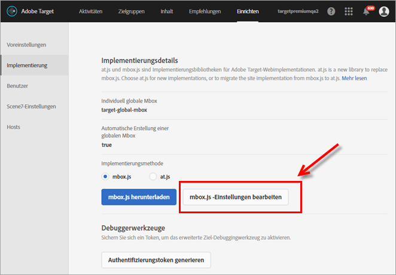
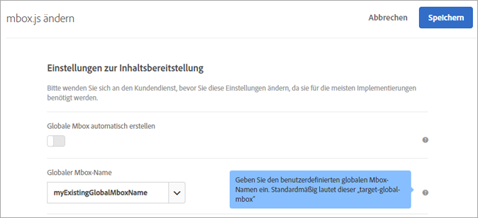
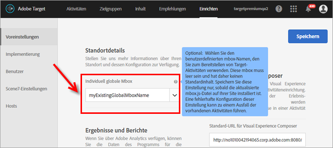

# Anpassen einer globalen Mbox{#customize-a-global-mbox}

Informationen, die Sie dabei unterstützen, eine globale Mbox für „at.js“ und „mbox.js“ anzupassen

1. Bearbeiten von „mbox.js“ 

   Navigieren Sie zu **[!UICONTROL Target]** &gt; **[!UICONTROL Einrichtung]** &gt; **[!UICONTROL Implementierung]**.

   * Klicken Sie für „mbox.js“ auf **[!UICONTROL mbox.js-Einstellungen bearbeiten]**.
   * Wählen Sie für [!DNL at.js]**die Option[!UICONTROL at.js]** unter „Implementierungsmethode“ aus und klicken Sie anschließend auf **[!UICONTROL mbox.js-Einstellungen bearbeiten]**.
   

1. Bearbeiten Sie [!DNL mbox.js] oder [!DNL at.js].

   Deaktivieren Sie **[!UICONTROL Globale Mbox automatisch erstellen]** und fügen Sie dann den Namen der globalen Mbox hinzu, die Aktivitäten aus [!DNL Target Standard/Premium] bereitstellen soll. Die globale Mbox wird auch für Klick-Tracking eingesetzt.

   

   Klicken Sie auf **[!UICONTROL Speichern], wenn Sie fertig sind.**
1. Integrieren Sie die Bibliothek [!DNL mbox.js] oder [!DNL at.js] in Ihre Site.

* Weitere Informationen zu mbox.js finden Sie unter [„mbox.js“-Implementierung](../../../../c-implementing-target/c-implementing-target-for-client-side-web/t-mbox-download/mbox-download.md#task_4EAE26BB84FD4E1D858F411AEDF4B420).
* Weitere Informationen zu at.js finden Sie unter [„at.js“-Implementierung](../../../../c-implementing-target/c-implementing-target-for-client-side-web/t-mbox-download/c-target-atjs-implementation/target-atjs-implementation.md#concept_8AC8D169E02944B1A547A0CAD97EAC17).

1. Stimmen Sie die Umstellung mit Ihrer Veröffentlichung zeitlich ab.

   Sind Sie bereit dafür, dass [!DNL Target Standard/Premium] künftig für alle Aktivitäten Ihre globale Mbox verwendet, können Sie mit diesem Schritt fortfahren.

   Aktualisieren Sie den Namen der globalen mbox, sodass er dem in Schritt 2 (siehe oben) verwendeten Namen entspricht.

   

   >[!IMPORTANT]
   >
   >Beim Speichern werden alle Aktivitäten in Ihrem Konto mit dieser Mbox synchronisiert. Befindet sich die Mbox nicht auf Ihrer Site, funktionieren Ihre Aktivitäten nicht mehr.

   Klicken Sie auf **[!UICONTROL Speichern]**.
