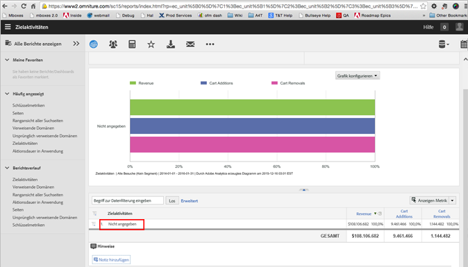

# Anzeigen von Berichten – Häufig gestellte Fragen zu A4T{#view-reports-a-t-faq}

Dieses Thema enthält Antworten auf häufig zur Anzeige von Berichten bei der Verwendung von Analytics als Berichtsquelle für Target (A4T) gestellte Fragen.

## Was ist die Zählmethode und wie wende ich sie an? {#section_E9C21C47B5BE4E54BABF0CD7F03D3945}

Die Zählmethode gibt an, was Target als Nenner für die Konversionsraten verwendet. Die Auswahlmöglichkeiten lauten wie folgt:

* Impressionen
* Besucher
* Besuche

## Kann ich eine Standardmetrik für die Target-Berichte festlegen? {#section_50C20D286AA042CCA958184C9C0767DD}

Für den Aktivitätsbericht können Administratoren die Standardmetrik so ändern, dass bei jeder Ausführung des Berichts dieselben Metriken angezeigt werden. Anderenfalls wird der Bericht standardmäßig auf die letzte Metrik festgesetzt, die Sie für Ihren letzten Bericht angewendet haben.

Weitere Informationen finden Sie unter [Standardberichtsmetriken auswählen](https://marketing.adobe.com/resources/help/en_US/sc/user/t_metrics_set_default.html) in der Anleitung *Hilfe zur Reports and Analytics-Schnittstelle*.

## Wann wende ich ein Segment auf die Metrik (mit einer errechneten Metrik) an und wann wende ich das Segment auf den Bericht an? {#section_BC29DEE6D2734911A5CD6FBF1189EB89}

Die Anwendung der Segmente auf die Berichte erfolgt wie die Anwendung von Segmenten in Target Classic. Diese Technik ist besonders nützlich, wenn Sie sehen möchten, wie sich der Test auf eine Untergruppe von Personen auswirkt (zum Beispiel: Wie verlief der Test für Kunden in Großbritannien?).

Es ist möglich, mit einer errechneten Metrik Segmente auf Metriken anzuwenden. Dies erfolgt im Allgemeinen, wenn Sie einen neuen Typ von Erfolgsereignis erstellen möchten. Zum Beispiel, wenn Sie sehen möchten, wie viele Besucher zu Ihrer generierten Aktivität zurückkehren oder wie viele Besucher zu einer bestimmten Seite gelangen und Ihren Test sehen. Bitte beachten Sie, dass Steigerung und Konfidenz derzeit nicht für errechnete Metriken generiert werden können.

## Sollte ich beim Anzeigen von Berichten Besucher, Aktivitätsimpressions oder Besuche verwenden? {#metrics}

Es gibt mehrere Optionen, von denen jede über eigene Vorteile verfügt:

* ***Unique Visitors*** wird um eins erhöht, wenn ein Benutzer sich zum ersten Mal für eine Aktivität qualifiziert.
* ***Besuche*** wird mit jeder Sitzung erhöht, sobald ein Benutzer (Unique Visitor) eine Aktivität beginnt, selbst wenn diese Aktivität nicht in nachfolgenden Besuchen angezeigt wird.
* ***Aktivitätsimpressionen*** wird jedes Mal erhöht, wenn Aktivitätsinhalt bereitgestellt wird. (Gemessen durch Target)
* ***Instanzen*** erhöht sich einmal pro Seite, wenn Aktivitätsinhalte bereitgestellt werden. (Gemessen durch Analytics)

Wenn ein Besucher eine Seite anzeigt, die eine Aktivität enthält, wird eine Variable für diesen Besucher festgelegt, die den Namen der Aktivität enthält. Informationen zu den verschiedenen Zählmethoden finden Sie in den unten aufgeführten ausführlichen Szenarien.

Beachten Sie Folgendes:

* Alle oben genannten Metriken werden ausgelöst, wenn ein Benutzer sich für eine Aktivität qualifiziert und Inhalt von [!DNL Target] zurückgegeben wird. Das bedeutet nicht zwingend, dass der Benutzer das Angebot gesehen hat. Wenn ein Aktivitätserlebnis sich unterhalb des angezeigten Bildschirmbereichs befindet und der Benutzer nicht nach unten scrollt, wurde das Angebot zwar von [!DNL Target] bereitgestellt, aber nicht vom Benutzer gesehen.
* [!UICONTROL Aktivitätsimpressionen] (gemessen durch [!DNL Target]) und [!UICONTROL Instanzen] (gemessen durch [!DNL Analytics]) sind gleich, sofern nicht mehrere Mbox-Aufrufe auf derselben Seite in derselben Aktivität vorhanden sind. Hierdurch werden mehrere [!UICONTROL Aktivitätsimpressionen] gezählt, aber nur eine [!UICONTROL Instanz].
* Stellen Sie bei Verwendung von [!UICONTROL Aktivitätsimpressionen] und [!UICONTROL Aktivitätskonversionsmetriken] [!DNL Analysis Workspace]sicher, dass beide Metriken gleiche [!UICONTROL Berührungszuordnungsmodelle] angewendet haben. Modelle können angewendet werden, indem Sie auf das Zahnradeinstellungsgerät klicken, [!UICONTROL nicht standardmäßige Zuordnungsmodelle aktivieren]und [!UICONTROL dann "Gleiche Berührung]«auswählen. Weitere Informationen über Attribution in [Attributes IQ finden](https://docs.adobe.com/content/help/en/analytics/analyze/analysis-workspace/panels/attribution.html) Sie im *Analytics-Tools-Handbuch*.

## Was bedeutet „Aktivitätskonversionen“, wenn der Marketingexperte beim Setup einer Aktivität eine Analytics-Metrik auswählt? {#section_F3EBACF85AF846E9B366A549AAB64356}

„Aktivitätskonversionen“ ist leer, wenn eine Analytics-Metrik als Konversionsmetrik für die Aktivität ausgewählt wurde.

## Warum steht in den Analytics-Berichten „Nicht angegeben“? Was bedeutet das? {#unspecified}

In anderen Berichten bedeutet „Nicht angegeben“, dass Daten eine bestimmte Classification nicht erfüllt haben. Dies sollte jedoch in A4T nie passieren. Wenn Sie „Nicht angegeben“ angezeigt bekommen, wurde der Classifications-Service noch nicht ausgeführt. In der Regel dauert es zwischen 24 bis 72 Stunden, bis Aktivitätsdaten in den Berichten angezeigt werden. Obwohl die Aktivitäten erst zu diesem Zeitpunkt in diesem Bericht angezeigt werden, werden alle an diese Aktivitäten geknüpften Besucherdaten erfasst und nach dem Abschluss der Classification angezeigt.

Nach dem Klassifizierungszeitraum werden Daten ca. eine Stunde nach Erfassung auf der Site in diesen Berichten angezeigt. Sämtliche Metriken, Segmente und Werte in den Berichten stammen aus der Berichtssuite, die Sie bei der Einrichtung der Aktivität ausgewählt haben.

## Warum werden Target-Metriken auch dann noch an Analytics gesendet, wenn die Aktivität deaktiviert wurde? {#section_38AA8380A4D54A18972F1EF3E73E22EF}

Die [!DNL Target]-Variable, die an [!DNL Analytics] gesendet wird, verfällt standardmäßig automatisch nach 90 Tagen. Diese Ablauffrist kann bei Bedarf vom Kundendienst geändert werden. Diese Einstellung gilt für alle Aktivitäten, daher sollte sie nicht nur für einen Fall angepasst werden.

Unter Umständen stellen Sie fest, dass Target-Variablen nach Ende der Ablauffrist an Analytics gesendet werden, da der Zeitraum sich auf 90 Tage beläuft, aber nur, wenn der jeweilige Benutzer keine andere Target-Aktivität sieht, für die A4T aktiviert ist. Wenn ein Benutzer am 45. Tag zur Site zurückkehrt und eine andere Aktivität ansieht, wird der gesamte Zähler für den A4T-eVar-Wert wieder auf 90 Tage zurückgesetzt. Das heißt, dass die erste Kampagne jetzt ab dem 1. Tag für 45 + 90 = 135 Tage fortbesteht. Falls der Benutzer anschließend weiterhin zurückkehrt, kann es sein, dass in Ihren Berichten irgendwann Metriken für weitaus ältere Aktivitäten an Analytics gesendet werden. Wenn Benutzer Cookies löschen und nicht zur Site zurückkehren, gehen die Zahlen für die entsprechende Aktivität zurück, werden aber weiterhin angezeigt.

Das bedeutet, dass Aktivitäten von Besuchern, die während ihrer aktiven Dauer Teil der Aktivität wurden, über einen Zeitraum von bis zu 90 Tagen nach Abschluss der Aktivität weiterhin angesehen, besucht usw. werden können. Sollten Sie jedoch einen Blick auf die Metrik [!UICONTROL Aktivitätsimpressionen] werfen, sollten nach Ablauf der Aktivität keine weiteren Impressionen erfasst werden.

Dies ist ein normales und erwartetes Verhalten. Die A4T-Variable funktioniert wie alle anderen eVars. Der Wert wird so lange dem Benutzer zugeordnet bis die Ablaufzeit erreicht ist (90 Tage). Daher wird der Wert, auch wenn eine Aktivität nur zwei Wochen lang aktiv ist, mindestens 90 Tage lang dem Benutzer zugeordnet.

Die Best Practice ist, Berichte für eine solche Aktivität nur für den Zeitraum anzuzeigen, in dem die Aktivität aktiv war. Die Datumsangaben sind standardmäßig korrekt, wenn Sie die Aktivität in Analytics anzeigen. Sofern Sie den Zeitraum also nicht manuell verlängert haben, sollte dies bei der Berichterstellung kein Problem darstellen.

Angenommen, die A4T-Variable läuft nach 90 Tagen ab und unser Test ist vom 1. bis 15. Januar aktiv.

Am 1. Januar besucht der Benutzer die Seite, sieht einmal die Aktivität XYZ und hat danach fünf weitere Seitenansichten. In den nächsten zwei Wochen kehrt der Benutzer nicht zur Seite zurück. Die Daten für diesen Benutzer sehen dann wie folgt aus:

| Aktivitätsname | Instanzen (Impressionen) | Seitenansichten | Besuche | Unique Visitors |
|--- |--- |--- |--- |--- |
| XYZ | 1 | 5 | 1 | 1 |

Der Benutzer kehrt dann am 1. Februar zurück, sieht fünf weitere Seiten, findet keine weiteren Target-Aktivitäten vor und die ursprüngliche Aktivität ist nicht mehr aktiv. Auch wenn die Aktivität nicht mehr aktiv ist, wird der Benutzer wegen der eVar-Persistenz jedoch weiterhin verfolgt. Die Daten sehen anschließend wie folgt aus:

| Aktivitätsname | Instanzen (Impressionen) | Seitenansichten | Besuche | Unique Visitors |
|--- |--- |--- |--- |--- |
| XYZ | 1 | 10 | 2 | 1 |

Der Benutzer kehrt am 1. März zurück und sieht die neue Aktivität ABC. Er sieht außerdem fünf Seiten. Da die Aktivität XYZ aufgrund der Persistenz weiterhin verfolgt und für diesen Benutzer dann auch ABC festgelegt wird, sind im Bericht jetzt zwei Linienelemente vorhanden:

| Aktivitätsname | Instanzen (Impressionen) | Seitenansichten | Besuche | Unique Visitors |
|--- |--- |--- |--- |--- |
| XYZ | 1 | 15 | 3 | 1 |
| ABC | 1 | 5 | 1 | 1 |

Der Benutzer kehrt am 1. April zurück, betrachtet fünf weitere Seiten und tätigt einen Kauf. Die Ablauffrist von 90 Tagen für den ersten eVar-Wert wird am 1. April zurückgesetzt, was im Bericht zu sehen ist. Und allen Target-Aktivitäten, die der Benutzer sieht, wird die Konversion gutgeschrieben, die Gesamtzahl der Konversionen wird jedoch dedupliziert:

| Aktivitätsname | Instanzen (Impressionen) | Seitenansichten | Besuche | Unique Visitors | Bestellungen |
|--- |--- |--- |--- |--- |--- |
| XYZ | 1 | 20 | 4 | 1 | 1 |
| ABC | 1 | 10 | 2 | 1 | 1 |
| Gesamt | 2 | 20 | 3 | 1 | 1 |

Da vor der Konversion beide Erlebnisse gesehen wurden, wird die Bestellung beiden „gutgeschrieben“. Im System gab es jedoch nur eine Bestellung, was die Summe zeigt. Für Target-Berichte ist es unerheblich, dass die Konversion allen Aktivitäten gutgeschrieben wird, die der Benutzer gesehen hat, weil dort keine Aktivitäten miteinander verglichen werden, um zu ermitteln, welche die erfolgreichere war. In diesen Berichten werden die Ergebnisse zweier Elemente innerhalb einer einzigen Aktivität verglichen. Ein Benutzer kann innerhalb derselben Aktivität keine unterschiedlichen Erlebnisse sehen, weshalb Sie sich über eine mögliche Kreuzkontamination bei der Zuschreibung der Bestellung keine Gedanken machen müssen.

Weitere Informationen finden Sie in der Analytics-Hilfe unter [Konversionsvariablen (eVar)](https://marketing.adobe.com/resources/help/en_US/reference/conversion_var_admin.html).

## Warum berechnen Analytics und Analytics for Target (A4T) die Zahlen für die Metrik „Unique Visitors“ unterschiedlich? {#section_0C3B648AB54041F9A2AA839D51791883}

Wenn Sie einen A/B-Test ausführen, der den Student-t-Test (die Konfidenzmetrik) verwendet, um einen Gewinner auszuwählen, gilt unter anderem die Annahme, dass es einen festen Zeithorizont gibt. Der Test ist nur dann statistisch gültig, wenn Sie diese feste Stichprobengröße untersuchen.

Die Metrik „Unique Visitors“ ist in Analytics und Target nur dann verschieden, wenn Sie einen Zeitraum untersuchen, der kürzer ist als der eigentliche Test. Wenn die Stichprobengröße nicht erreicht wird, ist der Test nicht sehr zuverlässig. Weitere Informationen finden Sie unter [How Not to Run an A/B-Test](https://www.evanmiller.org/how-not-to-run-an-ab-test.html) auf der [Website von Evan Miller](https://www.evanmiller.org/index.html).

Die Metrik „Unique Visitors“ zeigt die Anzahl der Personen im Test, die die Site während des festgelegten Zeitraums besucht haben. Diese Personen sind weiterhin Teil des Tests und müssen berücksichtigt werden. Wenn Sie nur die Anzahl der Personen sehen wollen, die innerhalb einer einzigen Woche betroffen waren, können Sie ein Segment der Besucher erstellen, die eine Aktivitätsimpression hatten, und dieses auf den Bericht anwenden.

Sie können den Zeitraum für die Persistenz der Target-Variablen auf eine Sitzung verkürzen. Dies ist jedoch meist problematisch für Tests, bei denen das Konversionsereignis wahrscheinlich nicht in derselben Sitzung erfolgt.

## Warum wird in Analytics derselbe Besucher manchmal bei mehreren Besuchen gezählt? {#section_1397E972D31C4207A142E4D2D6D794A2}

Die folgende Liste erklärt die Gründe, warum derselbe Besucher in Analytics bei mehreren Besuchen gezählt werden konnte:

* Das Target-Profil ist abgelaufen, aber das Analytics-Cookie ist immer noch vorhanden. In dieser Situation bewertet Target den Benutzer neu, aber Analytics betrachtet den Besucher als dieselbe Person.
* Wenn der Besucher die `mbox3rdPartyId` verwendet, sobald der anonyme Besucher mit seinem Drittanbieter-ID-Profil verschmolzen wird, könnte Target den Besucher in einen anderen Besuch einordnen, der mit der ID eines Drittanbieters übereinstimmt. Weitere Informationen finden Sie unter [Echtzeit-Profilsynchronisierung für mbox3rdPartyID](../../../c-target/c-visitor-profile/3rd-party-id.md#concept_BF4113593F614987B1D3E359AE1C5732).
* Analytics verfolgt möglicherweise verschiedene Geräte als denselben Besucher – anders, als Target diese Geräte verfolgt. Die Einrichtung der Drittanbieter-ID in Target unterscheidet sich von der in Analytics.

## Unterstützt A4T Virtual Report Suites?

Virtual Report Suites sind *nicht* in der Report Suite-Liste enthalten und Zielgruppen aus Virtual Report Suites werden in A4T-Berichten nicht unterstützt.

## Kann ich den Prozentsatz der Traffic-Zuordnung in einer Aktivität ändern, die nach der Aktivierung der Aktivität A4T verwendet?

Wenn Sie den Prozentsatz der Traffic-Zuordnung in einer Aktivität nach Aktivierung ändern, kann dies zu inkonsistenten Berichten in Analytics führen, da sich die Änderung nur auf neue Besucher auswirkt. Wiederkehrende Besucher sind nicht betroffen.

Am besten sollten Sie die vorhandene Aktivität stoppen und dann eine neue Aktivität erstellen, anstatt den Prozentsatz nach der Aktivierung zu ändern. Die Berichterstellung für die neue Aktivität beginnt mit neuen Besuchern und Daten aus zurückkehrenden Besuchern führen nicht zu inkonsistenten Berichten.

## Kann ich meine Target-Aktivitätsdaten im Adobe Analysis Workspace anzeigen?

Sie können mithilfe von [!DNL Adobe Analysis Workspace] tiefere Einblicke gewinnen, um die Daten zu visualisieren oder Einblicke zu finden, die unter der Oberfläche verborgen sind.

For detailed information and examples, open the [Analytics &amp; Target: Best Practices for Analysis tutorial](https://spark.adobe.com/page/Lo3Spm4oBOvwF/), provided by Adobe Experience League.