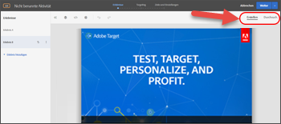
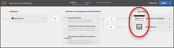

# Häufig gestellte Fragen zur Target-Optimierung und -Personalisierung

Eine Liste mit häufig gestellten Fragen über die Verwendung von Funktionen in Adobe Target zusammen mit Informationen und Links zu weiteren Informationen.

## Allgemeine Informationen {#section_CE5713B5AAC341C9A75586C107797FA3}

**Wie kann ich erkennen, wie andere Kunden Adobe Target für bessere Ergebnisse genutzt haben?**

Hier finden Sie nur einige unserer [Kundenerfolgsgeschichten](https://www.adobe.com/in/marketing-cloud/target/resources.html#x). Erfahren Sie, wie Kunden wie Sie Target zum Verbessern der Optimierung und Personalisierung verwendet haben, um ihre Geschäftsziele zu erreichen.

Beachten Sie, dass in einigen dieser Fallstudien Funktionen aus Adobe Target Premium verwendet wurden.

**Wo erhalte ich Informationen über die neuesten Target-Funktionen?**

Weitere Informationen zur neuesten Version finden Sie in den [Versionshinweisen](/help/r-release-notes/release-notes.md#reference_8FE40B43A5A34DDF8F26A53D55EE036A). Informationen über alle unsere [bisherigen Versionen](/help/r-release-notes/release-notes-for-previous-releases.md) sind ebenfalls online verfügbar.

**Verfügt Adobe über eine Community bzw. ein Forum, in der/dem ich Antworten und weitere Informationen über Target finden kann?**

Testen Sie das [Target-Community-Forum](/help/cmp-resources-and-contact-information.md#concept_9C203A8AED054DFFA9A504811DB6BA42). Hier helfen wir Kunden. Viel wichtiger ist jedoch, dass sich Adobe Target-Experten wie Sie hier gegenseitig unterstützen. Schließlich beruht der Erfolg einer Community und eines Forums auf der aktiven Beteiligung seiner Mitglieder. Werden Sie ein Teil der Community, beteiligen Sie sich und suchen Sie nach Antworten auf Ihre Fragen.

**Welche Browser werden von Target unterstützt?**

Weitere Details finden Sie in der [Unterstützte Browser](/help/c-implementing-target/c-considerations-before-you-implement-target/supported-browsers.md#reference_01B4BF99E7D545A7998773202A2F6100)-Matrix. Beachten Sie, dass es zwei Aspekte gibt: die Target Standard-/Premium Experience Cloud-Oberflächenunterstützung und die Endbenutzer-Browserunterstützung auf Desktop/Geräten.

## JavaScript-Bibliotheken in Target (at.js und mbox.js)   {#section_C2AC78DFDAD84981A8C84DF20893E340}

**Welche JavaScript-Implementierungsdatei sollte ich verwenden: at.js oder mbox.js?**

at.js ist unsere neueste und tollste JavaScript-Bibliothek. mbox.js ist unsere ältere Version. Unter [Die Vorteile von at.js](/help/c-implementing-target/c-implementing-target-for-client-side-web/t-mbox-download/c-target-atjs-implementation/target-atjs-implementation.md#benefits) finden Sie die Unterschiede zwischen den beiden Bibliotheken. Alle neuen Kunden sollten at.js verwenden.

Alle bestehenden mbox.js-Kunden sollten zu at.js migrieren. Erfahren Sie mehr über die in  [Migration von mbox.js zu at.js](/help/c-implementing-target/c-implementing-target-for-client-side-web/t-mbox-download/c-target-atjs-implementation/target-migrate-atjs.md#task_DE55DCE9AC2F49728395665DE1B1E6EA) Enthaltenen Schritte, bevor Sie den Übergang vornehmen.

## Aktivitäten {#section_CB95B3BF9934445DB98E8A7E22FC2CF6}

**Kann ich eine statistisch exakte Aktivität durchführen, um nach einem Gewinner- und Verlierererlebnis zu suchen, während ich ein Kontrollerlebnis verwende?**

Für die besten Ergebnisse verwenden Sie [die A/B-Tests](/help/c-activities/t-test-ab/test-ab.md#task_05E33EB15C4D4459B5EAFF90A94A7977) (Option „Manuelles Targeting“) zusammen mit [dem Stichprobengrößenrechner](/help/c-activities/t-test-ab/sample-size-determination.md#section_286EB6E671184239BB1552F0387DAEB5).

**Woran erkenne ich, wann ich meine Aktivität stoppen muss?**

Das verfrühte Stoppen von Aktivitäten kann zu falschen Schlüssen führen. Beachten Sie [allgemeine Fallen und vermeiden Sie sie mittels eingehaltener Verfahren](/help/c-activities/t-test-ab/common-ab-testing-pitfalls.md#section_DF01A97275E44CA5859D825E0DE2F49F). Siehe [Wie lange sollten A/B-Tests laufen](/help/c-activities/t-test-ab/sample-size-determination.md)?

**Wie kann ich eine Aktivität durchführen, wenn das Zeitfenster klein ist?**

**Kann ich mein Ziel optimieren, während ich einen Test vornehme?**

Verwenden Sie unsere [Berichte zur Ermittlung des erfolgreichsten Erlebnisses](/help/c-activities/automated-traffic-allocation/determine-winner.md#concept_5741A89ED7224E1285A3BC34B2CCD0F9).

**Kann ich eine Aktivität mit einer Personalisierungsebene als einen integralen Bestandteil der Aktivität durchführen?**

Sehen Sie sich die Option [Automatische Zielgruppe](/help/c-activities/auto-target/auto-target-to-optimize.md) an.

**Woran erkenne ich, welcher Aktivitätstyp sich am besten für meine Anforderungen eignet?**

Lesen Sie das [Target Activities-Handbuch](/help/c-activities/target-activities-guide.md#concept_D974B0918EB74B3B8CB07ACD32BF37A1), um die Szenarien zu verstehen, in der die einzelnen von Adobe Target bereitgestellten Optionen jeweils sinnvoll sind.

Denken Sie auch an die [Empfehlungs-Aktivitäten](/help/c-recommendations/recommendations.md#concept_7556C8A4543942F2A77B13A29339C0C0).

**Wie kann ich erkennen, welche Elementkombinationen auf meiner Seite zu ihrem Erfolg beitragen und zu welchem Grad die einzelnen Elemente hilfreich sind?**

Sehen Sie sich die [vollständigen Multivarianz-Aktivitäten (MVT)](/help/c-activities/c-multivariate-testing/multivariate-testing.md#concept_628695CDC71B449B8DCC2F5654C11499) mit der Elementbeitragsanalyse an, um zu sehen, ob sie Ihren Anforderungen entspricht.

Beachten Sie, dass sich die Traffic-Anforderung infolge von MVT-Aktivitäten erhöht.

**Kann ich eine Aktivität ausführen, die sich auf mehrere Seiten erstreckt, auf denen sich die Seitenstruktur unterscheidet?**

**Kann ich Angebote an unterschiedlichen Positionen (beispielsweise der Checkout-Trichter) anwenden?**

Probieren Sie die [Funktion „Mehrseitige Aktivität“](/help/c-experiences/c-visual-experience-composer/multipage-activity.md#concept_277E096063E14813AC5D8EDFA1D2ED48) aus, mit der Sie mehrere Seiten in den Erlebnissen verwenden können.

**Wie kann ich sicherstellen, dass einem Benutzer, nachdem ein (primäres oder sekundäres) Ziel erreicht wurde, die Aktivität niemals erneut angezeigt wird und er stattdessen künftig eine andere Aktivität sieht?**

Mithilfe der für jedes Ziel verfügbaren Option [Erweiterte Einstellungen](/help/c-activities/t-test-ab/t-test-create-ab/ab-goals-and-settings.md#section_E2FE441AFB324E498793ABB025ED9974) lässt sich dies leicht bewerkstelligen. Sie haben mehrere Entscheidungsmöglichkeiten dahingehend, was mit dem Benutzer passieren soll, nachdem er das Ziel erreicht hat, und wie Sie die Anzahl erhöhen möchten.

In diesem Fall wählen Sie möglicherweise „Anzahl erhöhen, Benutzer freigeben und an Wiedereintritt hindern“ zusammen mit „Standard-/Sonstiger Aktivitätsinhalt“ aus, um das Ziel zu erreichen. Überprüfen Sie auch die anderen Optionen.

**Ich habe mehrere Ziele in meiner Aktivität erstellt. Kann ich eine Kette an Zielen als einen Trichter für Berichterstellungs- und Analysezwecke erstellen?**

**Ich möchte beispielsweise Ziel B berücksichtigen, wenn der Benutzer Ziel A erreicht hat, damit ich die Zahlen für einen bestimmten Trichter nachverfolgen kann.**

Mit der Funktion für die Metrikabhängigkeit verfügt Target über eine zuverlässige Möglichkeit, um dies zu erreichen. [Fügen Sie einfach Abhängigkeiten und andere Erfolgsmetriken hinzu](/help/c-activities/r-success-metrics/success-metrics.md#section_7CE95A2FA8F5438E936C365A6D43BC5B). Ihnen stehen Optionen wie „Erreicht“ und „Nicht erreicht“ zusammen mit der Fähigkeit zur Verfügung, Metriken auf mehrere Weisen zu kombinieren, um die gewünschte Kombination zu erstellen.

**Wie muss ich eine Aktivität einrichten, um meine Ziele zu erreichen?**

Hier kommen [Ziele](/help/c-activities/t-test-ab/t-test-create-ab/ab-goals-and-settings.md#reference_B25389FD6F3A4989801E740364B089CC) an.

Sie sollten zunächst wissen, was Sie optimieren. Handelt es sich um den Umsatz, die Konversion oder die Interaktion? Diese Optionen stehen im Abschnitt mit den Zielen zur Verfügung. Für diese können Sie weitergehend definieren, welche Aktion ein Benutzer für die Qualifizierung auf Ihrer Site vornehmen würde, dass das Ziel erreicht wurde.

Dies wird durch die Einstellung „Primärziel“ in Schritt 3 des aus drei Teilen bestehenden geführten Workflows ermöglicht. Sie können auch zusätzliche Ziele hinzufügen, die Sie bei einer besseren Berichterstellung unterstützen.

**Kann ich planen, dass eine Aktivität zu einem festen Zeitpunkt gestartet und beendet wird?**

Im Schritt [Planungsfunktion in den Zielen und Einstellungen](/help/c-activities/t-test-ab/t-test-create-ab/ab-goals-and-settings.md#section_DCBDC354261F420EBD4B43EA34947BAC) des aus drei Teilen bestehenden Aktivitäts-Workflows können Sie die Start- und Enddatumswerte angeben.

Denken Sie daran, die Aktivität zu aktivieren. Nur aktive Aktivitäten halten den angegebenen Zeitplan ein. Nachdem das Enddatum erreicht wurde, geht die Aktivität in den Zustand „Beendet“ über.

**Ist es möglich, nur Änderungen am Targeting-Schritt vorzunehmen, ohne den gesamten, aus drei Schritten bestehenden geführten Workflow für die Bearbeitung zu durchlaufen?**

Geben Sie den gewünschten Schritt dazu einfach [direkt auf der Seite „Aktivitätsübersicht“ ein](/help/c-activities/edit-activity.md#concept_BB064C0D4A194BD1A1AE7CCA1E6BB8F0) und beenden Sie diesen Schritt dann mit der Option „Speichern und schließen“.

**Kann ich in einem bestimmten Schritt verbleiben, die Aktivität weiterhin ändern (beispielsweise Angebotstext oder benutzerspezifischer Code) und dann eine Qualitätssicherung auf einer anderen Registerkarte durchführen?**

Das ist auch möglich. Verwenden Sie [einfach die Option „Speichern“, um die inkrementellen Änderungen vorzunehmen, ohne den Schritt zu beenden](/help/c-activities/edit-activity.md#concept_BB064C0D4A194BD1A1AE7CCA1E6BB8F0).

**Wie kann ich eine Vorschau einer von mir eben erstellten Aktivität anzeigen und eine Qualitätssicherung diesbezüglich vornehmen?**

Verwenden Sie unseren [leistungsstarken QS-Modus](/help/c-activities/c-activity-qa/activity-qa.md), um eine Qualitätssicherung durchzuführen. Sie können Links für Ihr Qualitätssicherungsteam freigeben und die Aktivität auch durchgängig testen, einschließlich der Berichterstellung, um vollständig sicherzugehen, dass die Aktivität wie gewünscht und entsprechend dem Test funktioniert, sobald sie aktiv ist.

**Wie kann ich die Entscheidungsfindungsfunktion von Target verwenden, um ein Erlebnis/Angebot zu erhalten, das in Single-Page-Webanwendungen (Single Page Applications, SPAs) oder serverseitigen Integrationen verwendet werden kann?**

Nutzen Sie die Leistungsfähigkeit [formularbasierter Aktivitäten](/help/c-experiences/form-experience-composer.md#task_FAC842A6535045B68B4C1AD3E657E56E) mit [JSON-Angeboten](/help/c-experiences/c-manage-content/create-json-offer.md#concept_63C7BEE1F0DB4A7596D997219B7C136D), um Ihr Ziel zu erreichen.

**Ich habe zwei Aktivitäten eingerichtet. Wie erkenne ich, welche einem Besucher angezeigt wird?**

**Kann ich die Prioritätsreihenfolge von ein paar Aktivitäten festlegen?**

Verwenden Sie die in Schritt 3 des aus drei Teilen bestehenden geführten Target-Workflows (Seite „Ziele und Einstellungen“) verfügbare Einstellung „Priorität“ zum [Definieren der Aktivitätspriorität](/help/c-activities/t-test-ab/t-test-create-ab/ab-goals-and-settings.md#section_DCBDC354261F420EBD4B43EA34947BAC).

Hierzu gibt es zwei Optionen:

* Standard, mit drei Ebenen (Niedrig/Medium/Hoch)
* Benutzerdefiniert, mit einem Bereich von 0 bis 999. Aktivieren Sie für &quot;Benutzerdefiniert&quot;die Funktion &quot;Präzise Prioritäten&quot;(&quot;Administration&quot;> &quot;Visual Experience Composer&quot;).

## Zielgruppen{#section_FA6314777ABC46D8B198D6F388051460}

**Kann ich ein Zielgruppensegment in einer Aktivität erstellen, die für die Aktivität spezifisch ist? Ich bin nicht der Ansicht, dass solch eine Zielgruppe in der Zielgruppenbibliothek erstellt werden sollte, da kein Wiederverwendungsfaktor vorhanden ist.**

Verwenden Sie die [Funktion „Nur Aktivität“-Zielgruppe](/help/c-target/creating-activity-only-audience.md#concept_A6BADCF530ED4AE1852E677FEBE68483), um die für die Aktivität lokalen Zielgruppen zu definieren.

**Wie kann ich Benutzer auf Basis ihrer Standorte ansprechen?**

Probieren Sie die [Geo-Zielgruppen](/help/c-target/c-audiences/c-target-rules/geo.md#concept_5B4D99DE685348FB877929EE0F942670) aus. Machen Sie sich mit den Genauigkeitsebenen dieser Funktion vertraut.

**Kann ich Benutzer auf Basis einiger Attribute auf der Seite in der Sitzung ansprechen?**

Verwenden Sie am besten Mboxes und [benutzerdefinierte Zielgruppen](/help/c-target/c-audiences/c-target-rules/custom-parameters.md#concept_C4C6E00D7C5A4BE9B72D471DB2E3027B) zur Bereitstellung des richtigen Erlebnisses.

**Kann ich Erlebnisse auf Grundlage der über mehrere Besuche gegebenen Besucherattribute bereitstellen?**

**Kann ich den Traffic auf zufällige Weise in zwei Buckets aufteilen?**

Versuchen Sie es mit der [Funktion „Profilskripte“](/help/c-target/c-visitor-profile/profile-parameters.md#concept_8C07AEAB0A144FECA8B4FEB091AED4D2). Hiermit lassen sich Erlebnisse wirksam anpassen. Sie müssen dafür jedoch Code schreiben.

**Kann ich eine Aktivität mit einer geringeren Anzahl an Besuchern starten?**

Verwenden Sie die in [Schritt 2 des dreiteiligen Target-Arbeitsablaufs (Targeting-Seite)](/help/c-activities/t-test-ab/t-test-create-ab/ab-audience.md#concept_A268236C1224451DB7844BF67F41A087) verfügbaren Steuerelemente zum Zuordnen des Prozentsatzes, um festzulegen, wie Sie die Aktivität einrichten möchten.

**Ich verfüge auch über Adobe Analytics und möchte es mit Target nutzen. Welche wichtigen Funktionalitäten erhalte ich durch das Integrieren der zwei Lösungen?**

Lesen Sie die folgenden Aspekte des Produkts:

* [Analytics for Target (A4T)](/help/c-integrating-target-with-mac/a4t/a4t.md#concept_7540C8C04259434AB6EE33B09F47A1DE)
* [Kundenattribute](/help/c-target/c-visitor-profile/working-with-customer-attributes.md#concept_16C5C434D32D4EB1AD44A71821F3DEE8)
* [Zielgruppen](/help/c-integrating-target-with-mac/mmp.md)

## Erlebnisse {#section_5959536B8D6A4BEA8FAA1273338F3451}

**Kann ich eine Aktivität auf mehreren Seiten ausführen, die eine gemeinsame Seitenstruktur aufweisen?**

Sehen Sie sich die [Vorlagenregeln](/help/c-experiences/c-visual-experience-composer/temtest.md#task_2539D51A18044F82B0D9895636546781) an, um der Aktivität viele ähnlich strukturierte Seiten hinzuzufügen, während Sie das Erlebnis für die einzelne, angegebene URL erstellen.

**Mich stört die Meldung „allow your browser to load scripts“ (Laden von Skripten durch Browser zulassen), wenn ich versuche, meine Seite in Visual Experience Composer (VEC) zu laden. Wie lässt sich das vermeiden?**

Dies liegt am gemischten Inhalt Ihrer Site. Hierbei handelt es sich um eine Site, die HTTP- und HTTPS-Ressourcen abruft. Bitten Sie Ihr IT-Team, vollständig zu HTTPS zu wechseln.

Bis dies der Fall ist, sollten Sie die unter  [Zulassen von gemischtem Inhalt in Ihrem Browser](/help/c-experiences/c-visual-experience-composer/r-troubleshoot-composer/mixed-content.md#concept_46D022D50280468C9EF6D5DF6EFC911C), damit der Browser gemischte Inhalte laden kann. Dies ist eine Sicherheitsfunktion der meisten modernen Browser.

**Kann ich Visual Experience Composer (VEC) auch dann auf meiner Site testen, wenn die at.js-Bibliothek von Target noch nicht bereitgestellt wurde?**

Versuchen Sie, die Seite mit [Enhanced Experience Composer](/help/c-experiences/experiences.md#section_34265986611B4AB8A0E4D6ACC25EF91D) zu laden.

**Warum wird meine Site in Visual Experience Composer (VEC) nicht geladen?**

Konsultieren Sie die [Informationen zur Fehlerbehebung](/help/c-experiences/c-visual-experience-composer/r-troubleshoot-composer/troubleshoot-composer.md#reference_77743144F10143A3A89D56E116D296E4) auf der Hilfeseite. Wenden Sie sich an den [Adobe Support](/help/cmp-resources-and-contact-information.md#reference_ACA3391A00EF467B87930A450050077C), wenn keine dieser Vorgehensweisen funktioniert.

Wir haben auch [einen formularbasierten Ansatz](/help/c-experiences/form-experience-composer.md#task_FAC842A6535045B68B4C1AD3E657E56E), mit dem Sie freigeschaltet werden können.

Lesen Sie zudem, wann und warum [Enhanced Experience Composer](/help/c-experiences/experiences.md#section_34265986611B4AB8A0E4D6ACC25EF91D) hilfreich sein kann. Sie müssen sich möglicherweise an Ihre IT-Abteilung wenden, um auch die   [Auch die Proxy-](/help/c-experiences/c-visual-experience-composer/experience-composer-best-practices.md#concept_E284B3F704C04406B174D9050A2528A6) Server der Adobe von Zulassungslisten.

**Ich verfüge über eine responsive Site. Wie kann ich beim Erstellen einer Aktivität sichergehen, dass ich wichtige Geräte berücksichtige?**

Beschäftigen Sie sich mit der Funktion [Mobile Viewports](/help/c-experiences/c-visual-experience-composer/mobile-viewports.md#concept_8E45527C4ABC41D59AA3553BEDC76FA5). Beachten Sie, dass sie nur funktioniert, wenn „Enhanced Experience Composer“ aktiviert ist.

**Ich verfüge über mehrere Domänen. Für eine der Domänen muss „Enhanced Experience Composer“ aktiviert sein, während andere deaktiviert werden müssen. Wie kann ich dies vornehmen?**

Sie können immer die Option [Enhanced Experience Composer auf der Ebene der Aktivität](/help/c-experiences/experiences.md#section_34265986611B4AB8A0E4D6ACC25EF91D) verwenden, um die Standardeinstellung (&quot;Administration&quot;> &quot;Visual Experience Composer&quot;) zu überschreiben.

**Warum wird mir keine Option zum Tauschen von Bildern angezeigt?**

Wenden Sie sich an Adobe, um [sicherzustellen, dass Ihr Konto für Scene7 eingerichtet ist](/help/administrating-target/scene7-settings.md#task_37AD0768EFBA4E588955FE3D5DD670A5). Nach der Bereitstellung können Sie ein Bild problemlos mit einem anderen Bild tauschen.

**Ich möchte zwischen zwei unterschiedlichen Erlebnissen testen, beispielsweise zwischen einem pauschalen und Prozentsatzrabatt. Allerdings möchte ich entsprechend auf die Erlebnisse abzielen (also unterschiedlichen Gebietsschematext oder unterschiedliche Währungen für Personen aus unterschiedlichen Ländern anzeigen). Wie kann ich dies vornehmen?**

Das können Sie ganz einfach über unsere [Funktion „Mehrfach-Erlebnis-Version“](/help/c-activities/t-test-ab/t-test-create-ab/target-experience-to-multiple-audiences.md#task_0138112E283A4A5B9F8AB9AAF2FBC2FF) tun. Beachten Sie die Details in Bezug auf die Bereitstellung in solchen Tests.

**Wie kann ich sehen, welche Änderungen ich in Visual Experience Composer (VEC) vorgenommen habe?**

Ihre Änderungen werden immer im [Code-Editor](/help/c-experiences/c-visual-experience-composer/c-vec-code-editor/vec-code-editor.md#concept_B3A6E9EE3A60406DB640E205EA1745B5) angezeigt. Auf der Registerkarte „Änderungen“ werden der CSS-Selektor oder die Mbox angezeigt, die Sie auf Ihr Angebot angewendet haben.

Beachten Sie, dass der CSS-Selektor ein Sizzle Selector ist. Mit diesem Abschnitt können Sie schnell kleinere Änderungen vornehmen oder bestimmte Angebote löschen.

**Ich möchte JavaScript als einen Teil des Erlebnisses bzw. der Aktivität bereitstellen, um spontan Änderungen für einige dynamische Elemente vorzunehmen oder um einen Aufruf an eine Drittanbieterlösung zu senden. Wie kann ich dies vornehmen?**

Eine Möglichkeit besteht darin, den [benutzerdefinierten Code-Editor](/help/c-experiences/c-visual-experience-composer/c-vec-code-editor/vec-code-editor.md#concept_B3A6E9EE3A60406DB640E205EA1745B5) zu verwenden. Wenn Sie Ihr JavaScript im Abschnitt ablegen, wird es bereitgestellt. Sie können es in Abhängigkeit Ihrer Anforderungen in der Kopfzeile oder oberhalb des Textteils bereitstellen.

**Warum komme ich in Visual Experience Composer (VEC) nicht an der Anmeldeseite vorbei oder warum gelange ich nicht zu einer tief verankerten Seite, für die ich keine spezifische URL besitze?**

Mit den Funktionen Erstellen und Durchsuchen können Sie zur gewünschten Seite navigieren und Ihr Erlebnis erstellen.

**Wie kann ich über „Schritt 2 des aus drei Teilen bestehenden geführten Target-Workflows (Targeting-Seite)“ zum gewünschten Erlebnis wechseln?**

Klicken Sie auf die Miniaturansicht vor dem Erlebnisnamen in Schritt 2 und Sie gelangen zum gewünschten Erlebnis.

**Ich habe früher Target Classic verwendet. Kann ich meine Mboxes für bestimmte Anwendungsfälle verwenden?**

Verwenden Sie den [formularbasierten Ansatz](/help/c-experiences/form-experience-composer.md#task_FAC842A6535045B68B4C1AD3E657E56E) zum Erstellen von Aktivitäten.

**Kann ich sichergehen, dass einem Benutzer über allen seinen Geräten dasselbe Erlebnis auf konsistente Weise bereitgestellt wird?**

Lesen Sie die Informationen zur [Gerätekooperation](https://experienceleague.adobe.com/docs/device-co-op/using/home.html), wodurch Sie mehrere Geräte eines Benutzers durch die Leistung einer Kooperation deterministisch und probabilistisch miteinander verknüpfen können.

Wenn Sie sich in der Kooperation befinden, kann die Funktion mithilfe einer einfachen Markierung auf der Seite „Ziele und Einstellungen“ aktiviert werden. Die Berichterstellung wird nun so geändert, dass anstelle von Besuchern Personen berücksichtigt werden. Wenden Sie sich an Ihren Adobe-Kontakt, um weitere Informationen über diese nicht in allen Regionen verfügbare Funktion zu erhalten.

**Warum wird mir anstelle des gewünschten Angebots/Erlebnisses eine andere Aktivität angezeigt?**

Verwenden Sie den [Debugger](/help/c-activities/c-troubleshooting-activities/content-trouble.md#concept_D2548B486C984B1E97ED7A72075B8EEA) und suchen Sie nach [Aktivitätskollisionen](/help/c-experiences/c-visual-experience-composer/activity-collisions.md#concept_0BC6B929592744DFA7DA01FF4F91052E).

## Angebote {#section_A547B1EAD0B34FD38D3B87AAF62E3963}

**Ich möchte keine kleineren Änderungen versuchen, sondern eine brandneue, vollständig unterschiedliche Seite testen.**

**Ich möchte Benutzer zu einer Landingpage umleiten, beispielsweise einer neuen Einführung.**

**Wie kann ich dies vornehmen?**

Wir verfügen über eine [Weiterleitungs-URL](/help/c-experiences/c-manage-content/offer-redirect.md#task_33C80CD722564303B687948261484F94), mit der Sie Benutzer zur gewünschten Seite weiterleiten können (mit oder ohne die aktuellen Abfrageparameter).

**Warum erfolgt im meiner Qualitätssicherung keine Inhaltsbereitstellung?**

Es ist möglich, dass Ihre Site dynamische IDs, doppelte IDs oder dynamische Klassen für Elemente aufweist. Sie müssen die Voreinstellungsoptionen für die Site möglicherweise auf Kontoebene (oder auf Aktivitätsebene, wenn das Problem für eine Domäne oder Seite spezifisch ist) auswerten. Siehe [CSS-Selektoren](/help/administrating-target/visual-experience-composer-set-up.md#css).

**Warum wird mir anstelle des gewünschten Angebots/Erlebnisses eine andere Aktivität angezeigt?**

Verwenden Sie den [Debugger](/help/c-activities/c-troubleshooting-activities/content-trouble.md#concept_D2548B486C984B1E97ED7A72075B8EEA) und suchen Sie nach [Aktivitätskollisionen](/help/c-experiences/c-visual-experience-composer/activity-collisions.md#concept_0BC6B929592744DFA7DA01FF4F91052E).

**Kann ich die Entscheidungsfindungsfunktion von Target verwenden, um ein Erlebnis/Angebot zu erhalten, das in Single-Page-Webanwendungen (Single Page Applications, SPAs) oder serverseitigen Integrationen verwendet werden kann?**

Nutzen Sie die Leistungsfähigkeit [formularbasierter Aktivitäten](/help/c-experiences/form-experience-composer.md#task_FAC842A6535045B68B4C1AD3E657E56E) mit [JSON-Angeboten](/help/c-experiences/c-manage-content/create-json-offer.md#concept_63C7BEE1F0DB4A7596D997219B7C136D), um Ihr Ziel zu erreichen.

## Berichte (einschließlich Analytics for Target (A4T)){#section_8AECC69BEEB7422E894E7EC44A50BA0A}

**Ich verfüge auch über Adobe Analytics und möchte es mit Target nutzen. Welche wichtigen Funktionalitäten erhalte ich durch das Integrieren der zwei Lösungen?**

Lesen Sie die folgenden Aspekte des Produkts:

* [Analytics for Zielgruppe (A4T)](/help/c-integrating-target-with-mac/a4t/a4t.md#concept_7540C8C04259434AB6EE33B09F47A1DE)

* [Kundenattribute](/help/c-target/c-visitor-profile/working-with-customer-attributes.md#concept_16C5C434D32D4EB1AD44A71821F3DEE8)

* [Zielgruppen](/help/c-integrating-target-with-mac/mmp.md)

**Kann ich die Slice-and-Dice-Funktionalität für die Berichte zu mehreren Benutzersegmenten verwenden?**

Hier kommt die auf der Seite „Ziele und Einstellungen“ in Schritt 3 des aus drei Teilen bestehenden geführten Aktivitäts-Workflows verfügbare Funktion [Zielgruppen für die Berichterstellung](/help/c-activities/t-test-ab/t-test-create-ab/ab-goals-and-settings.md#section_13119392051044FBA6387D9B3B1C43CF) ins Spiel.

Sie können bis zu 50 solcher Segmente und auch den Anwendungspunkt (Aktivitätseintrag oder eine spezifische Metrik) hinzufügen, um über eine aussagekräftige Slice-and-Dice-Funktionalität zu verfügen.

Beachten Sie, dass Target die Daten diesbezüglich sammelt, sobald Sie diese Zielgruppen hinzufügen. Wenn Sie die Segmente also vor dem Ausführen des Tests nicht hinzufügen, haben Sie Pech.

**Ich kann die Zielgruppen vor dem Ausführen der Aktivität nicht definieren. Meines Erachtens sind Berichtszielgruppen in Target-Aktivitäten restriktiv.**

**Wie kann ich diesen Prozess vereinfachen?**

Hierfür ist [Analytics for Target (A4T)](/help/c-integrating-target-with-mac/a4t/a4t.md#concept_7540C8C04259434AB6EE33B09F47A1DE) praktisch. Wenn Sie über Adobe Analytics verfügen, können Sie einfach Analytics als Quelle auswählen, wodurch diese Einschränkung beseitigt wird. Nun können Sie jederzeit an jedem beliebigen Punkt Analysen für beliebige Zielgruppen durchführen und müssen die Berichtszielgruppen nicht vorab definieren.

**Kann ich Offline-Berichtsberechnungen durchführen?**

Verwenden Sie [„Berichte in CSV exportieren“ und „Auftragsdetails als CSV exportieren“](/help/c-reports/downloading-data-in-csv-file.md#concept_3F276FF2BBB2499388F97451D6DE2E75) auf der Seite „Berichte“ zum Herunterladen der gewünschten Berichtsdaten.

**Kann ich das Kontrollerlebnis für das Auswerten von Berichten oder die Zählmethodologie von „Besucher“ in „Besuche“ ändern?**

Verwenden Sie das  [Zahnrad „Einstellungen“ auf der Berichtsseite](/help/c-reports/c-report-settings/report-settings.md#concept_4BB6A7FDAB6F4806A632F9CD989B8BFA), um diese Änderungen vorzunehmen. Lesen Sie mehr über diese Einstellungen, um nachzuvollziehen, wie die Berechnungen variieren.

**Wie sollte ich Berichte interpretieren?**

Wir haben versucht, mit Funktionen wie  [Konfidenzintervallbalken, Steigerungsgrenzen, Signifikanz-/Konfidenz- und mehreren Metrikauswahlen, Tabellen- und Diagrammansichten, gleitenden Mitteln und mehr](/help/c-reports/c-report-settings/report-settings.md#concept_4BB6A7FDAB6F4806A632F9CD989B8BFA) Berichte so intuitiv wie möglich zu gestalten, um eine aussagekräftige und einfache Berichtsanalyse zu ermöglichen. Natürlich können Sie sich mit Analytics beschäftigen, wenn Sie [Analytics für Target](/help/c-integrating-target-with-mac/a4t/a4t.md#concept_7540C8C04259434AB6EE33B09F47A1DE)-Aktivitäten (A4T) für weitere Analysen von Zielgruppen verwenden.

## Antwort-Token {#section_C2A7118B4B62482A9D630C2212112A3D}

**Kann ich eine Integration in ein Drittanbietersystem durchführen, beispielsweise Google Analytics oder ClickTale, um die einem Endbenutzer bereitgestellten Aktivitätsinformationen für die Analyse weiterzugeben?**

Die [Funktion „Antwort-Token“](/help/administrating-target/response-tokens.md#concept_2B21B222F6A344D68CA5929817E836C4) bietet eine Lösung dafür.

## Fehlerbehebung {#section_6B8B4DC62AE34066A8C55915E9EC6C19}

**Wie kann ich den Verfügbarkeitsstatus von Adobe Target nachvollziehen?**

Auf der [Adobe-Systemstatusseite](/help/r-release-notes/system-status-updates.md#concept_5CBDF506BEFA40E483CC7DE0DA915EAD) können Sie den Status von Adobe-Produkten und Experience Cloud-Lösungen, einschließlich Target, anzeigen. Mit dieser Seite können Sie feststellen, welche Probleme möglicherweise aufgrund von Systemaktualisierungen oder Routinewartungsarbeiten auftreten können.

**Verfügen Sie über eine Anleitung zur Fehlerbehebung?**

Es tut uns leid, zu hören, dass Sie Probleme haben. Unter [Troubleshooting Target](/help/r-troubleshooting-target/troubleshooting-target.md#reference_A9DB82675D044BD8861F6752A4EE6839) finden Sie Links zu vielen Fehlerbehebungsthemen.

## Target Mobile Apps {#section_07BA89F2C38747158ECD5B153274AEAF}

**Wir besitzen eine mobile SKU. Kann ich mobile Aktivitäten erstellen?**

Zur Optimierung und Personalisierung auf Mobilgeräten müssen Sie [formularbasierte Aktivitäten](/help/c-experiences/form-experience-composer.md#task_FAC842A6535045B68B4C1AD3E657E56E) zusammen mit [Adobe SDK](/help/c-target-mobile-app/mobile-enable-target-in-sdk.md#task_FCA99AD0785A44E995468776AE76FE91) verwenden. Weitere Informationen zu [Target für mobile Apps](/help/c-target-mobile-app/target-mobile-app.md#concept_80126FF457724DE788CE37264A047559).

## Target-APIs {#section_714E85EFF6E3400389EF2E40D538E1DA}

**Wo erhalte ich weitere Informationen über Target-APIs?**

Wir verfügen über eine umfassende Dokumentation zu APIs. Siehe [Dokumentation zu Bereitstellungs-APIs, NodeJS-SDK und Empfehlungs-APIs](/help/c-implementing-target/c-api-and-sdk-overview/api-and-sdk-overview.md).
