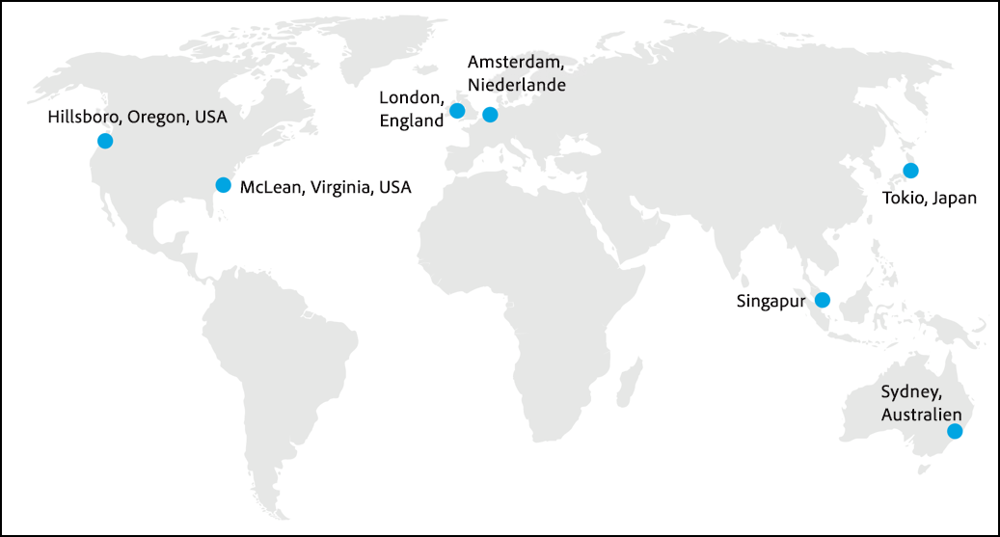

# Funktionsweise von Adobe Target{#how-adobe-target-works}

Informationen darüber, wie Adobe Target funktioniert, einschließlich Informationen zu den JavaScript-Bibliotheken (at.js und mbox.js) und den verschiedenen in Target enthaltenen Aktivitätstypen.

## JavaScript-Bibliotheken in Target {#libraries}

Adobe Target wird mit einer von zwei javascript-Bibliotheken in Websites integriert: " at. js" oder "mbox. js «

* **at.js:** Die [at.js-Bibliothek](../c-implementing-target/c-implementing-target-for-client-side-web/t-mbox-download/c-target-atjs-implementation/target-atjs-implementation.md#concept_8AC8D169E02944B1A547A0CAD97EAC17) ist die neue Implementierungsbibliothek für Target. Die „at.js“-Bibliothek sorgt für kürzere Seitenladezeiten bei Webimplementierungen und bietet bessere Implementierungsoptionen für Single-Page-Anwendungen. „at.js“ ist die empfohlene Implementierungsbibliothek und wird häufig mit neuen Funktionen aktualisiert. Wir empfehlen allen Kunden, die [neueste Version von „at.js“](../c-implementing-target/c-implementing-target-for-client-side-web/target-atjs-versions.md#reference_DBB5EDB79EC44E558F9E08D4774A0F7A) zu implementieren oder zu ihr zu migrieren.
* **mbox.js:** Die „mbox.js“-Bibliothek ist die alte Implementierungsbibliothek für Target. Die „mbox.js“-Bibliothek wird weiterhin unterstützt, aber es gibt keine weiteren Funktionsupdates.

>[!IMPORTANT]
>
>Alle Kunden sollten auf at.js migrieren. Weitere Informationen finden Sie unter [Migration zu at.js von mbox.js](../c-implementing-target/c-implementing-target-for-client-side-web/t-mbox-download/c-target-atjs-implementation/target-migrate-atjs.md#task_DE55DCE9AC2F49728395665DE1B1E6EA)

Sie müssen auf jeder Seite Ihrer Site auf die Javascript-Bibliotheksdatei von Target verweisen. Sie können sie beispielsweise Ihrer globalen Kopfzeile hinzufügen. Alternativ können Sie den [Adobe Launch-Tag-Manager verwenden.](/help/c-implementing-target/c-implementing-target-for-client-side-web/how-to-deployatjs/cmp-implementing-target-using-adobe-launch.md)

Jedes Mal, wenn ein Besucher eine Seite aufruft, die für Target optimiert wurde, wird eine Anfrage an das Targeting-System gesendet, um festzulegen, welcher Inhalt für einen Besucher bereitgestellt werden soll. Dieser Vorgang erfolgt in Echtzeit— Bei jedem Laden einer Seite wird eine Anforderung für den Inhalt erstellt und vom System ausgeführt. Der Inhalt wird durch die vom Marketingspezialisten kontrollierten Aktivitäten und Erlebnisse geregelt und auf den einzelnen Besucher der Site zugeschnitten. Es werden Inhalte bereitgestellt, auf die die einzelnen Besucher der Site mit großer Wahrscheinlichkeit reagieren, damit interagieren und letztendlich eine Kaufentscheidung treffen, um die Antwortraten, Erwerbsraten und den Umsatz zu maximieren.

In Target ist jedes Element auf der Seite Bestandteil eines einheitlichen Erlebnisses für die gesamte Seite. Jedes Erlebnis kann mehrere Elemente auf der Seite enthalten.

Der für Besucher angezeigte Inhalt hängt von der Art der Aktivität ab, die Sie erstellen:

### A/B-Test

Weitere Informationen finden Sie unter [Erstellen eines A/B-Tests](../c-activities/t-test-ab/t-test-create-ab/test-create-ab.md#task_68C8079BF9FF4625A3BD6680D554BB72).

Der Inhalt, der in einem einfachen A/B-Test angezeigt wird, wird zufällig aus den Assets ausgewählt, die Sie der Aktivität zuweisen, entsprechend den Prozentwerten, die Sie für die einzelnen Erlebnisse wählen. Als Folge dieser zufälligen Trennung des Traffic kann es anfänglich zu einem hohen Traffic-Aufkommen kommen, bevor sich die Prozentwerte ausgleichen. Wenn Sie beispielsweise zwei Erlebnisse erstellen, wird das Anfangserlebnis per Zufall ausgewählt. Bei wenig Traffic besteht die Möglichkeit, dass der Prozentsatz von Besuchern auf ein Erlebnis ausgerichtet wird. Mit zunehmendem Traffic sollten sich die Prozentsätze langsam angleichen.

Sie können für jedes Erlebnis prozentuale Ziele festlegen. In diesem Fall wird eine zufällige Nummer generiert und diese Nummer wird verwendet, um das anzuzeigende Erlebnis auszuwählen. Die sich ergebenden Prozentzahlen entsprechen möglicherweise nicht genau den festgelegten Zielen, allerdings bedeutet mehr Traffic, dass die Erlebnisse enger auf die beabsichtigen Ziele aufgeteilt werden sollten.

1. Ein Kunde ruft eine Seite von Ihrem Server auf und zeigt sie im Browser an.
2. Im Browser des Benutzers wird ein Erstanbieter-Cookie gesetzt, um das Kundenverhalten zu speichern.
3. Die Seite ruft das Targeting-System auf.
4. Inhalte werden basierend auf den Regeln Ihrer Aktivität angezeigt.

### Automatische Zuordnung

Weitere Informationen finden Sie unter [Automatische Zuordnung](../c-activities/automated-traffic-allocation/automated-traffic-allocation.md#concept_A1407678796B4C569E94CBA8A9F7F5D4).

Die Funktion „Automatisch zuweisen“ identifiziert einen Gewinner unter zwei oder mehr Erlebnissen und ordnet dem Gewinnererlebnis automatisch mehr Traffic zu, um Konversionen zu erhöhen, während der Test weiter ausgeführt und das Lernen fortgesetzt wird.

### Automatisches Targeting (AT)

Weitere Informationen finden Sie unter [Automatisches Targeting](../c-activities/auto-target-to-optimize.md#concept_67779E5B7F67427A97D7EA2A6FB919B3).

Automatisches Targeting verwendet fortschrittliche maschinelle Lernprogramme, um aus mehreren leistungsstarken Erlebnissen mit Marketingexperten auszuwählen und auf Grundlage ihres individuellen Kundenprofils und des Verhaltens älterer Besucher mit ähnlichen Profilen das umfassendste Erlebnis für jeden Besucher bereitzustellen, um Inhalte zu personalisieren und Umrechnungen zu fördern.

### Automatisierte Personalisierung (AP)

Weitere Informationen finden Sie unter [Automatisierte Personalisierung](../c-activities/t-automated-personalization/automated-personalization.md#task_8AAF837796D74CF893CA2F88BA1491C9).

Die automatisierte Personalisierung (AP) kombiniert Angebote oder Nachrichten und ordnet den einzelnen Besuchern basierend auf deren individuellen Kundenprofilen mithilfe des erweiterten maschinellen Lernens verschiedene Angebotsvarianten zu, um die Inhalte zu personalisieren und Konversionen zu fördern.

### Erlebnis-Targeting (XT)

[Erlebnis-Targeting](../c-activities/t-experience-target/experience-target.md#task_A53DF336CB9F4D7BB87EF2106099EFC4)

Beim Erlebnis-Targeting (XT) werden Inhalte für eine spezielle Zielgruppe basierend auf einem Satz aus vermarkterdefinierten Regeln und Kriterien bereitgestellt.

Erlebnis-Targeting, einschließlich Geotargeting, ermöglicht die Definition von Regeln für Erlebnisse oder Inhalte, die auf eine bestimmte Zielgruppe ausgerichtet sind. Es können mehrere Regeln für eine Aktivität bereitgestellt werden, um verschiedene Inhaltvarianten für verschiedene Zielgruppen bereitzustellen. Wenn Besucher Ihre Website aufrufen, werden sie vom Erlebnis-Targeting (XT) geprüft, um festzustellen, ob sie die von Ihnen festgelegten Kriterien erfüllen. Ist dies der Fall, treten sie in die Aktivität ein und das für die qualifizierenden Zielgruppen entworfene Erlebnis wird angezeigt. Sie können Erlebnisse für mehrere Zielgruppen innerhalb einer einzelnen Aktivität erstellen.

### Multivarianz-Tests (MVT)

Weitere Informationen finden Sie unter [Multivarianz-Test](../c-activities/c-multivariate-testing/multivariate-testing.md#concept_628695CDC71B449B8DCC2F5654C11499).

Beim Multivariate Tests (MVT) werden Kombinationen aus Angeboten in Elementen auf einer Seite verglichen, um zu bestimmen, welche Kombination die beste Leistung für eine bestimmte Zielgruppe erzielt. Zudem gibt er an, welches Element den größten Einfluss auf den Erfolg der Aktivität hat.

### Recommendations

Weitere Informationen finden Sie unter [Empfehlungen](../c-recommendations/recommendations.md#concept_7556C8A4543942F2A77B13A29339C0C0).

Recommendations-Aktivitäten zeigen automatisch Produkte oder Inhalte an, die basierend auf früheren Benutzeraktivitäten oder anderen Algorithmen für Ihre Kunden interessant sein könnten. Empfehlungen tragen dazu bei, Kunden zu relevanten Elementen zu lenken, von denen sie andernfalls möglicherweise nichts wissen.

## Das Edge-Netzwerk {#concept_0AE2ED8E9DE64288A8B30FCBF1040934}

„Edge“ ist eine räumlich verteilte Serving-Architektur, die Endnutzern, die Inhalte anfordern, optimale Reaktionszeiten gewährleistet, unabhängig davon, wo sie sich auf der Welt befinden.

Um die Reaktionszeiten zu verbessern, hosten Edge-Umgebungen nur die Aktivitätslogik und das zwischengespeicherte Profil und Angebotsinformationen. Die Aktivitäts- und Inhaltsdatenbanken, [!DNL Analytics]-Daten, APIs und Benutzeroberflächen der Marketingspezialisten werden in den zentralen Datenumgebungen von Adobe gespeichert. Aktualisierungen werden an die Edge-Knoten gesendet. Die zentralen Umgebungen und Edge-Knoten werden automatisch synchronisiert, um die zwischengespeicherten Aktivitätsdaten kontinuierlich zu aktualisieren. Außerdem wird auf jeder Kante 1:1-Modellierung gespeichert, sodass komplexere Anforderungen auch auf der Edge verarbeitet werden können.

Jeder Edge-Knoten verfügt über alle notwendigen Informationen, um auf die Inhaltsanforderung des Benutzers zu antworten und Analysedaten zu der Anforderung nachzuverfolgen. Benutzeranforderungen werden an den nächstgelegenen Edge-Knoten weitergeleitet.

Die Quelle für dieses Mage ist das [White Paper Adobe Target Security Overview](https://www.adobe.com/content/dam/acom/en/security/pdfs/AdobeTargetSecurityOverview.pdf) .

Die Adobe Target-Lösung wird auf von Adobe geteilten Datenzentren und von Adobe-rechenzentren gehostet. Admin-Server werden vollständig innerhalb von Rechenzentren von Adobe in London, Singapur und mehreren Standorten in den USA gehostet, einschließlich Oregon und Virginia. Edge Server werden sowohl auf Adobe-eigenen als auch auf Adobe-kompatiblen Servern in Amazon AWS-Rechenzentren in London, Hongkong, Singapur, Tokio und Sydney gehostet.

Speicherorte für Administratorserver enthalten ein Datenerfassungscenter und ein Datenverarbeitungscenter. Edge-Standorte umfassen nur ein Datenerfassungscenter. Jede Report Suite wird einem speziellen Datenverarbeitungscenter zugewiesen.

Anstatt auf alle Targeting-Anfragen von einem einzelnen Standort zu antworten, werden Anforderungen von der Edge-Umgebung verarbeitet, die am nächsten dem Besucher liegt, wodurch die Auswirkungen der Netzwerk-/Internet-Reisedauer beeinträchtigt werden.

>[!IMPORTANT]
>
>[!DNL Adobe Target] verfügt derzeit über kein Edge-Netzwerk in China und die Endbenutzerleistung wird für [!DNL Target] Kunden in China weiterhin eingeschränkt. Aufgrund der großen Firewall und dem Fehlen von Edge-Knoten innerhalb des Landes sind die Erlebnisse von Sites mit [!DNL Target] bereitgestellter Bereitstellung langsam und die Seitenladevorgänge beeinträchtigt. Außerdem können Marketingexperten bei der Verwendung der [!DNL Target] Authoring-Benutzeroberfläche Latenzzeiten aufweisen.

## Protected User Experience {#concept_40A5E781D90A41E4955F80EA9E5F8F96}

Adobe stellt sicher, dass die Verfügbarkeit und Performance der Targeting-Infrastruktur so zuverlässig wie möglich ist. Allerdings kann es durch einen Kommunikationsausfall zwischen dem Browser eines Endbenutzers und den Servern von Adobe zu einer Unterbrechung bei der Bereitstellung der Inhalte kommen.

To safeguard against service interruptions and connectivity issues, all locations are set up to include default content (defined by the client), which is displayed if the user’s browser cannot connect to [!DNL Target].

Es werden keine Änderungen an der Seite vorgenommen, wenn der Browser des Benutzers innerhalb eines festgelegten Timeout-Zeitraums (standardmäßig: 15 Sekunden). Wenn dieser Timeout-Schwellenwert erreicht wird, wird der Standardinhalt angezeigt.

Adobe schützt das Benutzererlebnis durch die Optimierung und Sicherung der Performance.

* Adobe stellt Leistungsbenchmarks auf Grundlage von Branchenstandards sicher, die durch die Dienstgütevereinbarung (Service Level Agreement, SLA) von Adobe gewährleistet werden.
* Das Edge-Netzwerk stellt eine rechtzeitige Datenbereitstellung sicher.
* Adobe setzt einen mehrstufigen Ansatz zur Sicherung seiner Anwendungen ein, um Kunden auf diese Weise ein Höchstmaß an Verfügbarkeit und Zuverlässigkeit zu gewähren.
* [!DNL Target] Consulting bietet Unterstützung bei der Implementierung und laufenden Produktsupport.

## Für Suchmaschinenoptimierung (SEO) geeignete Prüfung {#concept_C0C865663CAB4251B66A1F250FD25E6A}

[!DNL Adobe Target] ist an den Suchoptimierungsrichtlinien für Prüfungen ausgerichtet.

Google fördert Prüfung durch Benutzer und gibt in seiner Dokumentation an, dass A/B- und Multivariater Tests organische Suchergebnisrankings nicht negativ beeinflussen, solange die vorgegebenen Richtlinien befolgt werden.

Weitere Informationen finden Sie unter folgenden Google-Ressourcen:

* [Website-Tests und Google-Suche](https://webmasters.googleblog.com/2012/08/website-testing-google-search.html)
* [Experimente und Maskierung](https://support.google.com/analytics/answer/2576845?hl=en&ref_topic=1745207)

Die Richtlinien wurden in einem Beitrag auf dem [Google Webmaster Central Blog](https://webmasters.googleblog.com/2012/08/website-testing-google-search.html) veröffentlicht. Obwohl dieser Beitrag aus dem Jahr 2012 stammt, ist er die aktuellste Stellungnahme von Google zu diesem Thema und die Richtlinien sind nach wie vor gültig.

* **Keine Maskierung** - Maskierung bedeutet, Benutzern einen bestimmten Inhalt anzuzeigen, Bots von Suchmaschinen jedoch andere Inhalte anzuzeigen, indem diese Inhalte eigens identifiziert und durch andere Inhalte ersetzt werden.

   Target wurde als Plattform so entworfen, dass Bots von Suchmaschinen genau wie normale Benutzer behandelt werden. Das bedeutet, dass Bots möglicherweise in Tests eingeschlossen werden, wenn sie zufällig ausgewählt werden, und die Testvariationen „zu sehen bekommen“.

* **Verwendung von rel="canonical"** - Manchmal müssen für einen A/B-Test für Inhaltsvariationen unterschiedliche URLs erstellt werden. In diesen Fällen sollten alle Variationen das Tag `rel="canonical"` enthalten, das auf die ursprüngliche (Kontroll-)URL verweist. Prüft Adobe beispielsweise die eigene Startseite mit verschiedenen URLs für jede Variation, wäre im Tag `<head>` folgendes Canonical-Tag für jede der Variationen enthalten:

   `<link rel="canonical" href="https://www.adobe.com" />`

* **Verwendung von 302-Umleitungen (temporär)** - Werden unterschiedliche URLs im Rahmen eines Tests für Variationen verwendet, empfiehlt Google den Einsatz einer 302-Umleitung, die Traffic auf die verschiedenen Variationen umleitet. Auf diesem Weg wird Suchmaschinen mitgeteilt, dass die Umleitung nur vorübergehend und nur aktiv ist, solange die Prüfung durchgeführt wird.

   Eine 302-Umleitung ist eine Server-seitige Umleitung. Target stützt sich – wie die meisten anderen Optimierungsanbieter auch – auf Client-seitige Funktionen. Somit befolgt Target in diesem Fall die Empfehlungen von Google nicht zu hundert Prozent. Dies wirkt sich aber lediglich auf eine geringe Anzahl von Tests aus. Der Standardansatz für die Durchführung von Tests mit Target fordert sich ändernde Inhalte innerhalb einer einzigen URL, sodass keine Umleitungen erforderlich sind. Es handelt sich hierbei um Fälle, in denen Kunden mit verschiedenen URLs arbeiten müssen, um Variationen zu testen. Hier wird in Target der JavaScript-Befehl `window.location` verwendet, um Benutzer auf Testvariationen umzuleiten. Es wird dabei nicht angegeben, ob es sich um eine Umleitung des Typs 301 oder 302 handelt.

   Wir sind zwar weiterhin auf der Suche nach möglichen Lösungen für eine vollständige Umsetzung der Suchmaschinenrichtlinien für Kunden, die für ihre Tests verschiedene URLs verwenden müssen, sind jedoch überzeugt, dass die ordnungsgemäße Verwendung der oben beschriebenen Canonical-Tags für die Senkung des Risikos, das mit diesem Verfahren verbunden ist, vollkommen ausreicht.

* **Experimente nur so lange wie nötig durchführen** - „So lange wie nötig“ bedeutet für uns „so lange es dauert, bis ein Ergebnis mit statistischer Bedeutung erzielt wurde“. Es stehen in Target [Best Practices](https://docs.adobe.com/content/target-microsite/testcalculator.html) zur Verfügung, mit deren Hilfe festgestellt werden kann, wann Ihr Test diesen Punkt erreicht hat. Wir empfehlen, diese hartcodierte Implementierung erfolgreicher Tests in Ihren Test-Arbeitsablauf einzugliedern und die entsprechenden Ressourcen bereitzustellen.

   Es wird nicht empfohlen, die Plattform Target dauerhaft zur „Veröffentlichung“ der erfolgreich getesteten Variationen zu verwenden. Werden diese Variationen jedoch für 100 % der Benutzer zu 100 % der Zeit bereitgestellt, kann eine Variation mit Target veröffentlicht werden, solange die Hartcodierung noch nicht abgeschlossen ist.

   Beachten Sie dabei auch, was durch Ihren Test geändert wurde. Eine Änderung der Farbe von Schaltflächen oder anderer Elemente, die keinen Text enthalten, wirkt sich nicht auf das Suchmaschinenranking Ihrer Seite aus. Änderungen an Texten sollten jedoch auf jeden Fall hartcodiert werden.

   Berücksichtigen Sie außerdem, wie einfach auf die zu testende Seite zugegriffen werden kann. Sollte die Seite nicht für Suchmaschinen verfügbar sein und war sie niemals dafür gedacht, in organische Rankings von Suchmaschinen aufgenommen zu werden (beispielsweise im Falls einer besonderen Landingpage für E-Mail-Kampagnen), spielen die oben genannten Punkte keinerlei Rolle.

Google legt fest, dass die Einhaltung dieser Richtlinien dazu führen sollte, dass Ihre Tests in den Suchergebnissen wenig oder keine Auswirkungen auf Ihre Site haben. «

Zusätzlich zu diesen Richtlinien stellt Google eine weitere Richtlinie in der Dokumentation für das Werkzeug für Inhaltstests bereit:

* „Die Seitenvariationen sollten dem Inhalt Ihrer Originalseiten ähnlich sein. Die Variationen sollten die allgemeine Wahrnehmung der ursprünglichen Inhalte durch die Benutzer nicht ändern.“

Als Beispiel gibt Google an: „Wenn eine Originalseite voller Schlüsselwörter ist, die nicht den für die Benutzer verfügbaren Inhalten entsprechen, kann diese Seite aus unserem Index entfernt werden.“

Unserer Ansicht nach ist es jedoch eher schwierig, die Bedeutung originaler Inhalte im Rahmen eines Tests unabsichtlich in solcher Weise zu verändern. Trotzdem empfehlen wir, die Schlüsselwortaussagen einer Seite zu prüfen und sie bei neuen Variationen beizubehalten. Änderungen am Seiteninhalt, besonders das Löschen oder Hinzufügen relevanter Schlüsselwörter, kann dazu führen, dass sich das organische Ranking der Seite ändert. Wir empfehlen Ihnen, Ihren SEO-Partner in den Testvorgang einzubeziehen.

## Bots {#bots}

Adobe Target verwendet [deviceatlas](https://deviceatlas.com/) , um bekannte Bots zu erkennen. Der als von einem Bot generierte Traffic wird wie ein gewöhnlicher Benutzer weiterhin bereitgestellt, um sicherzustellen, dass er mit SEO-Richtlinien in Einklang gebracht wird. Durch Verwendung von Bot-Traffic können A/B-Tests oder Personalisierungsalgorithmen verfälschen, wenn sie wie normale Benutzer behandelt werden. Wenn daher ein bekannter Bot in Ihrer Target-Aktivität erkannt wird, wird der Traffic etwas anders behandelt. Das Entfernen von Bot-Traffic bietet eine genauere Messung der Benutzeraktivität.

Speziell für bekannte Bot-Traffic-Target gilt Folgendes:

* Ein Besucherprofil erstellen oder abrufen
* Protokollieren von Profilattributen oder Ausführen von Profilskripten
* Suchen Sie nach Adobe Audience Manager (AAM)-Segmenten (falls zutreffend).
* Verwenden Sie Bot-Traffic in der Modellierung und stellen Sie personalisierte Inhalte für Recommendations, automatisches Targeting, automatisierte Personalisierung oder automatisierte Zuordnung bereit.
* Protokollieren Sie einen Aktivitätsbesuch für die Berichterstellung.
* Protokolldaten, die an die Adobe Experience Cloud-Plattform gesendet werden sollen
