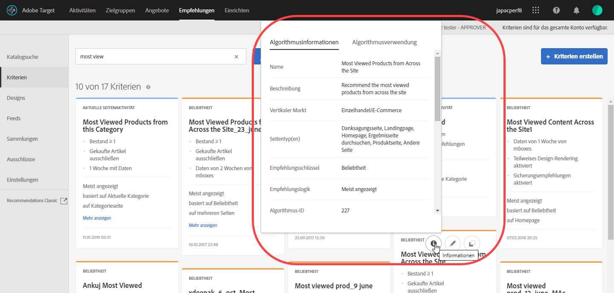
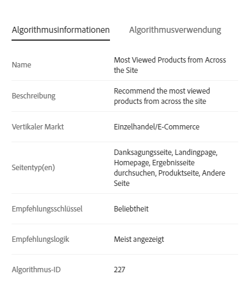
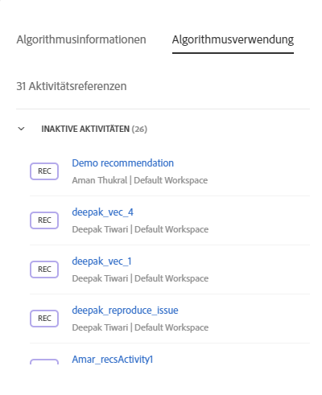

#  Kriterien{#criteria}

Kriterien sind Regeln, die auf Basis vorab ermittelter Verhaltensweisen von Besuchern festlegen, welche Produkte empfohlen werden.

Kriterien bestimmen, welche Aktion zu welcher Empfehlung führt. Sie können mehrere Empfehlungstypen untereinander testen, indem Sie mehrere Kriterien verwenden.

## Vertikaler Markt {#section_936BCFCF234C49A2BEC1C38AAC2D71AF}

Wählen Sie einen vertikalen Markt auf Grundlage der Ziele Ihrer Empfehlungsaktivität aus:

| Vertikaler Markt | Ziel |
|--- |--- |
| Einzelhandel/E-Commerce | Zum Kauf führende Konversion |
| Lead-Generierung/B2B/Finanzdienstleistungen | Konversion ohne Kauf |
| Medien/Verlagswesen | Interaktion |

## Empfehlungsschlüssel {#section_885B3BB1B43048A88A8926F6B76FC482}

Der ausgewählte Empfehlungsschlüssel bestimmt den Kriterientyp. Es gibt viele Kriterientypen. Sie werden beim Einrichten einer [!DNL Recommendations]-Aktivität als Kriterienkarten dargestellt.

| Kriterientyp | Schlüssel |
|--- |--- |
| Aktuelle Seitenaktivität | Empfehlen Sie Artikel auf Basis des Verhaltens der Benutzer auf der aktuellen Seite. Zum Beispiel möchten Besucher, die einen bestimmten Artikel ansehen, möglicherweise andere Artikel derselben Kategorie ansehen.<ul><li>Aktueller Artikel</li><li>Aktuelle Kategorie</li></ul> |
| Benutzerspezifisch | Empfohlene Artikel auf Grundlage benutzerspezifischer Attribute<ul><li>Benutzerspezifisches Attribut</li></ul>Wenn Sie Empfehlungen auf Grundlage von benutzerspezifischen Attributen erstellen, müssen Sie das benutzerspezifische Attribut auswählen und anschließend den Empfehlungstyp festlegen. Zusätzlich zur Ausgabe Ihrer eigenen benutzerspezifischen Kriterien können Sie in Echtzeit filtern. So können Sie beispielsweise Ihre empfohlenen Elemente so begrenzen, dass nur die Favoritenkategorie oder -marke eines Besuchers angezeigt wird. Dadurch können Sie Offline-Berechnungen mit der Echtzeitfilterung kombinieren. Mit dieser Funktionalität können Sie Target verwenden, um Ihre offline berechneten Empfehlungen oder benutzerdefiniert-kuratierten Listen zusätzlich zu personalisieren. Dadurch lässt sich die Leistung Ihrer Datenwissenschaftler und Ihrer Datenrecherche mit der bewährten Bereitstellung, der Laufzeitfilterung, den A/B-Tests, dem Targeting, der Berichterstellung, den Integrationen und mehr von Adobe kombinieren. Wenn benutzerdefinierten Kriterien Einschlussregeln hinzugefügt werden, wandelt dies auf der Grundlage eines Besuchers andernfalls statische Empfehlungen in dynamische Empfehlungen um.<ul><li>Benutzerdefinierte Kriterien können analog zu anderen Kriterien in Empfehlungen konfiguriert werden.</li><li>Sie können [Sammlungen](/help/c-recommendations/c-products/collections.md), [Ausschlüsse](/help/c-recommendations/c-products/exclusions.md) und [Einschlüsse](/help/c-recommendations/c-algorithms/use-dynamic-and-static-inclusion-rules.md) (einschließlich der speziellen Regeln für „Preis“ und „Bestand“) können auf die gleiche Weise wie alle anderen Kriterien genutzt werden.</li></ul>Mögliche Nutzungsszenarien:<ul><li>Sie möchten Filme aus einer benutzerdefiniert-kuratierten Liste nur dann empfehlen, wenn sie der Besucher noch nicht gesehen hat.</li><li>Sie möchten einen Offline-Algorithmus ausführen und die Ergebnisse verwenden, um Ihre Empfehlung zu verbessern. Dabei müssen Sie jedoch sicherstellen, dass vergriffene Artikel niemals empfohlen werden.</li><li>Sie möchten nur die Artikel einbeziehen, die aus der Favoritenkategorie dieses Besuchers stammen.</li></ul> |
| Vergangenes Verhalten | Empfehlen Sie Artikel auf Basis früherer Reaktionen von Besuchern auf Artikel. Zum Beispiel ist die Wahrscheinlichkeit höher, dass Personen, die sich für eine bestimmte Marke entschieden haben, weitere Artikel dieser Marke kaufen.<ul><li>Zuletzt gekaufter Artikel</li><li>Zuletzt angezeigter Artikel</li><li>Am häufigsten angezeigter Artikel</li><li>Favoritenkategorie</li></ul> |
| Beliebtheit | Empfehlen Sie die beliebtesten Artikel, wie zum Beispiel die beliebtesten Videos in einer verwandten Kategorie oder Produkte, die auf Ihrer Site am häufigsten angezeigt wurden.<ul><li>Beliebtheit</li></ul> |
| Vor Kurzem aufgerufene Artikel | Die Artikel empfehlen, die der Besucher vor Kurzem aufgerufen hat, wie zum Beispiel Artikel, die er oder sie sich bei seinem letzten Besuch auf Ihrer Website angesehen hat, oder Artikel, die momentan am meisten im Trend liegen. Der Algorithmus „Kürzlich angezeigte Elemente“ liefert Ergebnisse, die spezifisch für die Aktivität eines Besuchers in einer [Umgebung](/help/administrating-target/hosts.md) sind. Wenn zwei Sites zu unterschiedlichen Umgebungen gehören und ein Besucher zwischen den beiden Sites wechselt, gibt der Algorithmus nur die jeweiligen Elemente der entsprechenden Site zurück. Dieser Kriterientyp wird nicht durch Sammlungen beschränkt.<ul><li>Vor Kurzem aufgerufene Artikel</li></ul>**Hinweis:** Sie können die Kriterien für kürzlich angesehene Elemente nicht für Backup-Recommendations verwenden. „Kürzlich angezeigte Elemente/Medien“ kann so gefiltert werden, dass nur Elemente mit einem bestimmten Attribut angezeigt werden.<ul><li>Kürzlich angesehene Kriterien können analog zu anderen Kriterien in Empfehlungen konfiguriert werden.</li><li>Sie können [Sammlungen](/help/c-recommendations/c-products/collections.md), [Ausschlüsse](/help/c-recommendations/c-products/exclusions.md) und [Einschlüsse](/help/c-recommendations/c-algorithms/use-dynamic-and-static-inclusion-rules.md) (einschließlich der speziellen Regeln für „Preis“ und „Bestand“) können auf die gleiche Weise wie alle anderen Kriterien genutzt werden.</li></ul>Mögliche Nutzungsszenarien:<ul><li>In einer multinationalen Firma mit mehreren Unternehmen zeigt möglicherweise ein Besucher Elemente über mehrere digitale Eigenschaften hinweg an. In diesem Fall können Sie die kürzlich angezeigten Elemente so begrenzen, dass nur die entsprechende Eigenschaft angezeigt wird, wo sie angezeigt wurden. Dadurch wird verhindert, dass kürzlich angezeigte Elemente für die Site einer anderen digitalen Eigenschaft angezeigt werden.</li></ul> |

## Kriterien/Algorithmen {#section_DC4E38A00B9744959F05F8E10A0087A1}

[!DNL Target Recommendations] verwendet komplexe Algorithmen, um zu ermitteln, wann die Aktionen eines Benutzers den für Ihre Aktivität festgelegten Kriterien entsprechen. Der Empfehlungsschlüssel bestimmt die verfügbaren Optionen der Empfehlungslogik.

| Kriterien | Beschreibung |
|--- |--- |
| Artikel/Medien mit ähnlichen Attributen | Empfiehlt auf Grundlage von aktueller Seitenaktivität oder früherem Besucherverhalten Artikel oder Medien, die eine Ähnlichkeit zu anderen Artikeln oder Medien aufweisen. **Hinweis:** Wenn Sie Elemente/Medien mit ähnlichen Attributen auswählen, können Sie Regeln zur Ähnlichkeit von Inhalten festlegen. |
| Personen, die das ansahen, sahen auch dies an | Empfiehlt die Artikel, die am häufigsten von Kunden in derselben Sitzung angesehen werden, in der der angegebene Artikel angesehen wird. |
| Personen, die das ansahen, kauften dies | Empfiehlt die Artikel, die am häufigsten von Kunden in derselben Sitzung angesehen werden, in der der angegebene Artikel angesehen wird. Dieses Kriterium gibt andere Produkte zurück, die Personen nach dem Ansehen dieses Artikels gekauft haben. Das angegebene Produkt ist nicht in der Ergebnismenge enthalten. |
| Personen, die das kauften, kauften dies | Empfiehlt Artikel, die am häufigsten von Kunden zur selben Zeit gekauft werden, wie der angegebene Artikel. |
| Site-Affinität | Empfiehlt Artikel auf Grundlage der Wahrscheinlichkeit eines Zusammenhangs zwischen Artikeln. Sie können dieses Kriterium anhand des Reglers „Einschlussregeln“ konfigurieren und festlegen, wie viele Daten gesammelt werden sollen, bevor eine Empfehlung angezeigt wird. Wenn Sie zum Beispiel Sehr stark auswählen, werden nur Produkte mit der höchsten Wahrscheinlichkeit einer Übereinstimmung empfohlen. Beispiel: Sie legen eine sehr starke Affinität fest und Ihr Entwurf umfasst fünf Artikel, von denen drei den Schwellenwert für einen wahrscheinlichen Zusammenhang übersteigen. Die zwei Artikel, die die Voraussetzung nicht erfüllen, werden nicht in Ihren Empfehlungen angezeigt und durch von Ihnen definierte Ersatzartikel ausgetauscht. Die Artikel mit der stärksten Affinität werden zuerst angezeigt. Bei manchen Kunden mit diversen Produktsammlungen und vielfältigem Site-Verhalten kann es sein, dass die besten Ergebnisse mit einer schwachen Site-Affinität erzielt werden. |
| Topverkäufe | Die Artikel, die in den meisten abgeschlossenen Bestellungen enthalten sind Wenn derselbe Artikel in einer Bestellung mehrmals bestellt wurde, zählt dies als eine Bestellung. |
| Am häufigsten angezeigt | Die am häufigsten angezeigten Artikel oder Medien |
| Kürzlich angesehene Artikel/Medien | Artikel, die vom Besucher kürzlich angesehen wurden Wenn Sie dieses Kriterium verwenden, sollten Sie den Target-Entwurf aktualisieren, damit keine leeren Empfehlungen angezeigt werden, wenn vor Kurzem aufgerufene Artikel nicht in ausreichender Zahl für die Anzeige zur Verfügung stehen. |

>[!NOTE] {class="- topic/note "}
>
>Wenn Sie eine Empfehlung ausführen und deren Kriterien ändern, verlieren Sie Ihre Berichtsdaten.

Sie können auch zusätzliche bekannte Informationen über einen Besucher verwenden, um Ihre Empfehlungen zu verbessern.

Alle eintägigen Kriterien werden zweimal täglich ausgeführt. Alle einwöchigen und längeren Kriterien werden einmal täglich ausgeführt. Site-Affinitätskriterien werden einmal täglich ausgeführt. Reservekriterien werden zweimal täglich ausgeführt.

## Anzeigen von Kriterieninformationen {#section_7162DE58E4594FD688A4D7FDB829FD8B}

Sie können Kriteriendetails auf einer Popupkarte anzeigen, indem Sie mit dem Mauszeiger über eine Karte fahren und auf das Informationssymbol einer Kriterienkarte klicken, ohne das Kriterium zu öffnen.

Klicken Sie auf die Registerkarte **[!UICONTROL Algorithmusinformationen], um allgemeine Informationen zu den ausgewählten Kriterien anzuzeigen, einschließlich Name, Beschreibungen, vertikalen Markt, Seitentyp(en), Empfehlungsschlüssel, Empfehlungslogik und Algorithmus-ID.**

Klicken Sie auf die Registerkarte **[!UICONTROL Algorithmusnutzung]**, um eine Liste der Aktivitäten anzuzeigen, die das ausgewählte Kriterium verwenden. Die Karte führt aktive und inaktive Aktivitäten auf. Klicken Sie auf die Dropdownliste „Live-Aktivitäten“ oder „Inaktivitäten“, um die gesamte Liste von Aktivitäten anzuzeigen, die das Kriterium verwenden. Sie können auf einen Aktivitätslink klicken, um die Aktivität zur Bearbeitung zu öffnen.

## Bestimmen, wann Kriterienergebnisse zur Anzeige bereit sind {#section_03F328C07F234692B6D996DF745584B3}

Über das Aktivitätsdiagramm zeigen die Kriterienkarten es jetzt an, wenn die Ergebnisse zur Anzeige bereit sind. Wenn Sie wissen, wann die Ergebnisse bereit sind, können Sie bestimmen, ob Ihre Aktivität zur Liveschaltung bereit ist. Darüber hinaus wissen Sie so, ob Probleme mit den Kriterien vorliegen.

>[!NOTE]
>
>Informationen zu Ladezeiten finden Sie unter „Erwartete Verarbeitungszeit für Kriterien“ unter [Erstellen von Kriterien](../../c-recommendations/c-algorithms/create-new-algorithm.md#task_8A9CB465F28D44899F69F38AD27352FE).

Folgende Abbildung zeigt das Aktivitätsdiagramm auf der Übersichtsseite einer Recommendations-Aktivität. Während des Workflows zur Aktivitätserstellung sehen Sie auch das Aktivitätsdiagramm samt den Kriterienstatus-Ergebnissen aus Schritt 2.

Der Ergebnisstatus kann wie folgt lauten: Ergebnisse bereit, Ergebnisse nicht bereit oder Feed-Fehler. Siehe hierzu folgende Abbildung:

