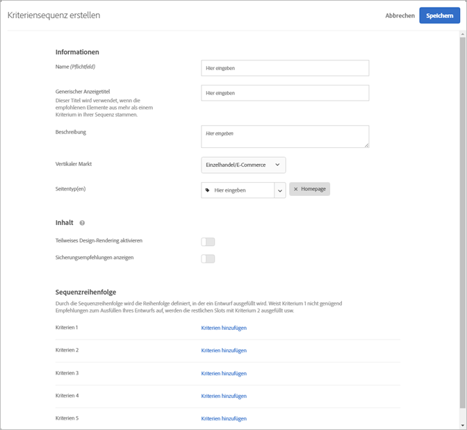
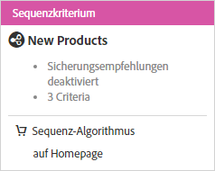

#  Kriteriensequenzen erstellen{#create-criteria-sequences}

Verwenden Sie Sequenzen von bis zu fünf Kriterien, um eine größere Kontrolle über die Elemente zu erhalten, die in Ihren Recommendations-Aktivitäten angezeigt werden.

>[!NOTE]
>
>Kriteriensequenzen können nicht mit [!UICONTROL Empfehlungs]-Aktivitäten verwendet werden, die vor der Version Oktober 2016 von [!DNL Target Premium] erstellt wurden.

Bevor Sie eine Kriteriensequenz erstellen können, müssen Sie zuerst die Kriterien erstellen, die in der Sequenz stehen sollen. Siehe [Erstellen von Kriterien](../../c-recommendations/c-algorithms/create-new-algorithm.md#task_8A9CB465F28D44899F69F38AD27352FE) für weitere Informationen.

Mithilfe einer Kriteriensequenz können Sie zusätzliche gezielte Empfehlungen bereitstellen, anstatt allgemeinere Reserveempfehlungen zu verwenden, wenn ein Kriterium nicht genügend Ergebnisse zurückgibt, um Ihr Design zu füllen. Eine Kriteriensequenz geht meist von einem spezifischeren Targeting, das möglicherweise weniger Ergebnisse zurückgibt, hin zu einem allgemeineren Targeting, das für gewöhnlich mehr Ergebnisse zurückgibt.

So kann zum Beispiel eine Kriteriensequenz für eine Produktseite in der folgenden Reihenfolge vorgehen:

1. Basierend auf dem aktuellen Artikel, von der gleichen Marke
1. Basierend auf dem aktuellen Artikel, von allen Marken
1. Basierend auf Inhaltsähnlichkeit
1. Basierend auf Topverkäufen
1. Basierend auf Artikeln, die auf der gesamten Website am häufigsten angezeigt wurden

Eine Kriteriensequenz für eine Startseite kann in der folgenden Reihenfolge vorgehen:

1. Basierend auf dem letzten Einkauf des Besuchers
1. Basierend auf dem Lieblingsartikel des Besuchers
1. Basierend auf der Lieblingskategorie des Besuchers
1. Basierend auf Topverkäufen
1. Basierend auf den Elementen, die auf der gesamten Website am häufigsten angezeigt wurden

Es gibt mehrere Möglichkeiten, um auf den Bildschirm [!UICONTROL Kriteriensequenz erstellen] zu gelangen. Einige Bildschirmoptionen variieren je nachdem, wie Sie auf den Bildschirm gelangen.

* Wenn Sie eine [!UICONTROL Recommendations]-Aktivität erstellen, klicken Sie im Bildschirm **[!UICONTROL Kriterien auswählen]** auf **[!UICONTROL Neu erstellen]** > [!UICONTROL Kriteriensequenz erstellen]. Sie haben die Möglichkeit, Ihre neue Kriteriensequenz zu speichern, um sie mit anderen [!UICONTROL Recommendations]-Aktivitäten zu verwenden.
* Wenn Sie eine [!UICONTROL Recommendations]-Aktivität bearbeiten, klicken Sie in ein Feld für die [!UICONTROL Empfehlungsposition] auf Ihrer Seite und wählen Sie **[!UICONTROL Kriterien ändern aus]**. Klicken Sie im Bildschirm [!UICONTROL Kriterien auswählen] auf **[!UICONTROL Neu erstellen]** > **[!UICONTROL Kriteriensequenz erstellen]**. Sie können Ihre neuen Kriterien speichern, um Sie mit anderen [!UICONTROL Recommendations]-Aktivitäten zu verwenden.
* Klicken Sie im Bildschirm der Bibliothek **[!UICONTROL Empfehlungen]** > **[!UICONTROL Kriterien]** auf **[!UICONTROL Kriterien erstellen]** > **[!UICONTROL Kriteriensequenz erstellen]**. Kriterien, die Sie hier erstellen, stehen automatisch für alle [!UICONTROL Recommendations]-Aktivitäten zur Verfügung.

1. Klicken Sie auf **[!UICONTROL Kriterien erstellen]** oder **[!UICONTROL Neu erstellen]**.

   

1. Wählen Sie **[!UICONTROL Kriteriensequenz erstellen]**.

   

1. Geben Sie einen **[!UICONTROL Namen]** für die Sequenz ein.

   Dies ist der „interne“ Name, der zur Beschreibung der Kriteriensequenz dient. Besuchern Ihrer Website wird dieser Name nicht angezeigt.
1. Geben Sie einen öffentlich sichtbaren **[!UICONTROL generischen Anzeigetitel]** ein, der auf der Seite angezeigt werden soll, wenn zum Ausfüllen des [!UICONTROL Empfehlungs]-Entwurfs mehrere Kriterien in der Sequenz verwendet werden.

   Ein Beispiel: Sie möchten die Zeichenfolge „Kunden, die diesen Artikel angezeigt haben, haben sich auch interessiert für …“ ersetzen. Stattdessen soll „Für Sie empfohlen“ angezeigt werden, wenn das Design Artikel enthält, die auf mehreren [!UICONTROL Recommendations]-Schlüsseln basieren.
1. Geben Sie eine kurze **[!UICONTROL Beschreibung]** der Kriteriensequenz ein.

   Die Beschreibung soll helfen, die Kriteriensequenz wiederzuerkennen, und kann Informationen über den Verwendungszweck der Sequenz enthalten.
1. Wählen Sie einen **[!UICONTROL vertikalen Markt]** aus.

   Ihr standardmäßiger vertikaler Markt wird automatisch angezeigt.
1. Wählen Sie einen **[!UICONTROL Seitentyp]** aus.

   Verschiedene Seitentypen stehen zur Verfügung.

   Vertikaler Markt und Seitentypen dienen beide zusammen zur Kategorisierung Ihrer gespeicherten Kriteriensequenz, was die Wiederverwendung von Sequenzen für andere [!UICONTROL Recommendations]-Aktivitäten vereinfacht.
1. Legen Sie Ihre **[!UICONTROL Inhaltsregeln]** fest.

   Wenn Sie eine Kriteriensequenz erstellen, werden Einstellungen für Reserveempfehlungen und partielles Design-Rendering für die einzelnen Kriterien ignoriert, aus denen die Sequenz gebildet wird. Wenn Sie Reserveempfehlungen und partielles Design-Rendering verwenden möchten, müssen Sie sie für die Sequenz aktivieren. Wählen Sie die entsprechenden Einstellungen aus. Wenn Sie Reserveempfehlungen zulassen, können Sie auch auswählen, ob für die Reserven Einschlussregeln gelten sollen.
1. Legen Sie die Sequenzreihenfolge fest.

1. Klicken Sie auf **[!UICONTROL Kriterien hinzufügen]**.
1. Wählen Sie im Bildschirm „Kriterien hinzufügen“ ein Kriterium aus.
1. Klicken Sie auf **[!UICONTROL Hinzufügen]**.

   Sie können einer Sequenz bis zu fünf Kriterien hinzufügen.
1. Klicken Sie auf **[!UICONTROL Speichern]**.

   Die Kriteriensequenz wird in der Kriterienliste angezeigt.

   

   Weitere Informationen zu den Empfehlungslogikoptionen finden Sie unter [Kriterien](../../c-recommendations/c-algorithms/algorithms.md#concept_4BD01DC437F543C0A13621C93A302750).

## Schulungsvideo: Kriterien in Recommendations erstellen (12:33) 

Dieses Video enthält die folgenden Informationen:

* Erstellen von Kriterien
* Erstellen von Kriteriensequenzen
* Hochladen benutzerdefinierter Kriterien

>[!VIDEO](https://video.tv.adobe.com/v/27694?quality=12)
