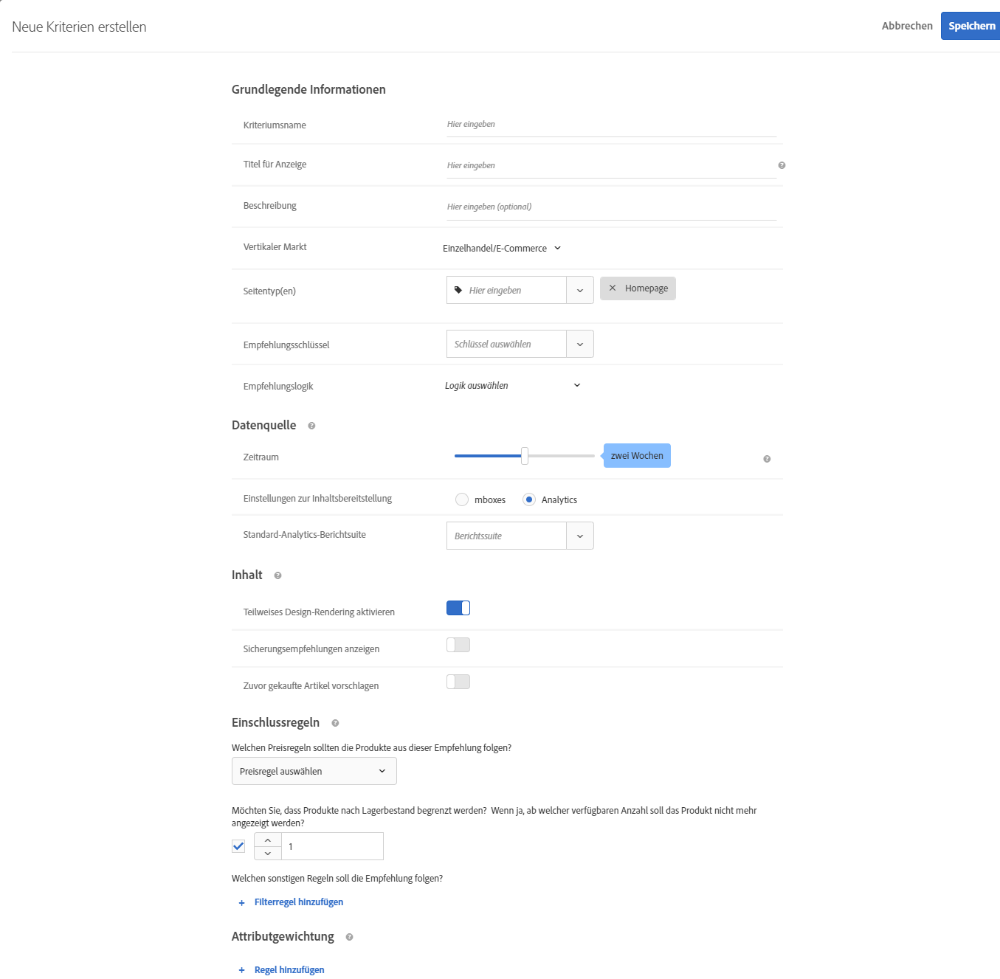

#  Kriterien erstellen

Kriterien in [!UICONTROL Adobe Target] [!UICONTROL Recommendations] den Inhalt Ihrer [!UICONTROL Recommendations] Aktivitäten. Erstellen Sie Kriterien zur Anzeige der Empfehlungen, die am besten zu Ihrer Aktivität passen. Diese Kriterien verwenden die Aktionen des Besuchers, um zu bestimmen, welcher Inhalt oder welche Produkte angezeigt werden sollen.

In den folgenden Abschnitten wird erläutert, wie ein neues Kriterium erstellt wird.

## Auf den Bildschirm &quot;Neue Kriterien erstellen&quot;zugreifen

Sie haben viele Möglichkeiten, um auf den Bildschirm [!UICONTROL Neue Kriterien erstellen] zu gelangen. Einige Bildschirmoptionen variieren je nachdem, wie Sie auf den Bildschirm gelangen.

* Auf **[!UICONTROL Recommendations]** > **[!UICONTROL Kriterien]** Bibliotheksbildschirm, klicken Sie **[!UICONTROL Kriterien erstellen]** > **[!UICONTROL Kriterien erstellen]**. Kriterien, die Sie hier erstellen, stehen automatisch für alle [!DNL Recommendations]-Aktivitäten zur Verfügung.
* Wenn Sie ein [!DNL Recommendations] Aktivität mit [!UICONTROL Visual Experience Composer] (VEC), werden Sie sofort zur [!UICONTROL Kriterien auswählen] angezeigt, nachdem Sie ein Element auf Ihrer Seite ausgewählt haben und klicken Sie auf [!UICONTROL Mit Recommendations ersetzen], [!UICONTROL Recommendations einfügen vor]oder [!UICONTROL Recommendations einfügen nach]. Sie können dann ein verfügbares Kriterium auswählen oder auf **[!UICONTROL Kriterien erstellen]**. Wenn Sie ein neues Kriterium erstellen, haben Sie die Möglichkeit, Ihre Kriterien zur Verwendung mit anderen zu speichern [!DNL Recommendations] Aktivitäten. Weitere Informationen finden Sie unter [Recommendations-Aktivität erstellen](/help/c-recommendations/t-create-recs-activity/create-recs-activity.md).
* Klicken Sie beim Bearbeiten einer [!DNL Recommendations]Aktivität in ein Feld für die [!UICONTROL Empfehlungsposition] auf Ihrer Seite und wählen Sie **[!UICONTROL Kriterien ändern]**. Auf [!UICONTROL Kriterien auswählen] Bildschirm, klicken Sie **[!UICONTROL Kriterien erstellen]**. Sie können Ihre neuen Kriterien speichern, um Sie mit anderen [!DNL Recommendations]-Aktivitäten zu verwenden.

Die folgenden Schritte setzen voraus, dass Sie auf [!UICONTROL Neue Kriterien erstellen] Bildschirm mit der ersten Methode: die **[!UICONTROL Recommendations]** > **[!UICONTROL Kriterien]** Bibliotheksbildschirm.

1. Klick **[!UICONTROL Recommendations]** > **[!UICONTROL Kriterien]**.

1. Klick **[!UICONTROL Kriterien erstellen]** > **[!UICONTROL Kriterien erstellen]**.

   

1. Konfigurieren Sie die Informationen in den folgenden Abschnitten.

## [!UICONTROL Basisinformationen  ] {#info}

1. Geben Sie einen **[!UICONTROL Kriteriennamen]** ein.

   Dies ist der „interne“ Name, der für die Beschreibung der Kriterien verwendet wird. Sie möchten zum Beispiel Ihre Kriterien „Produkte mit der höchsten Marge“ nennen, Sie möchten jedoch nicht, dass dieser Titel öffentlich angezeigt wird. Sehen Sie sich den nächsten Schritt an, um den öffentlichen Titel festzulegen.

   

1. Geben Sie einen öffentlichen **[!UICONTROL Anzeigetitel]** ein, der auf der Seite für alle Empfehlungen angezeigt wird, die diesen Kriterien entsprechen.

   So wäre es möglicherweise sinnvoll, „Personen, die das ansahen, sahen auch dies an“ oder „Ähnliche Produkte“ einzublenden, wenn Sie diese Kriterien zum Einblenden von Empfehlungen verwenden.

1. Geben Sie eine kurze **[!UICONTROL Beschreibung]** des Kriteriums ein.

   Die Beschreibung soll Ihnen dabei helfen, die Kriterien zu identifizieren und kann Informationen über den Zweck der Kriterien enthalten.

1. Wählen Sie eine vertikale Branche basierend auf den Zielen Ihrer Empfehlungs-Aktivität aus.

   | Vertikaler Markt | Ziel |
   |--- |--- |
   | Einzelhandel/E-Commerce | Zum Kauf führende Konversion |
   | Lead-Generierung/B2B/Finanzdienstleistungen | Konversion ohne Kauf |
   | Medien/Verlagswesen | Interaktion |

   Andere Optionen für Kriterien ändern sich auf Grundlage des vertikalen Markts, den Sie auswählen.

1. Wählen Sie einen **[!UICONTROL Seitentyp]** aus.

   Verschiedene Seitentypen stehen zur Verfügung.

   Vertikaler Markt und Seitentyp werden zusammen genutzt, um Ihre gespeicherten Kriterien zu kategorisieren, wodurch die Wiederverwendung der Kriterien für andere [!DNL Recommendations]-Aktivitäten erleichtert wird.

## [!UICONTROL Recommendations Algorithmus] {#rec-algo}

1. Wählen Sie eine **[!UICONTROL Algorithmustyp]** und **[!UICONTROL Algorithmus]**:

   

   | Algorithmustyp | Wann wird | Verfügbare Algorithmen |
   | --- | --- | --- |
   | [!UICONTROL Popularitätsbasiert] | Erstellen Sie Empfehlungen basierend auf der allgemeinen Beliebtheit eines Elements auf Ihrer Site oder basierend auf der Beliebtheit von Elementen in der bevorzugten oder am häufigsten angezeigten Kategorie, Marke, Kategorie usw. eines Benutzers. | <ul><li>Am häufigsten auf der gesamten Site angezeigt</li><li>Am häufigsten angezeigt nach Kategorie</li><li>Am häufigsten nach Elementattribut angezeigt</li><li>Topverkäufe quer durch die Site</li><li>Topverkäufe nach Kategorie</li><li>Topverkäufe nach Elementattribut</li><li>Top nach Analytics-Metrik</li></ul> |
   | [!UICONTROL Elementbasiert] | Erstellen Sie Empfehlungen, indem Sie ähnliche Elemente wie ein Element finden, das der Benutzer gerade anzeigt oder kürzlich angesehen hat. | <ul><li>Personen, die das ansahen, sahen auch dies an</li><li>Personen, die das ansahen, kauften dies</li><li>Personen, die das kauften, kauften dies</li><li>Elemente mit ähnlichen Attributen</li></ul> |
   | [!UICONTROL Benutzerbasiert] | Treffen Sie Empfehlungen auf Basis des Benutzerverhaltens. | <ul><li>Vor Kurzem aufgerufene Artikel </li><li>Empfohlen für Sie</li></ul> |
   | Warenkorb-basiert | Erstellen Sie Empfehlungen basierend auf dem Inhalt des Warenkorbs des Benutzers. | <ul><li>Personen, die diese ansahen, sahen diese an</li><li>Personen, die diese ansahen, kauften diese</li><li>Personen, die diese kauften, kauften diese</li></ul> |
   | [!UICONTROL Benutzerdefinierte Kriterien] | Erstellen Sie Empfehlungen basierend auf einer hochgeladenen benutzerdefinierten Datei. | <ul><li>Benutzerspezifischer Algorithmus</li></ul> |

   >[!NOTE]
   >
   >Wenn Sie **[!UICONTROL Elemente]**/ **[!UICONTROL Medien mit ähnlichen Attributen]**, können Sie [Übereinstimmungsregeln für Inhalte](#similarity).

1. Wählen Sie je nach Bedarf eine **Elementattribut** und **Profil-Attribut übereinstimmend**, a **Empfehlungsschlüssel**, **Filterschlüssel**, und/oder **Analytics-Metrik** um den Algorithmus zu konfigurieren.

Weitere Informationen zur Auswahl eines Empfehlungsschlüssels finden Sie unter [Empfehlung auf einem Empfehlungsschlüssel basieren](/help/c-recommendations/c-algorithms/base-the-recommendation-on-a-recommendation-key.md).

## [!UICONTROL Datenquelle] {#data-source}

1. Wählen Sie die gewünschte **[!UICONTROL Verhaltensdatenquelle]**: [!UICONTROL Adobe Target] oder [!UICONTROL Analytics].

   >[!NOTE]
   >
   >Die [!UICONTROL Verhaltensdatenquelle] Abschnitt wird nur angezeigt, wenn Ihre Implementierung [Analytics für Zielgruppe](/help/c-integrating-target-with-mac/a4t/a4t.md) (A4T).

   

   Wenn Sie sich für [!UICONTROL Analytics] entschieden haben, wählen Sie die gewünschte Report Suite.

   Wenn die Kriterien [!DNL Adobe Analytics] da die Verhaltensdatenquelle nach ihrer Erstellung von der Zeit für die Verfügbarkeit der Kriterien abhängt, ob die ausgewählte Report Suite und das Lookback-Fenster für andere Kriterien verwendet wurden, wie im Folgenden erläutert:

   * **Einmalige Einrichtung der Report Suite**: Wenn eine Report Suite zum ersten Mal mit einem Datumsbereich-Lookback-Fenster verwendet wird, kann es zwei bis sieben Tage dauern, bis [!DNL Target Recommendations] die Verhaltensdaten für die ausgewählte Report Suite von [!DNL Analytics] vollständig heruntergeladen hat. Dieser Zeitraum ist abhängig von [!DNL Analytics] Systemlast.
   * **Neue oder bearbeitete Kriterien mit einer bereits verfügbaren Report Suite**: Wenn Sie ein neues Kriterium erstellen oder ein vorhandenes Kriterium bearbeiten und die ausgewählte Report Suite bereits mit [!DNL Target Recommendations] verwendet wurde und der Datumsbereich gleich oder kleiner als der ausgewählte Datumsbereich ist, sind die Daten unmittelbar verfügbar und es ist keine einmalige Einrichtung erforderlich. In diesem Fall oder wenn die Einstellungen eines Algorithmus bearbeitet werden, ohne dass die ausgewählte Report Suite oder der ausgewählte Datumsbereich geändert wird, wird der Algorithmus innerhalb von 12 Stunden ausgeführt bzw. erneut ausgeführt.
   * **Laufende Ausführung von Algorithmen**: Daten werden täglich von [!DNL Analytics] zu [!DNL Target Recommendations] übertragen. Beispiel: Wenn sich ein Benutzer ein Produkt ansieht, wird für die Empfehlung [!UICONTROL Viewed Affinity] in nahezu Echtzeit ein Produktansichts-Tracking-Aufruf an [!DNL Analytics] gesendet. Die [!DNL Analytics]-Daten werden am Morgen des nächsten Tages an [!DNL Target] gesendet und [!DNL Target] führt den Algorithmus in weniger als 12 Stunden aus.

   Weitere Informationen finden Sie unter [Adobe Analytics mit Zielgruppe Recommendations verwenden](/help/c-recommendations/c-algorithms/use-adobe-analytics-with-recommendations.md).

1. Festlegen der **[!UICONTROL Lookback-Fenster]** um den Zeitraum der verfügbaren historischen Benutzerverhaltensdaten zu bestimmen, die bei der Bestimmung der anzuzeigenden Empfehlungen verwendet werden sollen. Diese Option ist für alle Algorithmen mit Ausnahme von Elementen mit ähnlichen Attributen und benutzerspezifischen Algorithmen verfügbar.

   

   Wählen Sie ein kürzeres Datenfenster, wenn Ihre Site durch hohes Traffic-Aufkommen und häufig wechselndes Verhalten gekennzeichnet ist. Ein kürzeres Fenster ermöglicht es [!DNL Recommendations], besser auf Änderungen am Markt und in Ihrem Unternehmen zu reagieren. Ein kürzeres Fenster bedeutet zum Beispiel, dass [!DNL Recommendations] Änderungen im Besucherverhalten erkennt, wenn Ihre Besucher Saisoneinkäufe absolvieren - wie etwa zum Schulanfang oder zu Weihnachten –, und Artikel empfiehlt, die zur jeweiligen Einkaufssaison passen.

   Wenn Sie nur über wenige Daten verfügen oder das Besucherverhalten sich nur selten ändert, können Sie ein längeres Fenster auswählen. Für viele Sites führt ein kürzeres Fenster jedoch zu Empfehlungen höherer Qualität.

   Die verfügbaren Datenbereiche sind:

   | Option &quot;Lookback-Fenster&quot; | Aktualisierte Frequenz (wird beim Bewegen des Mauszeigers angezeigt) | Unterstützte Algorithmen |
   | --- | --- | --- |
   | Sechs Stunden | Algorithmus wird alle 3-6 Stunden ausgeführt | [!UICONTROL Popularitätsbasiert] Algorithmen bei Auswahl [!UICONTROL Verhaltensdatenquelle] ist [!DNL Adobe Target] |
   | Ein Tag | Algorithmus wird alle 12-24 Stunden ausgeführt | [!UICONTROL Popularitätsbasiert] Algorithmen |
   | Zwei Tage | Algorithmus wird alle 12-24 Stunden ausgeführt | <ul><li>[!UICONTROL Popularitätsbasiert] Algorithmen</li><li>[!UICONTROL Elementbasiert] Algorithmen</li><li>[!UICONTROL Benutzerbasiert] Algorithmen</li><li>[!UICONTROL Warenkorb-basiert] Algorithmen</li></ul> |
   | Eine Woche | Algorithmus wird alle 24-48 Stunden ausgeführt | <ul><li>[!UICONTROL Popularitätsbasiert] Algorithmen</li><li>[!UICONTROL Elementbasiert] Algorithmen</li><li>[!UICONTROL Benutzerbasiert] Algorithmen</li><li>[!UICONTROL Warenkorb-basiert] Algorithmen</li></ul> |
   | Zwei Woche | Algorithmus wird alle 24-48 Stunden ausgeführt | <ul><li>[!UICONTROL Popularitätsbasiert] Algorithmen</li><li>[!UICONTROL Elementbasiert] Algorithmen</li><li>Alle [!UICONTROL Benutzerbasiert] Algorithmen</li><li>[!UICONTROL Warenkorb-basiert] Algorithmen</li></ul> |
   | Ein Monat (30 Tage) | Algorithmus wird alle 24-48 Stunden ausgeführt | <ul><li>[!UICONTROL Popularitätsbasiert] Algorithmen</li><li>[!UICONTROL Elementbasiert] Algorithmen</li><li>[!UICONTROL Benutzerbasiert] Algorithmen</li><li>[!UICONTROL Warenkorb-basiert] Algorithmen</li></ul> |
   | Zwei Monate (61 Tage) | Algorithmus wird alle 24-48 Stunden ausgeführt | <ul><li>[!UICONTROL Popularitätsbasiert] Algorithmen</li><li>[!UICONTROL Elementbasiert] Algorithmen</li><li>[!UICONTROL Benutzerbasiert] Algorithmen</li><li>[!UICONTROL Warenkorb-basiert] Algorithmen</li></ul> |

## [!UICONTROL Sicherungsinhalt] {#content}

[!UICONTROL Sicherungsinhalt] bestimmt, was passiert, wenn die Anzahl der empfohlenen Elemente Ihre [Empfehlungsdesign](/help/c-recommendations/c-design-overview/design-overview.md). Möglicherweise geben [!DNL Recommendations]-Kriterien weniger Empfehlungen zurück, als im Entwurf angegeben sind. Wenn Ihr Entwurf beispielsweise Slots für vier Elemente enthält, aufgrund Ihrer Kriterien jedoch nur zwei Elemente empfohlen werden, können Sie die verbleibenden Slots leer lassen, Sicherungsempfehlungen zum Ausfüllen der zusätzlichen Slots verwenden oder keine Empfehlungen anzeigen.

1. (Optional) Schieben Sie die **[!UICONTROL Teilweises Design-Rendering]** zur &quot;on&quot;-Position umschalten.

   Es werden so viele Slots wie möglich ausgefüllt, aber die Design-Vorlage enthält möglicherweise Leerraum für die restlichen Slots. Wenn diese Option deaktiviert ist und nicht genügend Inhalt zum Ausfüllen aller verfügbaren Slots vorhanden ist, werden keine Empfehlungen bereitgestellt und stattdessen der Standardinhalt angezeigt.

   Aktivieren Sie diese Option, wenn Empfehlungen mit leeren Slots bereitgestellt werden sollen. Verwenden Sie Sicherungsempfehlungen, wenn Sie möchten, dass Empfehlungssteckplätze mit Inhalten gefüllt werden, die auf Ihren Kriterien basieren, und zwar mit leeren Slots, die mit ähnlichen oder beliebten Inhalten aus Ihrer Site gefüllt werden, wie im nächsten Schritt erläutert.

1. (Optional) Schieben Sie die **[!UICONTROL Sicherungsinhalt anzeigen]** zur &quot;on&quot;-Position umschalten.

   Füllen Sie alle verbleibenden leeren Slots im Design mit einer zufälligen Auswahl der am häufigsten angezeigten Produkte aus Ihrer gesamten Site aus.

   Die Verwendung von Sicherungsempfehlungen stellt sicher, dass Ihr Empfehlungsentwurf alle verfügbaren Plätze ausfüllt. Angenommen, Sie haben ein Design von 4 x 1, wie unten dargestellt:

   

   Angenommen, Ihre Kriterien führen dazu, dass nur zwei Elemente empfohlen werden. Wenn Sie die [!UICONTROL Teilweises Design-Rendering] -Option, werden die ersten beiden Slots ausgefüllt, die restlichen beiden Slots bleiben jedoch leer. Wenn Sie jedoch die [!UICONTROL Backup Recommendations anzeigen] -Option, werden die ersten beiden Slots nach Ihren angegebenen Kriterien ausgefüllt und die restlichen zwei Slots werden gemäß Ihren Sicherungsempfehlungen ausgefüllt.

   Die folgende Matrix zeigt das Ergebnis, das Sie bei der Verwendung der [!UICONTROL Teilweises Design-Rendering] und [!UICONTROL Sicherungsinhalt] Optionen:

   | Teilweises Entwurfs-Rendering | Sicherungsinhalt | Ergebnis |
   |--- |--- |--- |
   | Deaktiviert | Deaktiviert | Wenn weniger Empfehlungen zurückgegeben werden als im Entwurf vorgesehen, wird der Empfehlungsentwurf durch Standardinhalte ersetzt und es erscheinen keine Empfehlungen. |
   | Aktiviert | Deaktiviert | Der Entwurf wird gerendert, kann jedoch leere Positionen enthalten, falls weniger Empfehlungen zurückgegeben werden, als im Entwurf vorgesehen. |
   | Aktiviert | Aktiviert | Ersatzempfehlungen erscheinen an solchen leeren Positionen und vervollständigen den Entwurf. Sollte die Anwendung von Einschlussregeln auf die Ersatzempfehlungen die Anzahl an geeigneten Ersatzempfehlungen so stark einschränken, dass der Entwurf nicht vervollständigt werden kann, wird der Entwurf nur teilweise gerendert. In dem Fall, dass die Kriterien keine Empfehlungen zurückgeben und die Einschlussregeln die Ersatzempfehlungen auf null reduzieren, wird der Entwurf durch Standardinhalte ersetzt. |
   | Deaktiviert | Aktiviert | Ersatzempfehlungen erscheinen an solchen leeren Positionen und vervollständigen den Entwurf. Sollte die Anwendung von Einschlussregeln auf die Ersatzempfehlungen die Anzahl an geeigneten Ersatzempfehlungen so stark einschränken, dass der Entwurf nicht vervollständigt werden kann, wird der Entwurf durch Standardinhalte ersetzt und es werden keine Empfehlungen angezeigt. |

   Weitere Informationen finden Sie unter [Sicherungsempfehlung verwenden](/help/c-recommendations/c-algorithms/backup-recs.md).

1. (Bedingt) Wenn Sie ausgewählt haben **[!UICONTROL Sicherungsinhalt anzeigen]** im vorherigen Schritt können Sie **[!UICONTROL Einschlussregeln auf Sicherungsempfehlungen anwenden]**.

   Einschlussregeln bestimmen, welche Elemente in Ihren Empfehlungen enthalten sind. Die verfügbaren Optionen hängen von Ihrem vertikalen Markt ab.

   Weitere Informationen finden Sie unter [Einschlussregeln angeben](#inclusion) unten.

1. (Optional) Schieben Sie die **[!UICONTROL Zuvor gekaufte Artikel empfehlen]** zur &quot;on&quot;-Position umschalten.

   Diese Einstellung basiert auf `productPurchasedId`. Das Standardverhalten ist es, zuvor gekaufte Artikel nicht zu empfehlen. In den meisten Fällen ist es nicht sinnvoll, Artikel zu bewerben, die Kunden kürzlich gekauft haben. Es ist nützlich, wenn Sie Artikel verkaufen, die Kunden in der Regel nur einmal kaufen, zum Beispiel Kayaks. Wenn Sie Artikel verkaufen, die Personen wiederholt kaufen, wie Shampoo oder andere persönliche Artikel, sollten Sie diese Option aktivieren.

## Ähnlichkeit von Inhalten {#similarity}

Verwenden Sie Regeln zur [!UICONTROL Ähnlichkeit von Inhalten] für die Bereitstellung von Empfehlungen basierend auf Artikeln oder Medienattributen.

>[!NOTE]
>
>Bei Auswahl von **[!UICONTROL Elementbasiert]**/ **[!UICONTROL Medien mit ähnlichen Attributen]** als Algorithmustyp und Algorithmus haben Sie die Möglichkeit, Übereinstimmungsregeln für Inhalte festzulegen.

Mithilfe der Funktion für Ähnlichkeit von Inhalten werden Artikelattribut-Schlüsselwörter verglichen und Empfehlungen basierend darauf erstellt, wie viele Schlüsselwörter die verschiedenen Artikel gemeinsam haben. Empfehlungen, die auf der Ähnlichkeit von Inhalten basieren, benötigen für herausragende Ergebnisse keine historischen Daten.

Eine Erstellung von Empfehlungen anhand der Ähnlichkeit von Inhalten ist besonders bei neuen Artikeln effektiv, die bei Empfehlungen mit der Funktion *Personen, die das ansahen, sahen auch dies an* und anderen, auf historischem Verhalten von Benutzern basierenden Optionen nicht angezeigt werden. Anhand der Ähnlichkeit von Inhalten können sinnvolle Empfehlungen für neue Benutzer erstellt werden, für die noch keine historischen Daten oder Einkäufe verzeichnet wurden.

Bei Auswahl von **[!UICONTROL Elementbasiert]**/ **[!UICONTROL Medien mit ähnlichen Attributen]**, haben Sie die Möglichkeit, Regeln zu erstellen, um die Bedeutung bestimmter Elementattribute bei der Bestimmung von Empfehlungen zu erhöhen oder zu verringern. Bei Artikeln wie beispielsweise Büchern möchten Sie möglicherweise die Bedeutung von Attributen wie *Genre*, *Autor*, *Serie* und so weiter hervorheben, um ähnliche Bücher zu empfehlen.

Da beim Vergleich der Ähnlichkeit von Inhalten Stichwörter verwendet werden, führen einige Attribute wie *Botschaft* oder *Beschreibung* zu einer Verwässerung der Vergleiche. Sie können daher Regeln erstellen, mit denen solche Attribute ignoriert werden.

Standardmäßig sind alle Attribute auf den Wert *Grundlinie* eingestellt. Sie müssen keine Regeln erstellen, wenn Sie diese Einstellung nicht ändern möchten.

>[!NOTE]
>
>Der Algorithmus zur Ähnlichkeit des Inhalts verwendet unter Umständen Stichproben bei der Berechnung der Ähnlichkeit zwischen Elementen. Infolgedessen können sich die Ähnlichkeitsberechtigungen zwischen den Elementen zwischen den Algorithmusabläufen unterscheiden.

## Einschlussregeln {#inclusion}

Mehrere Optionen ermöglichen es Ihnen, die in Ihren Empfehlungen angezeigten Elemente einzuschränken. Sie können Einschlussregeln beim Erstellen von Kriterien oder Promotions verwenden.

Einschlussregeln sind optional. Das Festlegen dieser Regeln jedoch ermöglicht Ihnen die bessere Steuerung der Artikel, die in Ihren Empfehlungen erscheinen. Jedes konfigurierte Detail schränkt die Anzeigekriterien weiter ein.

Beispiel: Sie können nur Damenschuhe anzeigen, deren Bestand über 50 und deren Preis zwischen 25 und 45 Euro liegt. Sie können auch jedes Attribut gewichten, sodass die für Ihr Unternehmen wichtigeren Artikel am ehesten angezeigt werden.

Weiteres Beispiel: Sie können Stellenangebote ausschließlich für Besucher Ihrer Website anzeigen, die aus bestimmten Orten stammen und über die erforderlichen Abschlüsse verfügen.

Die Optionen für die Einschlussregeln variieren je nach vertikalem Markt. Einschlussregeln werden standardmäßig auf Ersatzempfehlungen angewendet.

>[!IMPORTANT]
>
>Sie sollten mit Einschlussregeln vorsichtig umgehen. Sie sind nützlich, wenn Ihr Unternehmen beispielsweise mit Regeln arbeitet, die erfordern, dass eine Marke nicht empfohlen wird, während eine andere Marke gezeigt wird. Bei dieser Funktion kommt es jedoch zu Opportunitätskosten. Ein gewisser Lift-Prozentsatz geht möglicherweise verloren, wenn Artikel nicht angezeigt werden, die normalerweise durch die Aktivitätskriterien angezeigt werden würden.

Die Einschlussregeln werden mit „AND“ verbunden. Alle Regeln müssen erfüllt sein, damit ein Artikel in den Empfehlungen berücksichtigt wird.

Führen Sie zum Erstellen einer einfachen Einschlussregel die folgenden Schritte aus, um - wie im oben stehenden Beispiel - nur Damenschuhe mit einem Bestand von mehr als 50 und einem Preis von zwischen 25 und 45 € anzuzeigen.

1. Legen Sie einen Preisbereich für die Produkte fest, die Sie empfehlen möchten.
1. Legen Sie den Mindestbestand für die Produkte fest, die Sie empfehlen möchten.
1. Konfigurieren Sie die Empfehlung, um nur Artikel anzuzeigen, wenn sie bestimmte Kriterien erfüllen.

   

   Sie können angeben, dass Artikel nur berücksichtigt werden, wenn eines der Attribute in der Liste eine oder mehrere angegebene Bedingungen erfüllt oder nicht erfüllt.

   Die verfügbaren Auswerter sind von dem Wert abhängig, den Sie in der ersten Dropdownliste auswählen. Sie können mehrere Elemente auflisten. Diese Artikel werden durch ODER ausgewertet.

   Mehrere Regeln werden mit „AND“ kombiniert.

   >[!NOTE]
   >
   >Diese Option beschränkt die in der Empfehlung angezeigten Elemente. Sie hat keine Auswirkungen darauf, auf welchen Seiten die Empfehlung angezeigt wird. Um eine Einschränkung bezüglich der Anzeige der Empfehlung vorzunehmen, wählen Sie die Seiten im Experience Composer aus.

Weitere Informationen finden Sie unter [Dynamische und statische Inklusionsregeln verwenden](/help/c-recommendations/c-algorithms/use-dynamic-and-static-inclusion-rules.md).

## Attributgewichtung {#weighting}

Sie können mehrere Regeln hinzufügen, um den Algorithmus auf der Grundlage wichtiger Informationen oder Metadaten über den Inhaltskatalog zu &quot;verschieben&quot;, sodass bestimmte Elemente mit größerer Wahrscheinlichkeit angezeigt werden.

So haben Sie zum Beispiel die Möglichkeit, rabattierten Artikeln eine höherer Gewichtung zu verleihen, damit sie öfter in den Empfehlungen erscheinen. Artikel, die nicht Teil des Sonderangebots sind, werden nicht vollständig ausgeschlossen, jedoch weniger häufig angezeigt. Auf denselben Algorithmus können mehrere gewichtete Attribute angewendet werden und die gewichteten Attribute können mit dem in der Empfehlung aufgeteilten Traffic getestet werden.

1. Wählen Sie einen Wert aus.

   Der Wert bestimmt den Typ des Elements, das mit größerer Wahrscheinlichkeit und auf der Basis mehrerer verfügbarer Kriterien angezeigt wird.

1. Wählen Sie einen Auswerter.

1. Geben Sie das Keyword ein, um die Regelattribute abzuschließen.

   Die vollständige Regel könnte beispielsweise lauten: &quot;Kategorie enthält Unterzeichenfolgen-Schuhe.&quot;

   

1. Wählen Sie die Wertigkeit aus, die der Regel zugeordnet werden soll.

   Die Gewichtung kann von 0 bis 100 in 25er-Schritten eingestellt werden.

1. Fügen Sie nach Bedarf weitere Regeln hinzu.

Klicken Sie abschließend auf **[!UICONTROL Speichern]**.

Wenn Sie eine neue [!UICONTROL Recommendations]-Aktivität erstellen oder eine bestehende bearbeiten, wird das Kontrollkästchen **[!UICONTROL Kriterien für später speichern]** automatisch aktiviert. Sollten Sie die Kriterien nicht in anderen Aktivitäten verwenden wollen, deaktivieren Sie das Kontrollkästchen, bevor Sie speichern.

## Schulungsvideo: Kriterien in Recommendations erstellen (12:33) 

Dieses Video enthält die folgenden Informationen:

* Erstellen von Kriterien
* Erstellen von Kriteriensequenzen
* Hochladen benutzerdefinierter Kriterien

>[!VIDEO](https://video.tv.adobe.com/v/27694?quality=12)
