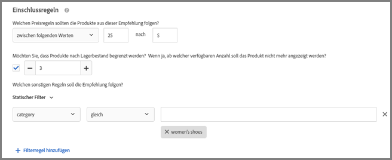
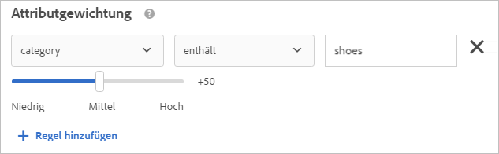
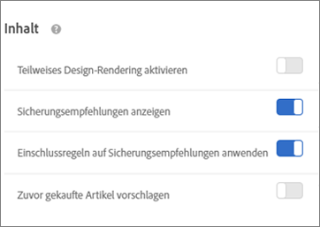
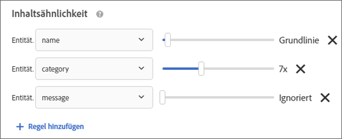

#  Kriterien erstellen{#create-criteria}

Kriterien steuern den Inhalt Ihrer Recommendations-Aktivitäten. Erstellen Sie Kriterien zur Anzeige der Empfehlungen, die am besten zu Ihrer Aktivität passen.

## Erstellen von Kriterien {#task_8A9CB465F28D44899F69F38AD27352FE}

Kriterien steuern den Inhalt Ihrer [!DNL Recommendations]-Aktivitäten. Erstellen Sie Kriterien zur Anzeige der Empfehlungen, die am besten zu Ihrer Aktivität passen.

Sie haben viele Möglichkeiten, um auf den Bildschirm [!UICONTROL Neue Kriterien erstellen] zu gelangen. Einige Bildschirmoptionen variieren je nachdem, wie Sie auf den Bildschirm gelangen.

* Wenn Sie eine [!DNL Recommendations]**[!UICONTROL -Aktivität erstellen, klicken Sie auf Neu erstellen]** auf dem Bildschirm [!UICONTROL Kriterien auswählen]. Sie können Ihre neuen Kriterien speichern, um Sie mit anderen [!DNL Recommendations]-Aktivitäten zu verwenden.
* Klicken Sie beim Bearbeiten einer [!DNL Recommendations]Aktivität in ein Feld für die [!UICONTROL Empfehlungsposition] auf Ihrer Seite und wählen Sie **[!UICONTROL Kriterien ändern]**. Klicken Sie auf dem Bildschirm [!UICONTROL Kriterien auswählen] auf **[!UICONTROL Neu erstellen]**. Sie können Ihre neuen Kriterien speichern, um Sie mit anderen [!DNL Recommendations]-Aktivitäten zu verwenden.
* Klicken Sie auf dem Bibliotheksbildschirm unter **[!UICONTROL Empfehlungen]** > **[!UICONTROL Kriterien]** auf **[!UICONTROL Kriterien erstellen]**. Kriterien, die Sie hier erstellen, stehen automatisch für alle [!DNL Recommendations]-Aktivitäten zur Verfügung.

1. Klicken Sie auf **[!UICONTROL Kriterien erstellen]** oder **[!UICONTROL Neu erstellen]**.

   

1. Wählen Sie **[!UICONTROL Kriterien erstellen]**.

   

1. Geben Sie einen **[!UICONTROL Kriteriennamen]** ein.

   Dies ist der „interne“ Name, der für die Beschreibung der Kriterien verwendet wird. Sie möchten zum Beispiel Ihre Kriterien „Produkte mit der höchsten Marge“ nennen, Sie möchten jedoch nicht, dass dieser Titel öffentlich angezeigt wird. Sehen Sie sich den nächsten Schritt an, um den öffentlichen Titel festzulegen.

1. Geben Sie einen öffentlichen **[!UICONTROL Anzeigetitel]** ein, der auf der Seite für alle Empfehlungen angezeigt wird, die diesen Kriterien entsprechen.

   So wäre es möglicherweise sinnvoll, „Personen, die das ansahen, sahen auch dies an“ oder „Ähnliche Produkte“ einzublenden, wenn Sie diese Kriterien zum Einblenden von Empfehlungen verwenden.

1. Geben Sie eine kurze **[!UICONTROL Beschreibung]** des Kriteriums ein.

   Die Beschreibung soll dazu beitragen, dass Sie das Kriterium identifizieren können, und kann Informationen über den Zweck des Kriteriums enthalten.

1. Wählen Sie eine **[!UICONTROL Branche]** aus:

   * [!UICONTROL Einzelhandel/E-Commerce]
   * [!UICONTROL Lead-Generierung/B2B/Finanzdienstleistungen]
   * [!UICONTROL Medien/Verlagswesen]

   Andere Optionen für Kriterien ändern sich auf Grundlage des vertikalen Markts, den Sie auswählen.

1. Wählen Sie einen **[!UICONTROL Seitentyp]** aus.

   Verschiedene Seitentypen stehen zur Verfügung.

   Vertikaler Markt und Seitentyp werden zusammen genutzt, um Ihre gespeicherten Kriterien zu kategorisieren, wodurch die Wiederverwendung der Kriterien für andere [!DNL Recommendations]-Aktivitäten erleichtert wird.

1. Wählen Sie einen **[!UICONTROL Empfehlungsschlüssel]** aus.

   Weitere Informationen zum Stützen von Kriterien auf einen Schlüssel finden Sie unter [Stützen der Empfehlung auf einen Empfehlungsschlüssel](../../c-recommendations/c-algorithms/create-new-algorithm.md#task_2B0ED54AFBF64C56916B6E1F4DC0DC3B).

1. Wählen Sie die **[!UICONTROL Empfehlungslogik]** aus.

   Weitere Informationen zu den Empfehlungslogikoptionen finden Sie unter [Kriterien](../../c-recommendations/c-algorithms/algorithms.md#concept_4BD01DC437F543C0A13621C93A302750).

   >[!NOTE]
   >
   >If you select **[!UICONTROL Items]**/ **[!UICONTROL Media with Similar Attributes]**, you will have the option to set [content similarity rules](../../c-recommendations/c-algorithms/create-new-algorithm.md#concept_5402DAFA279C4E46A9A449526889A0CB).

1. Legen Sie den **[!UICONTROL Datumsbereich]** fest, um den Zeitraum der verfügbaren historischen Benutzerverhaltensdaten festzulegen, die bei der Bestimmung der anzuzeigenden Empfehlungen verwendet werden.

   Wählen Sie ein kürzeres Datenfenster, wenn Ihre Site durch hohes Traffic-Aufkommen und häufig wechselndes Verhalten gekennzeichnet ist. Ein kürzeres Fenster ermöglicht es [!DNL Recommendations], besser auf Änderungen am Markt und in Ihrem Unternehmen zu reagieren. Ein kürzeres Fenster bedeutet zum Beispiel, dass [!DNL Recommendations] Änderungen im Besucherverhalten erkennt, wenn Ihre Besucher Saisoneinkäufe absolvieren - wie etwa zum Schulanfang oder zu Weihnachten –, und Artikel empfiehlt, die zur jeweiligen Einkaufssaison passen.

   Wenn Sie nur über wenige Daten verfügen oder das Besucherverhalten sich nur selten ändert, können Sie ein längeres Fenster auswählen. Bei vielen Websites führt ein kürzeres Fenster jedoch zu besseren Empfehlungen.

   Die verfügbaren Datenbereiche sind:

   * Zwei Tage
   * Eine Woche
   * Zwei Woche
   * Ein Monat
   * Zwei Monate

1. Wählen Sie die gewünschte **[!UICONTROL Verhaltensdatenquelle]**: [!UICONTROL Mboxes] oder [!UICONTROL Analytics].

   Wenn Sie sich für [!UICONTROL Analytics] entschieden haben, wählen Sie die gewünschte Report Suite.

1. Legen Sie Ihre **[!UICONTROL Inhaltsregeln]** fest.

   Inhaltsregeln bestimmen, was passiert, wenn die Anzahl an empfohlenen Artikeln Ihren Entwurf nicht vollständig füllt. Wenn Ihr Entwurf beispielsweise Platz für fünf Artikel bietet, Ihre Kriterien jedoch nur drei Artikelempfehlungen bereitstellen, können Sie den verbleibenden Platz leer lassen oder ihn mit Ersatzempfehlungen füllen.

   Wählen Sie die entsprechenden Einstellungen aus:

   * [!UICONTROL Teilweise Designwiedergabe aktivieren]
   * [!UICONTROL Backup-Empfehlungen anzeigen]
   * [!UICONTROL Zuvor gekaufte Artikel empfehlen]

   Diese Einstellung basiert auf `productPurchasedId`. Es ist nützlich, wenn Sie Artikel verkaufen, die Kunden in der Regel nur einmal kaufen, zum Beispiel Kayaks. Wenn Sie Artikel verkaufen, die Kunden immer wieder kaufen, zum Beispiel Shampoo oder andere persönliche Artikel, sollten Sie diese Option deaktivieren.

1. Legen Sie Ihre **[!UICONTROL Einschlussregeln]** fest.

   Einschlussregeln legen fest, welche Artikel in Ihren Empfehlungen angezeigt werden. Die verfügbaren Optionen hängen von Ihrem vertikalen Markt ab.

   Weitere Informationen finden Sie unter [Einschlussregeln](../../c-recommendations/c-algorithms/create-new-algorithm.md#task_28DB20F968B1451481D8E51BAF947079).

1. Konfigurieren Sie die **[!UICONTROL Attributgewichtung]**.

   Sie können mehrere Regeln hinzufügen, um dem Algorithmus auf Grundlage wichtiger Beschreibungen oder Metadaten zum Inhaltskatalog eine Orientierung zu geben. So haben Sie zum Beispiel die Möglichkeit, rabattierten Artikeln eine höherer Gewichtung zu verleihen, damit sie öfter in den Empfehlungen erscheinen.

   Weitere Informationen finden Sie unter [Attributgewichtung](../../c-recommendations/c-algorithms/create-new-algorithm.md#task_2AEDA0DB15B74770B76F6982B24C2E42).

1. Klicken Sie abschließend auf **[!UICONTROL Speichern]**.

   Wenn Sie eine neue [!UICONTROL Recommendations]-Aktivität erstellen oder eine bestehende bearbeiten, wird das Kontrollkästchen **[!UICONTROL Kriterien für später speichern]** automatisch aktiviert. Sollten Sie die Kriterien nicht in anderen Aktivitäten verwenden wollen, deaktivieren Sie das Kontrollkästchen, bevor Sie speichern.

### Adobe Analytics

Wenn das Kriterium [!DNL Adobe Analytics] als Verhaltens-Datenquelle verwendet, hängt der Zeitpunkt der Verfügbarkeit der Kriterien nach deren Erstellung davon ab, ob die ausgewählte Report Suite und das Lookback-Fenster bereits für andere Kriterien verwendet wurden.

* **Einmalige Einrichtung der Report Suite**: Wenn eine Report Suite zum ersten Mal mit einem Datumsbereich-Lookback-Fenster verwendet wird, kann es zwei bis sieben Tage dauern, bis [!DNL Target Recommendations] die Verhaltensdaten für die ausgewählte Report Suite von [!DNL Analytics] vollständig heruntergeladen hat. Dieser Zeitraum hängt von der [!DNL Analytics]-Systemlast ab.
* **Neue oder bearbeitete Kriterien mit einer bereits verfügbaren Report Suite**: Wenn Sie ein neues Kriterium erstellen oder ein vorhandenes Kriterium bearbeiten und die ausgewählte Report Suite bereits mit [!DNL Target Recommendations] verwendet wurde und der Datumsbereich gleich oder kleiner als der ausgewählte Datumsbereich ist, sind die Daten unmittelbar verfügbar und es ist keine einmalige Einrichtung erforderlich. In diesem Fall oder wenn die Einstellungen eines Algorithmus bearbeitet werden, ohne dass die ausgewählte Report Suite oder der ausgewählte Datumsbereich geändert wird, wird der Algorithmus innerhalb von 12 Stunden ausgeführt bzw. erneut ausgeführt.
* **Laufende Ausführung von Algorithmen**: Daten werden täglich von [!DNL Analytics] zu [!DNL Target Recommendations] übertragen. Beispiel: Wenn sich ein Benutzer ein Produkt ansieht, wird für die Empfehlung [!UICONTROL Viewed Affinity] in nahezu Echtzeit ein Produktansichts-Tracking-Aufruf an [!DNL Analytics] gesendet. Die [!DNL Analytics]-Daten werden am Morgen des nächsten Tages an [!DNL Target] gesendet und [!DNL Target] führt den Algorithmus in weniger als 12 Stunden aus.

## Stützen der Empfehlung auf einen Empfehlungsschlüssel {#task_2B0ED54AFBF64C56916B6E1F4DC0DC3B}

Die auf Schlüsseln basierenden Empfehlungen nutzen den Besucherverhaltenskontext zum Anzeigen relevanter Ergebnisse.

Es gibt zwei Arten von Recommendations:

* **Beliebtheit:** Führt Elemente gemäß „Am häufigsten angezeigt“, „Topverkäufe“ und „Top-Metriken“ auf. Der Schlüssel ist leer für die Beliebtheitskriterien.
* **Schlüsselbasiert:** Bildet den Rest der Kriterien. Recommendations bietet eine vielfältige Reihe an Auswahlmöglichkeiten in Bezug auf den Schlüsseltyp. Die Möglichkeiten reichen von „Aktueller Artikel“ bis hin zu „Profilparameter“, wodurch Sie den Schlüssel der zu empfehlenden Werte programmgesteuert festlegen können. Sie können mehrere Kriterien miteinander vergleichen, indem Sie festlegen, dass die einzelnen Kriterien auf einem unterschiedlichen Schlüssel basieren.

Jedes Kriterium ist in seinem eigenen Register definiert. Der Traffic wird gleichmäßig auf die verschiedenen Kriterientests verteilt. Anders ausgedrückt wird der Traffic bei zwei vorliegenden Kriterien gleichmäßig zwischen diesen aufgeteilt. Wenn Sie über zwei Kriterien und zwei Entwürfe verfügen, wird der Traffic gleichmäßig zwischen diesen vier Kombinationen aufgeteilt. Sie können auch den Prozentsatz der Websitebesucher festlegen, denen zum Vergleich der standardmäßige Inhalt gezeigt wird. In diesem Fall sieht ein angegebener Prozentsatz von Besuchern den Standardinhalt und der Rest wird auf die Kriterien- und Entwurfskombinationen verteilt.

1. Erstellen Sie eine neue Empfehlung oder wählen Sie eine vorhandene Empfehlung aus und klicken Sie auf **[!UICONTROL Bearbeiten]**.
1. Um den Empfehlungsschlüssel zu ändern, wählen Sie den neuen Schlüssel aus der Dropdown-Liste für [!UICONTROL Empfehlungsschlüssel] aus und klicken Sie dann auf **[!UICONTROL Speichern]**.

   Da sich unterschiedliche Logiken auf unterschiedliche Empfehlungsschlüssel beziehen, werden unterschiedliche Empfehlungen auf unterschiedlichen Seitentypen platziert. Weitere Informationen zu den einzelnen Schlüsseln finden Sie in den folgenden Abschnitten.

### Aktueller Artikel

Die Empfehlung wird vom Artikel bestimmt, den der Besucher momentan ansieht.

Recommendations zeigt andere Artikel an, die den Besucher aufgrund seiner derzeitigen Artikelwahl ebenfalls interessieren könnten.

Wenn diese Option ausgewählt ist, muss der `entity.id`-Wert als Parameter in der Anzeige-Mbox weitergeleitet werden.

**Logik (Kriterien)**

* [!UICONTROL Artikel mit ähnlichen Attributen]
* [!UICONTROL Personen, die das ansahen, sahen auch dies an]
* [!UICONTROL Personen, die das ansahen, kauften dies]
* [!UICONTROL Personen, die das kauften, kauften dies]
* [!UICONTROL Site-Affinität]

**Verwendung auf Ihrer Site**

Seiten mit einzelnen Artikeln, beispielsweise Produktseiten.

NICHT auf Seiten ohne Suchergebnisse verwenden.

### Aktuelle Kategorie

Die Empfehlung wird von der Produktkategorie bestimmt, die der Besucher momentan ansieht.

In Empfehlungen werden Produkte aus der angegebenen Produktkategorie angezeigt.

Wenn diese Option ausgewählt ist, muss der `entity.categoryId`-Wert als Parameter an die Anzeige-Mbox weitergeleitet werden.

**Logik (Kriterien)**

* Topverkäufe
* Am häufigsten angezeigt

**Verwendung auf Ihrer Site**

Seiten mit einer Kategorie.

NICHT auf Seiten ohne Suchergebnisse verwenden.

### Benutzerspezifisches Attribut  {#custom}

Die Empfehlung wird anhand eines Artikels ermittelt, der im Besucherprofil gespeichert ist, entweder mithilfe des Attributs user.*x* oder Profile.*x* Attribute.

Wurde diese Option ausgewählt, muss der Wert `entity.id` im Profilattribut enthalten sein.

**Logik (Kriterien)**

* [!UICONTROL Personen, die das ansahen, sahen auch dies an]
* [!UICONTROL Personen, die das ansahen, kauften dies]
* [!UICONTROL Personen, die das kauften, kauften dies]
* [!UICONTROL Gesamtverhalten]
* [!UICONTROL Am häufigsten angezeigt]
* [!UICONTROL Topverkäufe]

Wenn der Schlüssel ein benutzerspezifisches Profilattribut ist und der Algorithmustyp „Am häufigsten angezeigt“ oder „Topverkäufe“ lautet, wird eine neue Dropdownliste namens „Nach eindeutigem Wert gruppieren von“ angezeigt, in der eine Liste bekannter Entitätsattribute (mit Ausnahme von ID, category, margin, value, inventory und environment) vorhanden ist. Dieses Feld ist ein Pflichtfeld.

**Verwendung auf Ihrer Site**

Kann auf beliebigen Seiten verwendet werden.

**Verwenden Sie einen benutzerdefinierten Empfehlungsschlüssel.**

Sie können Empfehlungen auf dem Wert eines benutzerdefinierten Profilattributs basieren. Angenommen, Sie möchten empfohlene Filme basierend auf dem Film anzeigen, den ein Besucher zuletzt der Warteschlange hinzugefügt hat.

1. Wählen Sie Ihr benutzerdefiniertes Profilattribut aus der Dropdownliste **[!UICONTROL Empfehlungsschlüssel]** aus (z. B. „Zuletzt zur Watchlist hinzugefügt“).
1. Wählen Sie dann Ihre **[!UICONTROL Empfehlungslogik]** aus (z. B. „Personen, die das ansahen, sahen auch dies an“).

   

Wenn Ihr benutzerdefiniertes Profilattribut nicht direkt mit einer Entitäts-ID übereinstimmt, müssen Sie [!DNL Recommendations] erläutern, wie die Übereinstimmung mit einer Entität erfolgen soll. Angenommen, Sie möchten die wichtigsten Verkaufselemente aus der beliebtesten Marke eines Besuchers anzeigen.

1. Wählen Sie Ihr benutzerdefiniertes Profilattribut aus der Dropdownliste **[!UICONTROL Empfehlungsschlüssel]** aus (z. B. „Lieblingsmarke“).

1. Wählen Sie dann die **[!UICONTROL Empfehlungslogik]**, die Sie mit diesem Schlüssel verwenden möchten (z. B. „Topverkäufe“).

   Die Option [!UICONTROL Gruppieren nach individuellem Wert] wird angezeigt.

1. Wählen Sie das Entitätsattribut aus, das dem ausgewählten Schlüssel entspricht. In diesem Fall stimmt „Lieblingsmarke“ mit `entity.brand` überein.

   [!DNL Recommendations] erstellt nun für jede Marke eine Liste der Topverkäufe und zeigt den Besucher die entsprechende Liste „Topverkäufe“ basierend auf dem Wert an, der im Profilattribut „Lieblingsmarke“ des Besuchers gespeichert ist.

   

### Zuletzt gekaufter Artikel

Die Empfehlung wird durch den letzten Artikel bestimmt, der von dem jeweiligen Unique Visitor gekauft wurde. Dies wird automatisch erfasst, und es müssen keine Werte auf der Seite weitergereicht werden.

**Logik (Kriterien)**

* [!UICONTROL Artikel mit ähnlichen Attributen]
* [!UICONTROL Personen, die das ansahen, sahen auch dies an]
* [!UICONTROL Personen, die das ansahen, kauften dies]
* [!UICONTROL Personen, die das kauften, kauften dies]
* [!UICONTROL Site-Affinität]

**Verwendung auf Ihrer Site**

Startseite, Seite „Mein Konto“, Offsite-Werbeanzeigen.

NICHT auf Produktseiten oder Seiten verwenden, die für Einkäufe relevant sind.

### Zuletzt angezeigter Artikel

Die Empfehlung wird durch den letzten Artikel bestimmt, der von dem jeweiligen Unique Visitor angezeigt wurde. Dies wird automatisch erfasst, und es müssen keine Werte auf der Seite weitergereicht werden.

**Logik (Kriterien)**

* [!UICONTROL Artikel mit ähnlichen Attributen]
* [!UICONTROL Personen, die das ansahen, sahen auch dies an]
* [!UICONTROL Personen, die das ansahen, kauften dies]
* [!UICONTROL Personen, die das kauften, kauften dies]
* [!UICONTROL Site-Affinität]

**Verwendung auf Ihrer Site**

Startseite, Seite „Mein Konto“, Offsite-Werbeanzeigen.

NICHT auf Produktseiten oder Seiten verwenden, die für Einkäufe relevant sind.

### Am häufigsten angezeigter Artikel

Die Empfehlung wird von dem Artikel bestimmt, der am häufigsten angezeigt wurde, wobei dieselbe Methode wie für die bevorzugte Kategorie verwendet wird.

Dies wird vom Neuigkeits-/Häufigkeitskriterium bestimmt, das wie folgt funktioniert:

* 10 Punkte für erstmalige Ansicht
* 5 Punkte für alle folgenden Ansichten
* Am Ende der Sitzung alle Werte durch 2 teilen

Beispiel: Die Anzeige von Surfbrett A und Surfbrett B in einer Sitzung führt zu folgendem Ergebnis: A: 10 und B: 5. Am Ende der Sitzung ist das Ergebnis A: 5 und B: 2,5. Wenn Sie dieselben Artikel in der nächsten Sitzung anzeigen, ändern sich die Werte in A: 15 und B: 7,5.

**Logik (Kriterien)**

* [!UICONTROL Artikel mit ähnlichen Attributen]
* [!UICONTROL Personen, die das ansahen, sahen auch dies an]
* [!UICONTROL Personen, die das ansahen, kauften dies]
* [!UICONTROL Personen, die das kauften, kauften dies]
* [!UICONTROL Site-Affinität]

**Verwendung auf Ihrer Site**

Allgemeine Seiten wie Startseiten oder Landingpages und Offsite-Werbeanzeigen.

### Favoritenkategorie

Die Empfehlung wird von der Kategorie bestimmt, die am meisten Aktivität verzeichnete, wobei dieselbe Methode wie für den am häufigsten angezeigten Artikel verwendet wird, statt Produkten jedoch Kategorien bewertet werden.

Dies wird vom Neuigkeits-/Häufigkeitskriterium bestimmt, das wie folgt funktioniert:

* 10 Punkte für erstmalige Kategorieansicht
* 5 Punkte für alle folgenden Ansichten

Kategorien, die zum ersten Mal besucht werden, erhalten 10 Punkte. Für nachfolgende Besuche derselben Kategorie werden 5 Punkte vergeben. Bei jedem Besuch werden nicht aktuelle Kategorien, die zuvor besucht wurden, um 1 reduziert.

Beispiel: Die Anzeige von Kategorie A und Kategorie B in einer Sitzung führt zu folgendem Ergebnis: A: 9 und B: 10. Wenn Sie in der nächsten Sitzung dieselben Elemente ansehen, ändern sich die Werte in A: 20 B: 9.

**Logik (Kriterien)**

* [!UICONTROL Topverkäufe]
* [!UICONTROL Am häufigsten angezeigt]

**Verwendung auf Ihrer Site**

Allgemeine Seiten wie Startseiten oder Landingpages und Offsite-Werbeanzeigen.

### Beliebtheit

Die Empfehlung wird von den am meisten bevorzugten Artikeln auf Ihrer Site bestimmt. Unter „Popularität“ fallen Topverkäufe und die am häufigsten nach Mbox-Daten angezeigten Artikel sowie bei der Verwendung von Adobe Analytics alle verfügbaren Metriken im Produktbericht. Die Artikel werden je nach ausgewählter Recommendations-Logik in eine Rangfolge gebracht.

**Logik (Kriterien)**

* [!UICONTROL Topverkäufe]
* [!UICONTROL Am häufigsten angezeigt]
* Produktberichtsmetriken (bei der Verwendung von Adobe Analytics)

**Verwendung auf Ihrer Site**

Allgemeine Seiten wie Startseiten oder Landingpages und Offsite-Werbeanzeigen.

### Vor Kurzem aufgerufene Artikel  {#recently-viewed}

Nutzt den Verlauf des Benutzers (sitzungsübergreifend) für die Anzeige der letzten *x* vom Besucher angesehenen Artikel, basierend auf der Anzahl x der im Entwurf vorhandenen Plätze.

Das Kriterium „Kürzlich angezeigte Elemente“ liefert jetzt Ergebnisse speziell für die jeweilige [Umgebung](/help/administrating-target/hosts.md). Wenn zwei Sites zu unterschiedlichen Umgebungen gehören und ein Besucher zwischen den beiden Sites wechselt, zeigt jede Site nur die jeweiligen Elemente der entsprechenden Umgebung an. Wenn zwei Sites in derselben Umgebung enthalten sind und ein Besucher zwischen ihnen wechselt, erhält er die kürzlich angezeigten Elemente für beide Sites.

**Verwendung auf Ihrer Site**

Allgemeine Seiten wie Startseiten oder Landingpages und Offsite-Werbeanzeigen.

>[!NOTE]
>
>Vor Kurzem aufgerufene Artikel  berücksichtigt sowohl globale Ausschlüsse als auch die ausgewählte Sammlungseinstellung für die Aktivität. Wenn ein Artikel durch einen globalen Ausschluss ausgeschlossen oder nicht in der ausgewählten Sammlung enthalten ist, wird er nicht angezeigt. Daher sollte bei Verwendung des Kriteriums „Vor Kurzem aufgerufene Artikel“ die Einstellung „Alle Sammlungen“ verwendet werden.

## Einschlussregeln {#task_28DB20F968B1451481D8E51BAF947079}

Mehrere Optionen ermöglichen es Ihnen, die in Ihren Empfehlungen angezeigten Elemente einzuschränken. Sie können Einschlussregeln beim Erstellen von Kriterien oder Promotions verwenden.

Einschlussregeln sind optional. Das Festlegen dieser Regeln jedoch ermöglicht Ihnen die bessere Steuerung der Artikel, die in Ihren Empfehlungen erscheinen. Jedes konfigurierte Detail schränkt die Anzeigekriterien weiter ein.

Sie können beispielsweise festlegen, dass nur Damenschuhe mit einem Lagerbestand von mehr als 50 und einem Preis zwischen\ $ 25 und\ $ 45 angezeigt werden. Sie können auch jedes Attribut gewichten, sodass die für Ihr Unternehmen wichtigeren Artikel am ehesten angezeigt werden.

Weiteres Beispiel: Sie können Stellenangebote ausschließlich für Besucher Ihrer Website anzeigen, die aus bestimmten Orten stammen und über die erforderlichen Abschlüsse verfügen.

Die Optionen für die Einschlussregeln variieren je nach vertikalem Markt. Einschlussregeln werden standardmäßig auf Ersatzempfehlungen angewendet.

>[!NOTE]
>
>Sie sollten mit Einschlussregeln vorsichtig umgehen. Sie sind nützlich, wenn Ihr Unternehmen beispielsweise mit Regeln arbeitet, die erfordern, dass eine Marke nicht empfohlen wird, während eine andere Marke gezeigt wird. Bei dieser Funktion kommt es jedoch zu Opportunitätskosten. Ein gewisser Lift-Prozentsatz geht möglicherweise verloren, wenn Artikel nicht angezeigt werden, die normalerweise durch die Aktivitätskriterien angezeigt werden würden.

Die Einschlussregeln werden mit „AND“ verbunden. Alle Regeln müssen erfüllt sein, damit ein Artikel in den Empfehlungen berücksichtigt wird.

Führen Sie zum Erstellen einer einfachen Einschlussregel die folgenden Schritte aus, um - wie im oben stehenden Beispiel - nur Damenschuhe mit einem Bestand von mehr als 50 und einem Preis von zwischen 25 und 45 € anzuzeigen.

1. Legen Sie einen Preisbereich für die Produkte fest, die Sie empfehlen möchten.
1. Legen Sie den Mindestbestand für die Produkte fest, die Sie empfehlen möchten.
1. Konfigurieren Sie die Empfehlung, um nur Artikel anzuzeigen, wenn sie bestimmte Kriterien erfüllen.

   

   Sie können angeben, dass Artikel nur berücksichtigt werden, wenn eines der Attribute in der Liste eine oder mehrere angegebene Bedingungen erfüllt oder nicht erfüllt.

   Die verfügbaren Auswerter sind von dem Wert abhängig, den Sie in der ersten Dropdownliste auswählen. Sie können mehrere Elemente auflisten. Diese Artikel werden durch ODER ausgewertet.

   Mehrere Regeln werden mit „AND“ kombiniert.

   >[!NOTE]
   >
   >Diese Option beschränkt die in der Empfehlung angezeigten Elemente. Sie hat keine Auswirkungen darauf, auf welchen Seiten die Empfehlung angezeigt wird. Um eine Einschränkung bezüglich der Anzeige der Empfehlung vorzunehmen, wählen Sie die Seiten im Experience Composer aus.

## Attributgewichtung {#task_2AEDA0DB15B74770B76F6982B24C2E42}

Verwenden Sie die Attributgewichtung, um den Algorithmus „anzustoßen“, damit es wahrscheinlicher ist, dass bestimmte Elemente angezeigt werden. Marketingexperten können den Algorithmus mithilfe von wichtigen Beschreibungen oder Metadaten zum Inhaltskatalog beeinflussen.

Richten Sie Sonderangebote mit höherer Gewichtung ein, damit diese häufiger in der Empfehlung auftreten. Artikel, die nicht Teil des Sonderangebots sind, werden nicht vollständig ausgeschlossen, jedoch weniger häufig angezeigt. Auf denselben Algorithmus können mehrere gewichtete Attribute angewendet werden und die gewichteten Attribute können mit dem in der Empfehlung aufgeteilten Traffic getestet werden.

1. Wählen Sie einen Wert aus.

   Der Wert bestimmt den Typ des Elements, das mit größerer Wahrscheinlichkeit und auf der Basis mehrerer verfügbarer Kriterien angezeigt wird.

1. Wählen Sie einen Auswerter.
1. Geben Sie das Keyword ein, um die Regelattribute abzuschließen.

   Zum Beispiel könnte die vollständige Regel „Kategorie enthält Schuhe“ lauten.

   

1. Wählen Sie die Wertigkeit aus, die der Regel zugeordnet werden soll.

   Die Gewichtung kann von 0 bis 100 in 25er-Schritten eingestellt werden.

1. Fügen Sie nach Bedarf weitere Regeln hinzu.

## Inhaltseinstellungen {#concept_BC16005C7A1E4F1A87E33D16221F4A96}

Die Einstellungen unter [!UICONTROL Inhalt] bestimmen die Anzeige von Empfehlungen in Ihrem Design.

Möglicherweise geben [!UICONTROL Recommendations]-Kriterien weniger Empfehlungen zurück, als im Entwurf angegeben sind. So kann es zum Beispiel passieren, dass in Ihrem Entwurf fünf verfügbare Positionen vorgesehen sind, die Kriterien jedoch nur drei empfohlene Artikel ausgeben. Die Einstellungen unter [!UICONTROL Inhalt] bestimmen, wie Empfehlungen in solchen Fällen angezeigt werden.

Inhaltsregeln bestimmen, was passiert, wenn die Anzahl an empfohlenen Artikeln Ihren Entwurf nicht vollständig füllt. Wenn Ihr Entwurf beispielsweise Platz für fünf Artikel bietet, Ihre Kriterien jedoch nur drei Artikelempfehlungen bereitstellen, können Sie den verbleibenden Platz leer lassen oder ihn mit Ersatzempfehlungen füllen.

Wählen Sie die entsprechenden Einstellungen aus:

* [!UICONTROL Teilweise Designwiedergabe aktivieren]
* [!UICONTROL Backup-Empfehlungen anzeigen]
* [!UICONTROL Einschlussregeln auf Sicherungsempfehlungen anwenden]
* [!UICONTROL Zuvor gekaufte Artikel empfehlen]

   Diese Einstellung basiert auf dem Profilwert `productPurchasedId`. Das Standardverhalten ist es, zuvor gekaufte Artikel nicht zu empfehlen. In den meisten Fällen ist es nicht sinnvoll, Artikel zu bewerben, die Kunden kürzlich gekauft haben. Wenn Kunden bestimmte Artikel regelmäßig kaufen, werden mit dieser Funktion zuvor erworbene Artikel weiterhin empfohlen.

Wenn Sie **[!UICONTROL Ersatzempfehlungen anzeigen]** aktivieren, ist standardmäßig die Option zum Anwenden Ihrer [Einschlussregeln](../../c-recommendations/c-algorithms/create-new-algorithm.md#task_28DB20F968B1451481D8E51BAF947079) auf Reserveempfehlungen aktiviert.

| Teilweises Entwurfs-Rendering | Ersatzempfehlungen | Ergebnis |
|--- |--- |--- |
| Deaktiviert | Deaktiviert | Wenn weniger Empfehlungen zurückgegeben werden als im Entwurf vorgesehen, wird der Empfehlungsentwurf durch Standardinhalte ersetzt und es erscheinen keine Empfehlungen. |
| Aktiviert | Deaktiviert | Der Entwurf wird gerendert, kann jedoch leere Positionen enthalten, falls weniger Empfehlungen zurückgegeben werden, als im Entwurf vorgesehen. |
| Aktiviert | Aktiviert | Ersatzempfehlungen erscheinen an solchen leeren Positionen und vervollständigen den Entwurf. Sollte die Anwendung von Einschlussregeln auf die Ersatzempfehlungen die Anzahl an geeigneten Ersatzempfehlungen so stark einschränken, dass der Entwurf nicht vervollständigt werden kann, wird der Entwurf nur teilweise gerendert. In dem Fall, dass die Kriterien keine Empfehlungen zurückgeben und die Einschlussregeln die Ersatzempfehlungen auf null reduzieren, wird der Entwurf durch Standardinhalte ersetzt. |
| Deaktiviert | Aktiviert | Ersatzempfehlungen erscheinen an solchen leeren Positionen und vervollständigen den Entwurf. Sollte die Anwendung von Einschlussregeln auf die Ersatzempfehlungen die Anzahl an geeigneten Ersatzempfehlungen so stark einschränken, dass der Entwurf nicht vervollständigt werden kann, wird der Entwurf durch Standardinhalte ersetzt und es werden keine Empfehlungen angezeigt. |

## Ähnlichkeit von Inhalten {#concept_5402DAFA279C4E46A9A449526889A0CB}

Verwenden Sie Regeln zur [!UICONTROL Ähnlichkeit von Inhalten] für die Bereitstellung von Empfehlungen basierend auf Artikeln oder Medienattributen.

Mithilfe der Funktion für Ähnlichkeit von Inhalten werden Artikelattribut-Schlüsselwörter verglichen und Empfehlungen basierend darauf erstellt, wie viele Schlüsselwörter die verschiedenen Artikel gemeinsam haben. Empfehlungen, die auf der Ähnlichkeit von Inhalten basieren, benötigen für herausragende Ergebnisse keine historischen Daten.

Eine Erstellung von Empfehlungen anhand der Ähnlichkeit von Inhalten ist besonders bei neuen Artikeln effektiv, die bei Empfehlungen mit der Funktion *Personen, die das ansahen, sahen auch dies an* und anderen, auf historischem Verhalten von Benutzern basierenden Optionen nicht angezeigt werden. Anhand der Ähnlichkeit von Inhalten können sinnvolle Empfehlungen für neue Benutzer erstellt werden, für die noch keine historischen Daten oder Einkäufe verzeichnet wurden.

Wählen Sie **[!UICONTROL Artikel]**/**[!UICONTROL Medien mit ähnlichen Attributen]** aus, haben Sie die Option, Regeln zur Steigerung oder Minderung der Wichtigkeit bestimmter Artikelattribute bei der Erstellung von Empfehlungen festzulegen. Bei Artikeln wie beispielsweise Büchern möchten Sie möglicherweise die Bedeutung von Attributen wie *Genre*, *Autor*, *Serie* und so weiter hervorheben, um ähnliche Bücher zu empfehlen.

Da beim Vergleich der Ähnlichkeit von Inhalten Stichwörter verwendet werden, führen einige Attribute wie *Botschaft* oder *Beschreibung* zu einer Verwässerung der Vergleiche. Sie können daher Regeln erstellen, mit denen solche Attribute ignoriert werden.

Standardmäßig sind alle Attribute auf den Wert *Grundlinie* eingestellt. Sie müssen keine Regeln erstellen, wenn Sie diese Einstellung nicht ändern möchten.

>[!NOTE]
>
>Der Algorithmus zur Ähnlichkeit von Inhalten verwendet bei der Berechnung der Ähnlichkeit zwischen Elementen möglicherweise Stichproben. Infolgedessen können die Übereinstimmungsbewertungen von Elementen je nach Ausführung des Algorithmus variieren.

## Training video: Create criteria in Recommendations (12:33) 

Dieses Video enthält die folgenden Informationen:

* Erstellen von Kriterien
* Erstellen von Kriteriensequenzen
* Hochladen benutzerdefinierter Kriterien

>[!VIDEO](https://video.tv.adobe.com/v/27694?quality=12)
