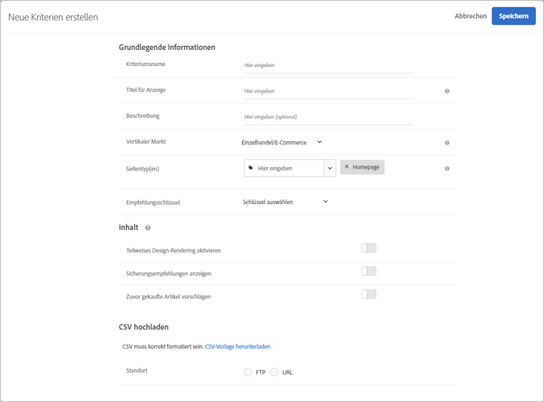

#  Upload benutzerdefinierter Kriterien{#upload-custom-criteria}

Laden Sie eine CSV-Datei hoch, um Empfehlungen anzupassen.

Sie haben viele Möglichkeiten, um auf den Bildschirm [!UICONTROL Neue Kriterien erstellen] zu gelangen. Einige Bildschirmoptionen variieren je nachdem, wie Sie auf den Bildschirm gelangen.

* Wenn Sie eine [!UICONTROL Recommendations]-Aktivität erstellen, klicken Sie auf **[!UICONTROL Neu erstellen]** auf dem Bildschirm [!UICONTROL Kriterien auswählen]. Sie können Ihre neuen Kriterien speichern, um Sie mit anderen [!UICONTROL Recommendations]-Aktivitäten zu verwenden.
* Wenn Sie eine [!UICONTROL Recommendations]-Aktivität bearbeiten, klicken Sie in ein Feld für die [!UICONTROL Empfehlungsposition] auf Ihrer Seite und wählen Sie **[!UICONTROL Kriterien ändern aus]**. Klicken Sie auf dem Bildschirm [!UICONTROL Kriterien auswählen] auf **[!UICONTROL Neu erstellen]**. Sie können Ihre neuen Kriterien speichern, um Sie mit anderen [!UICONTROL Recommendations]-Aktivitäten zu verwenden.
* Klicken Sie auf dem Bibliotheksbildschirm unter **[!UICONTROL Empfehlungen]** > **[!UICONTROL Kriterien]** auf **[!UICONTROL Kriterien erstellen]**. Kriterien, die Sie hier erstellen, stehen automatisch für alle [!UICONTROL Recommendations]-Aktivitäten zur Verfügung.

1. Klicken Sie auf **[!UICONTROL Kriterien erstellen]**.

   

1. Wählen Sie **[!UICONTROL benutzerspezifische Kriterien hochladen]**.

   

1. Geben Sie einen **[!UICONTROL Kriteriennamen]** ein.

   Dies ist der „interne“ Name, der für die Beschreibung der Kriterien verwendet wird.  Sie möchten zum Beispiel Ihre Kriterien „Produkte mit der höchsten Marge“ nennen, Sie möchten jedoch nicht, dass dieser Titel öffentlich angezeigt wird. Sehen Sie sich den nächsten Schritt an, um den öffentlichen Titel festzulegen.
1. Geben Sie einen öffentlichen **[!UICONTROL Anzeigetitel]** ein, der auf der Seite für alle Empfehlungen angezeigt wird, die diesen Kriterien entsprechen.

   So wäre es möglicherweise sinnvoll, „Personen, die das ansahen, sahen auch dies an“ oder „Ähnliche Produkte“ einzublenden, wenn Sie diese Kriterien zum Einblenden von Empfehlungen verwenden.
1. Geben Sie eine kurze **[!UICONTROL Beschreibung]** des Kriteriums ein.

   Die Beschreibung soll dazu beitragen, dass Sie das Kriterium identifizieren können, und kann Informationen über den Zweck des Kriteriums enthalten.
1. Wählen Sie einen **[!UICONTROL vertikalen Markt]** aus.

   Andere Optionen für Kriterien können sich je nach vertikalem Markt, den Sie auswählen, ändern.

1. Wählen Sie einen **[!UICONTROL Seitentyp]** aus.

   Verschiedene Seitentypen stehen zur Verfügung.

   Vertikaler Markt und Seitentyp werden zusammen genutzt, um Ihre gespeicherten Kriterien zu kategorisieren, wodurch die Wiederverwendung der Kriterien für andere [!UICONTROL Recommendations]-Aktivitäten erleichtert wird.
1. Wählen Sie einen **[!UICONTROL Empfehlungsschlüssel]** aus.

   Weitere Informationen zum Stützen von Kriterien auf einen Schlüssel finden Sie unter [Stützen der Empfehlung auf einen Empfehlungsschlüssel](../../c-recommendations/c-algorithms/create-new-algorithm.md#task_2B0ED54AFBF64C56916B6E1F4DC0DC3B).
1. Legen Sie Ihre **[!UICONTROL Inhaltsregeln]** fest.

   Inhaltsregeln bestimmen, was passiert, wenn die Anzahl an empfohlenen Artikeln Ihren Entwurf nicht vollständig füllt. Wenn Ihr Entwurf beispielsweise Platz für fünf Artikel bietet, Ihre Kriterien jedoch nur drei Artikelempfehlungen bereitstellen, können Sie den verbleibenden Platz leer lassen oder ihn mit Ersatzempfehlungen füllen. Wählen Sie die entsprechenden Einstellungen aus. Siehe [Geben Sie Inhaltseinstellungen](/help/c-recommendations/c-algorithms/create-new-algorithm.md#content)an.
1. Legen Sie Ihre **[!UICONTROL Einschlussregeln]** fest.

   Einschlussregeln helfen Ihnen dabei, die in Ihren Empfehlungen angezeigten Elemente einzuschränken. See [Specify inclusion rules](/help/c-recommendations/c-algorithms/create-new-algorithm.md#inclusion). 1. Wählen Sie den **[!UICONTROL Speicherort]** Ihrer CSV-Datei aus.

   Die CSV-Datei muss korrekt formatiert sein, um erfolgreich hochgeladen werden zu können. Klicken Sie auf **[!UICONTROL CSV-Vorlage herunterladen]**, um eine Vorlage mit richtiger Formatierung zu erhalten.

   Es gibt für Orte zwei Optionen:

   * **FTP:** Um Ihre CSV-Datei von einem FTP-Server hochzuladen, wählen Sie **[!UICONTROL FTP]** aus und geben Sie die erforderlichen Informationen ein. Sie können optional SSL verwenden, wobei die CSV-Datei sicher mittels eines FTPS-Protokolls übermittelt wird.
   * **URL:** Um Ihre CSV-Datei von einer URL hochzuladen, wählen Sie eine **[!UICONTROL URL]** aus und geben Sie dann eine Feed-URL ein.

1. Klicken Sie auf **[!UICONTROL Speichern]**.

   >[!NOTE]
   >
   >Benutzerdefinierte Kriterienentitäten (Zeilen) können bis zu 1.000 empfohlene Elemente (Spalten) enthalten.

Benutzerspezifische Kriterienupdates sind standardmäßig kumulativ. Neue Schlüssel-Wert-Paare, die in der CSV-Uploaddatei angegeben werden, überschreiben bestehende Schlüssel-Wert-Paare. Vorhandene Schlüssel-Wert-Paare, für die keine Schlüssel im CSV-Upload spezifiziert ist, können trotzdem bereitgestellt werden und laufen 31 Tagen nach dem letzten Hochladen als Teil der CSV-Datei ab.

Wenden Sie sich an Adobe Client Care, um die Einstellung zum Verwerfen bestehender Ergebnisse, die nicht im nächsten CSV-Upload enthalten sind, zu aktivieren. Wenn diese Einstellung aktiviert ist, sind nur die Schlüssel, die in der benutzerspezifischen CSV-Feed-Datei vorhanden sind, zur Bereitstellung verfügbar. Diese Einstellung gilt für alle benutzerspezifischen Kriterien.

Benutzerspezifische Kriterien-Feeds werden alle 24 Stunden aktualisiert.

Sie können den Upload- und Synchronisationsstatus Ihrer benutzerdefinierten Kriterien am Ende jeder Kriterienkarte auf der Seite „Recommendations“ > „Kriterien“ sehen. Sie können den Status auch im Dialogfeld „Bearbeiten“ sehen, wenn Sie benutzerdefinierte Kriterien bearbeiten.

Der Ablauf für einen fehlerfreien Upload sollte folgendermaßen aussehen: „Geplant“ > „Download der Feed-Datei“ > „Import“ > „Erfolgreich“.

Im Folgenden finden Sie mögliche Fehlermeldungen, die Sie erhalten können, wenn Target auf ein Problem beim Upload stößt:

| Fehlermeldung | Details |
|--- |--- |
| Unbekannter Fehler | Zeigt einen internen technischen Fehler an. |
| Parsing-Fehler | Es gibt wahrscheinlich ein Problem mit dem Feed-Dateiformat. Korrigieren Sie das Dateiformat und speichern Sie den Algorithmus erneut, um den Downloadvorgang erneut zu starten. |
| Server nicht gefunden | Geben Sie einen IP- oder Hostnamen an, der im Internet sichtbar ist. |
| Zugangsdatenfehler | Geben Sie einen gültigen Benutzernamen und ein gültiges Passwort für ein aktives Konto auf dem Server an. |
| Verzeichnis nicht gefunden | Geben Sie ein Verzeichnis an, das auf dem Server existiert. |
| Datei nicht gefunden | Geben Sie den Namen einer Datei an, die auf dem Server im angegebenen Verzeichnis existiert. |

## Schulungsvideo: Kriterien in Recommendations erstellen (12:33) 

Dieses Video enthält die folgenden Informationen (Details zum Hochladen benutzerdefinierter Kriterien beginnen um 11:43 Uhr):

* Erstellen von Kriterien
* Erstellen von Kriteriensequenzen
* Hochladen benutzerdefinierter Kriterien

>[!VIDEO](https://video.tv.adobe.com/v/27694?quality=12)