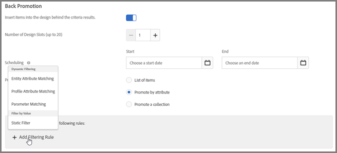
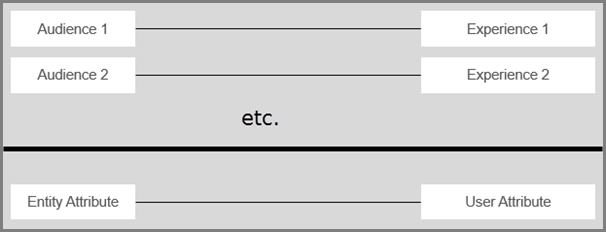
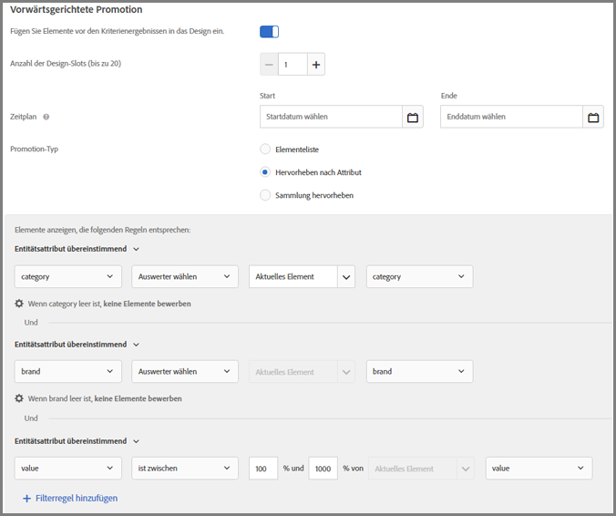
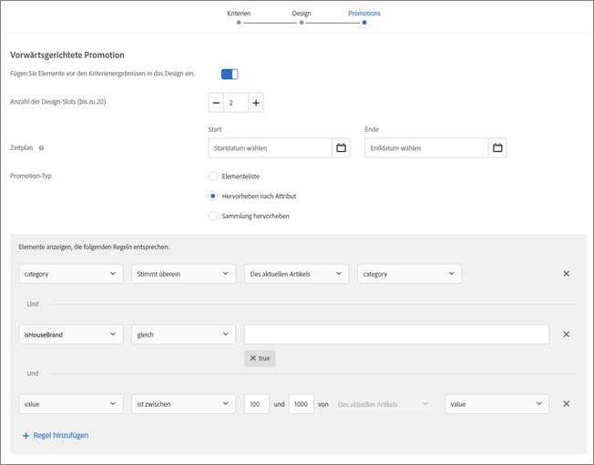
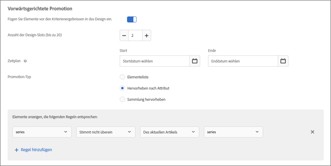
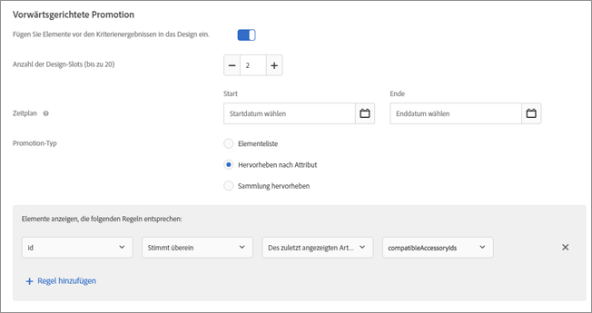
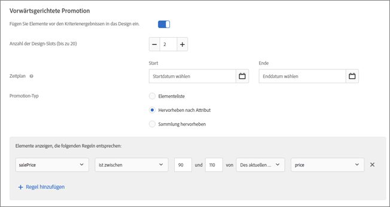
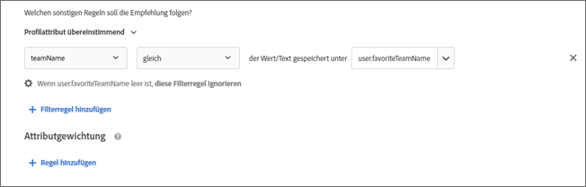
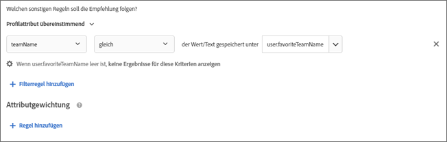
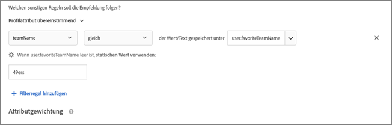

#  Verwenden dynamischer und statischer Einschlussregeln{#use-dynamic-and-static-inclusion-rules}

Informationen zum Erstellen von Einschlussregeln für Kriterien und Promotions und zum Hinzufügen zusätzlicher dynamischer oder statischer Filterungsregeln, um bessere Ergebnisse zu erzielen.

Der Prozess zum Erstellen und Verwenden von Einschlussregeln für Kriterien und Promotions ist ähnlich, genauso wie die Anwendungsfälle und Beispiele. In diesem Thema werden sowohl Kriterien und Promotions als auch die Verwendung von Einschlussregeln behandelt.

## Hinzufügen von Filterregeln zu Kriterien {#section_CD0D74B8D3BE4A75A78C36CF24A8C57F}

Klicken Sie beim [Erstellen von Kriterien](../../c-recommendations/c-algorithms/create-new-algorithm.md#task_8A9CB465F28D44899F69F38AD27352FE) auf **[!UICONTROL Filterregel hinzufügen]** unter **[!UICONTROL Einschlussregeln]**.


Die verfügbaren Optionen variieren je nach vertikalem Markt und Empfehlungsschlüssel.

## Hinzufügen von Filterregeln zu Promotions   {#section_D59AFB62E2EE423086281CF5D18B1076}

Wählen Sie beim [Erstellen einer Promotion](../../c-recommendations/t-create-recs-activity/adding-promotions.md#task_CC5BD28C364742218C1ACAF0D45E0E14) die Option **[!UICONTROL Hervorheben nach Attribut]** aus und klicken Sie dann auf **[!UICONTROL Filterregel hinzufügen]**.



## Filtertypen {#section_0125F1ED10A84C0EB45325122460EBCD}

In der folgenden Tabelle werden die Filteroptionstypen für Kriterien und Promotions aufgelistet:

| Typ | Option | Verfügbare Operatoren |
|--- |--- |--- |
| **Dynamische Filterung** | **Entitätsattributübereinstimmung:** Dynamisches Filtern per Vergleich eines Pools mit potenziellen Empfehlungselementen mit einem speziellen Element, mit dem ein Benutzer interagiert hat.<br>Beispielsweise nur empfohlene Elemente, die mit der Marke des aktuellen Elements übereinstimmen. | ist gleich wie<br>ist nicht gleich wie<br>ist zwischen<br>enthält<br>enthält nicht<br>beginnt mit<br>endet mit<br>Wert ist präsent<br>Wert ist nicht präsent<br>ist größer oder gleich wie<br>ist kleiner oder gleich wie |
|  | **Profilattributübereinstimmung:** Dynamisches Filtern per Vergleich von Elementen (Entitäten) mit einem Wert im Profil des Benutzers.<br>Beispielsweise nur empfohlene Elemente, die mit der Lieblingsmarke des Besuchers übereinstimmen. | ist gleich wie<br> ist nicht gleich wie<br>enthält<br>enthält nicht<br>beginnt mit<br>endet mit<br>ist größer oder gleich wie<br>ist geringer oder gleich wie<br>ist zwischen |
|  | **Parameterübereinstimmung:** Dynamisches Filtern per Vergleich von Elementen (Entitäten) mit einem Wert in der Anforderung (API oder Mbox).<br>Beispielsweise nur empfohlene Inhalte, die mit dem Branchen-Seitenparameter übereinstimmen.<br>**Wichtig:** Wenn die Aktivität vor dem 31. Oktober 2016 erstellt wurde, schlägt die Bereitstellung bei der Verwendung des Filters „Parameterübereinstimmung“ fehl. So umgehen Sie das Problem:<ul><li>Erstellen Sie eine neue Aktivität und fügen Sie Ihre Kriterien darin hinzu.</li><li>Verwenden Sie Kriterien, die den Filter „Parameterübereinstimmung“ nicht enthalten.</li><li>Entfernen Sie den Filter „Parameterübereinstimmung“ aus Ihren Kriterien.</li></ul> | gleich<br>ist nicht gleich wie<br>enthält<br>enthält nicht<br>beginnt mit<br>endet mit<br>ist größer oder gleich wie<br>ist kleiner oder gleich wie<br>ist zwischen |
| **Nach Wert filtern** | **Statischer Filter:** Geben Sie einen oder mehrere zu filternde Werte manuell ein.<br>Beispielsweise nur empfohlene Inhalte mit der MPAA-Einstufung „G“ oder „„PG“. | ist gleich wie<br>ist nicht gleich wie<br>enthält<br>enthält nicht<br>beginnt mit<br>endet mit<br>Wert ist präsent<br>Wert ist nicht präsent<br>ist größer oder gleich wie<br>ist kleiner oder gleich wie |

>[!NOTE]
>
>Wenn Sie wissen, wie die Einschlussregeln vor der Target 17.6.1-Version (Juni 2017) konfiguriert waren, werden Sie bemerken, dass einige der Optionen und Operatoren sich geändert haben. Es werden nur die Operatoren angezeigt, die auf die ausgewählte Option angewendet werden können. Zudem wurden einige Operatoren umbenannt („stimmt überein“ heißt jetzt „gleich“), um die Konsistenz und die Intuitivität zu erhöhen. Alle vorhandenen Ausschlussregeln, die vor dieser Version erstellt worden sind, wurden automatisch in die neue Struktur migriert. Es ist keine Neustrukturierung Ihrerseits nötig.

Sie können so viele Einschlussregeln wie benötigt erstellen. Die Einschlussregeln werden mit einem Operator vom Typ „AND“ verbunden. Alle Regeln müssen erfüllt sein, damit ein Artikel in den Empfehlungen berücksichtigt wird.

Dynamische Kriterien und Promotions sind deutlich leistungsstärker als statische Kriterien und Promotions und liefern bessere Ergebnisse und Interaktionen. Die folgenden Beispiele zeigen Verwendungsmöglichkeiten dynamischer Promotions als Marketing-Maßnahmen:

**Gleich:** Wenn Sie den Operator „gleich“ in dynamischen Promotions verwenden, können Sie, wenn ein Besucher auf Ihrer Website ein Element (z. B. ein Produkt, einen Artikel, einen Film usw.) anzeigt, weitere Elemente bewerben, die folgende Kriterien erfüllen:

* dieselbe Marke
* dieselbe Kategorie
* dieselbe Kategorie UND von der Hausmarke
* dasselbe Geschäft

**Ist nicht gleich:** Wenn Sie den Operator „ist nicht gleich“ in dynamischen Promotions verwenden, können Sie, wenn ein Besucher auf Ihrer Website ein Element (z. B. ein Produkt, einen Artikel, einen Film usw.) anzeigt, weitere Elemente bewerben, die folgende Kriterien erfüllen:

* andere TV-Serie
* anderes Genre
* andere Produktserie
* andere Stil-ID

**Ist zwischen:** Wenn Sie den Operator „ist zwischen“ in dynamischen Promotions verwenden, können Sie, wenn ein Besucher auf Ihrer Website ein Element (z. B. ein Produkt, einen Artikel oder einen Film) anzeigt, weitere Elemente bewerben, die folgende Kriterien erfüllen:

* teurer
* billiger
* kostet plus oder minus 30 %
* spätere Episoden in derselben Staffel
* vorherige Bücher einer Folge

## Umgang mit leeren Werten beim Filtern nach Entitätsattributübereinstimmung, Profilattributübereinstimmung und Parameterübereinstimmung   {#section_7D30E04116DB47BEA6FF840A3424A4C8}

Beim Filtern nach Entitätsattributübereinstimmung, Profilattributübereinstimmung und Parameterübereinstimmung für Abschlusskriterien und Promotions können Sie verschiedene Optionen zum Umgang mit leeren Werten wählen.

Zuvor wurden bei einem leeren Wert keine Ergebnisse zurückgegeben. In der Dropdownliste „Wenn *x* leer ist“ können Sie die entsprechende Aktion auswählen, die ausgeführt werden solle, wenn die Kriterien leere Werte enthalten, wie in der folgenden Abbildung dargestellt:


Um die gewünschte Aktion auszuwählen, bewegen Sie den Mauszeiger über das Zahnradsymbol () und wählen Sie dann die gewünschte Aktion aus:

| Aktion | Verfügbar für | Details |
|--- |--- |--- |
| Diese Filterregel ignorieren | Profilattributübereinstimmung<br>Parameterübereinstimmung | Dies ist die Standardaktion für die Profilattribut- und Parameterübereinstimmung.<br>Diese Option gibt an, dass die Regel ignoriert wird. Wenn beispielsweise drei Filterregeln vorhanden sind und die dritte Regel keine Werte übergibt, können Sie die dritte Regel mit den leeren Werten einfach ignorieren, statt gar keine Ergebnisse zurückzugeben. |
| Für diese Kriterien keine Ergebnisse anzeigen | Entitätsattributübereinstimmung<br>Profilattributübereinstimmung<br>Parameterübereinstimmung | Dies ist die Standardaktion für die Entitätsattributübereinstimmung.<br>Durch diese Aktion wird bestimmt, wie Target leere Werte vor dem Hinzufügen dieser Option verarbeitet hat: Für diese Kriterien werden keine Ergebnisse angezeigt. |
| Statischen Wert verwenden | Entitätsattributübereinstimmung<br>Profilattributübereinstimmung<br>Parameterübereinstimmung | Wenn ein Wert leer ist, können Sie die Verwendung eines statischen Werts festlegen. |

Sehen Sie sich für ein Beispiel zum Umgang mit leeren Werten das [Szenario 9](../../c-recommendations/c-algorithms/use-dynamic-and-static-inclusion-rules.md#section_9873E2F22E094E479569D05AD5BB1D40) unten an:

## Szenarien mit dynamischem Filter   {#section_9873E2F22E094E479569D05AD5BB1D40}

**Szenario 1:** Anstatt mithilfe eines statischen Filters ein Element aus einem Katalog mit anderen Elementen aus einem Katalog zu vergleichen, können Sie einen dynamischen Filter verwenden, um ein Element aus einem Katalog mit einem Attribut aus dem Profil des Besuchers zu vergleichen.

Sie können beispielsweise die Option [!UICONTROL Profilattributübereinstimmung] zum Erstellen einer Regel verwenden, laut der Elemente nur dann empfohlen werden, wenn die Marke mit dem Wert oder Text übereinstimmt, der unter `profile.favoritebrand` gespeichert ist. Wenn ein Besucher mit einer solchen Regel nach Laufshorts von einer bestimmten Marke sucht, werden nur Empfehlungen angezeigt, die mit der Lieblingsmarke des jeweiligen übereinstimmen (dem unter `profile.favoritebrand` im Profil des Benutzers gespeicherten Wert).

**Szenario 2:** Bevor in Target die Möglichkeit bestand, Attributinformationen aus dem Profil eines Besuchers zu verwenden, mussten Sie beim Einrichten von Stellenausschreibungen, die nur für Arbeitssuchende aus einem bestimmten Ort und mit einem bestimmten Schulabschluss angezeigt werden, zahlreiche Aktivitäten mit verschiedenen Zielgruppen einrichten (eine für jeden Ort und jeden Abschluss). Wenn Sie in mehreren Städten Stellenausschreibungen vornehmen, kann diese Aufgabe sehr beschwerlich sein.

Von nun an können Sie Einschlussregeln verwenden, um Ort und Abschluss eines Arbeitssuchenden aus seinem Profil mit einer Stellenausschreibung zu vergleichen, wie im folgenden Beispiel dargestellt:


Laut der Stellenausschreibung auf der linken Seite muss der Besucher aus San Francisco, New York oder Los Angeles (`entity.jobCity`) kommen und einen BSCS- oder MBA-Abschluss (`entity.requiredDegree`) haben.

Der Arbeitssuchende auf der rechten Seite kommt aus Los Angeles (`profile.usersCity`) und hat einen MBA-Abschluss ( `profile.degree`).

Mithilfe eines dynamischen Filters mit Profilattributübereinstimmung können Sie den im unteren Teil der oberen Abbildung gezeigten Filter erstellen, durch den nur Stellenausschreibungen empfohlen werden, für die sich der Besucher basierend auf seinem Wohnort und seinem Abschluss qualifiziert.

Die Kriterien für diese Filter lauten wie folgt:

```
entity.jobCity - equals - the value/text stored in - profile.usersCity
```

und

```
entity.requiredDegree - equals - the value/text stored in - profile.degree
```

Mit dynamischen Filtern mit Profilattributübereinstimmung können Sie mit weniger Aktivitäten mehr erreichen, wie unten dargestellt:


Das Diagramm im oberen Teil der oberen Abbildung zeigt, wie dynamische Filter mit Profilattributen funktionieren. Sie können eine Zielgruppe erstellen, die Kriterien verwendet (im oberen Beispiel Wohnort und Abschluss), um eine Stellenausschreibung anzuzeigen, für die sich der Besucher qualifiziert. Dieser Filter funktioniert für eine nahezu unbegrenzte Anzahl an Möglichkeiten bezüglich des Wohnorts und Abschlusses.

Das Diagramm am unteren Rand der Abbildung zeigt nur zwei der unzähligen Zielgruppen, die Sie einrichten müssten, wenn Sie keine Kriterien oder keine Promotion mit dynamischen Filtern konfigurieren würden, für die Profilattribute verwendet werden. Sie müssten für jeden Ort und jeden Abschluss eine andere Zielgruppe einrichten. Die Anzahl Zielgruppen würde schnell unüberschaubar werden, insbesondere dann, wenn es sich um viele Stellenausschreibungen in verschiedenen Städten handelt.

Ohne die Verwendung von Profilattributen würden Ihre Zielgruppen und Erlebnisse aussehen wie die obere Hälfte der folgenden Abbildung, jedoch mit zusätzlichen Zielgruppen/Erlebnis-Paaren für jedes denkbare Szenario.



Mithilfe von dynamischen Filtern mit Profilattributen, die Entitätsattribute mit Benutzerattributen vergleichen, können Sie eine einzelne Zielgruppe einrichten. Diese Zielgruppe stellt das gewünschte Erlebnis in kürzester Zeit dynamisch bereit, wie in der unteren Hälfte der Abbildung oben dargestellt.

Vorausgesetzt, dass Sie die erforderlichen Informationen in die einzelnen Stellenausschreibungen eingebettet haben und dass Sie die erforderlichen Informationen innerhalb der Benutzerprofile erfassen, wird die Erstellung und Verwaltung von Zielgruppen und Erlebnissen stark vereinfacht.

**Szenario 3:** Ein Sportartikelhersteller möchte auf seiner Website Artikel zu Teams zeigen, für die sich eine Person interessiert. Für jeden Artikel könnte ein Feld mit `entity.featuredTeams` vorhanden sein, das alle in dem Artikel behandelten Teams umfasst. Für jedes Profilattribut könnte eine Liste mit Lieblingsteams existieren, die der Benutzer „abonniert“.

Ein Beispiel für eine Einschlussregel könnte wie folgt lauten:

Nur einschließen, wenn `entity.featuredTeam` mindestens einen Wert enthält, der mit `profile.favoriteTeams` übereinstimmt.

Beachten Sie bei den folgenden Beispielen, dass mindestens ein gesamter Zeichenfolgenwert übereinstimmen muss (vollständig). Es liegt keine Übereinstimmung vor, wenn keine Zeichenfolge übereinstimmt. Beachten Sie die Entkopplung der Entitätsattribute in den Übereinstimmungsregeln. Dies ermöglicht den Abgleich zwischen verschiedenen Metadatenfeldern.

Beispiele/Beschreibungen

`"entity.featuredTeam" - "Athletics,Red Sox" equals "profile.favoriteTeams" - "Athletics"`

Gilt als Übereinstimmung, weil „Athletics“ übereinstimmt, obwohl dies bei „Red Sox“ nicht der Fall ist.

`"entity.featuredTeam" - "Athletics,Red Sox" equals "profile.favoriteTeams" - "Athletics,Red Sox"`

Gilt als Übereinstimmung, weil sowohl „Athletics“ als auch „Red Sox“ gleich ist, obwohl nicht beide Teams übereinstimmen müssen.

`"entity.featuredTeam" - "Athletics" equals "profile.favoriteTeams" - "Athletics,Red Sox"`

Gilt als Übereinstimmung, weil „Athletics“ übereinstimmt, obwohl dies bei „Red Sox“ nicht der Fall ist.

`"entity.featuredTeam" - "Athletics" equals "profile.favoriteTeams" - "Athletic"`

Keine Übereinstimmung, weil „Athletics“ (Plural) nicht gleich „Athletic“ (Singular) ist.

Alternativ könnten Sie „enthält“ anstelle von „gleich“ verwenden, damit dies als Übereinstimmung gilt.

`"entity.featuredTeam" - "Athletic" equals "profile.favoriteTeams" - "Athletics"`

Stimmt nicht überein, weil „Athletic“ (Singular) nicht gleich „Athletics“ (Plural) ist.

Alternativ könnten Sie „beginnt mit“ anstelle von „gleich“ verwenden, damit dies als Übereinstimmung gilt.

**Szenario 4:** Die folgende Abbildung veranschaulicht die Verwendung der Operatoren „gleich“ und „ist zwischen“ zum Bewerben teurerer Artikel, die aus derselben Kategorie und von derselben Marke stammen. So kann z. B. ein Unternehmen für Sportbekleidung teurere Laufschuhe bewerben, um einen Upsell eines Besucher zu erzielen, der nach Laufschuhen sucht.



In diesem Beispiel werden folgende Regeln verwendet:

```
category - equals - current item's - category 
And 
brand - equals - current item's - brand 
And 
value - is between - 100% and 1000% of - current item's - value
```

>[!NOTE]
>
>Sie können den Schlüssel in einer dynamischen Promotion nicht mit mehreren Regeln ändern (die dritte Dropdown-Liste in den ersten beiden Regeln, die in der Abbildung „Aktueller Artikel“ genannt werden).

**Szenario 5:** Die zweite Abbildung zeigt die Verwendung der Operatoren „gleich“ und „ist zwischen“, um teurere Elemente zu bewerben, die zu derselben Kategorie und derselben Marke und Hausmarke gehören. So könnte z. B. ein Anbieter von Bürobedarf teurere Tonerkartuschen bewerben, sowohl von derselben Marke als auch von der Hausmarke des Unternehmens, um einen Upsell eines Besuchers zu erzielen, der nach Druckern sucht.



In diesem Beispiel werden folgende Regeln verwendet:

```
category - equals - current item's - category 
And 
IsHouseBrand - equals - true 
And 
value - is between - 100% and 1000% of - current item's - value
```

Beachten Sie, dass in diesem Beispiel zwei dynamische Regeln und eine statische Regel verwendet werden.

**Szenario 6:** Die dritte Abbildung zeigt die Verwendung des Operators „ist nicht gleich“, um eine Serie zu bewerben, die nicht mit der Serie übereinstimmt, die der Besucher sich gerade ansieht. So könnte z. B. eine Medien-Website eine Fernsehserie bewerben, die nicht mit der Serie übereinstimmt, die sich der Besucher gerade ansieht.



In diesem Beispiel wird die folgende Regel verwendet:

```
series - does not equal - current item's - series
```

**Szenario 7:** Die vierte Abbildung zeigt, wie passende Zubehörartikel für den vom Besucher zuletzt gekauften Artikel beworben werden können. Wenn z. B. jemand ein neues Fernsehgerät gekauft hat, könnten Sie auf dynamische Art und Weise ein HDMI-Kabel bewerben.



In diesem Beispiel werden folgende Regeln verwendet:

```
id - equals - last purchased item's - compatibleAccessoryids
```

**Szenario 8:** Die nächste Abbildung zeigt, wie Artikel beworben werden können, die zu einem Preis von zwischen 90 und 110 Prozent des Preises des Artikels verkauft werden, den sich der Besucher gerade ansieht. Wenn sich z. B. jemand ein Fernsehgerät ansieht, können dynamisch ähnliche Fernsehgeräte beworben werden, die sich etwa in derselben Preisklasse bewegen.



In diesem Beispiel werden folgende Regeln verwendet:

```
salesPrice - is between - 90% and 110% of - current item's - price
```

**Szenario 9:** Ziehen Sie das folgende Szenario für eine Sportmedien-Website bezüglich des Umgangs mit leeren Werten in Erwägung, wie zuvor unter [Umgang mit leeren Werten beim Filtern nach Entitätsattributübereinstimmung, Profilattributübereinstimmung und Parameterübereinstimmung](../../c-recommendations/c-algorithms/use-dynamic-and-static-inclusion-rules.md#section_7D30E04116DB47BEA6FF840A3424A4C8) erläutert:

Das Inhaltsteam für eine Sportmedien-Website möchte Benutzern Inhalte zu deren Lieblingsmannschaften präsentieren. Wenn ein Benutzer eine Lieblingsmannschaft angegeben hat, sollen Medien für die jeweilige Mannschaft angezeigt werden. Wenn ein Benutzer keine Lieblingsmannschaft angegeben hat, kann die Dropdownliste „Wenn *x* leer ist“ verwendet werden, um eine der folgenden Aktionen auszuführen:

* Verwenden Sie die Option [!UICONTROL Diese Filterregel ignorieren], um den Mannschaftsfilter insgesamt zu ignorieren, wie in der folgenden Abbildung dargestellt:

   

* Verwenden Sie die Option [!UICONTROL Keine Ergebnisse für diese Kriterien anzeigen], um keine Medien im Rahmen dieser Kriterien anzuzeigen, wie in der folgenden Abbildung dargestellt:

   

* Verwenden Sie die Option [!UICONTROL Statischen Wert verwenden], um Medien zu einer bestimmten Mannschaft anzuzeigen (z. B. zu den 49ers), wie in der folgenden Abbildung dargestellt:

   

## Einschränkungen {#section_A889FAF794B7458CA074DEE06DD0E345}

>[!IMPORTANT]
>
>Verschiedene Datentypattribute sind möglicherweise nicht mit dynamischen Kriterien oder Promotions kompatibel, während sie zur Laufzeit mit den Operatoren „ist gleich“ und „ist nicht gleich“ verwendet werden. Die Werte für den Wert, die Marge, den Bestand und die Umgebung müssen auf der rechten Seite mit Bedacht ausgewählt werden, wenn auf der linken Seite vordefinierte Attribute oder benutzerdefinierte Attribute verwendet werden.


Die folgende Tabelle enthält wirksame Regeln und Regeln, die während der Laufzeit möglicherweise nicht kompatibel sind:

| Kompatible Regeln | Potenziell inkompatible Regeln |
|--- |--- |
| value - ist zwischen - 90 % und 110 % des aktuellen Elements - salesValue | salesValue - ist zwischen - 90 % und 110 % des aktuellen Elements - value |
| value - ist zwischen - 90 % und 110 % des aktuellen Elements - value | clearancePrice - ist zwischen - 90 % und 110 % des aktuellen Elements - margin |
| margin - ist zwischen - 90 % und 110 % des aktuellen Elements - margin | storeInventory - gleich - dem aktuellen Element - inventory |
| inventory - gleich - dem aktuellen Element - inventory |